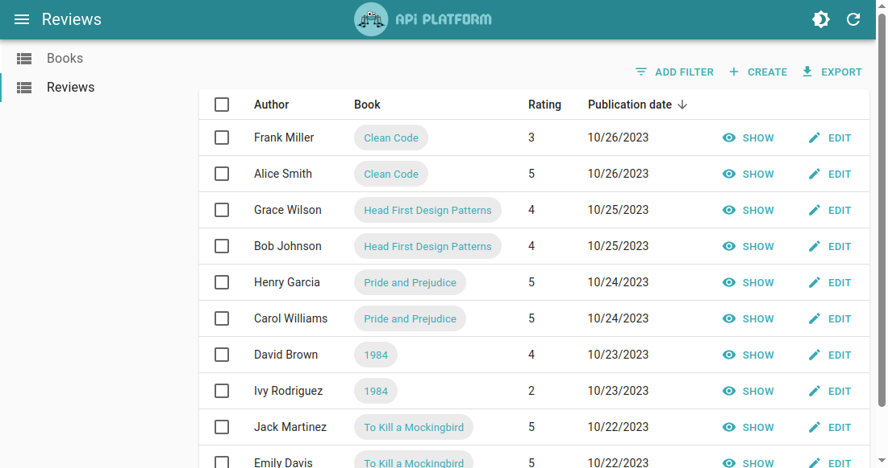
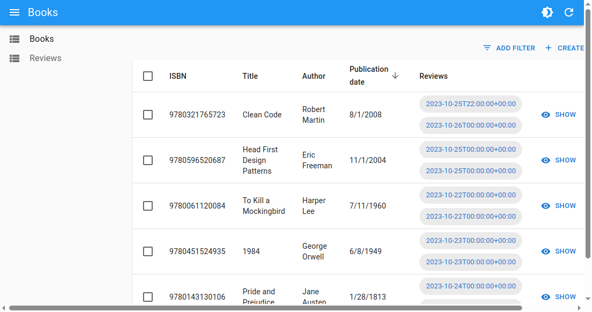
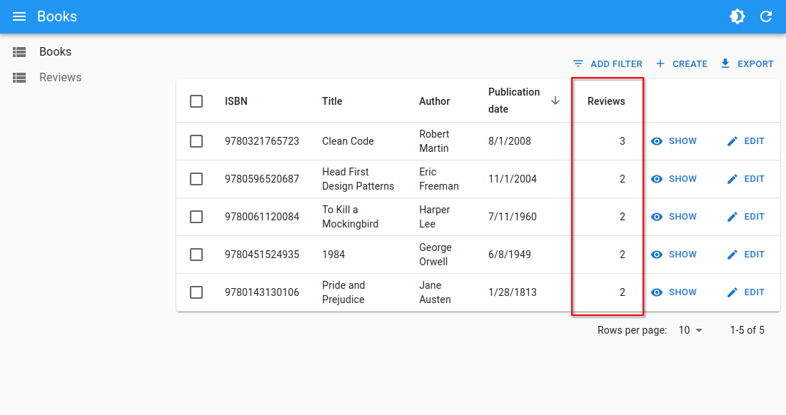
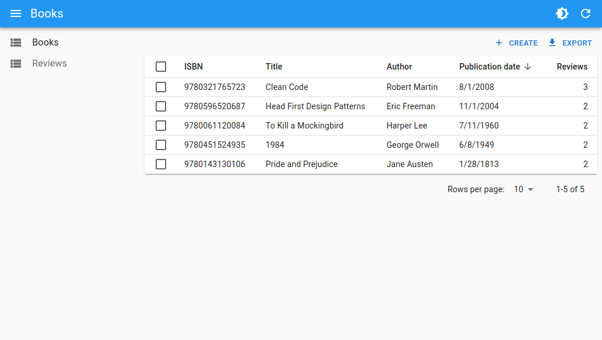
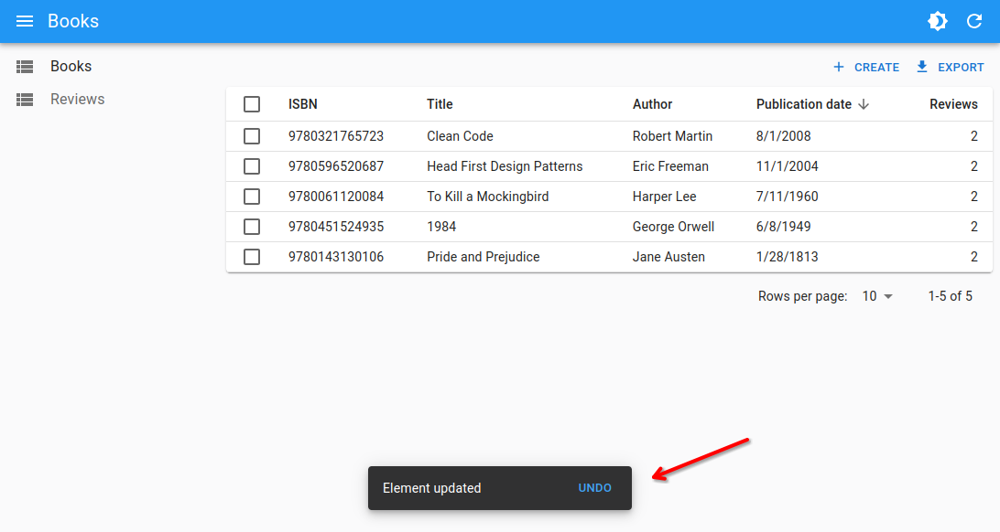
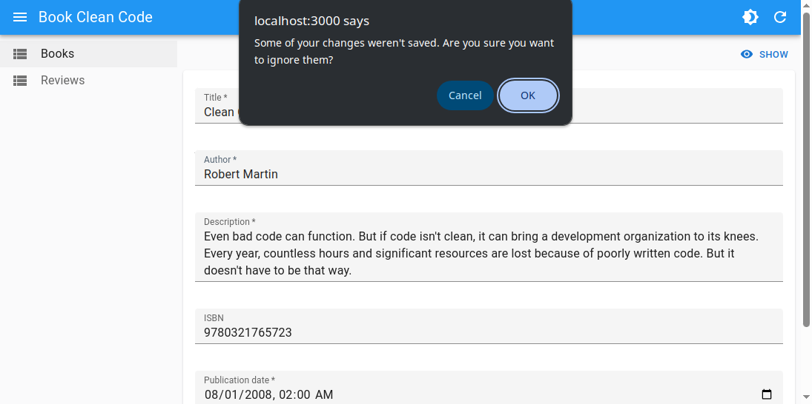
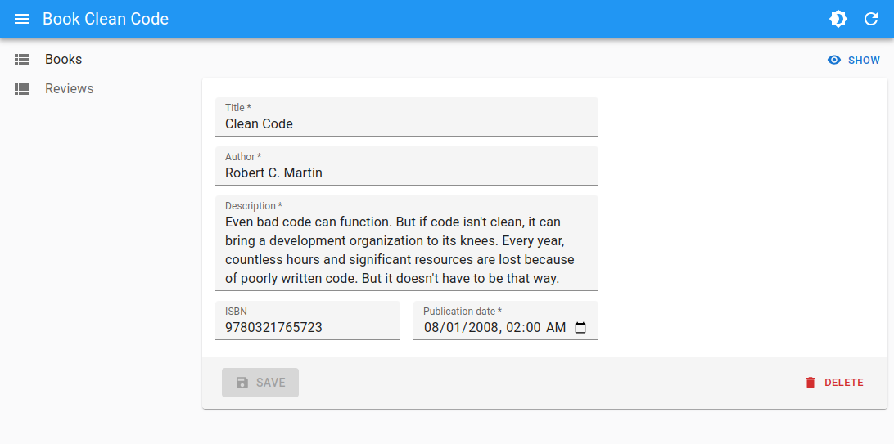
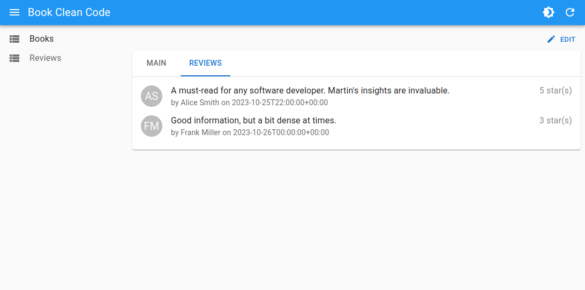
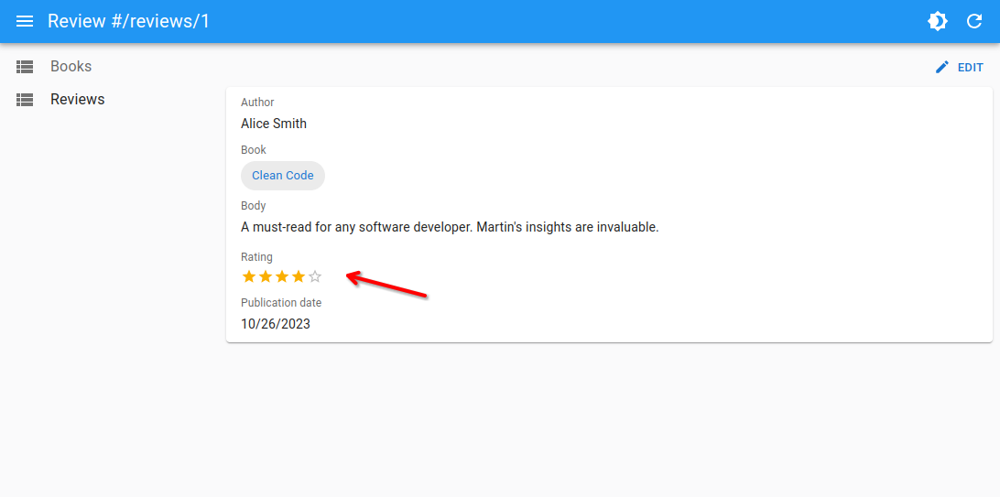
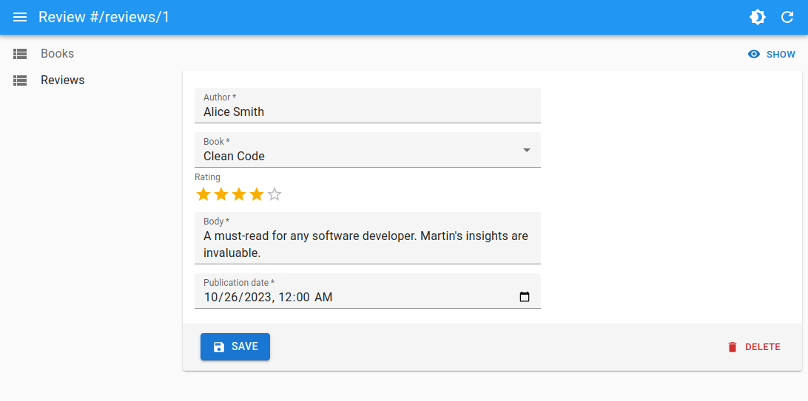

# Customizing the Admin

In the previous sections, we have seen how to customize the generated Admin by [updating the schema](./schema.md), and by [customizing the guesser components](./customizing.md).

But we can go much further in customizing the generated pages by leveraging React Admin components and props.

In the following sections, we will for instance learn how to:

- Change the default theme and layout
- Display the number of related records instead of listing them
- Navigate from the list using simple row click
- Make mutations undoable
- Improve the layout of a form
- Switch to a tabbed layout
- Create a custom field component
- Add icons to the menu

Let's dive in!

## Changing the Default Theme and Layout

API Platform comes with its own [layout](https://marmelab.com/react-admin/Admin.html#layout) and [themes](https://marmelab.com/react-admin/Admin.html#theme) by default.



However you may not find them to your liking, or you may want to remove the API Platform logo from the top bar.

To change the top bar logo, you will need to opt out of API Platform's default Layout component, and provide your own.

You can for instance use the default [Layout](https://marmelab.com/react-admin/Layout.html) provided by `react-admin`.

```diff
import { HydraAdmin, ResourceGuesser } from "@api-platform/admin";
+import { Layout } from 'react-admin';

export const App = () => (
-   <HydraAdmin entrypoint={...}>
+   <HydraAdmin entrypoint={...} layout={Layout}>
        <ResourceGuesser name="books" />
        <ResourceGuesser name="reviews" />
    </HydraAdmin>
);
```

To customize the light and dark themes, you will need to use the [`theme`](https://marmelab.com/react-admin/Admin.html#theme) and [`darkTheme`](https://marmelab.com/react-admin/Admin.html#darktheme) props of the `<Admin>` component.

Here too, we can use the default themes provided by `react-admin`.

```diff
import { HydraAdmin, ResourceGuesser } from "@api-platform/admin";
-import { Layout } from 'react-admin';
+import { Layout, defaultDarkTheme, defaultLightTheme } from 'react-admin';

export const App = () => (
-   <HydraAdmin entrypoint={...} layout={Layout}>
+   <HydraAdmin 
+       entrypoint={...} 
+       layout={Layout}
+       theme={defaultLightTheme}
+       darkTheme={defaultDarkTheme}>
        <ResourceGuesser name="books" />
        <ResourceGuesser name="reviews" />
    </HydraAdmin>
);
```

Here is the result:



## Displaying the Number of Related Records

When dealing with related records, the default behavior of the guessers is to display the list of related records.

However if there are many related records, it can be more suitable to display the number of related records instead.

Reusing our example with `books` and `reviews`, here is how you can display the number of reviews for each book in the book list:

```diff
import { ListGuesser, FieldGuesser } from '@api-platform/admin';
import { NumberField } from 'react-admin';

const BookList = () => (
  <ListGuesser sort={{ field: 'publicationDate', order: 'DESC' }}>
    <FieldGuesser source="isbn" label="ISBN" />
    <FieldGuesser source="title" />
    <FieldGuesser source="author" />
    <FieldGuesser source="publicationDate" />
-   <FieldGuesser source="reviews" />
+   <NumberField source="reviews.length" label="Reviews" />
  </ListGuesser>
);
```



**Tip:** It is recommended to also set a custom `label` to the column, as the label is otherwise humanized from the `source` prop, which is no longer suitable with a source like `reviews.length`.

## Hiding the Show And Edit Buttons in the List View

By default, the list guesser displays a `Show` and `Edit` button for each row.

However the UX can often be improved by setting a default action when clicking on a row, and removing the `Show` and `Edit` buttons.

To hide these buttons, we will need to replace the `<ListGuesser>` by a [`<List>`](https://marmelab.com/react-admin/List.html) component, provided by `react-admin`.

Then, to get the same layout as before, we will choose to render the list items using a [`<Datagrid>`](https://marmelab.com/react-admin/Datagrid.html) component.

`<Datagrid>` will automatically set the row click action to redirect to the show view if there is one, or to the edit view otherwise.

```diff
-import { ListGuesser, FieldGuesser } from '@api-platform/admin';
+import { FieldGuesser } from '@api-platform/admin';
-import { NumberField } from 'react-admin';
+import { List, Datagrid, NumberField } from 'react-admin';

const BookList = () => (
- <ListGuesser sort={{ field: 'publicationDate', order: 'DESC' }}>
+ <List sort={{ field: 'publicationDate', order: 'DESC' }}>
+   <Datagrid>
      <FieldGuesser source="isbn" label="ISBN" />
      <FieldGuesser source="title" />
      <FieldGuesser source="author" />
      <FieldGuesser source="publicationDate" />
      <NumberField source="reviews.length" label="Reviews" />
+   </Datagrid>
+ </List>
- </ListGuesser>
);
```

The UI is now more concise:



If you want, you can use the [`rowClick`](https://marmelab.com/react-admin/Datagrid.html#rowclick) prop to customize the row click action, for instance to redirect to the book edit view instead:

```diff
const BookList = () => (
  <List sort={{ field: 'publicationDate', order: 'DESC' }}>
-   <Datagrid>
+   <Datagrid rowClick="edit">
      <FieldGuesser source="isbn" label="ISBN" />
      <FieldGuesser source="title" />
      <FieldGuesser source="author" />
      <FieldGuesser source="publicationDate" />
      <NumberField source="reviews.length" label="Reviews" />
    </Datagrid>
  </List>
);
```

**Tip:** Check out the [`<Datagrid>` documentation](https://marmelab.com/react-admin/Datagrid.html) for more customization options.

## Enabling Undoable Mutations

React Admin offers the possibility to make mutations (e.g. updating or deleting a record) undoable.

When this feature is enabled, a notification will be displayed at the bottom of the page, allowing the user to undo the mutation for a certain amount of time.

If the user clicks on the UNDO button, the record will be restored to its previous state. Otherwise, the change is persisted to the API.

Let's, for instance, add the possibility to undo an update to a book. To do that, we will leverage the [`mutationMode`](https://marmelab.com/react-admin/Edit.html#mutationmode) prop provided by React Admin, and set its value to `"undoable"`.

This is possible because the `<EditGuesser>` component is a wrapper around the [`<Edit>`](https://marmelab.com/react-admin/Edit.html) component provided by React Admin, and it will forward the `mutationMode` prop to it.

```diff
import { EditGuesser, InputGuesser } from "@api-platform/admin";

export const BookEdit = () => (
- <EditGuesser>
+ <EditGuesser mutationMode="undoable">
      <InputGuesser source="isbn" />
      <InputGuesser source="title" />
      <InputGuesser source="description" />
      <InputGuesser source="author" />
      <InputGuesser source="publicationDate" />
      <InputGuesser source="reviews" />
  </EditGuesser>
);
```

That's enough to display an undoable notification when updating a book:



**Tip:** The default `mutationMode` set by `<EditGuesser>` is `"pessimistic"`, however the default `mutationMode` set by React Admin's `<Edit>` component is `"undoable"`.

## Warning the User When There Are Unsaved Changes

Another feature offered by React Admin is the possibility to warn the user when there are unsaved changes in a form.

When the user tries to navigate away from a form with unsaved changes, a confirmation dialog will be displayed, asking the user if they want to leave the page. This prevents the risk of losing unsaved data.

To enable this feature, all we need to do is to leverage the [`warnWhenUnsavedChanges`](https://marmelab.com/react-admin/SimpleForm.html#warnwhenunsavedchanges) prop provided by React Admin.

This is possible because the `<EditGuesser>` component is also a wrapper around the [`<SimpleForm>`](https://marmelab.com/react-admin/SimpleForm.html) component provided by React Admin, and it will forward the `warnWhenUnsavedChanges` prop to it.

```diff
import { EditGuesser, InputGuesser } from "@api-platform/admin";

export const BookEdit = () => (
- <EditGuesser>
+ <EditGuesser warnWhenUnsavedChanges>
    <InputGuesser source="isbn" />
    <InputGuesser source="title" />
    <InputGuesser source="description" />
    <InputGuesser source="author" />
    <InputGuesser source="publicationDate" />
    <InputGuesser source="reviews" />
  </EditGuesser>
);
```

Now, if the user tries to navigate away from the form with unsaved changes, they will be warned:



## Customizing the Form Layout

As we saw earlier, `<EditGuesser>` actually renders two (nested) React Admin components: [`<Edit>`](https://marmelab.com/react-admin/Edit.html) and [`<SimpleForm>`](https://marmelab.com/react-admin/SimpleForm.html).
You can pass additional props to `<EditGuesser>` which will be forwarded to `<Edit>` or `<SimpleForm>` accordingly.

However there are cases where this won't be enough. For instance, if we want to customize the form layout, we will need to specifically target the form component to pass styling props (such as `sx`), or to replace the component altogether (e.g. to use a [`<TabbedForm>`](https://marmelab.com/react-admin/TabbedForm.html) instead).

So, for our example, let's first replace the `<EditGuesser>` by an `<Edit>` and a `<SimpleForm>`.

```diff
-import { EditGuesser, InputGuesser } from "@api-platform/admin";
+import { InputGuesser } from "@api-platform/admin";
+import { Edit, SimpleForm } from "react-admin";

export const BookEdit = () => (
- <EditGuesser>
+ <Edit>
+   <SimpleForm>
      <InputGuesser source="isbn" />
      <InputGuesser source="title" />
      <InputGuesser source="description" />
      <InputGuesser source="author" />
      <InputGuesser source="publicationDate" />
      <InputGuesser source="reviews" />
+   </SimpleForm>
+ </Edit>
- </EditGuesser>
);
```

**Tip:** This will also enable [undoable mutation mode](./advanced-customization.md#enabling-undoable-mutations). Indeed, the default `mutationMode` set by `<EditGuesser>` is `"pessimistic"`, however the default `mutationMode` set by React Admin's `<Edit>` component is `"undoable"`. You can set the `mutationMode` prop back to `"pessimistic"` if you want to keep the same behavior as before.

By default, `<SimpleForm>` organizes the inputs in a very simple layout, simply stacking them vertically.
Under the hood, it uses Material UI's [`<Stack>`](https://mui.com/material-ui/react-stack/) component.
This means we can use with `<SimpleForm>` any prop that `<Stack>` accepts, and customize the style of the component using [the `sx` prop](https://marmelab.com/react-admin/SX.html).

For instance, let's limit the width of the inputs to 500px:

```diff
export const BookEdit = () => (
  <Edit>
-   <SimpleForm>
+   <SimpleForm sx={{ maxWidth: 500 }}>
      <InputGuesser source="isbn" />
      <InputGuesser source="title" />
      <InputGuesser source="description" />
      <InputGuesser source="author" />
      <InputGuesser source="publicationDate" />
      <InputGuesser source="reviews" />
    </SimpleForm>
  </Edit>
);
```

We can also use `<Stack>` directly in the `<SimpleForm>` to customize the layout further:

```tsx
import { InputGuesser } from '@api-platform/admin';
import { Edit, SimpleForm } from 'react-admin';
import { Stack } from '@mui/material';

export const BookEdit = () => (
  <Edit>
    <SimpleForm sx={{ maxWidth: 500 }}>
      <InputGuesser source="title" />
      <InputGuesser source="author" />
      <InputGuesser source="description" multiline />
      <Stack direction="row" gap={2} width="100%">
        <InputGuesser source="isbn" label="ISBN" />
        <InputGuesser source="publicationDate" />
      </Stack>
    </SimpleForm>
  </Edit>
);
```

With these simple changes we already get a more appealing form layout:



**Tip:** Feel free to look at the [`<Edit>`](https://marmelab.com/react-admin/Edit.html) and [`<SimpleForm>`](https://marmelab.com/react-admin/SimpleForm.html) documentation pages to learn more about the customization options they offer.

**Tip:** `<SimpleForm>` is not the only form layout provided by React Admin. You can also use another layout such as [`<TabbedForm>`](https://marmelab.com/react-admin/TabbedForm.html), [`<LongForm>`](https://marmelab.com/react-admin/LongForm.html),
[`<AccordionForm>`](https://marmelab.com/react-admin/AccordionForm.html), [`<WizardForm>`](https://marmelab.com/react-admin/WizardForm.html) or even [create your own](https://marmelab.com/react-admin/Form.html).

## Rendering Related Records in a Dedicated Tab

Speaking of tabbed layout, a common pattern is to display related records in a dedicated tab of the show view of the main record.

For instance, let's leverage the [`<TabbedShowLayout>`](https://marmelab.com/react-admin/TabbedShowLayout.html) component provided by React Admin to display the reviews of a book in a dedicated tab.

We will also leverage `<ReferenceArrayField>` to fetch the related reviews of a book, and `<SimpleList>` to display them in a list.

```tsx
import { Show, TabbedShowLayout, TextField, DateField, ReferenceArrayField, SimpleList } from 'react-admin';

const BookShow = () => (
  <Show>
    <TabbedShowLayout>
      <TabbedShowLayout.Tab label="main">
        <TextField source="title" />
        <TextField source="author" />
        <TextField source="description" />
        <TextField source="isbn" label="ISBN" />
        <DateField source="publicationDate" />
      </TabbedShowLayout.Tab>
      <TabbedShowLayout.Tab label="reviews">
        <ReferenceArrayField source="reviews" reference="reviews" label={false}>
          <SimpleList
            primaryText="%{body}"
            secondaryText="by %{author} on %{publicationDate}"
            tertiaryText="%{rating} star(s)"
            sx={{ pt: 0, '& .MuiListItemButton-root': { p: 0 } }}
            leftAvatar={(review) =>
              review.author
                .split(' ')
                .map((name: string) => name[0])
                .join('')
            }
          />
        </ReferenceArrayField>
      </TabbedShowLayout.Tab>
    </TabbedShowLayout>
  </Show>
);
```

Here is the result:



**Tip:** Feel free to look at the [`<TabbedShowLayout>`](https://marmelab.com/react-admin/TabbedShowLayout.html), [`<ReferenceArrayField>`](https://marmelab.com/react-admin/ReferenceArrayField.html) and [`<SimpleList>`](https://marmelab.com/react-admin/SimpleList.html) documentation pages to learn more about the customization options they offer.

## Creating A Custom Field Component

React Admin already provides numerous off-the-shelf [field](https://marmelab.com/react-admin/Fields.html) and [input](https://marmelab.com/react-admin/Inputs.html) components.

However, you may still need to create your own custom field component to display a specific type of data, or to add a specific behavior.

Fortunately, React Admin makes it easy to create custom [field](https://marmelab.com/react-admin/Fields.html#writing-your-own-field-component) or [input](https://marmelab.com/react-admin/Inputs.html#writing-your-own-input-component) components, thanks to the many building blocks it provides.

Let's take a look at a concrete example. Let's say we want to create a custom field component to display a rating as a series of stars.

We will leverage Material UI's [`<Rating>`](https://mui.com/material-ui/react-rating/) component for the rendering.

Since the component is fairly simple, we won't create a dedicated React component, but will instead leverage [`<WithRecord>`](https://marmelab.com/react-admin/WithRecord.html), a React Admin component allowing to build a custom field on-the-fly.

```tsx
import { ShowGuesser } from '@api-platform/admin';
import { FieldGuesser, WithRecord, Labeled } from 'react-admin';
import { Rating } from '@mui/material';

const ReviewShow = () => (
  <ShowGuesser>
    <FieldGuesser source="author" />
    <FieldGuesser source="book" />
    <FieldGuesser source="body" />
    <Labeled label="Rating">
      <WithRecord
        render={(review) => (
          <Rating value={review.rating} readOnly size="small" />
        )}
      />
    </Labeled>
    <FieldGuesser source="publicationDate" />
  </ShowGuesser>
);
```

Here is the result:



**Tip:** For a more complex field component, the preferred approach would probably be to create a dedicated React component. You can then leverage the [`useRecordContext`](https://marmelab.com/react-admin/useRecordContext.html) hook to achieve the same result.

**Tip:** Check out the [Writing Your Own Field Component](https://marmelab.com/react-admin/Fields.html#writing-your-own-field-component) documentation to learn more about creating custom field components.

Now let's create a custom input component, allowing not only to display a rating as a series of stars, but also to edit it.

Again, we will leverage Material UI's [`<Rating>`](https://mui.com/material-ui/react-rating/) component for the rendering. But this time, we will leverage the [`useInput`](https://marmelab.com/react-admin/useInput.html) hook provided by React Admin, which allows to easily create a custom input component.

```tsx
import { useInput } from 'react-admin';
import { Rating } from '@mui/material';

const RatingInput = (props: InputProps) => {
  const { field } = useInput(props);
  return (
    <Rating
      {...field}
      onChange={(_event, value) => {
        field.onChange(value);
      }}
    />
  );
};
```

As you see, the `RatingInput` component is really short. It simply needs to call `field.onChange` whenever the rating changes.

Now let's use this custom input component in the `ReviewEdit` component:

```tsx
import { Edit, SimpleForm, InputGuesser, Labeled } from 'react-admin';
import { RatingInput } from './RatingInput';

const ReviewEdit = () => (
  <Edit warnWhenUnsavedChanges>
    <SimpleForm sx={{ maxWidth: 500 }}>
      <InputGuesser source="author" helperText={false} />
      <InputGuesser source="book" helperText={false} />
      <Labeled label="Rating">
        <RatingInput source="rating" />
      </Labeled>
      <InputGuesser source="body" multiline helperText={false} />
      <InputGuesser source="publicationDate" helperText={false} />
    </SimpleForm>
  </Edit>
);
```

Here is the result:



## React Admin Components

As you saw from the previous sections and examples, while API Platform Admin aims at providing a complete and ready-to-use admin interface with as little code as possible, it always provides the flexibility to fully customize every aspect of the generated admin, while keeping a pleasant developer experience.

This is made possible thanks to the numerous **React Admin components**. They are battle-tested, backend agnostic, fully customizable solutions to common Admin requirements.

Here are some examples, from the simplest to the most complete solutions:

- [PrevNextButton](https://marmelab.com/react-admin/PrevNextButton.html)
- [MenuLive](https://marmelab.com/react-admin/MenuLive.html)
- [FilterList](https://marmelab.com/react-admin/FilterList.html)
- [RevisionsButton](https://marmelab.com/react-admin/RevisionsButton.html)
- [WizardForm](https://marmelab.com/react-admin/WizardForm.html)
- [Calendar](https://marmelab.com/react-admin/Calendar.html)
- [SmartRichTextInput](https://marmelab.com/react-admin/SmartRichTextInput.html)
- [SolarLayout](https://marmelab.com/react-admin/SolarLayout.html)
- And many more...

React Admin already includes 230+ hooks and components. And it always allows you to make your own, thanks to the building blocks it provides. Feel free to read through its [All Features](https://marmelab.com/react-admin/Features.html) documentation page to discover them all.
