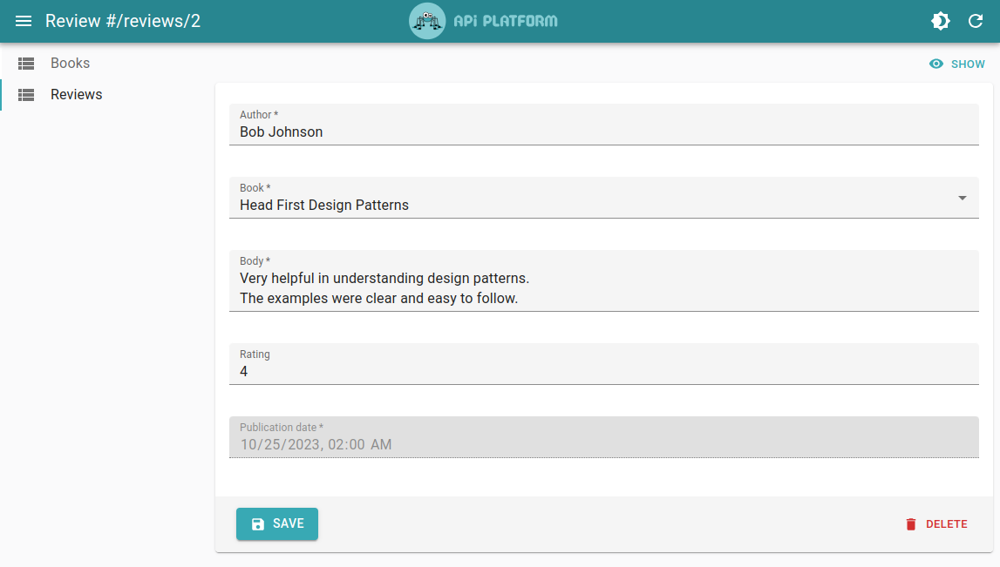

# Customizing the Guessers

Using `<HydraAdmin>` or `<OpenApiAdmin>` directly is a great way to quickly get started with API Platform Admin. They will introspect your API schema (using `@api-platform/api-doc-parser`) and automatically generate CRUD pages for all the resources it exposes. They will even [configure filtering, sorting, and real-time updates with Mercure](./schema.md) if your API supports it.

For some this may be enough, but you will often find yourself wanting to customize the generated pages further. For instance, you may want to:

- Hide or reorder resources in the menu
- Hide or reorder columns in the list view
- Hide or reorder fields in the show, create and edit views
- Customize the generated list, e.g. add a default sort order
- Customize the generated create and edit views, e.g. to add a warning when there are unsaved changes
- Customize the generated inputs, e.g. set a custom label or make a text input multiline

Such changes can't be achieved by modifying the Schema, they require customizing the React components generated by API Platform Admin.

Fortunately, API Platform Admin has you covered!

## From `<AdminGuesser>` To `<ResourceGuesser>`

If you are using `<HydraAdmin>` or `<OpenApiAdmin>` directly, there is a simple way to start customizing the generated pages.

Simply open your browser's developer tools and look at the console. You will see messages like this:

```txt
If you want to override at least one resource, paste this content in the <AdminGuesser> component of your app:

<ResourceGuesser name="books" />
<ResourceGuesser name="greetings" />
<ResourceGuesser name="reviews" />
```

This message tells you which resources are exposed by your API and how to customize the generated pages for each of them.

Let's say we'd like to hide the `greetings` resource from the menu. We can do this by replacing the `<AdminGuesser>` component (`<HydraAdmin>` in our case) children with a list of `<ResourceGuesser>`:

```diff
-import { HydraAdmin } from "@api-platform/admin";
+import { HydraAdmin, ResourceGuesser } from "@api-platform/admin";

const App = () => (
-   <HydraAdmin entrypoint={...} />
+   <HydraAdmin entrypoint={...}>
+       <ResourceGuesser name="books" />
+       <ResourceGuesser name="reviews" />
+   </HydraAdmin>
);
```

Now the `greetings` resource will no longer be displayed in the menu.


`<ResourceGuesser>` also accepts all props react-admin's [`<Resource>`](https://marmelab.com/react-admin/Resource.html) component accepts. This means that, for instance, you can use the `list` prop to use your own list component, but keep using the create, edit and show components introspected by `<ResourceGuesser>`:

```diff
import { HydraAdmin, ResourceGuesser } from "@api-platform/admin";
+import { BookList } from "./BookList";

const App = () => (
    <HydraAdmin entrypoint={...}>
-       <ResourceGuesser name="books" />
+       <ResourceGuesser name="books" list={BookList} />
        <ResourceGuesser name="reviews" />
    </HydraAdmin>
);
```

Likewise, you can use the `icon` prop to customize the icon displayed in the menu:

```diff
+import AutoStoriesIcon from '@mui/icons-material/AutoStories';
+import ReviewsIcon from '@mui/icons-material/Reviews';
import { HydraAdmin, ResourceGuesser } from "@api-platform/admin";

const App = () => (
    <HydraAdmin entrypoint={...}>
-       <ResourceGuesser name="books" />
+       <ResourceGuesser name="books" icon={AutoStoriesIcon} />
-       <ResourceGuesser name="reviews" />
+       <ResourceGuesser name="reviews" icon={ReviewsIcon} />
    </HydraAdmin>
);
```

Here is the result:


## Customizing the `<ListGuesser>`

By default, `<ResourceGuesser>` will render a `<ListGuesser>` component as the list view for a resource.

This component will automatically introspect the API schema and generate a list view with all the fields of the resource.


This is already usable, but may not provide the best user experience yet.

To start customizing the list view, you can look at the DevTools console. You will see messages like this:

```txt
If you want to override at least one field, create a BookList component with this content:

import { ListGuesser, FieldGuesser } from "@api-platform/admin";

export const BookList = () => (
    <ListGuesser>
        <FieldGuesser source="isbn" />
        <FieldGuesser source="title" />
        <FieldGuesser source="description" />
        <FieldGuesser source="author" />
        <FieldGuesser source="publicationDate" />
        <FieldGuesser source="reviews" />
    </ListGuesser>
);

Then, update your main admin component:

import { HydraAdmin, ResourceGuesser } from "@api-platform/admin";
import { BookList } from './BookList';

const App = () => (
    <HydraAdmin entrypoint={...}>
        <ResourceGuesser name="books" list={BookList} />
        {/* ... */}
    </HydraAdmin>
);
```

If you follow these instructions, you will end up with the same view as before, but now you can start customizing it.

For instance, we'll hide the 'Description' column as it takes too much space (we'll reserve that to the show view). And we will also add a default sort order to show the most recent books first.

Here's how to achieve this:

```diff
export const BookList = () => (
-   <ListGuesser>
+   <ListGuesser sort={{ field: 'publicationDate', order: 'DESC' }}>
        <FieldGuesser source="isbn" />
        <FieldGuesser source="title" />
-       <FieldGuesser source="description" />
        <FieldGuesser source="author" />
        <FieldGuesser source="publicationDate" />
        <FieldGuesser source="reviews" />
    </ListGuesser>
);
```

And here is the result:


That's already better isn't it? 🙂

## Customizing the `<FieldGuesser>`

Removing or reordering `<FieldGuesser>` components is not the only thing we can do. We can also customize them.

Indeed, `<FieldGuesser>` will forward additional props to the underlying React Admin [Field component](https://marmelab.com/react-admin/Fields.html).

This means we can use any [common field prop](https://marmelab.com/react-admin/Fields.html#common-field-props) on them.

For instance, let's add a `label` prop to customize the label of the ISBN column to be all uppercase:

```diff
export const BookList = () => (
    <ListGuesser sort={{ field: 'publicationDate', order: 'DESC' }}>
-       <FieldGuesser source="isbn" />
+       <FieldGuesser source="isbn" label="ISBN" />
        <FieldGuesser source="title" />
        <FieldGuesser source="author" />
        <FieldGuesser source="publicationDate" />
        <FieldGuesser source="reviews" />
    </ListGuesser>
);
```

And here is the result:


## Customizing the `<ShowGuesser>`

Following the same principles as the `<ListGuesser>` (including looking at the DevTools console) we can customize the show view.

In the following example, the show view for the `books` resource was customized to make the label of the `isbn` field uppercase:

```tsx
import {
  HydraAdmin,
  ResourceGuesser,
  ShowGuesser,
  FieldGuesser,
} from '@api-platform/admin';

const BookShow = () => (
  <ShowGuesser>
    <FieldGuesser source="isbn" label="ISBN" />
    <FieldGuesser source="title" />
    <FieldGuesser source="description" />
    <FieldGuesser source="author" />
    <FieldGuesser source="publicationDate" />
    <FieldGuesser source="reviews" />
  </ShowGuesser>
);

export default () => (
  <HydraAdmin entrypoint="https://demo.api-platform.com">
    <ResourceGuesser name="books" show={BookShow} />
    <ResourceGuesser name="reviews" />
  </HydraAdmin>
);
```

Here is the result:


## From `<FieldGuesser>` To React Admin Fields

As mentioned in the [Customizing the `<FieldGuesser>`](./customizing.md#customizing-the-fieldguesser) section, we can use any [common field prop](https://marmelab.com/react-admin/Fields.html#common-field-props) from React Admin to customize the `<FieldGuesser>` elements.

However in some cases you may want to go further and use a React Admin [field components](https://marmelab.com/react-admin/Fields.html), such as [`<TextField>`](https://marmelab.com/react-admin/TextField.html), [`<DateField>`](https://marmelab.com/react-admin/DateField.html) or [`<ReferenceField>`](https://marmelab.com/react-admin/ReferenceField.html) directly, to access more advanced features.

For instance, you can replace a `<FieldGuesser>` with a [`<DateField>`](https://marmelab.com/react-admin/DateField.html) to control more precisely how the publication date is displayed, leveraging the [`showTime`](https://marmelab.com/react-admin/DateField.html#showtime) prop:

```diff
import { ShowGuesser, FieldGuesser } from '@api-platform/admin';
+import { DateField } from 'react-admin';

const ReviewShow = () => (
  <ShowGuesser>
-     <FieldGuesser source="publicationDate" />
+     <DateField showTime source="publicationDate" />
  </ShowGuesser>
);
```

## Customizing the `<EditGuesser>` and `<CreateGuesser>`

Customizing the `<EditGuesser>` and `<CreateGuesser>` is very similar to customizing the `<ShowGuesser>`.

We can start by looking at the DevTools console to get the initial code of the components.

```txt
If you want to override at least one input, create a ReviewEdit component with this content:

import { EditGuesser, InputGuesser } from "@api-platform/admin";

export const ReviewEdit = () => (
    <EditGuesser>
        <InputGuesser source="rating" />
        <InputGuesser source="body" />
        <InputGuesser source="author" />
        <InputGuesser source="publicationDate" />
        <InputGuesser source="book" />
    </EditGuesser>
);

Then, update your main admin component:

import { HydraAdmin, ResourceGuesser } from "@api-platform/admin";
import { ReviewEdit } from './ReviewEdit';

const App = () => (
    <HydraAdmin entrypoint={...}>
        <ResourceGuesser name="reviews" edit={ReviewEdit} />
        {/* ... */}
    </HydraAdmin>
);
```

Let's customize this `ReviewEdit` component to:

- reorder the inputs
- make the `body` input multiline
- mark the `publicationDate` input as read-only


```diff
export const ReviewEdit = () => (
    <EditGuesser>
-       <InputGuesser source="rating" />
-       <InputGuesser source="body" />
-       <InputGuesser source="author" />
-       <InputGuesser source="publicationDate" />
-       <InputGuesser source="book" />
+       <InputGuesser source="author" />
+       <InputGuesser source="book" />
+       <InputGuesser source="body" multiline />
+       <InputGuesser source="rating" />
+       <InputGuesser source="publicationDate" readOnly />
    </EditGuesser>
);
```

Here is the result:



**Tip:** Here, we leveraged the `multiline` and `readOnly` props of the `<InputGuesser>` component. But you can use any [common input prop](https://marmelab.com/react-admin/Inputs.html#common-input-props) supported by React Admin [Inputs](https://marmelab.com/react-admin/Inputs.html) on them.

## From `<InputGuesser>` To React Admin Inputs

As mentioned in the previous section, we can use any [common input prop](https://marmelab.com/react-admin/Inputs.html#common-input-props) from React Admin to customize the `<InputGuesser>` elements.

However in some cases you may want to go further and use a React Admin [input components](https://marmelab.com/react-admin/Inputs.html), such as [`<TextInput>`](https://marmelab.com/react-admin/TextInput.html), [`<DateInput>`](https://marmelab.com/react-admin/DateInput.html) or [`<ReferenceInput>`](https://marmelab.com/react-admin/ReferenceInput.html) directly, to access more advanced features.

A good example is to use an [Autocomplete Input to edit a relation](./handling-relations.md#using-an-autocomplete-input-for-relations).

This leverages both [`<ReferenceInput>`](https://marmelab.com/react-admin/ReferenceInput.html) and [`<AutocompleteInput>`](https://marmelab.com/react-admin/AutocompleteInput.html) to offer a better user experience when editing the relation:

```diff
import { EditGuesser, InputGuesser } from '@api-platform/admin';
+import { ReferenceInput, AutocompleteInput } from 'react-admin';

const ReviewsEdit = () => (
  <EditGuesser>
    <InputGuesser source="author" />
-   <InputGuesser source="book" />
+   <ReferenceInput source="book" reference="books">
+     <AutocompleteInput
+       filterToQuery={(searchText) => ({ title: searchText })}
+       optionText="title"
+     />
+   </ReferenceInput>
  </EditGuesser>
);
```


> [!WARNING]
> When replacing `<InputGuesser>` with a React Admin input component, the validation rules are not automatically applied. You will need to manually add them back. Fortunately, this is very easy to do. Read the [Validation With React Admin Inputs](./validation.md#validation-with-react-admin-inputs) section to learn more.

## Next Step

The above examples are limited to customizing the various API Platform Admin Guessers, but this is just the tip of the iceberg.

By leveraging React Admin components and props, you can go much further in customizing the generated pages.

Head to the next section, [Customizing the Admin](./advanced-customization.md), for step-by-step examples.
