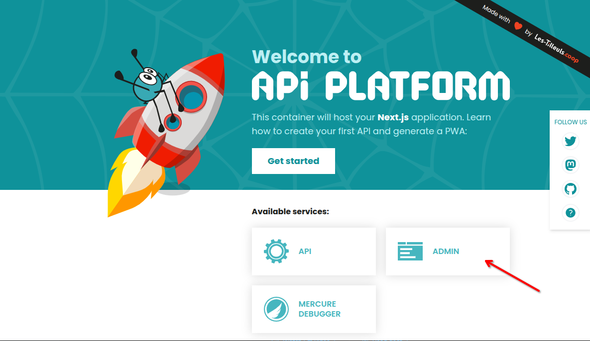
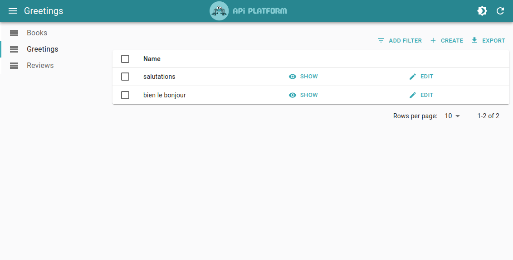

# Getting Started

## API Platform Symfony variant

If you use the [API Platform Symfony variant](../symfony/), good news, API Platform Admin is already installed! 🎉

You can access it by visiting `/admin` on your API Platform application.

When running locally, you can also click on the "Admin" button of the welcome page at https://localhost.



Here is what it looks like with a simple API exposing a `Greetings` resource:



## Manual Installation

If you did not use the Symfony variant of API Platform and need to install API Platform Admin manually, follow this guide.

First, let's scaffold a React Admin Application by using the [Create React Admin](https://marmelab.com/react-admin/CreateReactAdmin.html) tool:

```bash
npx create-react-admin@latest my-admin
cd my-admin
```

Then, install the `@api-platform/admin` library:

```bash
npm install @api-platform/admin
```

Now you can use either:

- [`<HydraAdmin>`](#using-hydraadmin) to connect your app to an API exposing a Hydra documentation
- [`<OpenApiAdmin>`](#using-openapiadmin) to connect your app to an API exposing an OpenAPI documentation

## Using `HydraAdmin`

You can use the [`<HydraAdmin>`](./components.md#hydraadmin) component exported by `@api-platform/admin` to connect your app to an API exposing a Hydra documentation.

If you used Create React Admin, you can replace the content of `src/App.tsx` by:

```tsx
import { HydraAdmin } from "@api-platform/admin";

// Replace with your own API entrypoint
// For instance if https://example.com/api/books is the path to the collection of book resources, then the entrypoint is https://example.com/api
export const App = () => <HydraAdmin entrypoint="https://localhost" />;
```

**Tip:** if you don't want to hardcode the API URL, you can [use an environment variable](https://vite.dev/guide/env-and-mode).

Your new administration interface is ready! `HydraAdmin` will automatically fetch the Hydra documentation of your API and generate CRUD pages for all the resources it exposes.

Type `npm run dev` to try it!


**Tip:** There are more props you can pass to the `HydraAdmin` component to customize the dataProvider or the connection to Mercure. Check the [API documentation](./components.md#hydraadmin) for more information.

**Tip:** You may also need to configure your API to set the correct CORS headers. Refer to the [Configuring CORS](#configuring-cors) section below to learn more.

## Using `OpenApiAdmin`

You can use the [`<OpenApiAdmin>`](./components.md#openapiadmin) component exported by `@api-platform/admin` to connect your app to an API exposing an OpenAPI documentation.

If you used Create React Admin, you can replace the content of `src/App.tsx` by:

```tsx
import { OpenApiAdmin } from "@api-platform/admin";

// Replace with your own API entrypoint
export const App = () => (
  <OpenApiAdmin
    entrypoint="https://localhost"
    docEntrypoint="https://localhost/docs.jsonopenapi"
  />
);
```

**Tip:** if you don't want to hardcode the API URL, you can [use an environment variable](https://vite.dev/guide/env-and-mode).

Your new administration interface is ready! `OpenApiAdmin` will automatically fetch the Hydra documentation of your API and generate CRUD pages for all the resources it exposes.

Type `npm run dev` to try it!


**Tip:** There are more props you can pass to the `OpenApiAdmin` component to customize the dataProvider or the connection to Mercure. Check the [API documentation](./components.md#openapiadmin) for more information.

**Tip:** You may also need to configure your API to set the correct CORS headers. Refer to the [Configuring CORS](#configuring-cors) section below to learn more.

## Configuring CORS

Be sure to make your API send proper [CORS HTTP headers](https://developer.mozilla.org/en-US/docs/Web/HTTP/CORS) to allow
the admin's domain to access it.

To do so, if you use the API Platform Symfony variant, update the value of the `CORS_ALLOW_ORIGIN` parameter in `api/.env` (it will be set to `^https?://localhost:?[0-9]*$`
by default).

If you use a custom installation of Symfony and [API Platform Core](../core/), you will need to adjust the [NelmioCorsBundle configuration](https://github.com/nelmio/NelmioCorsBundle#configuration) to expose the `Link` HTTP header and to send proper CORS headers on the route under which the API will be served (`/api` by default).
Here is a sample configuration:

```yaml
# config/packages/nelmio_cors.yaml

nelmio_cors:
  paths:
    '^/api/':
      origin_regex: true
      allow_origin: ['^http://localhost:[0-9]+'] # You probably want to change this regex to match your real domain
      allow_methods: ['GET', 'OPTIONS', 'POST', 'PUT', 'PATCH', 'DELETE']
      allow_headers: ['Content-Type', 'Authorization']
      expose_headers: ['Link']
      max_age: 3600
```

Clear the cache to apply this change:

```console
bin/console cache:clear --env=prod
```

**Next step:** Learn how to add more features to your generated Admin by [Customizing the Schema](./schema-org.md).