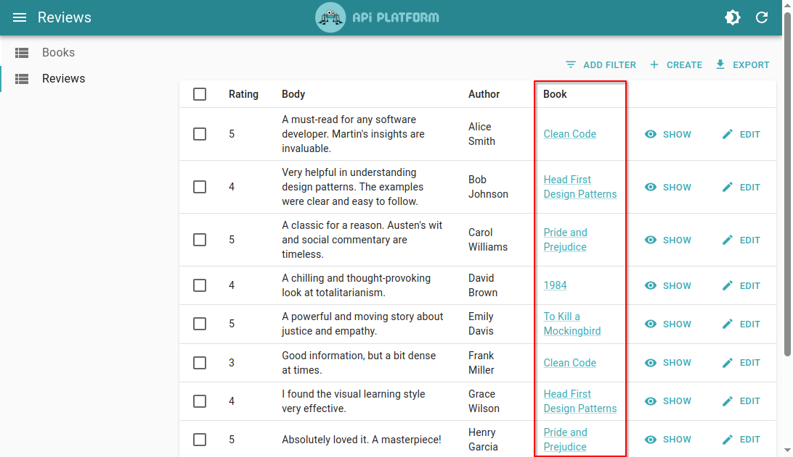
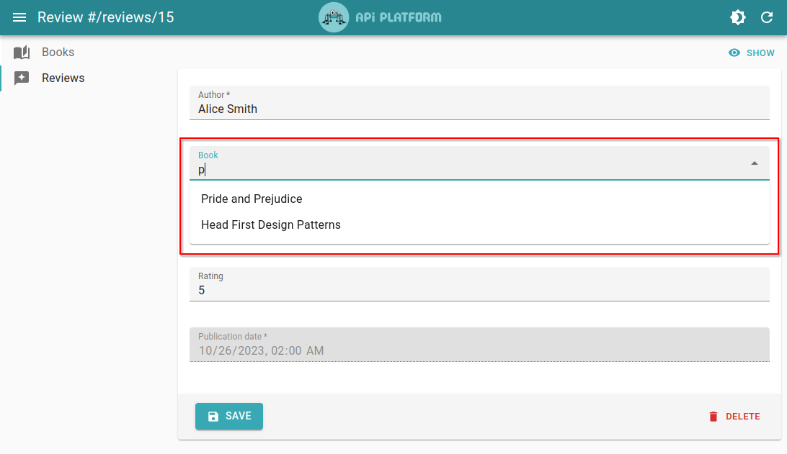

# Handling Relations

API Platform Admin handles `one-to-one`, `many-to-one` and `one-to-many` relations automatically.

However, in some cases, dependeing on whether or not you chose to embed the relation in the serialized data, you may need to customize the way the relation is displayed and/or can be edited.

## Working With Embedded Relations

You can configure your API to [embed the related data](../core/serialization.md#embedding-relations) in the serialized response.

```js
// Without Embedded Book Data
{
  "@id": "/reviews/15",
  id: 15,
  rating: 5,
  body: "A must-read for any software developer. Martin's insights are invaluable.",
  author: "Alice Smith",
  book: "/books/7"
}

// With Embedded Book Data
{
  "@id": "/reviews/15",
  id: 15,
  rating: 5,
  body: "A must-read for any software developer. Martin's insights are invaluable.",
  author: "Alice Smith",
  book: {
    "@id": "/books/7",
    id: 7,
    title: "Clean Code",
    author: "Robert C. Martin",
  }
}
```

If you do so, by default the admin will render the full object as text field and text input, which is not very user-friendly.


There are two ways you can handle this situation:

1. Change the Field and Input components to [display the fields you want](#displaying-a-field-of-an-embedded-relation)
2. Ask the admin to [return the embedded resources' IRI instead of the full record](#return-the-embedded-resources-iri-instead-of-the-full-record), by leveraging the `useEmbedded` parameter

### Displaying a Field of an Embedded Relation

React Admin fields allow to use the dot notation (e.g. `book.title`) to target a field from an embedded relation.

```jsx
import {
  HydraAdmin,
  FieldGuesser,
  ListGuesser,
  ResourceGuesser,
} from '@api-platform/admin';
import { TextField } from 'react-admin';

const ReviewList = () => (
  <ListGuesser>
    <FieldGuesser source="rating" />
    <FieldGuesser source="body" />
    <FieldGuesser source="author" />
    {/* Use react-admin components directly when you want complex fields. */}
    <TextField label="Book" source="book.title" />
  </ListGuesser>
);

export const App = () => (
  <HydraAdmin entrypoint={...} >
    <ResourceGuesser name="reviews" list={ReviewList} />
  </HydraAdmin>
);
```


Allowing to edit the relation, on the other hand, is a little trickier, as it requires transforming the record to replace the nested object by its IRI.

Fortunately, this can be done by leveraging the `transform` prop of the `<EditGuesser>` component.

We can edit the relation by leveraging either [`<ReferenceInput>`](https://marmelab.com/react-admin/ReferenceInput.html) for a `to-one` relation or [`<ReferenceArrayInput>`](https://marmelab.com/react-admin/ReferenceArrayInput.html) for a `to-many` relation.

```jsx
import {
  HydraAdmin,
  InputGuesser,
  EditGuesser,
  ResourceGuesser,
} from '@api-platform/admin';
import { ReferenceInput, AutocompleteInput } from 'react-admin';

const reviewEditTransform = (values) => ({
  ...values,
  book: values.book['@id'],
});

const ReviewEdit = () => (
  <EditGuesser transform={reviewEditTransform}>
    <InputGuesser source="rating" />
    <InputGuesser source="body" />
    <InputGuesser source="author" />
    <ReferenceInput source="book.@id" reference="books">
      <AutocompleteInput
        label="Book"
        filterToQuery={(searchText) => ({ title: searchText })}
      />
    </ReferenceInput>
  </EditGuesser>
);

export const App = () => (
  <HydraAdmin entrypoint={...} >
    <ResourceGuesser name="reviews" edit={ReviewEdit} />
  </HydraAdmin>
);
```

This offers a nice and convenient way to edit the relation.


**Tip:** We also had to customize `<ReferenceInput>`'s child [`<AutocompleteInput>`](https://marmelab.com/react-admin/AutocompleteInput.html) component to override its `label` and `filterToQuery` props. You can learn more about why that's necessary in the [Using an AutoComplete Input for Relations](#using-an-autocomplete-input-for-relations) section.

### Return the Embedded Resources' IRI Instead of the Full Record

You can also ask the admin to return the embedded resources' IRI instead of the full record, by setting the `useEmbedded` parameter of the Hydra data provider to `false`.

```jsx
// admin/src/App.jsx

import { HydraAdmin, dataProvider } from '@api-platform/admin';

const entrypoint = process.env.ENTRYPOINT;

export const App = () => (
  <HydraAdmin
    entrypoint={entrypoint}
    dataProvider={dataProvider({
      entrypoint,
      useEmbedded: false,
    })}
  />
);
```

This tells the dataProvider to return only the IRI in the record, discarding the embedded data.

```js
// With useEmbedded=true (default)
const record = {
  "@id": "/reviews/15",
  id: 15,
  rating: 5,
  body: "A must-read for any software developer. Martin's insights are invaluable.",
  author: "Alice Smith",
  book: {
    "@id": "/books/7",
    id: 7,
    title: "Clean Code",
    author: "Robert C. Martin",
  }
}

// With useEmbedded=false
const record = {
  "@id": "/reviews/15",
  id: 15,
  rating: 5,
  body: "A must-read for any software developer. Martin's insights are invaluable.",
  author: "Alice Smith",
  book: "/books/7"
}
```

This way, the related record's IRI is returned and can be displayed.


We can improve the UI further by leveraging React Admin's [`<ReferenceField>`](https://marmelab.com/react-admin/ReferenceField.html) component:

```jsx
import {
  HydraAdmin,
  FieldGuesser,
  ListGuesser,
  ResourceGuesser,
} from '@api-platform/admin';
import { ReferenceField, TextField } from 'react-admin';

const ReviewList = () => (
  <ListGuesser>
    <FieldGuesser source="rating" />
    <FieldGuesser source="body" />
    <FieldGuesser source="author" />
    <ReferenceField source="book" reference="books">
      <TextField source="title" />
    </ReferenceField>
  </ListGuesser>
);

export const App = () => (
  <HydraAdmin entrypoint={...} >
    <ResourceGuesser name="reviews" list={ReviewList} />
  </HydraAdmin>
);
```

This allows to display the title of the related book instead of its IRI.



Lastly, this also allows to easily edit the relation by leveraging either [`<ReferenceInput>`](https://marmelab.com/react-admin/ReferenceInput.html) for a `to-one` relation or [`<ReferenceArrayInput>`](https://marmelab.com/react-admin/ReferenceArrayInput.html) for a `to-many` relation.

```jsx
import {
  HydraAdmin,
  InputGuesser,
  EditGuesser,
  ResourceGuesser,
} from '@api-platform/admin';
import { ReferenceInput, AutocompleteInput } from 'react-admin';

const ReviewEdit = () => (
  <EditGuesser>
    <InputGuesser source="rating" />
    <InputGuesser source="body" />
    <InputGuesser source="author" />
    <ReferenceInput source="book" reference="books">
      <AutocompleteInput
        filterToQuery={(searchText) => ({ title: searchText })}
      />
    </ReferenceInput>
  </EditGuesser>
);

export const App = () => (
  <HydraAdmin entrypoint={...} >
    <ResourceGuesser name="reviews" edit={ReviewEdit} />
  </HydraAdmin>
);
```

This offers a nice and convenient way to edit the relation.


**Tip:** We also had to customize `<ReferenceInput>`'s child [`<AutocompleteInput>`](https://marmelab.com/react-admin/AutocompleteInput.html) component to override its `filterToQuery` props. You can learn more about why that's necessary in the [Using an AutoComplete Input for Relations](#using-an-autocomplete-input-for-relations) section.

## Using an Autocomplete Input for Relations

By default, `<InputGuesser>` will render a [`<SelectInput>`](https://marmelab.com/react-admin/SelectInput.html) when it detects a relation.

We can improve the UX further by rendering an [`<AutocompleteInput>`](https://marmelab.com/react-admin/AutocompleteInput.html) instead.

`<AutocompleteInput>` allows to search for a related record by typing its name in an input field. This is much more convenient when there are many records to choose from.

Let's consider an API exposing `Review` and `Book` resources linked by a `many-to-one` relation (through the `book` property).

This API uses the following PHP code:

```php
<?php
// api/src/Entity/Review.php
namespace App\Entity;

use ApiPlatform\Metadata\ApiResource;
use Doctrine\ORM\Mapping as ORM;

#[ORM\Entity]
#[ApiResource]
class Review
{
    #[ORM\Id, ORM\Column, ORM\GeneratedValue]
    public ?int $id = null;

    #[ORM\ManyToOne]
    public Book $book;
}
```

```php
<?php
// api/src/Entity/Book.php
namespace App\Entity;

use ApiPlatform\Metadata\ApiFilter;
use ApiPlatform\Metadata\ApiResource;
use ApiPlatform\Doctrine\Orm\Filter\SearchFilter;
use Doctrine\Common\Collections\ArrayCollection;
use Doctrine\Common\Collections\Collection;
use Doctrine\ORM\Mapping as ORM;

#[ORM\Entity]
#[ApiResource]
class Book
{
    #[ORM\Id, ORM\Column, ORM\GeneratedValue]
    public ?int $id = null;

    #[ORM\Column]
    #[ApiFilter(SearchFilter::class, strategy: 'ipartial')]
    public string $title;

    #[ORM\OneToMany(targetEntity: Review::class, mappedBy: 'book')]
    public $reviews;

    public function __construct()
    {
        $this->reviews = new ArrayCollection();
    }
}
```

Notice the "partial search" [filter](../core/filters.md) on the `title` property of the `Book` resource class.

Now, let's configure API Platform Admin to enable autocompletion for the book selector. We will leverage the [`<ReferenceInput>`](https://marmelab.com/react-admin/ReferenceInput.html) and [`<AutocompleteInput>`](https://marmelab.com/react-admin/AutocompleteInput.html) components from React Admin:

```jsx
import {
  HydraAdmin,
  ResourceGuesser,
  CreateGuesser,
  EditGuesser,
  InputGuesser,
} from '@api-platform/admin';
import { ReferenceInput, AutocompleteInput } from 'react-admin';

const ReviewsEdit = () => (
  <EditGuesser>
    <InputGuesser source="author" />

    <ReferenceInput source="book" reference="books">
      <AutocompleteInput
        filterToQuery={(searchText) => ({ title: searchText })}
        optionText="title"
      />
    </ReferenceInput>

    <InputGuesser source="rating" />
    <InputGuesser source="body" />
    <InputGuesser source="publicationDate" />
  </EditGuesser>
);

export const App = () => (
  <HydraAdmin entrypoint={...} >
    <ResourceGuesser name="reviews" edit={ReviewsEdit} />
  </HydraAdmin>
);
```

The important things to note are:

- the `filterToQuery` prop, which allows to search for books by title (leveraging the "partial search" filter mentioned above)
- the `optionText` prop, which tells the `<AutocompleteInput>` component to render books using their `title` property

You can now search for books by title in the book selector of the review form.



## Displaying Related Record Name Instead of Their IRI

Thanks to the [Schema.org](./schema-org.md) support, you can easily display the name of a related resource instead of its IRI.

Follow the [Displaying Related Resource's Name Instead of its IRI](./schema-org.md#displaying-related-resources-name-instead-of-its-iri) section of the Schema.org documentation to implement this feature.

## Going Further

React Admin can handle many types of relations, even `many-to-many`. You can learn more about them in the [Fields For Relationships](https://marmelab.com/react-admin/FieldsForRelationships.html) documentation.

You can also read the [Handling Relationships in React Admin](https://marmelab.com/blog/2025/02/06/handling-relationships-in-react-admin.html) post from the React Admin blog for concrete examples and source code.
