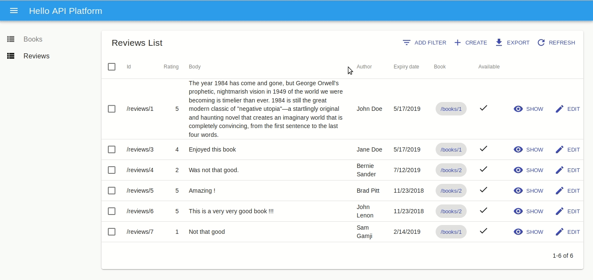

# The API Platform Admin

API Platform Admin is a tool to automatically create a beautiful and fully featured administration interface
for any API supporting [the Hydra Core Vocabulary](http://www.hydra-cg.com/) or other API specification formats supported by [`@api-platform/api-doc-parser`](https://github.com/api-platform/api-doc-parser) (experimental support for [OpenAPI](https://www.openapis.org/) is also available).

API Platform Admin is the perfect companion of APIs created
using [the API Platform framework](https://api-platform.com), but also supports APIs written with any other programming language or framework as long as they expose a standard Hydra API documentation.

API Platform Admin is a 100% standalone Single-Page-Application with no coupling to the server part,
according to the API-first paradigm.

API Platform Admin parses the API documentation then uses the awesome [React Admin](https://marmelab.com/react-admin/)
library to expose a nice, responsive, management interface (Create-Retrieve-Update-Delete) for all documented resource types.

You can **customize everything** by using provided React Admin and [Material UI](https://material-ui.com/) components, or by writing your custom [React](https://reactjs.org/) components.

## Features

* Automatically generates an admin interface for all the resources of the API thanks to hypermedia features of Hydra
* Generates 'list', 'create', 'show', and 'edit' screens, as well as a delete button
* Generates suitable inputs and fields according to the API doc (e.g. number HTML input for numbers, checkbox for booleans, selectbox for relationships...)
* Generates suitable inputs and fields according to Schema.org types if available (e.g. email field for `https://schema.org/email`)
* Handles relationships
* Supports pagination
* Supports filters and ordering
* Automatically validates whether a field is mandatory client-side according to the API description
* Sends proper HTTP requests to the API and decodes them using Hydra and JSON-LD formats
* Nicely displays server-side errors (e.g. advanced validation)
* **100% customizable**
