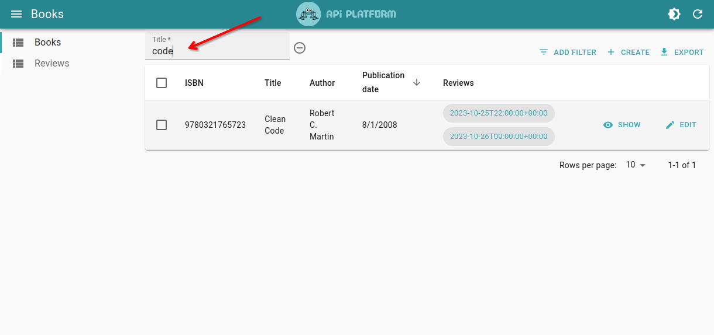
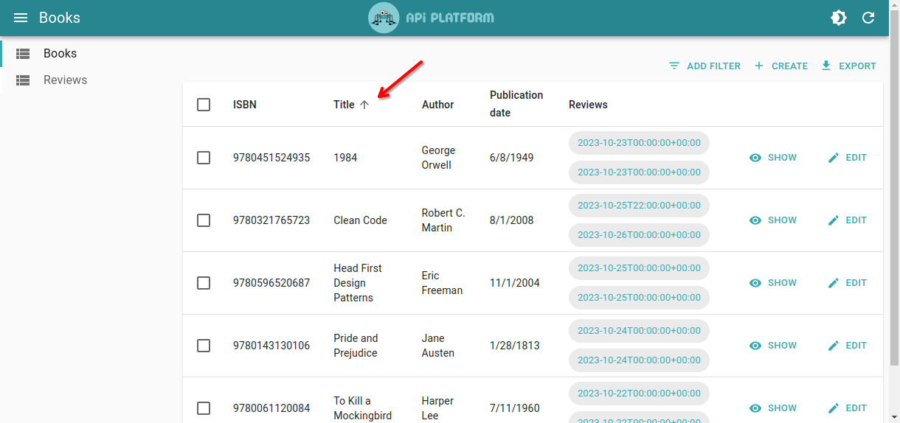
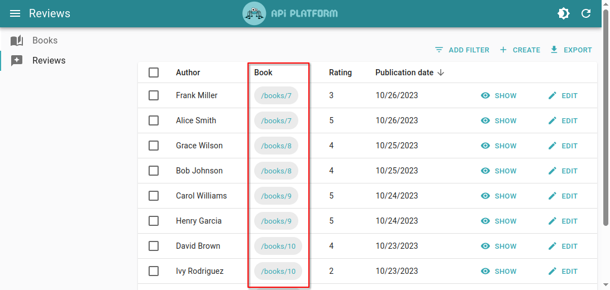

# Customizing the Schema

Both [`HydraAdmin`](./components.md#hydraadmin) and [`OpenApiAdmin`](./components.md#openapiadmin) leverage introspection of the API schema to discover its capabilities, like **filtering** and **sorting**.

They also detect wether the API has real-time capabilities using [Mercure](./real-time-mercure.md), and automatically enable it if it does.

Lastly, API Platform Admin has native support for the popular [Schema.org](./schema.md#about-schemaorg) vocabulary, which enables it to automatically use the field type matching your data, or display a related resource's name instead of its IRI.

## Adding Filtering Capabilities

You can add the [`ApiFilter` attribute](../core/filters.md#apifilter-attribute) to an API Platform resource to configure a filter on a property.

For instance, here is how configure filtering on the `id`, `title` and `author` properties of a `Book` resource:

```php
<?php
// api/src/Entity/Book.php
namespace App\Entity;

use ApiPlatform\Metadata\ApiFilter;
use ApiPlatform\Metadata\ApiResource;
use ApiPlatform\Doctrine\Orm\Filter\SearchFilter;
use Doctrine\ORM\Mapping as ORM;

#[ApiResource]
#[ORM\Entity]
#[ApiFilter(SearchFilter::class, properties: [
    'id' => 'exact', 
    'title' => 'ipartial', 
    'author' => 'ipartial'
])]
class Book
{
    // ...
}
```

If you are using the guessers, the Admin will automatically update the Book list view to include a filter on the selected properties.



**Tip:** Learn more about the [`ApiFilter` attribute](../core/filters.md#apifilter-attribute) in the core documentation.

## Adding Sorting Capabilities

You can also use the [`ApiFilter` attribute](../core/filters.md#apifilter-attribute) on an API Plaform resource to configure sorting.

For instance, here is how to configure sorting on the `id`, `isbn`, `title`, `author` and `publicationDate` properties of a `Book` resource:

```php
<?php
// api/src/Entity/Book.php
namespace App\Entity;

use ApiPlatform\Metadata\ApiFilter;
use ApiPlatform\Metadata\ApiResource;
use ApiPlatform\Doctrine\Orm\Filter\SearchFilter;
use Doctrine\ORM\Mapping as ORM;

#[ApiResource]
#[ORM\Entity]
#[ApiFilter(OrderFilter::class, properties: [
    'id' => 'ASC', 
    'isbn' => 'ASC', 
    'title' => 'ASC', 
    'author' => 'ASC', 
    'publicationDate' => 'DESC'
])]
class Book
{
    // ...
}
```

If you are using the guessers, the Admin will automatically update the Book list view to make the selected columns sortable.



**Tip:** Learn more about the [`ApiFilter` attribute](../core/filters.md#apifilter-attribute) in the core documentation.

## Enabling Real-Time Updates

You can use the `mercure` attribute to hint API Platform that it must dispatch the updates regarding the given resources to the Mercure hub:

```php
<?php
// api/src/ApiResource/Book.php with Symfony or app/ApiResource/Book.php with Laravel
namespace App\ApiResource;

use ApiPlatform\Metadata\ApiResource;

#[ApiResource(mercure: true)]
class Book
{
    // ...
}
```

Make sure you have [configured your dataProvider to support Mercure](./real-time-mercure.md).

**Tip:** Learn more about how to use the Mercure Protocol in the [API Platform Core documentation](../core/mercure.md).

## About Schema.org

API Platform Admin has native support for the popular [Schema.org](https://schema.org) vocabulary.

> Schema.org is a collaborative, community activity with a mission to create, maintain, and promote schemas for structured data on the Internet, on web pages, in email messages, and beyond.

To leverage this capability, your API must use the JSON-LD format and the appropriate Schema.org types.
The following examples will use [API Platform Core](../core/) to create such API, but keep in mind that this feature will work with any JSON-LD API using the Schema.org vocabulary, regardless of the used web framework or programming language.

## Displaying Related Resource's Name Instead of its IRI

By default, IRIs of related objects are displayed in lists and forms.
However, it is often more user-friendly to display a string representation of the resource (such as its name) instead of its ID.

To configure which property should be shown to represent your entity, map the property containing the name of the object with the `https://schema.org/name` type:

```php
// api/src/Entity/Person.php
...

#[ApiProperty(iris: ["https://schema.org/name"])]
private $name;

...
```

| With IRI                                                         | With Resource Name                                                           |
| ---------------------------------------------------------------- | ---------------------------------------------------------------------------- |
|  |  |

## Emails, URLs and Identifiers

Besides, it is also possible to use the documentation to customize some fields automatically while configuring the semantics of your data.

The following Schema.org types are currently supported by API Platform Admin:

- `https://schema.org/email`: the field will be rendered using the [`<EmailField>`](https://marmelab.com/react-admin/EmailField.html) React Admin component
- `https://schema.org/url`: the field will be rendered using the [`<UrlField>`](https://marmelab.com/react-admin/UrlField.html) React Admin component
- `https://schema.org/identifier`: the field will be formatted properly in inputs

Note: if you already use validation on your properties, the semantics are already configured correctly (see [the correspondence table](../core/validation.md#open-vocabulary-generated-from-validation-metadata))!

## Next Step

Learn how to tweak the generated Admin by [Customizing the Guessers](./customizing.md).
