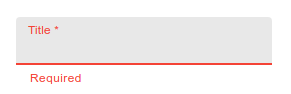
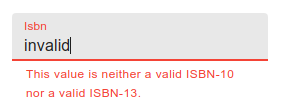

# Validation

API Platform Admin manages automatically two types of validation: client-side validation and server-side (or submission) validation.

## Client-side Validation

If the API documentation indicates that a field is mandatory,
API Platform Admin will automatically add a [required client-side validation](https://marmelab.com/react-admin/CreateEdit.html#per-input-validation-built-in-field-validators).

For instance, with API Platform as backend, if you write the following:

```php
<?php
// api/src/Entity/Book.php
namespace App\Entity;

use ApiPlatform\Metadata\ApiResource;
use Symfony\Component\Validator\Constraints as Assert;

#[ApiResource]
class Book
{
    #[Assert\NotBlank]
    public ?string $title = null;
}
```

If you create a new book and touch the "Title" field without typing, you will see:



## Server-side Validation

When the form is submitted and if submission errors are received,
API Platform Admin will automatically show the errors for the corresponding fields.

To do so, it uses the [submission validation](https://marmelab.com/react-admin/CreateEdit.html#submission-validation) feature of React Admin,
and the mapping between the response and the fields is done by the [schema analyzer](components.md#schemaanalyzer) with its method `getSubmissionErrors`.

API Platform is supported by default, but if you use another backend, you will need to override the `getSubmissionErrors` method.

For example if you have this code:

```php
<?php
// api/src/Entity/Book.php
namespace App\Entity;

use ApiPlatform\Metadata\ApiResource;
use Symfony\Component\Validator\Constraints as Assert;

#[ApiResource]
class Book
{
    #[Assert\Isbn]
    public ?string $isbn = null;
}
```

If you submit the form with an invalid ISBN, you will see:


