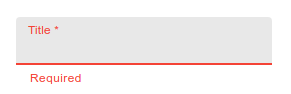
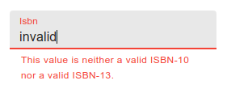

# Validation

API Platform Admin manages automatically two types of validation: client-side validation and
server-side (or submission) validation.

## Client-side Validation

If the API documentation indicates that a field is mandatory, API Platform Admin will automatically
add a
[required client-side validation](https://marmelab.com/react-admin/Validation.html#per-input-validation-built-in-field-validators).

For instance, with API Platform as backend, if you write the following:

```php
<?php
// api/src/Entity/Book.php
namespace App\Entity;

use ApiPlatform\Metadata\ApiResource;
use Symfony\Component\Validator\Constraints as Assert;

#[ApiResource]
class Book
{
    #[Assert\NotBlank]
    public ?string $title = null;
}
```

If you create a new book and try to submit without filling the "Title" field, you will see:



## Server-side Validation

When the form is submitted and if submission errors are received, API Platform Admin will
automatically show the errors for the corresponding fields.

To do so, it uses the
[Server-Side Validation](https://marmelab.com/react-admin/Validation.html#server-side-validation)
feature of React Admin, and the mapping between the response and the fields is done by the
[schema analyzer](components.md#hydra-schema-analyzer) with its method `getSubmissionErrors`.

API Platform is supported by default, but if you use another backend, you will need to override the
`getSubmissionErrors` method.

For example if you have this code:

```php
<?php
// api/src/Entity/Book.php
namespace App\Entity;

use ApiPlatform\Metadata\ApiResource;
use Symfony\Component\Validator\Constraints as Assert;

#[ApiResource]
class Book
{
    #[Assert\Isbn]
    public ?string $isbn = null;
}
```

If you submit the form with an invalid ISBN, you will see:



### How Server-side Validation Works Under the Hood

When `fetchHydra` receives an error response (HTTP status outside the 2xx range), it
[expands](https://www.w3.org/TR/json-ld11-api/#expansion) the JSON-LD body using the API
documentation context. This means the error object passed to `getSubmissionErrors` does not contain
the raw response payload, but an expanded JSON-LD document.

For example, a typical API Platform validation error response:

```json
{
    "@context": "/contexts/ConstraintViolationList",
    "@type": "ConstraintViolationList",
    "title": "An error occurred",
    "description": "isbn: This value is neither a valid ISBN-10 nor a valid ISBN-13.",
    "violations": [
        {
            "propertyPath": "isbn",
            "message": "This value is neither a valid ISBN-10 nor a valid ISBN-13."
        }
    ]
}
```

Gets expanded into a structure like:

```json
[
    {
        "http://www.w3.org/ns/hydra/core#description": [
            {
                "@value": "isbn: This value is neither a valid ISBN-10 nor a valid ISBN-13."
            }
        ],
        "http://www.w3.org/ns/hydra/core#violations": [
            {
                "http://www.w3.org/ns/hydra/core#propertyPath": [{ "@value": "isbn" }],
                "http://www.w3.org/ns/hydra/core#ConstraintViolation/message": [
                    {
                        "@value": "This value is neither a valid ISBN-10 nor a valid ISBN-13."
                    }
                ]
            }
        ]
    }
]
```

This expanded document is what the `HttpError`'s `body` property contains. The `getSubmissionErrors`
method of the [schema analyzer](components.md#hydra-schema-analyzer) handles parsing this expanded
format automatically and maps violations back to field names.

### Handling Validation Errors Outside React Admin

If you use `fetchHydra` in a custom React application (outside of React Admin forms), you need to
handle the expanded JSON-LD error format yourself.

Here is an example of how to extract validation errors from the expanded response:

```typescript
import { fetchHydra } from "@api-platform/admin";
import type { HttpError } from "react-admin";

async function submitData(url: URL, data: object) {
    try {
        return await fetchHydra(url, {
            method: "POST",
            body: JSON.stringify(data),
        });
    } catch (error) {
        if (error instanceof HttpError && error.status === 422 && error.body?.[0]) {
            const content = error.body[0];
            // Find the violations key (e.g. "http://www.w3.org/ns/hydra/core#violations")
            const violationKey = Object.keys(content).find((key) => key.includes("violations"));
            if (violationKey) {
                const base = violationKey.substring(0, violationKey.indexOf("#"));
                const violations = content[violationKey].map((violation) => ({
                    propertyPath: violation[`${base}#propertyPath`]?.[0]?.["@value"],
                    message: (violation[`${base}#message`] ??
                        violation[`${base}#ConstraintViolation/message`])?.[0]?.["@value"],
                }));
                return { violations };
            }
        }
        throw error;
    }
}
```

Alternatively, you can use the
[`jsonld.compact`](https://github.com/digitalbazaar/jsonld.js#compacting) method to convert the
expanded response back to a compact form closer to the original payload:

```typescript
import jsonld from "jsonld";

// Inside your catch block, after getting error.body:
const compacted = await jsonld.compact(error.body, {
    "@context": "http://www.w3.org/ns/hydra/context.jsonld",
});
// compacted now has a structure closer to the original API response
```

## Validation With React Admin Inputs

If you replace an `<InputGuesser>` with a React Admin
[input component](https://marmelab.com/react-admin/Inputs.html), such as
[`<TextInput>`](https://marmelab.com/react-admin/TextInput.html),
[`<DateInput>`](https://marmelab.com/react-admin/DateInput.html) or
[`<ReferenceInput>`](https://marmelab.com/react-admin/ReferenceInput.html), you will need to
**manually add the validation rules back**.

Fortunately, this is very easy to do, thanks to the
[`validate`](https://marmelab.com/react-admin/Inputs.html#validate) prop of the input components.

For instance, here is how to replace the input for the required `title` field:

```diff
import { EditGuesser, InputGuesser } from '@api-platform/admin';
+import { TextInput, required } from 'react-admin';

export const BookEdit = () => (
    <EditGuesser>
-       <InputGuesser source="title" />
+       <TextInput source="title" validate={required()} />
    </EditGuesser>
);
```

React Admin already comes with several
[built-in validators](https://marmelab.com/react-admin/Validation.html#per-input-validation-built-in-field-validators),
such as:

- `required(message)` if the field is mandatory,
- `minValue(min, message)` to specify a minimum value for integers,
- `maxValue(max, message)` to specify a maximum value for integers,
- `minLength(min, message)` to specify a minimum length for strings,
- `maxLength(max, message)` to specify a maximum length for strings,
- `number(message)` to check that the input is a valid number,
- `email(message)` to check that the input is a valid email address,
- `regex(pattern, message)` to validate that the input matches a regular expression,
- `choices(list, message)` to validate that the input is within a given list

React Admin also supports
[Global Validation](https://marmelab.com/react-admin/Validation.html#global-validation) (at the form
level).

Check out the [Form Validation](https://marmelab.com/react-admin/Validation.html) documentation to
learn more.
