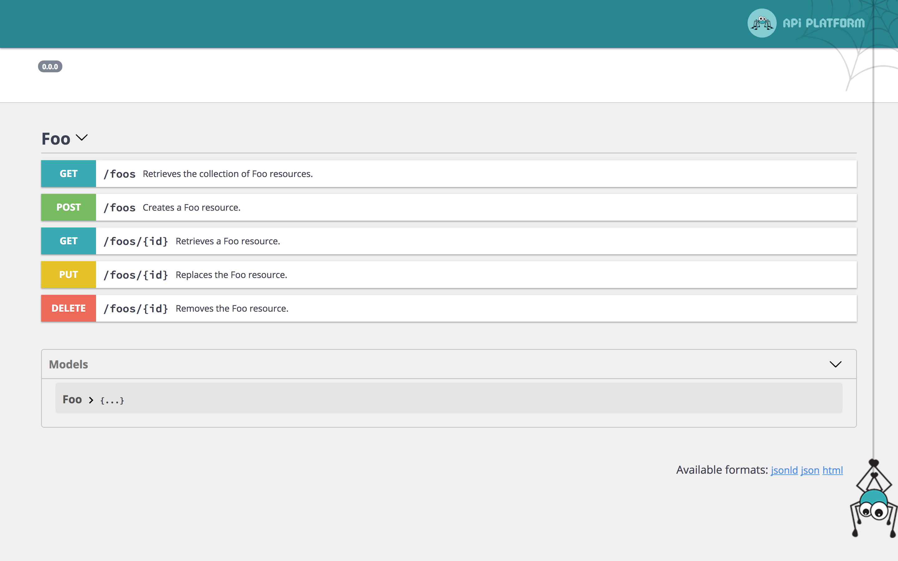

# Swagger UI

API-Platform ships with [Swagger UI](https://swagger.io/tools/swagger-ui/) to vizualize and interact with your resources.

It is enabled by default and accessible from your browser at the mounting point of your API (usually `/api`):



## Changing the Location of Swagger UI

Sometimes you may want to have the API at one location, and the Swagger UI at a different location. This can be done by disabling the Swagger UI from the API Platform configuration file and manually adding the documentation UI controller.

### Disabling Swagger UI

```yaml
# api/config/packages/api_platform.yaml
api_platform:
    # ...
    enable_swagger_ui: false
```

It will switch your default documentation UI to [ReDoc](redoc-ui.md).

### Manually Registering the Swagger UI Controller

```yaml
# app/config/routes.yaml
swagger_ui:
    path: /docs
    controller: api_platform.swagger.action.ui
```

Change `/docs` to the URI you wish Swagger to be accessible on.


## Overriding the UI Template

As described [in the Symfony documentation](https://symfony.com/doc/current/templating/overriding.html), it's possible to override the Twig template that loads Swagger UI and renders the documentation:

```twig
{# templates/bundles/ApiPlatformBundle/SwaggerUi/index.html.twig #}
<!DOCTYPE html>
<html>
<head>
    <meta charset="UTF-8">
    <title>{{ title }} My custom template</title>
    {# ... #}
</html>
```

You may want to copy the [one shipped with API Platform](https://github.com/api-platform/core/blob/master/src/Bridge/Symfony/Bundle/Resources/views/SwaggerUi/index.html.twig) and customize it.
