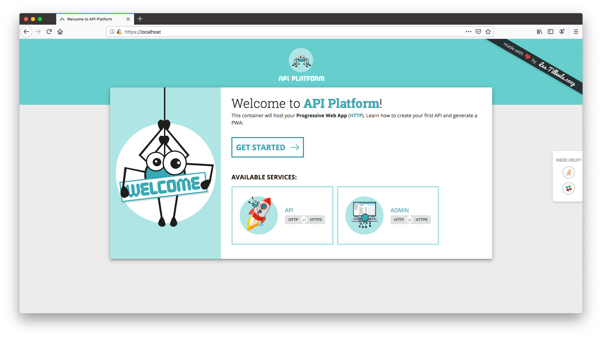

# Installing the Framework

## Using the API Platform Distribution

Start by [downloading the API Platform distribution `.tar.gz` file](https://github.com/api-platform/api-platform/releases/latest), or [generate a GitHub repository from the template we provide](https://github.com/api-platform/api-platform/generate).
Once you have extracted its contents, the resulting directory contains the API Platform project structure. You will add your own code and configuration inside it.

**Note**: Try to avoid using the `.zip` file, as it may cause potential [permission](https://github.com/api-platform/api-platform/issues/319#issuecomment-307037562) [issues](https://github.com/api-platform/api-platform/issues/777#issuecomment-412515342).

API Platform is shipped with a [Docker](https://docker.com) setup that makes it easy to get a containerized development
environment up and running. If you do not already have Docker on your computer, [it's the right time to install it](https://docs.docker.com/install/).

On Mac, only [Docker for Mac](https://docs.docker.com/docker-for-mac/) is supported.
Similarly, on Windows, only [Docker for Windows](https://docs.docker.com/docker-for-windows/) is supported. Docker Machine **is not** supported out of the box.

Open a terminal, and navigate to the directory containing your project skeleton. Run the following command to start all
services using [Docker Compose](https://docs.docker.com/compose/):

    $ docker-compose pull # Download the latest versions of the pre-built images
    $ docker-compose up -d # Running in detached mode

This starts the following services:

| Name     | Description                                                       | Port(s)                                                     | Environment(s)                                     |
|----------|-------------------------------------------------------------------|-------------------------------------------------------------|----------------------------------------------------|
| php      | The API with PHP, PHP-FPM 7.3, Composer and sensitive configs     | n/a                                                         | all                                                |
| db       | A PostgreSQL database server                                      | 5432                                                        | all (prefer using a managed service in prod)       |
| client   | A development server for the Progressive Web App                  | 80                                                          | dev (use a static website hosting service in prod) |
| admin    | A development server for the admin                                | 81                                                          | dev (use a static website hosting service in prod) |
| api      | The HTTP server for the API (Nginx)                               | 8080                                                        | all                                                |
| mercure  | The Mercure hub, [for real-time capabilities](../real-time-and-streaming-capabilities/index.md) | 1337                                                        | all (prefer using the managed version in prod)     |
| h2-proxy | A HTTP/2 and HTTPS development proxy for all apps                 | 443 (client) 444 (admin) 8443 (api) 1338 (mercure) | dev (configure properly your web server in prod)   |

To see the container's logs, run:

    $ docker-compose logs -f # follow the logs

Project files are automatically shared between your local host machine and the container thanks to a pre-configured [Docker
volume](https://docs.docker.com/engine/tutorials/dockervolumes/). It means that you can edit files of your project locally
using your preferred IDE or code editor, they will be transparently taken into account in the container.
Speaking about IDEs, our favorite software to develop API Platform apps is [PHPStorm](https://www.jetbrains.com/phpstorm/)
with its awesome [Symfony](https://confluence.jetbrains.com/display/PhpStorm/Getting+Started+-+Symfony+Development+using+PhpStorm)
and [Php Inspections](https://plugins.jetbrains.com/plugin/7622-php-inspections-ea-extended-) plugins. Give them a try,
you'll got auto-completion for almost everything and awesome quality analysis.

The API Platform distribution comes with a dummy entity for test purpose: `api/src/Entity/Greeting.php`. We will remove
it later.

If you're used to the PHP ecosystem, you probably guessed that this test entity uses the industry-leading [Doctrine ORM](https://www.doctrine-project.org/projects/orm.html)
library as persistence system. It is shipped, in the API Platform distribution.
Doctrine ORM is the easiest way to persist and query data in an API Platform project thanks to the bridge shipped with the
distribution. It is optimized for performance and development convenience. For instance, when using Doctrine, API Platform
is able to automatically optimize the generated SQL queries by adding the appropriate `JOIN` clauses. It also provides a
lot of powerful built-in filters.
Doctrine ORM and its bridge support most popular RDBMS including PostgreSQL, MySQL, MariaDB, SQL Server, Oracle and SQLite.
There is also a shipped [Doctrine MongoDB ODM](https://www.doctrine-project.org/projects/mongodb-odm.html) optional support.

If you don't want to use the built-in Doctrine system, alternative approaches which offer an integration with API Platform exist. 
For instance, [Pomm](https://www.pomm-project.org/) is a database access framework for PHP dedicated to PostgreSQL. 
The bundle to integrate it with API Platform can be found [here](https://github.com/pomm-project/pomm-api-platform).

That being said, keep in mind that API Platform is 100% independent of the persistence system. [You can use the one(s) that
best suit(s) your needs](../fetching-and-persisting-data/data-providers.md) (including NoSQL databases or remote web services). API Platform even supports using several persistence
systems together in the same project.

## It's Ready!

Open `https://localhost` in your favorite web browser:

You'll need to add a security exception in your browser to accept the self-signed TLS certificate that has been generated
for this container when installing the framework. Repeat this step for all other services available through HTTPS.

Later you will probably replace this welcome screen by the homepage of your Progressive Web App. If you don't plan to create
a Progressive Web App, you can remove the `client/` directory and the related lines in `docker-compose.yaml` (don't do it
now, we'll use this container later in this tutorial).

Click on the "HTTPS API" button, or go to `https://localhost:8443/`:

API Platform exposes a description of the API in the [OpenAPI](https://www.openapis.org/) format (formerly known as Swagger).
It also integrates a customized version of [Swagger UI](https://swagger.io/swagger-ui/), a nice interface rendering the
Open API documentation.
Click on an operation to display its details. You can also send requests to the API directly from the UI.
Try to create a new *Greeting* resource using the `POST` operation, then access it using the `GET` operation and, finally,
delete it by executing the `DELETE` operation.
If you access any API URL using a web browser, API Platform detects it (by scanning the `Accept` HTTP header) and displays
the corresponding API request in the UI. Try it yourself by browsing to `http://localhost:8080/greetings`. If the `Accept` header
doesn't contain `text/html` as the preferred format, a JSON-LD response is sent ([configurable behavior](content-negotiation.md)).

So, if you want to access the raw data, you have two alternatives:

* Add the correct `Accept` header (or don't set any `Accept` header at all if you don't care about security) - preferred
  when writing API clients
* Add the format you want as the extension of the resource - for debug purpose only

For instance, go to `http://localhost:8080/greetings.jsonld` to retrieve the list of `Greeting` resources in JSON-LD, or to
`http://localhost:8080/greetings.json` to retrieve data in raw JSON.

Of course, you can also use your favorite HTTP client to query the API.
We are fond of [Postman](https://www.getpostman.com/). It works perfectly well with API Platform, has native Open API support,
allows to easily write functional tests and has good team collaboration features.

## Using Symfony Flex and Composer

The API Platform server component can also be installed directly on a local machine.
**This method is recommended for advanced users who want full control over the directory structure and the installed
dependencies.**

[For a good introduction, watch how to install API Platform without the distribution on SymfonyCasts](https://symfonycasts.com/screencast/api-platform/install?cid=apip).

The rest of this tutorial assumes that you have installed API Platform using the official distribution. Go straight to the
next section if it's your case.

API Platform has an official Symfony Flex recipe. It means that you can easily install it from any Flex-compatible Symfony
application using [Composer](https://getcomposer.org/):

    # Create a new Symfony Flex project
    $ composer create-project symfony/skeleton bookshop-api
    # Enter the project folder
    $ cd bookshop-api
    # Install the API Platform's server component in this skeleton
    $ composer req api

Then, create the database and its schema:

    $ bin/console doctrine:database:create
    $ bin/console doctrine:schema:create

And start the built-in PHP server:

    # Built-in PHP server
    $ php -S 127.0.0.1:8000 -t public

All JavaScript components are also [available as standalone libraries](https://github.com/api-platform?language=javascript)
installable with NPM or Yarn.  

**Note:** when installing API Platform this way, the API will be exposed as the `/api/` path. You need to open `http://localhost:8000/api/` to see the API documentation. If you are deploying API Platform directly on an Apache or Nginx webserver and getting a 404 error on opening this link, you will need to enable the [rewriting rules](https://symfony.com/doc/current/setup/web_server_configuration.html) for your specific webserver software.

