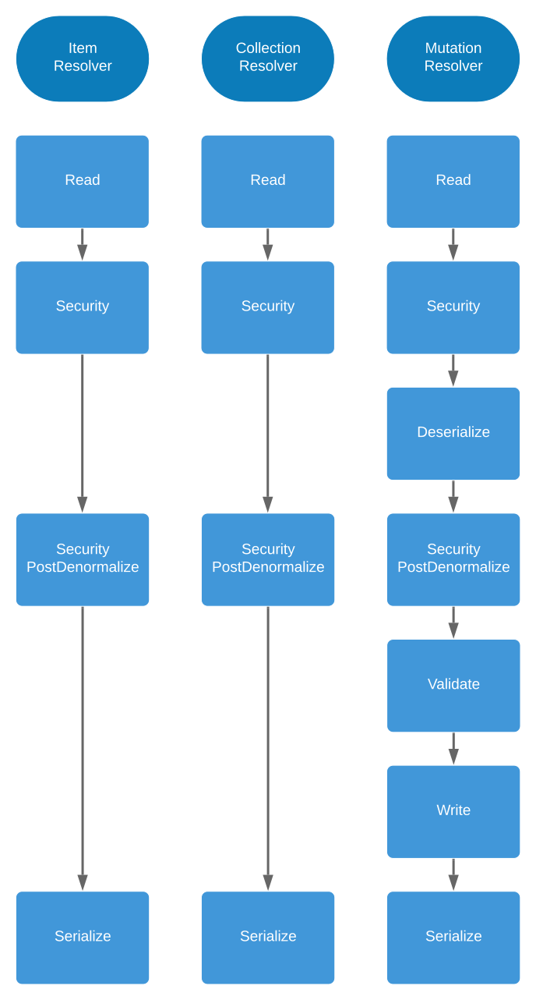

# Resolvers Workflow

API Platform resolves the queries and mutations by using its own **resolvers**.

Even if you create your [custom queries](queries.md) or your [custom mutations](mutations.md),
these resolvers will be used and yours will be called at the right time.

Each resolver follows a workflow composed of **stages**.

The schema below describes them:



Each stage corresponds to a service. It means you can take control of the workflow wherever you want by decorating them!

Here is an example of the decoration of the write stage, for instance if you want to persist your data as you want.

Create your *WriteStage*:

```php
<?php

namespace App\Stage;

use ApiPlatform\Core\GraphQl\Resolver\Stage\WriteStageInterface;

final class WriteStage implements WriteStageInterface
{
    private $writeStage;

    public function __construct(WriteStageInterface $writeStage)
    {
        $this->writeStage = $writeStage;
    }

    /**
     * {@inheritdoc}
     */
    public function __invoke($data, string $resourceClass, string $operationName, array $context)
    {
        // Use the provided write stage. Or not.
        $writtenObject = ($this->writeStage)($data, $resourceClass, $operationName, $context);

        // Do whatever you want.

        return $writtenObject;
    }
}
```

Decorate the API Platform stage service:

```yaml
# api/config/services.yaml
services:
    # ...
    'App\Stage\WriteStage':
        decorates: api_platform.graphql.resolver.stage.write
```

### Disabling Resolver Stages

If you need to, you can disable some stages done by the resolvers, for instance if you don't want your data to be validated.

The following table lists the stages you can disable in your resource configuration.

Attribute     | Type   | Default | Description
--------------|--------|---------|-------------
`read`        | `bool` | `true`  | Enables or disables the reading of data
`deserialize` | `bool` | `true`  | Enables or disables the deserialization of data (mutation only)
`validate`    | `bool` | `true`  | Enables or disables the validation of the denormalized data (mutation only)
`write`       | `bool` | `true`  | Enables or disables the writing of data into the persistence system (mutation only)
`serialize`   | `bool` | `true`  | Enables or disables the serialization of data

A stage can be disabled at the operation level:

```php
<?php

namespace App\Model;

use ApiPlatform\Core\Annotation\ApiResource;

/**
 * @ApiResource(graphql={
 *     "mutation"={
 *         "write"=false
 *     }
 * })
 */
class Book
{
    // ...
}
```

Or at the resource attributes level (will be also applied in REST and for all operations):

```php
<?php

namespace App\Model;

use ApiPlatform\Core\Annotation\ApiResource;

/**
 * @ApiResource(
 *     graphql={...},
 *     attributes={
 *         "write"=false
 *     }
 * })
 */
class Book
{
    // ...
}
```
