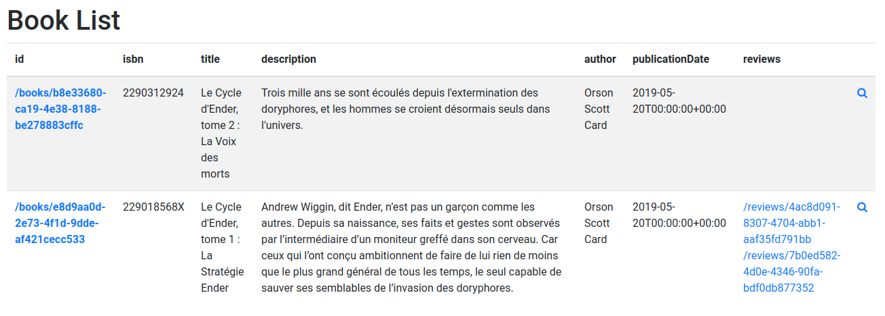
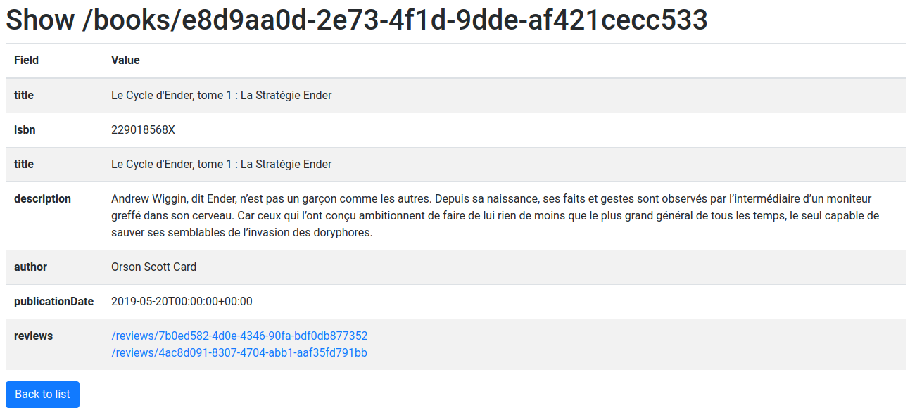

# Next.js Generator

The Next.js Client Generator generates components for Server Side Rendered applications using [Next.js](https://zeit.co/blog/next)

## Install

### Next + Express Server

Create a [Next.js application with express server](https://github.com/zeit/next.js/tree/canary/examples/custom-server-express). The easiest way is to execute:

    $ npx create-next-app your-app-name
    # or
    $ yarn create next-app your-app-name

### Installing the Generator Dependencies

Enable TypeScript in your next project

    yarn add --dev typescript @types/react @types/node

Install required dependencies:

    yarn add lodash.get lodash.has @types/lodash isomorphic-unfetch formik

## Generating Routes

    $ npx @api-platform/client-generator https://demo.api-platform.com . --generator next --resource book
    # Replace the URL by the entrypoint of your Hydra-enabled API
    # Omit the resource flag to generate files for all resource types exposed by the API.

> Note: On the [API Platform distribution](https://github.com/api-platform/api-platform), you can run
> `generate-api-platform-client` instead of `npx @api-platform/client-generator`.

## Starting the Project

You can launch the server with

    yarn dev

Go to `http://localhost:3000/books/` to start using your app.

## Screenshots

