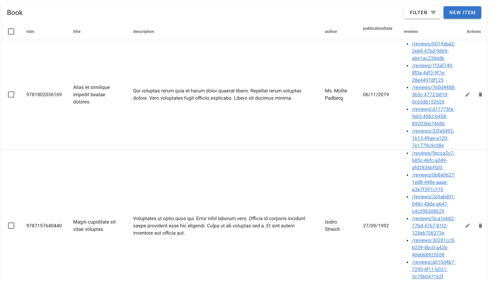
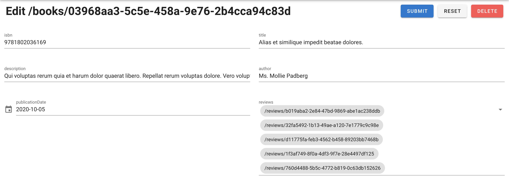

# Nuxt.js Generator

The Nuxt.js Client Generator generates components for Server Side Rendered applications using [Nuxt.js](https://nuxtjs.org/) and [Vuetify](https://vuetifyjs.com/).

## Install

### Nuxt

Create a [Nuxt.js application](https://nuxtjs.org/guides/get-started/installation#using-create-nuxt-app). The easiest way is to execute:  

    $ npx create-nuxt-app your-app-name
    # or
    $ yarn create nuxt-app your-app-name

It will ask you some questions you can use these answers :

```
Project name: your-app-name
Programming language: JavaScript
Package manager: Yarn
UI framework: Vuetify.js
Nuxt.js modules: None
Linting tools: Prettier, Lint staged files
Testing framework: None
Rendering mode: Single Page App
Deployment target: Static (Static/JAMStack hosting)
```

### Installing the Generator Dependencies

Install required dependencies:

    $ yarn add moment lodash vue-i18n vuelidate vuex-map-fields
    # yarn add --dev @nuxtjs/vuetify @nuxtjs/fontawesome

## Updating nuxtjs config

Update your `nuxt.config.js` with following:

```javascript
  buildModules: [
    // ...
    '@nuxtjs/vuetify',
    '@nuxtjs/fontawesome'
  ],
```
## Generating Routes

    $ npx @api-platform/client-generator https://demo.api-platform.com . --generator nuxt
    # Replace the URL by the entrypoint of your Hydra-enabled API

> Note: Omit the resource flag to generate files for all resource types exposed by the API.

## Updating default layout


Update your `layouts/default.vue` with following:

```javascript
<template>
  <v-app>
    <alert />
    <v-navigation-drawer v-model="drawer" app>
      <v-list dense>
        <v-list-item>
          <v-list-item-action>
            <v-icon>mdi-home</v-icon>
          </v-list-item-action>
          <v-list-item-content>
            <v-list-item-title>Home</v-list-item-title>
          </v-list-item-content>
        </v-list-item>
        <v-list-item>
          <v-list-item-action>
            <v-icon>mdi-book</v-icon>
          </v-list-item-action>
          <v-list-item-content>
            <v-list-item-title>
              <nuxt-link :to="{ name: 'books' }">Books</nuxt-link>
            </v-list-item-title>
          </v-list-item-content>
        </v-list-item>
        <v-list-item>
          <v-list-item-action>
            <v-icon>mdi-comment-quote</v-icon>
          </v-list-item-action>
          <v-list-item-content>
            <v-list-item-title>
              <nuxt-link :to="{ name: 'reviews' }">Reviews</nuxt-link>
            </v-list-item-title>
          </v-list-item-content>
        </v-list-item>
      </v-list>
    </v-navigation-drawer>
    <v-app-bar app color="indigo" dark>
      <v-app-bar-nav-icon @click.stop="drawer = !drawer"></v-app-bar-nav-icon>
      <v-toolbar-title>Application</v-toolbar-title>
    </v-app-bar>

    <v-main>
      <nuxt />
    </v-main>
    <v-footer color="indigo" app>
      <span class="white--text">&copy; {{ date }}</span>
    </v-footer>
  </v-app>
</template>

<script>
import Alert from '../components/Alert'

export default {
  components: {
    Alert
  },

  data: () => ({
    date: null,
    drawer: null
  }),

  mounted () {
    this.date = new Date().getFullYear()
  }
}
</script>
```

## Starting the Project

You can launch the server with 

    $ yarn dev

Go to `https://localhost:3000/books/` to start using your app.

## Screenshots

  

