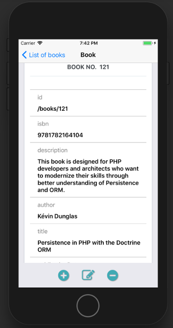

React Native generator
======================

Create a React Native application using [React Community's Create React Native App](https://github.com/react-community/create-react-native-app)

```bash
$ yarn add -g expo-cli
$ expo init my-app
$ cd my-app
```

Install:  React Native Elements, React Native Router Flux, React Native Vector Icons, Redux, React Redux, Redux Thunk, Redux Form, Prop Types

```bash
$ yarn add redux react-redux redux-thunk redux-form react-native-elements react-native-router-flux 
react-native-vector-icons prop-types
```

Install the generator globally:

```bash
$ yarn global add @api-platform/client-generator
```

In the app directory, generate the files for the resource you want:

```
    $ generate-api-platform-client https://demo.api-platform.com  -g react-native --resource foo
    # Replace the URL by the entrypoint of your Hydra-enabled API
    # Omit the resource flag to generate files for all resource types exposed by the API
```
Create **Router.js** file to import all routes

```javascript
import React from 'react';
import { Router, Stack } from 'react-native-router-flux';
//replace "book" with the name of resource type
import BookRoutes from './routes/book';

const RouterComponent = () => {
  return (
      <Router>
        <Stack key="root">
          {BookRoutes}
        </Stack>
      </Router>
  );
};

export default RouterComponent;
```
Here is an example of  **App.js**

```javascript
import React, { Component } from 'react';
import { Provider } from 'react-redux';
import thunk from 'redux-thunk';
import { createStore, applyMiddleware, combineReducers} from 'redux';
import { View } from 'react-native';
import {reducer as form} from 'redux-form';
//replace "book" with the name of resource type
import book from './reducers/book';
import Router from './Router';

export default class App extends Component {
  render() {
    const store = createStore(combineReducers({
      book,
      form
    }), {}, applyMiddleware(thunk));
    return (
        <Provider store={store}>
          <View style={{flex: 1}}>
            <Router/>
          </View>
        </Provider>
    );
  }
}
```

The code is ready to be executed!
```bash
$ expo start
```

#### Example of running  application on IOS simulator

 
  
