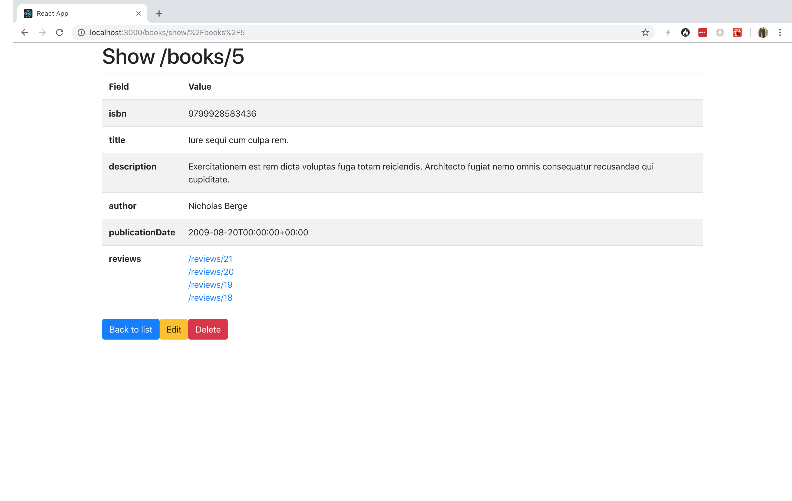
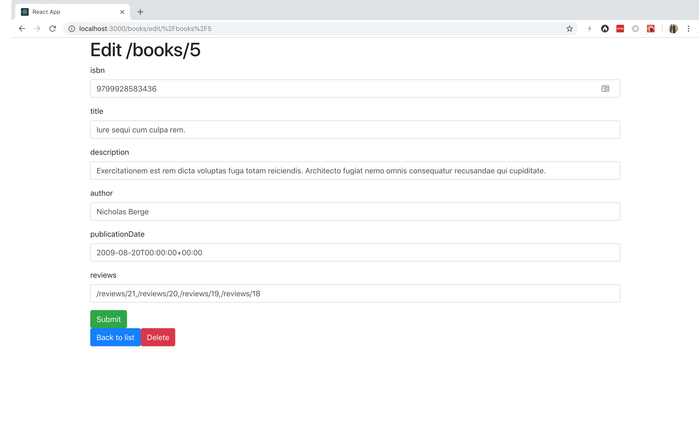
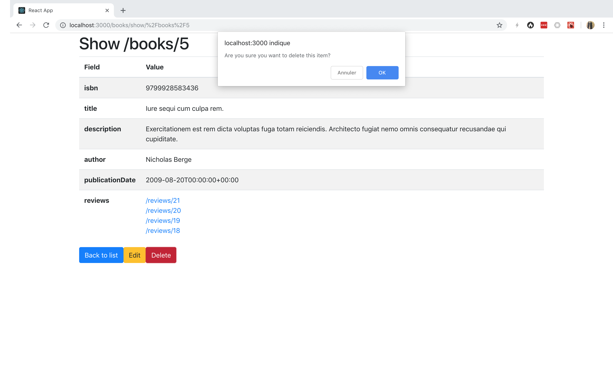

# React Generator


The React Client Generator generates a Progressive Web App built with battle-tested libraries from the ecosystem:

* [React](https://facebook.github.io/react/)
* [Redux](http://redux.js.org)
* [React Router](https://reacttraining.com/react-router/)
* [Redux Form](http://redux-form.com/)

It is designed to generate code that works seamlessly with [Facebook's Create React App](https://github.com/facebook/create-react-app).

## Install

The easiest way to get started is to install [the API Platform distribution](../distribution/index.md).
It contains the React Client Generator, all dependencies it needs, a Progressive Web App skeleton generated with Create React App,
a development Docker container to serve the webapp, and all the API Platform components you may need, including an API server
supporting Hydra.

If you use the API Platform, jump to the next section!
Alternatively, you can generate a skeleton and install the generator using [npx](https://www.npmjs.com/package/npx).
To use this generator you need [Node.js](https://nodejs.org/) and [Yarn](https://yarnpkg.com/) (or [NPM](https://www.npmjs.com/)) installed.

Bootstrap a React application:

```bash
$ npx create-react-app client
$ cd client
```

Install the required dependencies:

```bash
$ yarn add redux react-redux redux-thunk redux-form react-router-dom connected-react-router prop-types lodash
```

Optionally, install Bootstrap and Font Awesome to get an app that looks good:

```bash
$ yarn add redux bootstrap font-awesome
```

Finally, start the integrated web server:

```bash
$ yarn start
```

## Generating a Progressive Web App

If you use the API Platform distribution, generating all the code you need for a given resource is as simple as running the following command:

```bash
$ docker-compose exec client generate-api-platform-client --resource book
```

Omit the resource flag to generate files for all resource types exposed by the API.

If you don't use the standalone installation, run the following command instead:

```bash
$ npx @api-platform/client-generator https://demo.api-platform.com src/ --resource book
# Replace the URL by the entrypoint of your Hydra-enabled API
```

The code has been generated, and is ready to be executed!
Register the reducers and the routes in the `client/src/index.js` file:

```javascript
import React from 'react';
import ReactDOM from 'react-dom';
import { createStore, combineReducers, applyMiddleware } from 'redux';
import { Provider } from 'react-redux';
import thunk from 'redux-thunk';
import { reducer as form } from 'redux-form';
import { Route, Switch } from 'react-router-dom';
import createBrowserHistory from 'history/createBrowserHistory';
import {
  ConnectedRouter,
  connectRouter,
  routerMiddleware
} from 'connected-react-router';
import 'bootstrap/dist/css/bootstrap.css';
import 'font-awesome/css/font-awesome.css';
import * as serviceWorker from './serviceWorker';
// Replace "book" with the name of the resource type
import book from './reducers/book/';
import bookRoutes from './routes/book';

const history = createBrowserHistory();
const store = createStore(
  combineReducers({
    router: connectRouter(history),
    form,
    book
    /* Replace book with the name of the resource type */
  }),
  applyMiddleware(routerMiddleware(history), thunk)
);

ReactDOM.render(
  <Provider store={store}>
    <ConnectedRouter history={history}>
      <Switch>
        {bookRoutes}
        {/* Replace bookRooutes with the name of the resource type */}
        <Route render={() => <h1>Not Found</h1>} />
      </Switch>
    </ConnectedRouter>
  </Provider>,
  document.getElementById('root')
);

// If you want your app to work offline and load faster, you can change
// unregister() to register() below. Note this comes with some pitfalls.
// Learn more about service workers: http://bit.ly/CRA-PWA
serviceWorker.unregister();
```

Go to `https://localhost/books/` to start using your app.
That's all!

## Screenshots





