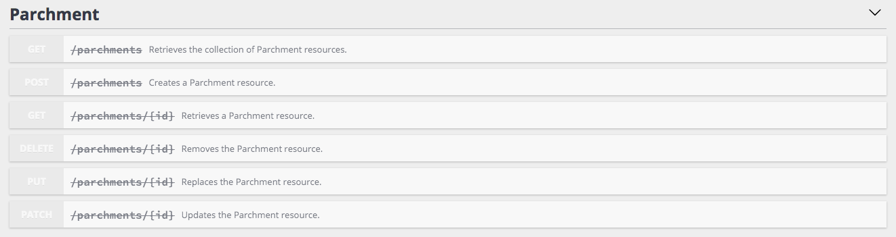

# Deprecating Resources and Properties (Alternative to Versioning)

A best practice regarding web API development is to apply [the evolution strategy](https://phil.tech/api/2018/05/02/api-evolution-for-rest-http-apis/)
to indicate to client applications which resource types, operations and fields are deprecated and shouldn't be used anymore.

While versioning an API requires modifying all clients to upgrade, even the ones not impacted by the changes.
It's a tedious task that should be avoided as much as possible.

On the other hand, the evolution strategy (also known as versionless APIs) consists of deprecating the fields, resources
types or operations that will be removed at some point.

Most modern API formats including [JSON-LD / Hydra](content-negotiation.md), [GraphQL](graphql.md) and [OpenAPI](swagger.md)
allow you to mark resources types, operations or fields as deprecated.

## Deprecating Resource Classes, Operations and Properties

When using API Platform, it's easy to mark a whole resource, a specific operation or a specific property as deprecated.
All documentation formats mentioned in the introduction will then automatically take the deprecation into account.

To deprecate a resource class, use the `deprecationReason` attribute:

```php
<?php
// api/src/Entity/Parchment.php

namespace App\Entity;

use ApiPlatform\Core\Annotation\ApiResource;

#[ApiResource(deprecationReason: "Create a Book instead")]
class Parchment
{
    // ...
}
```

As you can see, to deprecate a resource, we just have to explain what the client should do to upgrade in the dedicated attribute.

The deprecation will automatically be taken into account by clients supporting the previously mentioned format, including
[API Platform Admin](../admin/index.md), [API Platform Client Generator](../client-generator/index.md) and the lower level
[api-doc-parser library](https://github.com/api-platform/api-doc-parser).

Here is how it renders for OpenAPI in the built-in Swagger UI shipped with the framework:



And now in the built-in version of GraphiQL (for GraphQL APIs):


You can also use this new `deprecationReason` attribute to deprecate specific [operations](operations.md):

```php
<?php
// api/src/Entity/Parchment.php

namespace App\Entity;

use ApiPlatform\Core\Annotation\ApiResource;

#[ApiResource(itemOperations: [ "get" => ["deprecation_reason" => "Retrieve a Book instead"])]
class Parchment
{
    // ...
}
```

It's also possible to deprecate a single property:

<code-selector>

```php
<?php
// api/src/Entity/Review.php

namespace App\Entity;

use ApiPlatform\Core\Annotation\ApiProperty;
use ApiPlatform\Core\Annotation\ApiResource;

#[ApiResource]
class Review
{
    // ...

    #[ApiProperty(deprecationReason: "Use the rating property instead")]
    public $letter;
    
    // ...
}
```

```yaml
# config/api_platform/resources/Review.yaml
resources:
    # ...
    App\Entity\Review:
        properties:
            # ...
            letter:
                attributes:
                    deprecation_reason: 'Use the rating property instead'
```

</code-selector>

* With JSON-lD / Hydra, [an `owl:deprecated` annotation property](https://www.w3.org/TR/owl2-syntax/#Annotation_Properties) will be added to the appropriate data structure
* With Swagger / OpenAPI, [a `deprecated` property](https://swagger.io/docs/specification/2-0/paths-and-operations/) will be added
* With GraphQL, the [`isDeprecated` and `deprecationReason` properties](https://facebook.github.io/graphql/June2018/#sec-Deprecation) will be added to the schema

## Setting the `Sunset` HTTP Header to Indicate When a Resource or an Operation Will Be Removed

[The `Sunset` HTTP response header](https://tools.ietf.org/html/draft-wilde-sunset-header) indicates that a URI is likely to become unresponsive at a specified point in the future.
It is especially useful to indicate when a deprecated URL will not be available anymore.

Thanks to the `sunset` attribute, API Platform makes it easy to set this header for all URLs related to a resource class:

```php
<?php
// api/src/Entity/Parchment.php

namespace App\Entity;

use ApiPlatform\Core\Annotation\ApiResource;

#[ApiResource(
    deprecationReason: "Create a Book instead",
    sunset: "01/01/2020"
)]
class Parchment
{
    // ...
}
```

The value of the `sunset` attribute can be any string compatible with [the `\DateTime` constructor](https://www.php.net/manual/en/datetime.construct.php).
It will be automatically converted to a valid HTTP date.

It's also possible to set the `Sunset` header only for a specific [operation](operations.md):

```php
<?php
// api/src/Entity/Parchment.php

namespace App\Entity;

use ApiPlatform\Core\Annotation\ApiResource;

#[ApiResource(itemOperations: [
    "get" => [
        "deprecation_reason" => "Retrieve a Book instead",
        "sunset" => "01/01/2020"
    ]
])]
class Parchment
{
    // ...
}
```
