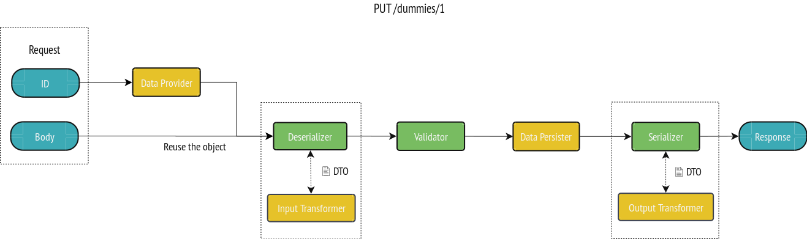

# Using Data Transfer Objects (DTOs)

## Specifying an Input or an Output Data Representation

For a given resource class, you may want to have a different representation of this class as input (write) or output (read).
To do so, a resource can take an input and/or an output class:

```php
<?php
// api/src/Entity/Book.php

namespace App\Entity;

use ApiPlatform\Core\Annotation\ApiResource;
use App\Dto\BookInput;
use App\Dto\BookOutput;

/**
 * @ApiResource(
 *   input=BookInput::class,
 *   output=BookOutput::class
 * )
 */
final class Book
{
}
```

The `input` attribute is used during [the deserialization process](serialization.md), when transforming the user-provided data to a resource instance.
Similarly, the `output` attribute is used during [the serialization process](serialization.md). This class represents how the `Book` resource will be represented in the `Response`.

The `input` and `output` attributes are taken into account by all the documentation generators (GraphQL and OpenAPI, Hydra).

To create a `Book`, we `POST` a data structure corresponding to the `BookInput` class and get back in the response a data structure corresponding to the `BookOutput` class:


To simplify object transformations we have to implement a Data Transformer that will convert the input into a resource or a resource into an output.

We have the following `BookInput`:

```php
<?php
// src/Dto/BookInput.php

namespace App\Dto;

final class BookInput {
  public $isbn;
}
```

We can transform the `BookInput` to a `Book` resource instance:

```php
<?php
// src/DataTransformer/BookInputDataTransformer.php

namespace App\DataTransformer;

use ApiPlatform\Core\DataTransformer\DataTransformerInterface;
use App\Dto\BookInput;

final class BookInputDataTransformer implements DataTransformerInterface
{
    /**
     * {@inheritdoc}
     */
    public function transform($data, string $to, array $context = [])
    {
        $book = new Book();
        $book->isbn = $data->isbn;
        return $book;
    }

    /**
     * {@inheritdoc}
     */
    public function supportsTransformation($data, string $to, array $context = []): bool
    {
        // in the case of an input, the value given here is an array (the JSON decoded).
        // if it's a book we transformed the data already
        if ($data instanceof Book) {
          return false;
        }

        return Book::class === $to && null !== ($context['input']['class'] ?? null);
    }
}
```

We now register it:

```yaml
# api/config/services.yaml
services:
    # ...
    'App\DataTransformer\BookInputDataTransformer': ~
        # Uncomment only if autoconfiguration is disabled
        #tags: [ 'api_platform.data_transformer' ]
```

To manage the output, it's exactly the same process. For example, we have the following `BookOutput`:

```php
<?php
// src/Dto/BookOutput.php

namespace App\Dto;

final class BookOutput {
  public $name;
}
```

We can transform the `Book` to a `BookOutput` object:

```php
<?php
// src/DataTransformer/BookOutputDataTransformer.php

namespace App\DataTransformer;

use ApiPlatform\Core\DataTransformer\DataTransformerInterface;
use App\Dto\BookOutput;
use App\Entity\Book;

final class BookOutputDataTransformer implements DataTransformerInterface
{
    /**
     * {@inheritdoc}
     */
    public function transform($data, string $to, array $context = [])
    {
        $output = new BookOutput();
        $output->name = $data->name;
        return $output;
    }

    /**
     * {@inheritdoc}
     */
    public function supportsTransformation($data, string $to, array $context = []): bool
    {
        return BookOutput::class === $to && $data instanceof Book;
    }
}
```

We now register it:

```yaml
# api/config/services.yaml
services:
    # ...
    'App\DataTransformer\BookOutputDataTransformer': ~
        # Uncomment only if autoconfiguration is disabled
        #tags: [ 'api_platform.data_transformer' ]
```

## Updating a Resource with a Custom Input

When performing an update (e.g. `PUT` operation), the resource to be updated is read by ApiPlatform before the deserialization phase. To do so, it uses a [data provider](data-providers.md) with the `:id` parameter given in the URL. The *body* of the request is the JSON object sent by the client, it is deserialized and is used to update the previously found resource.



Now, we will update our resource by using a different input representation.

With the following `BookInput`:

```
<?php
// src/Dto/BookInput.php

namespace App\Dto;

final class BookInput {
  /**
   * @var \App\Entity\Author
   */
  public $author;
}
```

We will implement a `BookInputDataTransformer` that transforms the `BookInput` to our `Book` resource instance. In this case, the `Book` (`/books/1`) already exists, so we will just update it.

```
<?php
// src/DataTransformer/BookInputDataTransformer.php

namespace App\DataTransformer;

use ApiPlatform\Core\DataTransformer\DataTransformerInterface;
use ApiPlatform\Core\Serializer\AbstractItemNormalizer;
use App\Dto\BookInput;

final class BookInputDataTransformer implements DataTransformerInterface
{
    /**
     * {@inheritdoc}
     */
    public function transform($data, string $to, array $context = [])
    {
        $existingBook = $context[AbstractItemNormalizer::OBJECT_TO_POPULATE];
        $existingBook->author = $data->author;
        return $existingBook;
    }

    /**
     * {@inheritdoc}
     */
    public function supportsTransformation($data, string $to, array $context = []): bool
    {
        if ($data instanceof Book) {
          return false;
        }

        return Book::class === $to && null !== ($context['input']['class'] ?? null);
    }
}
```

```yaml
# api/config/services.yaml
services:
    # ...
    'App\DataTransformer\BookInputDataTransformer': ~
        # Uncomment only if autoconfiguration is disabled
        #tags: [ 'api_platform.data_transformer' ]
```

## Disabling the Input or the Output

Both the `input` and the `output` attributes can be set to `false`.
If `input` is `false`, the deserialization process will be skipped, and no data persister will be called.
If `output` is `false`, the serialization process will be skipped, and no data provider will be called.

## Input/Output Metadata

When specified, `input` and `output` attributes support:
- a string representing the class to use
- a falsy boolean to disable them
- an array to specify more metadata for example `['class' => BookInput::class, 'name' => 'BookInput', 'iri' => '/book_input']`


## Using DTOs Inside Resources

Because API Platform can (de)normalize anything in the supported formats (`jsonld`, `jsonapi`, `hal`, etc.), you can use any object you want inside resources. For example, let's say that the `Book` has an `attribute` property that can't be represented by a resource, we can do the following:

```php
<?php
// api/src/Entity/Book.php

namespace App\Entity;

use ApiPlatform\Core\Annotation\ApiResource;
use App\Model\Attribute;

/**
 * @ApiResource
 */
final class Book
{
  /**
   * @var Attribute
   **/
  public $attribute;

  public $isbn;
}
```

The `Book` `attribute` property will now be an instance of `Attribute` after the (de)normalization phase.
