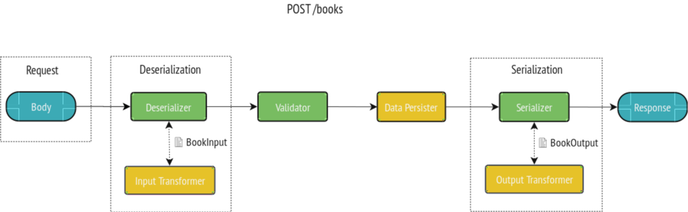
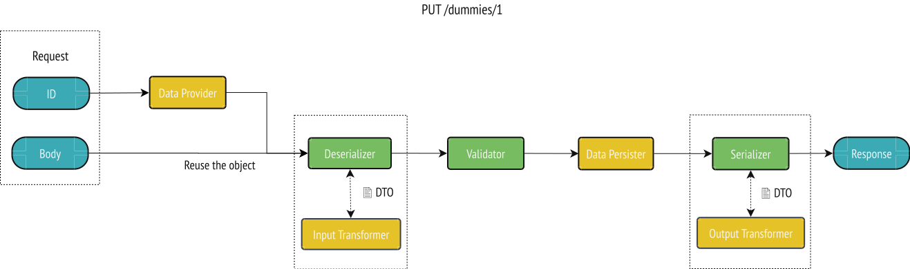

# Using Data Transfer Objects (DTOs)

As stated in [the general design considerations](design.md), in most cases [the DTO pattern](https://en.wikipedia.org/wiki/Data_transfer_object) should be implemented using an API Resource class representing the public data model exposed through the API and [a custom data provider](data-providers.md). In such cases, the class marked with `#[ApiResource]` will act as a DTO.

However, it's sometimes useful to use a specific class to represent the input or output data structure related to an operation.

## Specifying an Input or an Output Data Representation

For a given resource class, you may want to have a different representation of this class as input (write) or output (read).
To do so, a resource can take an input and/or an output class:

<code-selector>

```php
<?php
// api/src/Entity/Book.php

namespace App\Entity;

use ApiPlatform\Core\Annotation\ApiResource;
use App\Dto\BookInput;
use App\Dto\BookOutput;

#[ApiResource(input: BookInput::class, output: BookOutput::class)]
final class Book
{
    public $id;
}
```

```yaml
# config/api_platform/resources.yaml
resources:
    App\Entity\Book:
        attributes:
            input: App\Dto\BookInput
            output: App\Dto\BookOutput
```

```xml
<?xml version="1.0" encoding="UTF-8" ?>
<!-- api/config/api_platform/resources.xml -->

<resources xmlns="https://api-platform.com/schema/metadata"
           xmlns:xsi="http://www.w3.org/2001/XMLSchema-instance"
           xsi:schemaLocation="https://api-platform.com/schema/metadata
           https://api-platform.com/schema/metadata/metadata-2.0.xsd">
    <resource class="App\Entity\Book">
      <attribute name="input">App\Dto\BookInput</attribute>
      <attribute name="output">App\Dto\BookOutput</attribute>
    </resource>
</resources>
```

</code-selector>

The `input` attribute is used during [the deserialization process](serialization.md), when transforming the user-provided data to a resource instance.
Similarly, the `output` attribute is used during [the serialization process](serialization.md). This class represents how the `Book` resource will be represented in the `Response`.

The `input` and `output` attributes are taken into account by all the documentation generators (GraphQL and OpenAPI, Hydra).

Note that `Book` entity needs an id property. The simplest way is adding a public property called `$id`, as in the example. However, as in any other entity, you can use a private property, with getter and setter functions, and/or named it as you wish, provided you annotate it with `@ApiProperty(identifier=true)`. For instance, you could have a property called `$code`.
So the `InputDataTransformer` actually transforms the isbn into a code. And then in the `OutputDataTransformer`, from this code into the name.

To create a `Book`, we `POST` a data structure corresponding to the `BookInput` class and get back in the response a data structure corresponding to the `BookOutput` class:



To simplify object transformations we have to implement a Data Transformer that will convert the input into a resource or a resource into an output.

We have the following `BookInput`:

```php
<?php
// src/Dto/BookInput.php

namespace App\Dto;

final class BookInput
{
    /**
     * @var string
     */
    public $isbn;
}
```

When using serialization groups, you need to specify these to the class and also to the Input itself.
We can transform the `BookInput` to a `Book` resource instance:

```php
<?php
// src/DataTransformer/BookInputDataTransformer.php

namespace App\DataTransformer;

use ApiPlatform\Core\DataTransformer\DataTransformerInterface;
use App\Entity\Book;

final class BookInputDataTransformer implements DataTransformerInterface
{
    /**
     * {@inheritdoc}
     */
    public function transform($data, string $to, array $context = [])
    {
        $book = new Book();
        $book->isbn = $data->isbn;

        return $book;
    }

    /**
     * {@inheritdoc}
     */
    public function supportsTransformation($data, string $to, array $context = []): bool
    {
        // in the case of an input, the value given here is an array (the JSON decoded).
        // if it's a book we transformed the data already
        if ($data instanceof Book) {
          return false;
        }

        return Book::class === $to && null !== ($context['input']['class'] ?? null);
    }
}
```

We now register it:

```yaml
# config/services.yaml
services:
    # ...
    'App\DataTransformer\BookInputDataTransformer': ~
        # Uncomment only if autoconfiguration is disabled
        #tags: [ 'api_platform.data_transformer' ]
```

To manage the output, it's exactly the same process. For example, we have the following `BookOutput`:

```php
<?php
// src/Dto/BookOutput.php

namespace App\Dto;

final class BookOutput
{
    /**
     * @var string
     */
    public $name;
}
```

We can transform the `Book` to a `BookOutput` object:

```php
<?php
// src/DataTransformer/BookOutputDataTransformer.php

namespace App\DataTransformer;

use ApiPlatform\Core\DataTransformer\DataTransformerInterface;
use App\Dto\BookOutput;
use App\Entity\Book;

final class BookOutputDataTransformer implements DataTransformerInterface
{
    /**
     * {@inheritdoc}
     */
    public function transform($data, string $to, array $context = [])
    {
        $output = new BookOutput();
        $output->name = $data->name;

        return $output;
    }

    /**
     * {@inheritdoc}
     */
    public function supportsTransformation($data, string $to, array $context = []): bool
    {
        return BookOutput::class === $to && $data instanceof Book;
    }
}
```

We now register it:

```yaml
# config/services.yaml
services:
    # ...
    'App\DataTransformer\BookOutputDataTransformer': ~
        # Uncomment only if autoconfiguration is disabled
        #tags: [ 'api_platform.data_transformer' ]
```

## Updating a Resource with a Custom Input

When performing an update (e.g. `PUT` operation), the resource to be updated is read by API Platform before the deserialization phase.
To do so, it uses a [data provider](data-providers.md) with the `:id` parameter given in the URL.
The *body* of the request is the JSON object sent by the client, it is deserialized and is used to update the previously found resource.



Now, we will update our resource by using a different input representation.

With the following `BookInput`:

```php
<?php
// src/Dto/BookInput.php

namespace App\Dto;

final class BookInput
{
  /**
   * @var \App\Entity\Author
   */
  public $author;
}
```

We will implement a `BookInputDataTransformer` that transforms the `BookInput` to our `Book` resource instance. In this case, the `Book` (`/books/1`) already exists, so we will just update it.

```php
<?php
// src/DataTransformer/BookInputDataTransformer.php

namespace App\DataTransformer;

use ApiPlatform\Core\DataTransformer\DataTransformerInterface;
use ApiPlatform\Core\Serializer\AbstractItemNormalizer;
use App\Entity\Book;

final class BookInputDataTransformer implements DataTransformerInterface
{
    /**
     * {@inheritdoc}
     */
    public function transform($data, string $to, array $context = [])
    {
        $existingBook = $context[AbstractItemNormalizer::OBJECT_TO_POPULATE];
        $existingBook->author = $data->author;

        return $existingBook;
    }

    /**
     * {@inheritdoc}
     */
    public function supportsTransformation($data, string $to, array $context = []): bool
    {
        if ($data instanceof Book) {
          return false;
        }

        return Book::class === $to && null !== ($context['input']['class'] ?? null);
    }
}
```

```yaml
# config/services.yaml
services:
    # ...
    'App\DataTransformer\BookInputDataTransformer': ~
        # Uncomment only if autoconfiguration is disabled
        #tags: [ 'api_platform.data_transformer' ]
```

## Initialize the Input DTO For Partial Update

In order to be able to do a partial update (`PATCH`), it is needed to initialize the input DTO with the existing data before the deserialization process.

This way, the input DTO will be correctly validated with its old data and partial new data.

Create a class implementing the `DataTransformerInitializerInterface` instead of the `DataTransformerInterface`:

```php
<?php
// src/DataTransformer/BookInputDataTransformerInitializer.php

namespace App\DataTransformer;

use ApiPlatform\Core\DataTransformer\DataTransformerInitializerInterface;
use ApiPlatform\Core\Serializer\AbstractItemNormalizer;
use App\Entity\Book;
use App\Dto\BookInput;

final class BookInputDataTransformerInitializer implements DataTransformerInitializerInterface
{
    /**
     * {@inheritdoc}
     */
    public function transform($data, string $to, array $context = [])
    {
        $existingBook = $context[AbstractItemNormalizer::OBJECT_TO_POPULATE];
        $existingBook->author = $data->author;

        return $existingBook;
    }

    /**
     * {@inheritdoc}
     */
    public function initialize(string $inputClass, array $context = [])
    {
        $existingBook = $context[AbstractItemNormalizer::OBJECT_TO_POPULATE] ?? null;
        if (!$existingBook) {
            return new BookInput();
        }

        $bookInput = new BookInput();
        $bookInput->author = $existingBook->author;

        return $bookInput;
    }

    /**
     * {@inheritdoc}
     */
    public function supportsTransformation($data, string $to, array $context = []): bool
    {
        if ($data instanceof Book) {
          return false;
        }

        return Book::class === $to && null !== ($context['input']['class'] ?? null);
    }
}
```

Register it:

```yaml
# config/services.yaml
services:
    # ...
    'App\DataTransformer\BookInputDataTransformerInitializer': ~
        # Uncomment only if autoconfiguration is disabled
        #tags: [ 'api_platform.data_transformer' ]
```

## Disabling the Input or the Output

Both the `input` and the `output` attributes can be set to `false`. If `input` is `false`, the deserialization process
will be skipped. If `output` is `false`, the serialization process will be skipped.

## Per Operation `input` and `output`

`input` and `output` attributes can be set on a per operation basis:

<code-selector>

```php
<?php
// api/src/Entity/Book.php

namespace App\Entity;

use ApiPlatform\Core\Annotation\ApiResource;
use App\Dto\BookOutput;
use App\Dto\CreateBook;
use App\Dto\UpdateBook;

#[ApiResource(
    collectionOperations: [
        "create" => [
            "method" => "POST",
            "input" => CreateBook::class,
            "output" => BookOutput::class
        ],
    ],
    itemOperations: [
        "update" => [
            "method" => "PUT",
            "input" => UpdateBook::class,
            "output" => BookOutput::class,
        ],
    ],
)]
final class Book
{
}
```

```yaml
# config/api_platform/resources.yaml
resources:
    App\Entity\Book:
        collectionOperations:
            create:
                method: POST
                input: App\Dto\CreateBook
                output: App\Dto\BookOutput
        itemOperations:
            update:
                method: PUT
                input: App\Dto\UpdateBook
                output: App\Dto\BookOutput
```

```xml
<?xml version="1.0" encoding="UTF-8" ?>
<!-- api/config/api_platform/resources.xml -->

<resources xmlns="https://api-platform.com/schema/metadata"
           xmlns:xsi="http://www.w3.org/2001/XMLSchema-instance"
           xsi:schemaLocation="https://api-platform.com/schema/metadata
           https://api-platform.com/schema/metadata/metadata-2.0.xsd">
    <resource class="App\Entity\Book">
      <collectionOperations>
        <collectionOperation name="create">
          <attribute name="method">POST</attribute>
          <attribute name="input">App\Dto\CreateBook</attribute>
          <attribute name="output">App\Dto\BookOutput</attribute>
        </collectionOperation>
      </collectionOperations>
      <itemOperations>
        <itemOperation name="update">
          <attribute name="method">PUT</attribute>
          <attribute name="input">App\Dto\UpdateBook</attribute>
          <attribute name="output">App\Dto\BookOutput</attribute>
        </itemOperation>
      </itemOperations>
    </resource>
</resources>
```

</code-selector>

## Input/Output Metadata

When specified, `input` and `output` attributes support:

- a string representing the class to use
- a falsy boolean to disable them
- an array to specify more metadata for example `['class' => BookInput::class, 'name' => 'BookInput', 'iri' => '/book_input']`

## Using Objects As Relations Inside Resources

Because API Platform can (de)normalize anything in the supported formats (`jsonld`, `jsonapi`, `hal`, etc.), you can use any object you want inside resources. For example, let's say that the `Book` has an `attribute` property that can't be represented by a resource, we can do the following:

```php
<?php
// api/src/Entity/Book.php

namespace App\Entity;

use ApiPlatform\Core\Annotation\ApiResource;
use App\Model\Attribute;

#[ApiResource]
final class Book
{
  /**
   * @var Attribute
   */
  public $attribute;

  public $isbn;
}
```

The `Book` `attribute` property will now be an instance of `Attribute` after the (de)normalization phase.

## Validating Data Transfer Objects

Before transforming DTO to your API Resource you may want to ensure that the DTO
has valid data. In this case we can inject the validator to your data transformer
and validate it.

```php
<?php
// src/DataTransformer/BookInputDataTransformer.php

namespace App\DataTransformer;

use ApiPlatform\Core\DataTransformer\DataTransformerInterface;
use ApiPlatform\Core\Validator\ValidatorInterface;
use App\Entity\Book;

final class BookInputDataTransformer implements DataTransformerInterface
{
    private $validator;
    
    public function __construct(ValidatorInterface $validator)
    {
        $this->validator = $validator;
    }

    /**
     * {@inheritdoc}
     */
    public function transform($data, string $to, array $context = []): Book
    {
        $this->validator->validate($data);
        
        $book = new Book();
        $book->isbn = $data->isbn;
        return $book;
    }

    /**
     * {@inheritdoc}
     */
    public function supportsTransformation($data, string $to, array $context = []): bool
    {
        if ($data instanceof Book) {
          return false;
        }

        return Book::class === $to && null !== ($context['input']['class'] ?? null);
    }
}
```
