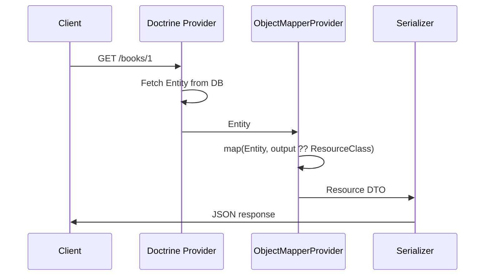
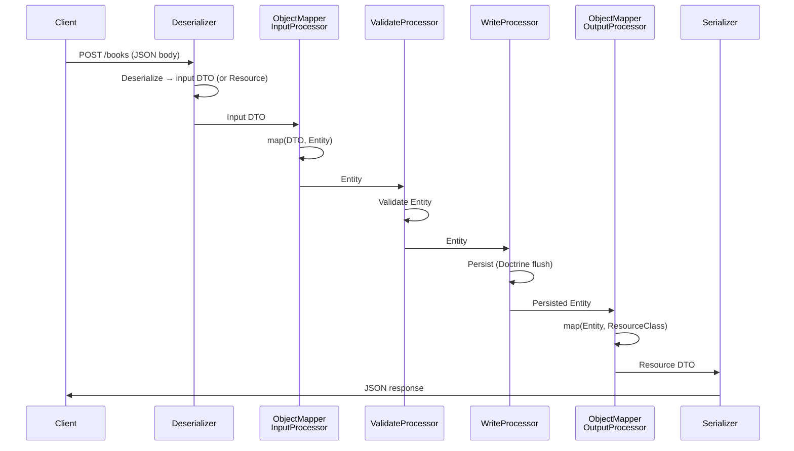

# Using Data Transfer Objects (DTOs)

<p class="symfonycasts" align="center"><a href="https://symfonycasts.com/api-platform-extending?cid=apip">

Watch the Custom Resources screencast</a></p>

The DTO pattern isolates your public API contract from your internal data model (Entities). This
decoupling allows you to evolve your data structure without breaking the API and provides finer
control over validation and serialization.

In API Platform, [the general design considerations](design.md) recommended pattern is
[DTO](https://en.wikipedia.org/wiki/Data_transfer_object) as a Resource: the class marked with
`#[ApiResource]` is the DTO, effectively becoming the "contract" of your API.

This reference covers three implementation strategies:

- For automated CRUD operations, link a DTO Resource to an Entity:
  [State Options](#1-the-dto-resource-state-options)
- For automated Write operation, use input DTOs with stateOptions:
  [Automated Mapped Inputs](#2-automated-mapped-inputs-and-outputs)
- For specific business actions, use input DTOs with custom State Processors :
  [Custom Business Logic](#3-custom-business-logic-custom-processor)

## 1. The DTO Resource (State Options)

> [!WARNING] This is a Symfony only feature in 4.2 and is not working properly without
> symfony/object-mapper:^7.4 or symfony/object-mapper:^8.0

You can map a DTO Resource directly to a Doctrine Entity using stateOptions. This automatically
configures the built-in State Providers and Processors to fetch/persist data using the Entity and
map it to your Resource (DTO) using the Symfony Object Mapper.

> [!WARNING] You must apply the #[Map] attribute to your DTO class. This signals API Platform to use
> the Object Mapper for transforming data between the Entity and the DTO.

### The Entity

First, ensure your entity is a standard Doctrine entity.

```php
// src/Entity/Book.php
namespace App\Entity;

use Doctrine\ORM\Mapping as ORM;
use Symfony\Component\Validator\Constraints as Assert;

#[ORM\Entity]
class Book
{
    #[ORM\Id, ORM\GeneratedValue, ORM\Column]
    public private(set) int $id;

    #[ORM\Column(length: 13)]
    #[Assert\NotBlank, Assert\Isbn]
    public string $isbn;

    #[ORM\Column(length: 255)]
    #[Assert\NotBlank, Assert\Length(max: 255)]
    public string $title;

    #[ORM\Column(length: 255)]
    #[Assert\NotBlank, Assert\Length(max: 255)]
    public string $description;

    #[ORM\Column]
    #[Assert\PositiveOrZero]
    public int $price;
}
```

### The API Resource (Main DTO)

The Resource DTO handles the public representation. We use `#[Map]` to handle differences between
the internal model (title) and the public API (name), as well as value transformations
(`formatPrice`).

```php
// src/Api/Resource/Book.php
namespace App\Api\Resource;

use ApiPlatform\Doctrine\Orm\State\Options;
use ApiPlatform\Metadata\ApiResource;
use App\Entity\Book as BookEntity;
use Symfony\Component\ObjectMapper\Attribute\Map;

#[ApiResource(
    shortName: 'Book',
    // 1. Link this DTO to the Doctrine Entity
    stateOptions: new Options(entityClass: BookEntity::class),
    operations: [ /* ... defined in next sections ... */ ]
)]
#[Map(source: BookEntity::class)]
final class Book
{
    public int $id;

    // 2. Map the Entity 'title' property to the DTO 'name' property
    #[Map(source: 'title')]
    public string $name;

    public string $description;

    public string $isbn;

    // 3. Use a custom static method to transform the price
    #[Map(transform: [self::class, 'formatPrice'])]
    public string $price;

    public static function formatPrice(mixed $price, object $source): int|string
    {
        // Entity (int) -> DTO (string)
        if ($source instanceof BookEntity) {
            return number_format($price / 100, 2).'$';
        }
        // DTO (string) -> Entity (int)
        if ($source instanceof self) {
            return 100 * (int) str_replace('$', '', $price);
        }
        throw new \LogicException(\sprintf('Unexpected "%s" source.', $source::class));
    }
}
```

### Implementation Details: The Object Mapper Magic

Automated mapping relies on three internal classes: `ApiPlatform\State\Provider\ObjectMapperProvider`,
`ApiPlatform\State\Processor\ObjectMapperInputProcessor`, and
`ApiPlatform\State\Processor\ObjectMapperOutputProcessor`.

These classes act as decorators around the standard Provider/Processor chain. They are activated
when:

- The Object Mapper component is available.
- `stateOptions` are configured with an `entityClass` (or `documentClass` for ODM).
- The Resource (and Entity for writes) classes have the `#[Map]` attribute.

#### Read flow (GET)


```mermaid
sequenceDiagram
    participant Client
    participant Provider as Doctrine Provider
    participant OMP as ObjectMapperProvider
    participant Serializer

    Client->>Provider: GET /books/1
    Provider->>Provider: Fetch Entity from DB
    Provider->>OMP: Entity
    OMP->>OMP: map(Entity, output ?? ResourceClass)
    OMP->>Serializer: Resource DTO
    Serializer->>Client: JSON response
```

The `ObjectMapperProvider` delegates fetching the data to the underlying Doctrine provider (which
returns an Entity). It then maps the Entity to the **output class** (if `output:` is configured on
the operation) or the **resource class**, using `$objectMapper->map($entity, $outputOrResourceClass)`.
The `input:` configuration is not used during read operations.

#### Write flow (POST/PUT/PATCH)


```mermaid
sequenceDiagram
    participant Client
    participant Serializer as Deserializer
    participant OMIP as ObjectMapper<br/>InputProcessor
    participant VP as ValidateProcessor
    participant WP as WriteProcessor
    participant OMOP as ObjectMapper<br/>OutputProcessor
    participant Ser as Serializer

    Client->>Serializer: POST /books (JSON body)
    Serializer->>Serializer: Deserialize → input DTO (or Resource)
    Serializer->>OMIP: Input DTO
    OMIP->>OMIP: map(DTO, Entity)
    OMIP->>VP: Entity
    VP->>VP: Validate Entity
    VP->>WP: Entity
    WP->>WP: Persist (Doctrine flush)
    WP->>OMOP: Persisted Entity
    OMOP->>OMOP: map(Entity, ResourceClass)
    OMOP->>Ser: Resource DTO
    Ser->>Client: JSON response
```

The serializer deserializes the request body into the **input class** (if `input:` is configured)
or the resource class. The `ObjectMapperInputProcessor` then receives that deserialized object and
maps it to the Entity. For PATCH, it maps onto the existing Entity retrieved by the provider
(stored in `request->attributes['mapped_data']`), so only the properties set by the client are
applied. It then delegates to the underlying Doctrine processor to persist the Entity. After
persistence, `ObjectMapperOutputProcessor` maps the persisted Entity back to the **resource
class**.

#### Without stateOptions (custom or static provider)

`stateOptions` is not required to use the Object Mapper. When it is absent, the three decorator
classes still activate as long as the resource class (and input class for writes) carry the
`#[Map]` attribute. The difference is in what the mapper targets:

- **`ObjectMapperProvider`** maps your provider's return value to the **output class** (if set) or
  the **resource class** — determined by `getOutput()['class'] ?? getClass()`.
- **`ObjectMapperInputProcessor`** maps the deserialized input to the **resource class** — it falls
  back to `$operation->getClass()` when no entity class is found in `stateOptions`.

This is useful for non-Doctrine backends (static data, remote APIs, in-memory stores) where you
still want clean DTO separation without writing manual mapping code in a custom processor.

## 2. Automated Mapped Inputs and Outputs

Ideally, your read and write models should differ. You might want to expose less data in a
collection view (Output DTO) or enforce strict validation during creation/updates (Input DTOs).

### Input DTOs (Write Operations)

For POST and PATCH, we define specific DTOs. The `#[Map(target: BookEntity::class)]` attribute tells
the system to map this DTO onto the Entity class before persistence.

#### CreateBook DTO

```php
// src/Api/Dto/CreateBook.php
namespace App\Api\Dto;

use App\Entity\Book as BookEntity;
use Symfony\Component\ObjectMapper\Attribute\Map;
use Symfony\Component\Validator\Constraints as Assert;

#[Map(target: BookEntity::class)]
final class CreateBook
{
    #[Assert\NotBlank, Assert\Length(max: 255)]
    #[Map(target: 'title')] // Maps 'name' input to 'title' entity field
    public string $name;

    #[Assert\NotBlank, Assert\Length(max: 255)]
    public string $description;

    #[Assert\NotBlank, Assert\Isbn]
    public string $isbn;

    #[Assert\PositiveOrZero]
    public int $price;
}
```

### UpdateBook DTO

For PATCH, properties must be **uninitialized** (no default values). A default value causes every
PATCH request to overwrite that field even when the client did not include it in the request body.

```php
// src/Api/Dto/UpdateBook.php
namespace App\Api\Dto;

use App\Entity\Book as BookEntity;
use Symfony\Component\ObjectMapper\Attribute\Map;
use Symfony\Component\Validator\Constraints as Assert;

#[Map(target: BookEntity::class)]
final class UpdateBook
{
    #[Assert\NotBlank, Assert\Length(max: 255)]
    #[Map(target: 'title')]
    public string $name;

    #[Assert\NotBlank, Assert\Length(max: 255)]
    public string $description;
}
```

#### Output DTO (Collection Read)

For the `GetCollection` operation, we use a lighter DTO that exposes only essential fields.

```php
// src/Api/Dto/BookCollection.php
namespace App\Api\Dto;

use App\Entity\Book as BookEntity;
use Symfony\Component\ObjectMapper\Attribute\Map;

#[Map(source: BookEntity::class)]
final class BookCollection
{
    public int $id;

    #[Map(source: 'title')]
    public string $name;

    public string $isbn;
}
```

#### Wiring it all together in the Resource

In your Book resource, configure the operations to use these classes via `input` and `output`.

> [!NOTE]
> `input:` and `output:` operate at the **serializer** layer: `input:` is the class the request
> body is deserialized into; `output:` is the class the serializer normalizes into the response.
> The ObjectMapper (`map: true`, `#[Map]`) operates at the **state pipeline** layer: the Provider
> maps the Entity to the output class (or resource class), and the InputProcessor maps the input
> DTO to the Entity. These two mechanisms are independent and can be combined safely.
>
> When `stateOptions` is configured, the ObjectMapper maps between your DTO and the Doctrine
> Entity. Without `stateOptions`, the ObjectMapper still works but maps to the resource class
> itself — useful when you bring your own provider.

```php
// src/Api/Resource/Book.php

#[ApiResource(
    stateOptions: new Options(entityClass: BookEntity::class),
    operations: [
        new Get(),
        // ObjectMapperProvider maps Entity -> BookCollection for this operation
        new GetCollection(
            output: BookCollection::class
        ),
        // Serializer deserializes request body into CreateBook; ObjectMapperInputProcessor maps CreateBook -> Entity
        new Post(
            input: CreateBook::class
        ),
        // Serializer deserializes request body into UpdateBook; ObjectMapperInputProcessor maps UpdateBook -> existing Entity
        new Patch(
            input: UpdateBook::class
        ),
    ]
)]
final class Book { /* ... */ }
```

### Recommendations on input and output

**Declare your operations on the Resource class** — it represents the JSON contract of your API.
Avoid using `output:` on write operations (`Post`, `Put`, `Patch`, `Delete`). The
`ObjectMapperOutputProcessor` already maps the persisted Entity back to the Resource class
automatically. Adding an explicit `output:` on writes creates confusion and can lead to subtle
bugs (see [#7745](https://github.com/api-platform/core/issues/7745)).

The main legitimate use case for `output:` is on `GetCollection` when you need a lighter
representation with fewer fields than the main Resource. Even then, consider whether serialization
groups or a separate Resource class might be clearer.

Use `input:` freely for write operations — it is the right tool for differentiating Create vs
Update validation and accepted fields.

## 3. Custom Business Logic (Custom Processor)

For complex business actions (like applying a discount), standard CRUD mapping isn't enough. You
should use a custom Processor paired with a specific Input DTO.

### The Input DTO

This DTO holds the data required for the specific action.

```php
// src/Api/Dto/DiscountBook.php
namespace App\Api\Dto;

use Symfony\Component\Validator\Constraints as Assert;

final class DiscountBook
{
    #[Assert\Range(min: 0, max: 100)]
    public int $percentage;
}
```

### The Processor

The processor handles the business logic. It receives the DiscountBook DTO as $data and the loaded
Entity (retrieved automatically via stateOptions) in the context.

```php
// src/State/DiscountBookProcessor.php
namespace App\State;

use ApiPlatform\Metadata\Operation;
use ApiPlatform\State\ProcessorInterface;
use App\Api\Resource\Book; // The Output Resource
use Symfony\Component\DependencyInjection\Attribute\Autowire;
use Symfony\Component\HttpKernel\Exception\NotFoundHttpException;
use Symfony\Component\ObjectMapper\ObjectMapperInterface;

final readonly class DiscountBookProcessor implements ProcessorInterface
{
    public function __construct(
        // Inject the built-in Doctrine persist processor to handle saving
        #[Autowire(service: 'api_platform.doctrine.orm.state.persist_processor')]
        private ProcessorInterface $persistProcessor,
        private ObjectMapperInterface $objectMapper,
    ) {
    }

    public function process(mixed $data, Operation $operation, array $uriVariables = [], array $context = []): Book
    {
        // 1. Retrieve the Entity loaded by API Platform (via stateOptions)
        if (!$entity = $context['request']->attributes->get('read_data')) {
            throw new NotFoundHttpException('Not Found');
        }

        // 2. Apply Business Logic
        // $data is the validated DiscountBook DTO
        $entity->price = (int) ($entity->price * (1 - $data->percentage / 100));

        // 3. Persist using the inner processor
        $entity = $this->persistProcessor->process($entity, $operation, $uriVariables, $context);

        // 4. Map the updated Entity back to the main Book Resource
        return $this->objectMapper->map($entity, $operation->getClass());
    }
}
```

### Registering the Custom Operation

Finally, register the custom operation in your Book resource.

```php
// src/Api/Resource/Book.php

#[ApiResource(
    operations: [
        // ... standard operations ...
        new Post(
            uriTemplate: '/books/{id}/discount',
            uriVariables: ['id'],
            input: DiscountBook::class,
            processor: DiscountBookProcessor::class,
            status: 200,
        ),
    ]
)]
final class Book { /* ... */ }
```
