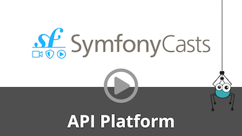

# Extending JSON-LD AND Hydra Contexts

## JSON-LD

<p align="center" class="symfonycasts"><a href="https://symfonycasts.com/screencast/api-platform/json-ld?cid=apip"><br>Watch the JSON-LD screencast</a></p>

API Platform provides the possibility to extend the JSON-LD context of properties. This allows you
to describe JSON-LD-typed values, inverse properties using the `@reverse` keyword, and you can even
overwrite the `@id` property this way. Everything you define within the following annotation will be
passed to the context. This provides a generic way to extend the context.

```php
<?php
// api/src/ApiResource/Book.php with Symfony or app/ApiResource/Book.php with Laravel
namespace App\ApiResource;

use ApiPlatform\Metadata\ApiProperty;
use ApiPlatform\Metadata\ApiResource;

#[ApiResource(types: ['https://schema.org/Book'])]
class Book
{
    // ...

    #[ApiProperty(
        types: ['https://schema.org/name'],
        jsonldContext: [
            '@id' => 'http://yourcustomid.com',
            '@type' => 'http://www.w3.org/2001/XMLSchema#string',
            'someProperty' => [
                'a' => 'textA',
                'b' => 'textB'
            ]
        ]
    )]
    public $name;

    // ...
}
```

The generated context will now have your custom attributes set:

`GET /contexts/Book`

```json
{
    "@context": {
        "@vocab": "http://example.com/apidoc#",
        "hydra": "http://www.w3.org/ns/hydra/core#",
        "name": {
            "@id": "http://yourcustomid.com",
            "@type": "http://www.w3.org/2001/XMLSchema#string",
            "someProperty": {
                "a": "textA",
                "b": "textB"
            }
        }
    }
}
```

Note that you do not have to provide the `@id` attribute. If you do not provide an `@id` attribute,
the value from `iri` will be used.

### Extending the Context of a Whole Resource

The `jsonldContext` option is also available on `#[ApiResource]` itself. Its main use is declaring
namespace prefixes once for the whole resource, instead of repeating a full IRI on every property
that needs one:

```php
<?php
// api/src/ApiResource/Book.php with Symfony or app/ApiResource/Book.php with Laravel
namespace App\ApiResource;

use ApiPlatform\Metadata\ApiProperty;
use ApiPlatform\Metadata\ApiResource;

#[ApiResource(
    types: ['https://schema.org/Book'],
    jsonldContext: ['dct' => 'http://purl.org/dc/terms/'],
)]
class Book
{
    // ...

    #[ApiProperty(types: ['https://schema.org/name'], iris: ['dct:title'])]
    public $name;

    // ...
}
```

The `dct` prefix is merged into the top-level `@context`, so properties can then reference it
through a compact IRI such as `dct:title`:

`GET /contexts/Book`

```json
{
    "@context": {
        "@vocab": "http://example.com/apidoc#",
        "hydra": "http://www.w3.org/ns/hydra/core#",
        "dct": "http://purl.org/dc/terms/",
        "name": "dct:title"
    }
}
```

The resource-level context is merged into `@context` before the per-property entries are added, and
each property's entry is then written to `@context[<propertyName>]`, overwriting anything already
present at that key. In practice, the two never collide because the resource-level context is meant
for prefix declarations, while a property's own entry is keyed by the property name; a collision
only happens if a property is literally named after one of your prefixes, in which case the property
wins.

If an operation (for example a `Get` or a `Patch`) declares its own `jsonldContext`, that value is
used as-is for that operation instead of the resource's: the two are not merged together, the
operation's `jsonldContext` simply takes precedence.

## Hydra

<p align="center" class="symfonycasts"><a href="https://symfonycasts.com/screencast/api-platform/hydra?cid=apip"><br>Watch the Hydra screencast</a></p>

It's also possible to replace the Hydra context used by the documentation generator:

<code-selector>

```php
<?php
// api/src/ApiResource/Book.php with Symfony or app/ApiResource/Book.php with Laravel
namespace App\ApiResource;

use ApiPlatform\Metadata\ApiResource;
use ApiPlatform\Metadata\Get;

#[ApiResource(operations: [
  new Get(hydraContext: ['foo' => 'bar'])
])]
class Book
{
    //...
}
```

```yaml
# api/config/api_platform/resources.yaml
# The YAML syntax is only supported for Symfony
resources:
    App\ApiResource\Book:
        operations:
            ApiPlatform\Metadata\Get:
                hydraContext: { foo: "bar" }
```

```xml
<?xml version="1.0" encoding="UTF-8" ?>
<!-- api/config/api_platform/resources.xml -->
<!-- The XML syntax is only supported for Symfony -->

<resources xmlns="https://api-platform.com/schema/metadata/resources-3.0"
           xmlns:xsi="http://www.w3.org/2001/XMLSchema-instance"
           xsi:schemaLocation="https://api-platform.com/schema/metadata/resources-3.0
           https://api-platform.com/schema/metadata/resources-3.0.xsd">
    <resource class="App\ApiResource\Book">
        <operations>
            <operation class="ApiPlatform\Metadata\Get">
                <hydraContext>
                    <values>
                        <value name="foo">bar</value>
                    </values>
                </hydraContext>
            </operation>
        </operations>
    </resource>
</resources>
```

</code-selector>

### The `hydra:memberAssertion` Property

For every resource exposing a collection operation, the generated Hydra API documentation
(`GET /docs.jsonld`) automatically adds a `hydra:memberAssertion` entry to the entrypoint's
`hydra:supportedProperty` for that collection. It asserts, as an `rdf:type` statement, that every
member returned by the collection is an instance of the resource:

```json
{
    "@id": "#Entrypoint/books",
    "@type": "hydra:Link",
    "domain": "#Entrypoint",
    "owl:maxCardinality": 1,
    "range": "hydra:Collection",
    "hydra:memberAssertion": {
        "hydra:property": { "@id": "rdf:type" },
        "hydra:object": { "@id": "#Book" }
    },
    "hydra:supportedOperation": ["..."]
}
```

This assertion is generated automatically for every collection and isn't configurable through
`jsonldContext` or `hydraContext`.

> [!NOTE] Before API Platform 4.4, the same assertion was expressed as an `owl:equivalentClass`
> restriction (an `owl:onProperty: hydra:member` / `owl:allValuesFrom: #Book` pair nested inside the
> `range` array). `owl:equivalentClass` no longer appears anywhere in the generated Hydra
> documentation: if you parse `range` and expect that structure, read `hydra:memberAssertion`
> instead.
