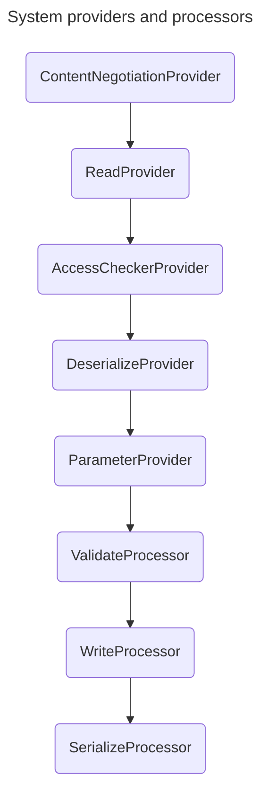

# Extending API Platform

Because it handles the complex, tedious and repetitive task of creating an API infrastructure for you, API Platform lets you focus on what matters the most for the end user: the business logic.
To do so, API Platform provides a lot of extension points you can use to hook your own code.
Those extensions points are taken into account both by the REST and [GraphQL](graphql.md) subsystems.

The following tables summarizes which extension point to use depending on what you want to do:

| Extension Point                                                                                | Usage                                                                                                                                                                                                                               |
|------------------------------------------------------------------------------------------------|-------------------------------------------------------------------------------------------------------------------------------------------------------------------------------------------------------------------------------------|
| [State Providers](state-providers.md)                                                          | adapters for custom persistence layers, virtual fields, custom hydration                                                                                                                                                            |
| [Denormalizers](serialization.md)                                                              | post-process objects created from the payload sent in the HTTP request body                                                                                                                                                         |
| [Symfony Voters](../symfony/security.md#hooking-custom-permission-checks-using-voters)         | custom authorization logic                                                                                                                                                                                                          |
| [Laravel Policies](../laravel/security.md#policies)                                            | custom authorization logic                                                                                                                                                                                                          |
| [Validation constraints](validation.md)                                                        | custom validation logic                                                                                                                                                                                                             |
| [State Processors](state-processors)                                                           | custom business logic and computations to trigger before or after persistence (ex: mail, call to an external API...)                                                                                                                |
| [Normalizers](serialization.md#changing-the-serialization-context-dynamically)                 | customize the resource sent to the client (add fields in JSON documents, encode codes, dates...)                                                                                                                                    |
| [Filters](filters.md)                                                                          | create filters for collections and automatically document them (OpenAPI, GraphQL, Hydra)                                                                                                                                            |
| [Serializer Context Builders](serialization.md#changing-the-serialization-context-dynamically) | change the Serialization context (e.g. groups) dynamically                                                                                                                                                                          |
| [Messenger Handlers](../symfony/messenger.md)                                                  | create 100% custom, RPC, async, service-oriented endpoints (should be used in place of custom controllers because the messenger integration is compatible with both REST and GraphQL, while custom controllers only work with REST) |
| [DTOs](dto.md)                                                                                 | use a specific class to represent the input or output data structure related to an operation                                                                                                                                        |
| [Kernel Events](events.md)                                                                     | customize the HTTP request or response (REST only, other extension points must be preferred when possible)                                                                                                                          |

## Doctrine Specific Extension Points

| Extension Point                | Usage                                                                                              |
|--------------------------------|----------------------------------------------------------------------------------------------------|
| [Extensions](extensions.md)    | Access to the query builder to change the DQL query                                                |
| [Filters](doctrine-filters.md) | Add filters documentations (OpenAPI, GraphQL, Hydra) and automatically apply them to the DQL query |

## Leveraging the Built-in Infrastructure Using Composition

While most API Platform classes are marked as `final`, built-in services are straightforward to reuse and customize [using composition](https://en.wikipedia.org/wiki/Composition_over_inheritance).

For instance, if you want to send a mail after a resource has been persisted, but still want to benefit from the native Doctrine ORM [state processor](state-processors.md), use [the decorator design pattern](https://en.wikipedia.org/wiki/Decorator_pattern#PHP) to wrap the native state processor in your own class sending the mail, as demonstrated in [this example](../core/state-processors.md#creating-a-custom-state-processor).

To replace existing API Platform services with your decorators, [check out how to decorate services](https://symfony.com/doc/current/service_container/service_decoration.html).

<p style="display: flex; justify-content: center; text-align: center;" class="symfonycasts"><a href="https://symfonycasts.com/screencast/api-platform-security/service-decoration?cid=apip"><br>Watch the Service Decoration screencast</a></p>

## System Providers and Processors

The system is based on a workflow composed of **state providers** and **state processors**.

The schema below describes them:



### Symfony Access Checker Provider

When using Symfony, the access checker provider is used at three different stages:

- `api_platform.state_provider.access_checker.post_validate` decorates the `ValidateProvider`
- `api_platform.state_provider.access_checker.post_deserialize` decorates the `DeserializeProvider`
- `api_platform.state_provider.access_checker` decorates the `ReadProvider`

> [!NOTE]
> For graphql use: `api_platform.graphql.state_provider.access_checker.post_deserialize`,
> `api_platform.graphql.state_provider.access_checker.post_validate`, `api_platform.graphql.state_provider.validate` and
> `api_platform.graphql.state_provider.access_checker.after_resolver`

### Decoration Example

Here is an example of the decoration of the RespondProcessor:

Starts by creating your `CustomRespondProcessor`:

```php
<?php
namespace App\State;

use ApiPlatform\State\ProcessorInterface;

final class CustomRespondProcessor implements ProcessorInterface
{
    public function __construct(private readonly ProcessorInterface $processor) {}

    public function process(mixed $data, Operation $operation, array $uriVariables = [], array $context = []): void
    {
        // You can add pre-write code here.

        // Call the decorated processor's process method.
        $writtenObject = $this->processor->process($data, $operation, $uriVariables, $context);

        // You can add post-write code here.

        return $writtenObject;
    }
}
```

Now decorate the `RespondProcessor` with the `CustomRespondProcessor` using Symfony or Laravel:

### Symfony Processor Decoration

With Symfony you can simply do that by adding the `#[AsDecorator]` attribute as following:

```php
namespace App\State;

use ApiPlatform\State\ProcessorInterface;

#[AsDecorator(decorates: 'api_platform.state.processor.respond_processor')]
final class CustomRespondProcessor implements ProcessorInterface
{
    // ...
}
```

or in the `services.yaml` by defining:

```yaml
# api/config/services.yaml
services:
  # ...
  App\State\CustomRespondProcessor:
    decorates: api_platform.state.processor.respond_processor
```

And that's it!

### Laravel Processor Decoration

```php
<?php

namespace App\Providers;

use App\State\CustomRespondProcessor;
use ApiPlatform\State\Processor\RespondProcessor;
use Illuminate\Support\ServiceProvider;

class AppServiceProvider extends ServiceProvider
{
    public function register(): void
    {
        $this->app->extend(RespondProcessor::class, function (RespondProcessor $respondProcessor) {
            return new CustomRespondProcessor($respondProcessor);
        });
    }
}
```
