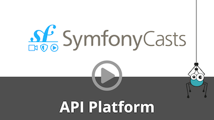

# Filters

API Platform provides a generic system to apply filters and sort criteria on collections.
Useful filters for Doctrine ORM, Eloquent ORM, MongoDB ODM and ElasticSearch are provided with the library.

You can also create custom filters that fit your specific needs.
You can also add filtering support to your custom [state providers](state-providers.md) by implementing interfaces provided
by the library.

By default, all filters are disabled. They must be enabled explicitly.

When a filter is enabled, it automatically appears in the [OpenAPI](openapi.md) and [GraphQL](graphql.md) documentations.
It is also automatically documented as a `search` property for JSON-LD responses.

<a href="https://symfonycasts.com/screencast/api-platform/filters?cid=apip"> Watch the Filtering & Searching screencast</a>

For the **filters documentation**, please refer to the following pages, depending on your needs:
- [Doctrine filters documentation](doctrine-filters.md)
- [Laravel filters documentation](../laravel/filters.md)
