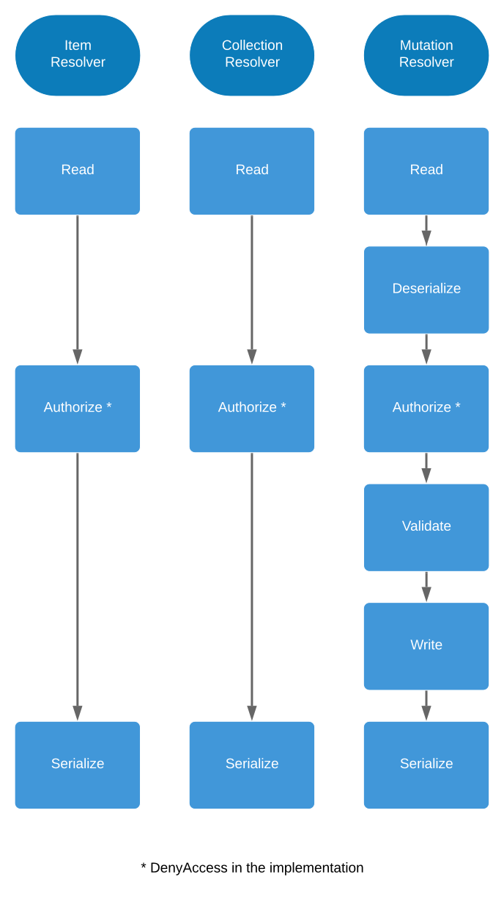

# GraphQL Support

[GraphQL](https://graphql.org/) is a query language made to communicate with an API and therefore is an alternative to REST.

It has some advantages compared to REST: it solves the over-fetching or under-fetching of data, is strongly typed, and is capable of retrieving multiple and nested data in one go, but it also comes with drawbacks. For example it creates overhead depending on the request.

API Platform creates a REST API by default. But you can choose to enable GraphQL as well.

Once enabled, you have nothing to do: your schema describing your API is automatically built and your GraphQL endpoint is ready to go!

## Enabling GraphQL

To enable GraphQL and its IDE (GraphiQL and GraphQL Playground) in your API, simply require the [graphql-php](https://webonyx.github.io/graphql-php/) package using Composer and clear the cache one more time:

```console
docker-compose exec php sh -c '
    composer require webonyx/graphql-php
    bin/console cache:clear
'
```

You can now use GraphQL at the endpoint: `https://localhost:8443/graphql`.

*Note:* If you used [Symfony Flex to install API Platform](../distribution/index.md#using-symfony-flex-and-composer-advanced-users), URLs will be prefixed with `/api` by default. For example, the GraphQL endpoint will be: `https://localhost:8443/api/graphql`.

## Changing Location of the GraphQL Endpoint

Sometimes you may want to have the GraphQL endpoint at a different location. This can be done by manually configuring the GraphQL controller.

```yaml
# config/routes.yaml
api_graphql_entrypoint:
    path: /api/graphql
    controller: api_platform.graphql.action.entrypoint
# ...
```

Change `/api/graphql` to the URI you wish the GraphQL endpoint to be accessible on.

## GraphiQL

If Twig is installed in your project, go to the GraphQL endpoint with your browser. You will see a nice interface provided by GraphiQL to interact with your API.

The GraphiQL IDE can also be found at `/graphql/graphiql`.

If you need to disable it, it can be done in the configuration:

```yaml
# config/packages/api_platform.yaml
api_platform:
    graphql:
        graphiql:
            enabled: false
# ...
```

### Add another Location for GraphiQL

If you want to add a different location besides `/graphql/graphiql`, you can do it like this:

```yaml
# config/routes.yaml
graphiql:
    path: /docs/graphiql
    controller: api_platform.graphql.action.graphiql
```

## GraphQL Playground

Another IDE is by default included in API Platform: GraphQL Playground.

It can be found at `/graphql/graphql_playground`.

You can disable it if you want in the configuration:

```yaml
# config/packages/api_platform.yaml
api_platform:
    graphql:
        graphql_playground:
            enabled: false
# ...
```

### Add another Location for GraphQL Playground

You can add a different location besides `/graphql/graphql_playground`:

```yaml
# config/routes.yaml
graphql_playground:
    path: /docs/graphql_playground
    controller: api_platform.graphql.action.graphql_playground
```

## Modifying or Disabling the Default IDE

When going to the GraphQL endpoint, you can choose to launch the IDE you want.

```yaml
# config/packages/api_platform.yaml
api_platform:
    graphql:
        # Choose between graphiql or graphql-playground
        default_ide: graphql-playground
# ...
```

You can also disable this feature by setting the configuration value to `false`.

```yaml
# config/packages/api_platform.yaml
api_platform:
    graphql:
        default_ide: false
# ...
```

## Request with `application/graphql` Content-Type

If you wish to send a [POST request using the `application/graphql` Content-Type](https://graphql.org/learn/serving-over-http/#post-request),
you need to enable it in the [allowed formats of API Platform](content-negotiation.md#configuring-formats-globally):

```yaml
# config/packages/api_platform.yaml
api_platform:
    formats:
        # ...
        graphql: ['application/graphql']
```

## Operations

To understand what an operation is, please refer to the [operations documentation](operations.md).

For GraphQL, the operations are defined under the `graphql` attribute.
By default, all operations are enabled.

For the queries, the operations are:

* `item_query`
* `collection_query`

For the mutations, the operations are:

* `create`
* `update`
* `delete`

You can of course disable or configure these operations.

For instance, in the following example, only the query of an item and the create mutation are enabled:

```php
<?php
// api/src/Entity/Book.php

namespace App\Entity;

#[ApiResource(
    graphql: ['item_query', 'create']
)]
class Book
{
    // ...
}
```

## Queries

If you don't know what queries are yet, please [read the documentation about them](https://graphql.org/learn/queries/).

For each resource, two queries are available: one for retrieving an item and the other one for the collection.
For example, if you have a `Book` resource, the queries `book` and `books` can be used.

### Global Object Identifier

When querying an item, you need to pass an identifier as argument. Following the [GraphQL Global Object Identification Specification](https://relay.dev/graphql/objectidentification.htm),
the identifier needs to be globally unique. In API Platform, this argument is represented as an [IRI (Internationalized Resource Identifier)](https://www.w3.org/TR/ld-glossary/#internationalized-resource-identifier).

For example, to query a book having as identifier `89`, you have to run the following:

```graphql
{
  book(id: "/books/89") {
    title
    isbn
  }
}
```

Note that in this example, we're retrieving two fields: `title` and `isbn`.

### Custom Queries

To create a custom query, first of all you need to create its resolver.

If you want a custom query for a collection, create a class like this:

```php
<?php

namespace App\Resolver;

use ApiPlatform\Core\GraphQl\Resolver\QueryCollectionResolverInterface;
use App\Model\Book;

final class BookCollectionResolver implements QueryCollectionResolverInterface
{
    /**
     * @param iterable<Book> $collection
     *
     * @return iterable<Book>
     */
    public function __invoke(iterable $collection, array $context): iterable
    {
        // Query arguments are in $context['args'].

        foreach ($collection as $book) {
            // Do something with the book.
        }

        return $collection;
    }
}
```

If you use autoconfiguration (the default Symfony configuration) in your application, then you are done!

Else, you need to tag your resolver like this:

```yaml
# config/services.yaml
services:
    # ...
    App\Resolver\BookCollectionResolver:
        tags:
            - { name: api_platform.graphql.query_resolver }
```

The resolver for an item is very similar:

```php
<?php

namespace App\Resolver;

use ApiPlatform\Core\GraphQl\Resolver\QueryItemResolverInterface;
use App\Model\Book;

final class BookResolver implements QueryItemResolverInterface
{
    /**
     * @param Book|null $item
     *
     * @return Book
     */
    public function __invoke($item, array $context)
    {
        // Query arguments are in $context['args'].

        // Do something with the book.
        // Or fetch the book if it has not been retrieved.

        return $item;
    }
}
```

Note that you will receive the retrieved item or not in this resolver depending on how you configure your query in your resource.

Since the resolver is a service, you can inject some dependencies and fetch your item in the resolver if you want.

If you don't use autoconfiguration, don't forget to tag your resolver with `api_platform.graphql.query_resolver`.

Now that your resolver is created and registered, you can configure your custom query and link its resolver.

In your resource, add the following:

```php
<?php

namespace App\Model;

use ApiPlatform\Core\Annotation\ApiResource;
use App\Resolver\BookCollectionResolver;
use App\Resolver\BookResolver;

#[ApiResource(
    graphql: [
        // Auto-generated queries and mutations
        'item_query',
        'collection_query',
        'create',
        'update',
        'delete',

        'retrievedQuery' => [
            'item_query' => BookResolver::class
        ],
        'notRetrievedQuery' => [
            'item_query' => BookResolver::class,
            'args' => []
        ],
        'withDefaultArgsNotRetrievedQuery' => [
            'item_query' => BookResolver::class,
            'read' => false
        ],
        'withCustomArgsQuery' => [
            'item_query' => BookResolver::class,
            'args' => [
                'id' => ['type' => 'ID!'],
                'log' => ['type' => 'Boolean!', 'description' => 'Is logging activated?'],
                'logDate' => ['type' => 'DateTime']
            ]
        ],
        'collectionQuery' => [
            'collection_query' => BookCollectionResolver::class
        ]
    ]
)]
class Book
{
    // ...
}
```

Note that you need to explicitly add the auto-generated queries and mutations if they are needed when configuring custom queries, like it's done for the [operations](#operations).

As you can see, it's possible to define your own arguments for your custom queries.
They are following the GraphQL type system.
If you don't define the `args` property, it will be the default ones (for example `id` for an item).

If you don't want API Platform to retrieve the item for you, disable the `read` stage like in `withDefaultArgsNotRetrievedQuery`.
Some other stages [can be disabled](#disabling-resolver-stages).
Another option would be to make sure there is no `id` argument.
This is the case for `notRetrievedQuery` (empty args).
Conversely, if you need to add custom arguments, make sure `id` is added among the arguments if you need the item to be retrieved automatically.

Note also that:

* If you have added your [own custom types](#custom-types), you can use them directly for your arguments types (it's the case here for `DateTime`).
* You can also add a custom description for your custom arguments. You can see the [field arguments documentation](https://webonyx.github.io/graphql-php/type-system/object-types/#field-arguments) for more options.

The arguments you have defined or the default ones and their value will be in `$context['args']` of your resolvers.

You custom queries will be available like this:

```graphql
{
  retrievedQueryBook(id: "/books/56") {
    title
  }

  notRetrievedQueryBook {
    title
  }

  withDefaultArgsNotRetrievedQueryBook(id: "/books/56") {
    title
  }

  withCustomArgsQueryBook(id: "/books/23", log: true, logDate: "2019-12-20") {
    title
  }

  collectionQueryBooks {
    edges {
      node {
        title
      }
    }
  }
}
```

## Mutations

If you don't know what mutations are yet, the documentation about them is [here](https://graphql.org/learn/queries/#mutations).

For each resource, three mutations are available: one for creating it (`create`), one for updating it (`update`) and one for deleting it (`delete`).

When updating or deleting a resource, you need to pass the **IRI** of the resource as argument. See [Global Object Identifier](#global-object-identifier) for more information.

### Client Mutation ID

Following the [Relay Input Object Mutations Specification](https://github.com/facebook/relay/blob/v7.1.0/website/spec/Mutations.md#relay-input-object-mutations-specification),
you can pass a `clientMutationId` as argument and can ask its value as a field.

For example, if you delete a book:

```graphql
mutation DeleteBook($id: ID!, $clientMutationId: String!) {
  deleteBook(input: {id: $id, clientMutationId: $clientMutationId}) {
    clientMutationId
  }
}
```

### Custom Mutations

Creating custom mutations is comparable to creating [custom queries](#custom-queries).

Create your resolver:

```php
<?php

namespace App\Resolver;

use ApiPlatform\Core\GraphQl\Resolver\MutationResolverInterface;
use App\Model\Book;

final class BookMutationResolver implements MutationResolverInterface
{
    /**
     * @param Book|null $item
     *
     * @return Book
     */
    public function __invoke($item, array $context)
    {
        // Mutation input arguments are in $context['args']['input'].

        // Do something with the book.
        // Or fetch the book if it has not been retrieved.

        // The returned item will pe persisted.
        return $item;
    }
}
```

As you can see, depending on how you configure your custom mutation in the resource, the item is retrieved or not.
For instance, if you don't set an `id` argument or if you disable the `read` or the `deserialize` stage (other stages [can also be disabled](#disabling-resolver-stages)),
the received item will be `null`.

Likewise, if you don't want your item to be persisted by API Platform,
you can return `null` instead of the mutated item (be careful: the response will also be `null`) or disable the `write` stage.

Don't forget the resolver is a service and you can inject the dependencies you want.

If you don't use autoconfiguration, add the tag `api_platform.graphql.mutation_resolver` to the resolver service.

Now in your resource:

```php
<?php

namespace App\Model;

use ApiPlatform\Core\Annotation\ApiResource;
use App\Resolver\BookMutationResolver;

#[ApiResource(
    graphql: [
        // Auto-generated queries and mutations
        'item_query',
        'collection_query',
        'create',
        'update',
        'delete',

        'mutation' => [
            'mutation' => BookMutationResolver::class
        ],
        'withCustomArgsMutation' => [
            'mutation' => BookMutationResolver::class,
            'args' => [
                'sendMail' => ['type' => 'Boolean!', 'description'=> 'Send a mail?' ]
            ]
        ],
        'disabledStagesMutation' => [
            'mutation' => BookMutationResolver::class,
            'deserialize' => false,
            'write' => false
        ]
    ]
)]
class Book
{
    // ...
}
```

Note that you need to explicitly add the auto-generated queries and mutations if they are needed when configuring custom mutations, like it's done for the [operations](#operations).

As the custom queries, you can define your own arguments if you don't want to use the default ones (extracted from your resource).
The only difference with them is that, even if you define your own arguments, the `clientMutationId` will always be set.

The arguments will be in `$context['args']['input']` of your resolvers.

Your custom mutations will be available like this:

```graphql
{
  mutation {
    mutationBook(input: {id: "/books/18", title: "The Fitz and the Fool"}) {
      book {
        title
      }
    }
  }

  mutation {
    withCustomArgsMutationBook(input: {sendMail: true, clientMutationId: "myId"}) {
      book {
        title
      }
      clientMutationId
    }
  }

  mutation {
    disabledStagesMutationBook(input: {id: "/books/18", title: "The Fitz and the Fool"}) {
      book {
        title
      }
      clientMutationId
    }
  }
}
```

## Subscriptions

Subscriptions are an [RFC](https://github.com/graphql/graphql-spec/blob/master/rfcs/Subscriptions.md#rfc-graphql-subscriptions) to allow a client to receive pushed realtime data from the server.

In API Platform, the built-in subscription support is handled by using [Mercure](https://mercure.rocks/) as its underlying protocol.

### Enable Update Subscriptions for a Resource

To enable update subscriptions for a resource, three conditions have to be met:

* the [Mercure hub and bundle need to be installed and configured](mercure.md#installing-mercure-support).
* Mercure needs to be enabled for the resource.
* the `update` mutation needs to be enabled for the resource.

For instance, your resource should look like this:

```php
<?php

namespace App\Model;

use ApiPlatform\Core\Annotation\ApiResource;

 #[ApiResource(
      graphql: [
          ...
          'update',
          ...
      ],
      mercure: true
)]
class Book
{
    // ...
}
```

### Subscribe

Doing a subscription is very similar to doing a query:

```graphql
{
  subscription {
    updateBookSubscribe(input: {id: "/books/1", clientSubscriptionId: "myId"}) {
      book {
        title
        isbn
      }
      mercureUrl
      clientSubscriptionId
    }
  }
}
```

As you can see, you need to pass the **IRI** of the resource as argument. See [Global Object Identifier](#global-object-identifier) for more information.

You can also pass `clientSubscriptionId` as argument and can ask its value as a field.

In the payload of the subscription, the given fields of the resource will be the fields you subscribe to: if any of these fields is updated, you will be pushed their updated values.

The `mercureUrl` field is the Mercure URL you need to use to [subscribe to the updates](https://mercure.rocks/docs/getting-started#subscribing) on the client-side.

### Receiving an Update

On the client side, you will receive the pushed updated data like you would receive the updated data if you did an `update` mutation.

For instance, you could receive a JSON payload like this:

```json
{
  "book": {
    "title": "Updated title",
    "isbn": "978-6-6344-4051-1"
  }
}
```

### Subscriptions Cache

Internally, API Platform stores the subscriptions in a cache, using the [Symfony Cache](https://symfony.com/doc/current/cache.html).

The cache is named `api_platform.graphql.cache.subscription` and the subscription keys are generated from the subscription payload by using a SHA-256 hash.

It's recommended to use an adapter like Redis for this cache.

## Workflow of the Resolvers

API Platform resolves the queries and mutations by using its own **resolvers**.

Even if you create your [custom queries](#custom-queries) or your [custom mutations](#custom-mutations),
these resolvers will be used and yours will be called at the right time.

Each resolver follows a workflow composed of **stages**.

The schema below describes them:



Each stage corresponds to a service. It means you can take control of the workflow wherever you want by decorating them!

Here is an example of the decoration of the write stage, for instance if you want to persist your data as you want.

Create your *WriteStage*:

```php
<?php

namespace App\Stage;

use ApiPlatform\Core\GraphQl\Resolver\Stage\WriteStageInterface;

final class WriteStage implements WriteStageInterface
{
    private $writeStage;

    public function __construct(WriteStageInterface $writeStage)
    {
        $this->writeStage = $writeStage;
    }

    /**
     * {@inheritdoc}
     */
    public function __invoke($data, string $resourceClass, string $operationName, array $context)
    {
        // You can add pre-write code here.

        // Call the decorated write stage (this syntax calls the __invoke method).
        $writtenObject = ($this->writeStage)($data, $resourceClass, $operationName, $context);

        // You can add post-write code here.

        return $writtenObject;
    }
}
```

Decorate the API Platform stage service:

```yaml
# config/services.yaml
services:
    # ...
    'App\Stage\WriteStage':
        decorates: api_platform.graphql.resolver.stage.write
```

### Disabling Resolver Stages

If you need to, you can disable some stages done by the resolvers, for instance if you don't want your data to be validated.

The following table lists the stages you can disable in your resource configuration.

Attribute     | Type   | Default | Description
--------------|--------|---------|-------------
`read`        | `bool` | `true`  | Enables or disables the reading of data
`deserialize` | `bool` | `true`  | Enables or disables the deserialization of data (mutation only)
`validate`    | `bool` | `true`  | Enables or disables the validation of the denormalized data (mutation only)
`write`       | `bool` | `true`  | Enables or disables the writing of data into the persistence system (mutation only)
`serialize`   | `bool` | `true`  | Enables or disables the serialization of data

A stage can be disabled at the operation level:

```php
<?php

namespace App\Model;

use ApiPlatform\Core\Annotation\ApiResource;

#[ApiResource(
    graphql: [
        'mutation' => [
            'write' => false
        ]
    ]
)]
class Book
{
    // ...
}
```

Or at the resource attributes level (will be also applied in REST and for all operations):

```php
<?php

namespace App\Model;

use ApiPlatform\Core\Annotation\ApiResource;

#[ApiResource(
    graphql: [...],
    attributes: [
        'write' => false
    ]
)]
class Book
{
    // ...
}
```

## Events

No events are sent by the resolvers in API Platform. If you want to add your custom logic, [decorating the stages](#workflow-of-the-resolvers) is
the recommended way to do it.

However, if you really want to use events, you can by installing a [bundle dispatching events before and after the stages](https://github.com/alanpoulain/ApiPlatformEventsBundle).

## Filters

Filters are supported out-of-the-box. Follow the [filters](filters.md) documentation and your filters will be available as arguments of queries.

However you don't necessarily have the same needs for your GraphQL endpoint as for your REST one.

In the `ApiResource` declaration, you can choose to decorrelate the GraphQL filters in `collection_query` of the `graphql` attribute.
In order to keep the default behavior (possibility to fetch, delete, update or create), define all the operations (`item_query` ,`collection_query` , `delete`, `update` and `create`).

For example, this entity will have a search filter for REST and a date filter for GraphQL:

```php
<?php
// api/src/Entity/Offer.php

namespace App\Entity;

use ApiPlatform\Core\Annotation\ApiResource;

#[ApiResource(
    attributes: [
        'filters' => ['offer.search_filter']
    ],
    graphql: [
        'item_query',
        'collection_query' => [
            'filters' => ['offer.date_filter']
        ],
        'delete',
        'update',
        'create'
    ]
)]
class Offer
{
    // ...
}
```

### Syntax for Filters with a List of Key / Value Arguments

Some filters like the [exists filter](filters.md#exists-filter) or the [order filter](filters.md#order-filter-sorting) take a list of key / value as arguments.

The first syntax coming to mind to use them is to write:

```graphql
{
  offers(order: {id: "ASC", name: "DESC"}) {
    edges {
      node {
        id
        name
      }
    }
  }
}
```

However this syntax has a problematic issue: it doesn't keep the order of the arguments.
These filters usually need a proper order to give results as expected.

That's why this syntax needs to be used instead:

```graphql
{
  offers(order: [{id: "ASC"}, {name: "DESC"}]) {
    edges {
      node {
        id
        name
      }
    }
  }
}
```

Since a list is used for the arguments, the order is preserved.

### Filtering on Nested Properties

Unlike for REST, all built-in filters support nested properties using the underscore (`_`) syntax instead of the dot (`.`) syntax, e.g.:

```php
<?php
// api/src/Entity/Offer.php

namespace App\Entity;

use ApiPlatform\Core\Annotation\ApiFilter;
use ApiPlatform\Core\Annotation\ApiResource;
use ApiPlatform\Core\Bridge\Doctrine\Orm\Filter\OrderFilter;
use ApiPlatform\Core\Bridge\Doctrine\Orm\Filter\SearchFilter;

#[ApiResource]
#[ApiFilter(OrderFilter::class, properties: ['product.releaseDate'])]
#[ApiFilter(SearchFilter::class, properties: ['product.color' => 'exact'])]
class Offer
{
    // ...
}
```

The above allows you to find offers by their respective product's color like for the REST Api.
You can then filter using the following syntax:

```graphql
{
  offers(product_color: "red") {
    edges {
      node {
        id
        product {
          name
          color
        }
      }
    }
  }
}
```

Or order your results like:

```graphql
{
  offers(order: [{product_releaseDate: "DESC"}]) {
    edges {
      node {
        id
        product {
          name
          color
        }
      }
    }
  }
}
```

Another difference with the REST API filters is that the keyword `_list` must be used instead of the traditional `[]` to filter over multiple values.

For example, if you want to search the offers with a green or a red product you can use the following syntax:

```graphql
{
  offers(product_color_list: ["red", "green"]) {
    edges {
      node {
        id
        product {
          name
          color
        }
      }
    }
  }
}
```

## Pagination

API Platform natively enables a cursor-based pagination for collections.
It supports [GraphQL's Complete Connection Model](https://graphql.org/learn/pagination/#complete-connection-model) and is compatible with [GraphQL Cursor Connections Specification](https://relay.dev/graphql/connections.htm).

A page-based pagination can also be enabled per resource or per operation.

### Using the Cursor-based Pagination

Here is an example query leveraging the pagination system:

```graphql
{
  offers(first: 10, after: "cursor") {
    totalCount
    pageInfo {
      endCursor
      hasNextPage
    }
    edges {
      cursor
      node {
        id
      }
    }
  }
}
```

Two pairs of parameters work with the query:

* `first` and `after`;
* `last` and `before`.

More precisely:

* `first` corresponds to the items per page starting from the beginning;
* `after` corresponds to the `cursor` from which the items are returned.

* `last` corresponds to the items per page starting from the end;
* `before` corresponds to the `cursor` from which the items are returned, from a backwards point of view.

The current page always has a `startCursor` and an `endCursor`, present in the `pageInfo` field.

To get the next page, you would add the `endCursor` from the current page as the `after` parameter.

```graphql
{
  offers(first: 10, after: "endCursor") {
  }
}
```

For the previous page, you would add the `startCursor` from the current page as the `before` parameter.

```graphql
{
  offers(last: 10, before: "startCursor") {
  }
}
```

How do you know when you have reached the last page? It is the aim of the property `hasNextPage` or `hasPreviousPage` in `pageInfo`.
When it is false, you know it is the last page and moving forward or backward will give you an empty result.

### Using the Page-based Pagination

In order to use the page-based pagination, you need to enable it in the resource.

For instance at the operation level:

```php
<?php
// api/src/Entity/Offer.php

namespace App\Entity;

use ApiPlatform\Core\Annotation\ApiResource;

#[ApiResource(
    graphql: [
        'item_query',
         'collection_query' => [
            'pagination_type' => 'page'
         ],
         'delete',
         'update',
         'create'
    ]
)]
class Offer
{
    // ...
}
```

Or if you want to do it at the resource level:

```php
<?php
// api/src/Entity/Offer.php

namespace App\Entity;

use ApiPlatform\Core\Annotation\ApiResource;

#[ApiResource(
    attributes: [
        'pagination_type' => 'page'
    ]
)]
class Offer
{
    // ...
}
```

Once enabled, a `page` filter will be available in the collection query (its name [can be changed in the configuration](pagination.md)) and an `itemsPerPage` filter will be available too if [client-side-pagination](pagination.md#client-side) is enabled.

A `paginationInfo` field can be queried to obtain the following information:

* `itemsPerPage`: the number of items per page. To change it, follow the [pagination documentation](pagination.md#changing-the-number-of-items-per-page).
* `lastPage`: the last page of the collection.
* `totalCount`: the total number of items in the collection.

The collection items data are available in the `collection` field.

An example of a query:

```graphql
{
  offers(page: 3, itemsPerPage: 15) {
    collection {
      id
    }
    paginationInfo {
      itemsPerPage
      lastPage
      totalCount
    }
  }
}
```

### Disabling the Pagination

See also the [pagination documentation](pagination.md#disabling-the-pagination).

#### Globally

The pagination can be disabled for all GraphQL resources using this configuration:

```yaml
# config/packages/api_platform.yaml
api_platform:
    graphql:
        collection:
            pagination:
                enabled: false
```

#### For a Specific Resource

It can also be disabled for a specific resource (REST and GraphQL):

```php
<?php
// api/src/Entity/Book.php

use ApiPlatform\Core\Annotation\ApiResource;

#[ApiResource(attributes: ['pagination_enabled' => false])]
class Book
{
    // ...
}
```

#### For a Specific Resource Collection Operation

You can also disable the pagination for a specific collection operation:

```php
<?php
// api/src/Entity/Book.php

use ApiPlatform\Core\Annotation\ApiResource;

#[ApiResource(graphql: ['collection_query' => ['pagination_enabled' => false]])]
class Book
{
    // ...
}
```

### Partial Pagination

[Partial pagination](pagination.md#partial-pagination) is possible with GraphQL.

When enabled, backwards pagination will not be possible, and the `hasNextPage` information will be always `false`.

## Security

To add a security layer to your queries and mutations, follow the [security](security.md) documentation.

The REST security configuration and the GraphQL one are **not** correlated.

If you have only some parts differing between REST and GraphQL, you have to redefine the common parts anyway.

In the example below, we want the same security rules as we have in REST, but we also want to allow an admin to delete a book only in GraphQL.
Please note that, it's not possible to update a book in GraphQL because the `update` operation is not defined.

```php
<?php
// api/src/Entity/Book.php

namespace App\Entity;

use ApiPlatform\Core\Annotation\ApiResource;

#[ApiResource(
    attributes: ['security' => "is_granted('ROLE_USER')"],
    collectionOperations: [
        'post' => ['security' => "is_granted('ROLE_ADMIN')", 'security_message' => 'Only admins can add books.']
    ],
    itemOperations: [
        'get' => ['security' => "is_granted('ROLE_USER') and object.owner == user", 'security_message' => 'Sorry, but you are not the book owner.']
    ],
    graphql: [
        'item_query' => ['security' => "is_granted('ROLE_USER') and object.owner == user"],
        'collection_query' => ['security' => "is_granted('ROLE_ADMIN')"],
        'delete' => ['security' => "is_granted('ROLE_ADMIN')"],
        'create' => ['security' => "is_granted('ROLE_ADMIN')"]
    ]
)]
class Book
{
    // ...
}
```

## Serialization Groups

You may want to restrict some resource's attributes to your GraphQL clients.

As described in the [serialization process](serialization.md) documentation, you can use serialization groups to expose only the attributes you want in queries or in mutations.

If the (de)normalization context between GraphQL and REST is different, use the `graphql` key to change it.

Note that:

* A **query** is only using the normalization context.
* A **mutation** is using the denormalization context for its input and the normalization context for its output.

The following example shows you what can be done:

```php
<?php
// api/src/Entity/Book.php

namespace App\Entity;

use ApiPlatform\Core\Annotation\ApiResource;
use Symfony\Component\Serializer\Annotation\Groups;

#[ApiResource(
    normalizationContext: ['groups' => ['read']],
    denormalizationContext: ['groups' => ['write']],
    graphql: [
        'item_query' => ['normalization_context' => ['groups' => ['item_query']]],
        'collection_query' => ['normalization_context' => ['groups' => ['collection_query']]],
        'create' => [
            'normalization_context' => ['groups' => ['collection_query']],
            'denormalization_context' => ['groups' => ['mutation']]
        ]
    ]
)]
class Book
{
    // ...

    /**
     * @Groups({"read", "write", "item_query", "collection_query"})
     */
    public $name;

    /**
     * @Groups({"read", "mutation", "item_query"})
     */
    public $author;

    // ...
}
```

In this case, the REST endpoint will be able to get the two attributes of the book and to modify only its name.

The GraphQL endpoint will be able to query the name and author of an item.
It will be able to query the name of the items in the collection.
It will only be able to create a book with an author.
When doing this mutation, the author of the created book will not be returned (the name will be instead).

### Different Types when Using Different Serialization Groups

When you use different serialization groups, it will create different types in your schema.

Make sure you understand the implications when doing this: having different types means breaking the cache features in some GraphQL clients (in [Apollo Client](https://www.apollographql.com/docs/react/caching/cache-configuration/#automatic-cache-updates) for example).

For instance:

* If you use a different `normalization_context` for a mutation, a `MyResourcePayloadData` type with the restricted fields will be generated and used instead of `MyResource` (the query type).
* If you use a different `normalization_context` for the query of an item (`item_query` operation) and for the query of a collection (`collection_query` operation), two types `MyResourceItem` and `MyResourceCollection` with the restricted fields will be generated and used instead of `MyResource` (the query type).

## Exception and Error

### Handling Exceptions and Errors (Logging, Filtering, ...)

When there are errors (GraphQL ones, or if an exception is sent), a default error handler (`api_platform.graphql.error_handler`) is called.
Its main responsibility is to apply a formatter to them.

If you need to log the errors, or if you want to filter them, you have to decorate this service.

For instance, create a class like this:

```php
<?php
// api/src/Error/ErrorHandler.php

namespace App\Error;

use ApiPlatform\Core\GraphQl\Error\ErrorHandlerInterface;

final class ErrorHandler implements ErrorHandlerInterface
{
    private $defaultErrorHandler;

    public function __construct(ErrorHandlerInterface $defaultErrorHandler)
    {
        $this->defaultErrorHandler = $defaultErrorHandler;
    }

    /**
     * {@inheritdoc}
     */
    public function __invoke(array $errors, callable $formatter): array
    {
        // Log or filter the errors.

        return ($this->defaultErrorHandler)($errors, $formatter);
    }
}
```

Then register the service:

<code-selector>

```yaml
# config/services.yaml
services:
    # ...
    App\Error\ErrorHandler:
        decorates: api_platform.graphql.error_handler
```

```xml
<?xml version="1.0" encoding="UTF-8" ?>
<!-- api/config/services.xml -->
<container xmlns="http://symfony.com/schema/dic/services"
    xmlns:xsd="http://www.w3.org/2001/XMLSchema-instance"
    xsd:schemaLocation="http://symfony.com/schema/dic/services https://symfony.com/schema/dic/services/services-1.0.xsd">

    <services>
        <service id="App\Error\ErrorHandler"
            decorates="api_platform.graphql.error_handler"
        />
    </services>
</container>
```

```php
<?php
// api/config/services.php

namespace Symfony\Component\DependencyInjection\Loader\Configurator;

use App\Error\ErrorHandler;
use App\Mailer;

return function(ContainerConfigurator $configurator) {
    $services = $configurator->services();

    $services->set(ErrorHandler::class)
        ->decorate('api_platform.graphql.error_handler');
};
```

</code-selector>

### Formatting Exceptions and Errors

By default, if an exception is sent when resolving a query or a mutation or if there are GraphQL errors, they are normalized following the [GraphQL specification](https://github.com/graphql/graphql-spec/blob/master/spec/Section%207%20--%20Response.md#errors).

It means an `errors` entry will be returned in the response, containing the following entries: `message`, `extensions`, `locations` and `path`.
For more information, please [refer to the documentation in graphql-php](https://webonyx.github.io/graphql-php/error-handling/#default-error-formatting).

In `prod` mode, the displayed message will be a generic one, excepted for a `RuntimeException` (and all exceptions inherited from it) for which it will be its actual message.
This behavior is different from what is described in the [graphql-php documentation](https://webonyx.github.io/graphql-php/error-handling).
It's because a built-in [custom exception normalizer](#custom-exception-normalizer) is used to normalize the `RuntimeException` and change the default behavior.

If you are in `dev` mode, more entries will be added in the response: `debugMessage` (containing the actual exception message, for instance in the case of a `LogicException`) and `trace` (the formatted exception trace).

For some specific exceptions, built-in [custom exception normalizers](#custom-exception-normalizer) are also used to add more information.
It's the case for a `HttpException` for which the `status` entry will be added under `extensions` and for a `ValidationException` for which `status` (by default 422) and `violations` entries will be added.

#### Custom Exception Normalizer

If you want to add more specific behaviors depending on the exception or if you want to change the behavior of the built-in ones, you can do so by creating your own normalizer.

Please follow the [Symfony documentation to create a custom normalizer](https://symfony.com/doc/current/serializer/custom_normalizer.html).

The code should look like this:

```php
<?php
// api/src/Serializer/Exception/MyExceptionNormalizer.php

namespace App\Serializer\Exception;

use App\Exception\MyException;
use GraphQL\Error\Error;
use GraphQL\Error\FormattedError;
use Symfony\Component\Serializer\Normalizer\NormalizerInterface;

final class MyExceptionNormalizer implements NormalizerInterface
{
    /**
     * {@inheritdoc}
     */
    public function normalize($object, $format = null, array $context = []): array
    {
        $exception = $object->getPrevious();
        $error = FormattedError::createFromException($object);

        // Add your logic here and add your specific data in the $error array (in the 'extensions' entry to follow the GraphQL specification).
        // $error['extensions']['yourEntry'] = ...;

        return $error;
    }

    /**
     * {@inheritdoc}
     */
    public function supportsNormalization($data, $format = null): bool
    {
        return $data instanceof Error && $data->getPrevious() instanceof MyException;
    }
}
```

You can see that, in the `normalize` method, you should add a call to `FormattedError::createFromException` in order to have the same behavior as the other normalizers.

When registering your custom normalizer, you can add a priority to order your normalizers between themselves.

If you use a positive priority (or no priority), your normalizer will always be called before the built-in normalizers.
For instance, you can register a custom normalizer like this:

```yaml
# config/services.yaml
services:
    App\Serializer\Exception\MyExceptionNormalizer:
        tags:
            - { name: 'serializer.normalizer', priority: 12 }
```

## Name Conversion

You can modify how the property names of your resources are converted into field and filter names of your GraphQL schema.

By default the property name will be used without conversion. If you want to apply a name converter, follow the [Name Conversion documentation](serialization.md#name-conversion).

For instance, your resource can have properties in camelCase:

```php
<?php
// api/src/Entity/Book.php

namespace App\Entity;

use ApiPlatform\Core\Annotation\ApiResource;
use ApiPlatform\Core\Annotation\ApiFilter;
use ApiPlatform\Core\Bridge\Doctrine\Orm\Filter\SearchFilter;

#[ApiResource]
#[ApiFilter(SearchFilter::class, properties: ['publicationDate' => 'partial'])]
class Book
{
    // ...

    public $publicationDate;

    // ...
}
```

By default, with the search filter, the query to retrieve a collection will be:

```graphql
{
  books(publicationDate: "2010") {
    edges {
      node {
        publicationDate
      }
    }
  }
}
```

But if you use the `CamelCaseToSnakeCaseNameConverter`, it will be:

```graphql
{
  books(publication_date: "2010") {
    edges {
      node {
        publication_date
      }
    }
  }
}
```

### Nesting Separator

If you use snake_case, you can wonder how to make the difference between an underscore and the separator of the nested fields in the filter names, by default an underscore too.

For instance if you have this resource:

```php
<?php
// api/src/Entity/Book.php

namespace App\Entity;

use ApiPlatform\Core\Annotation\ApiResource;
use ApiPlatform\Core\Annotation\ApiFilter;
use ApiPlatform\Core\Bridge\Doctrine\Orm\Filter\SearchFilter;

#[ApiResource]
#[ApiFilter(SearchFilter::class, properties: ['relatedBooks.name' => 'exact'])]
class Book
{
    // ...

    public $name;

    #[ORM\OneToMany(targetEntity: Book::class)]
    public $relatedBooks;

    // ...
}
```

You would need to use the search filter like this:

```graphql
{
  books(related_books_name: "The Fitz and the Fool") {
    edges {
      node {
        name
      }
    }
  }
}
```

To avoid this issue, you can configure the nesting separator to use, for example, `__` instead of `_`:

```yaml
# config/packages/api_platform.yaml
api_platform:
    graphql:
        nesting_separator: __
# ...
```

In this case, your query will be:

```graphql
{
  books(related_books__name: "The Fitz and the Fool") {
    edges {
      node {
        name
      }
    }
  }
}
```

Much better, isn't it?

## Custom Types

You might need to add your own types to your GraphQL application.

Create your type class by implementing the interface `ApiPlatform\Core\GraphQl\Type\Definition\TypeInterface`.

You should extend the `GraphQL\Type\Definition\ScalarType` class too to take advantage of its useful methods.

For instance, to create a custom `DateType`:

```php
<?php

namespace App\Type\Definition;

use ApiPlatform\Core\GraphQl\Type\Definition\TypeInterface;
use GraphQL\Error\Error;
use GraphQL\Language\AST\StringValueNode;
use GraphQL\Type\Definition\ScalarType;
use GraphQL\Utils\Utils;

final class DateTimeType extends ScalarType implements TypeInterface
{
    public function __construct()
    {
        $this->name = 'DateTime';
        $this->description = 'The `DateTime` scalar type represents time data.';

        parent::__construct();
    }

    public function getName(): string
    {
        return $this->name;
    }

    /**
     * {@inheritdoc}
     */
    public function serialize($value)
    {
        // Already serialized.
        if (\is_string($value)) {
            return (new \DateTime($value))->format('Y-m-d');
        }

        if (!($value instanceof \DateTime)) {
            throw new Error(sprintf('Value must be an instance of DateTime to be represented by DateTime: %s', Utils::printSafe($value)));
        }

        return $value->format(\DateTime::ATOM);
    }

    /**
     * {@inheritdoc}
     */
    public function parseValue($value)
    {
        if (!\is_string($value)) {
            throw new Error(sprintf('DateTime cannot represent non string value: %s', Utils::printSafeJson($value)));
        }

        if (false === \DateTime::createFromFormat(\DateTime::ATOM, $value)) {
            throw new Error(sprintf('DateTime cannot represent non date value: %s', Utils::printSafeJson($value)));
        }

        // Will be denormalized into a \DateTime.
        return $value;
    }

    /**
     * {@inheritdoc}
     */
    public function parseLiteral($valueNode, ?array $variables = null)
    {
        if ($valueNode instanceof StringValueNode && false !== \DateTime::createFromFormat(\DateTime::ATOM, $valueNode->value)) {
            return $valueNode->value;
        }

        // Intentionally without message, as all information already in wrapped Exception
        throw new \Exception();
    }
}
```

You can also check the documentation of [graphql-php](https://webonyx.github.io/graphql-php/type-system/scalar-types/#writing-custom-scalar-types).

The big difference in API Platform is that the value is already serialized when it's received in your type class.
Similarly, you would not want to denormalize your parsed value since it will be done by API Platform later.

If you use autoconfiguration (the default Symfony configuration) in your application, then you are done!

Else, you need to tag your type class like this:

```yaml
# config/services.yaml
services:
    # ...
    App\Type\Definition\DateTimeType:
        tags:
            - { name: api_platform.graphql.type }
```

Your custom type is now registered and is available in the `TypesContainer`.

To use it please [modify the extracted types](#modify-the-extracted-types) or use it directly in [custom queries](#custom-queries) or [custom mutations](#custom-mutations).

## Modify the Extracted Types

The GraphQL schema and its types are extracted from your resources.
In some cases, you would want to modify the extracted types for instance to use your custom ones.

To do so, you need to decorate the `api_platform.graphql.type_converter` service:

```yaml
# config/services.yaml
services:
    # ...
    'App\Type\TypeConverter':
        decorates: api_platform.graphql.type_converter
```

Your class needs to look like this:

```php
<?php

namespace App\Type;

use ApiPlatform\Core\GraphQl\Type\TypeConverterInterface;
use App\Model\Book;
use GraphQL\Type\Definition\Type as GraphQLType;
use Symfony\Component\PropertyInfo\Type;

final class TypeConverter implements TypeConverterInterface
{
    private $defaultTypeConverter;

    public function __construct(TypeConverterInterface $defaultTypeConverter)
    {
        $this->defaultTypeConverter = $defaultTypeConverter;
    }

    /**
     * {@inheritdoc}
     */
    public function convertType(Type $type, bool $input, ?string $queryName, ?string $mutationName, ?string $subscriptionName, string $resourceClass, string $rootResource, ?string $property, int $depth)
    {
        if ('publicationDate' === $property
            && Book::class === $resourceClass
        ) {
            return 'DateTime';
        }

        return $this->defaultTypeConverter->convertType($type, $input, $queryName, $mutationName, $subscriptionName, $resourceClass, $rootResource, $property, $depth);
    }

    /**
     * {@inheritdoc}
     */
    public function resolveType(string $type): ?GraphQLType
    {
        return $this->defaultTypeConverter->resolveType($type);
    }
}
```

In this case, the `publicationDate` property of the `Book` class will have a custom `DateTime` type.

You can even apply this logic for a kind of property. Replace the previous condition with something like this:

```php
if (Type::BUILTIN_TYPE_OBJECT === $type->getBuiltinType()
    && is_a($type->getClassName(), \DateTimeInterface::class, true)
) {
    return 'DateTime';
}
```

All `DateTimeInterface` properties will have the `DateTime` type in this example.

## Changing the Serialization Context Dynamically

[As REST](serialization.md#changing-the-serialization-context-dynamically), it's possible to add dynamically a (de)serialization group when resolving a query or a mutation.

There are some differences though.

The service is `api_platform.graphql.serializer.context_builder` and the method to override is `create`.

The decorator could be like this:

```php
<?php

namespace App\Serializer;

use ApiPlatform\Core\GraphQl\Serializer\SerializerContextBuilderInterface;
use App\Entity\Book;
use Symfony\Component\Security\Core\Authorization\AuthorizationCheckerInterface;

final class BookContextBuilder implements SerializerContextBuilderInterface
{
    private $decorated;
    private $authorizationChecker;

    public function __construct(SerializerContextBuilderInterface $decorated, AuthorizationCheckerInterface $authorizationChecker)
    {
        $this->decorated = $decorated;
        $this->authorizationChecker = $authorizationChecker;
    }

    public function create(?string $resourceClass, string $operationName, array $resolverContext, bool $normalization): array
    {
        $context = $this->decorated->create($resourceClass, $operationName, $resolverContext, $normalization);
        $resourceClass = $context['resource_class'] ?? null;

        if ($resourceClass === Book::class && isset($context['groups']) && $this->authorizationChecker->isGranted('ROLE_ADMIN') && false === $normalization) {
            $context['groups'][] = 'admin:input';
        }

        return $context;
    }
}
```

## Export the Schema in SDL

You may need to export your schema in SDL (Schema Definition Language) to import it in some tools.

The `api:graphql:export` command is provided to do so:

```shell-session
docker-compose exec php \
    bin/console api:graphql:export -o path/to/your/volume/schema.graphql
```

Since the command prints the schema to the output if you don't use the `-o` option, you can also use this command:

```shell-session
docker-compose exec php \
    bin/console api:graphql:export > path/in/host/schema.graphql
```

## Handling File Upload

Please follow the [file upload documentation](file-upload.md), only the differences will be documented here.

The file upload with GraphQL follows the [GraphQL multipart request specification](https://github.com/jaydenseric/graphql-multipart-request-spec).

You can also upload multiple files at the same time.

### Configuring the Entity Receiving the Uploaded File

Configure the entity by adding a [custom mutation resolver](#custom-mutations):

```php
<?php
// api/src/Entity/MediaObject.php

namespace App\Entity;

use ApiPlatform\Core\Annotation\ApiProperty;
use ApiPlatform\Core\Annotation\ApiResource;
use App\Resolver\CreateMediaObjectResolver;
use Doctrine\ORM\Mapping as ORM;
use Symfony\Component\HttpFoundation\File\File;
use Symfony\Component\Serializer\Annotation\Groups;
use Symfony\Component\Validator\Constraints as Assert;
use Vich\UploaderBundle\Mapping\Annotation as Vich;

/**
 * @Vich\Uploadable
 */
#[ORM\Entity]
#[ApiResource(
    iri: 'https://schema.org/MediaObject',
    normalizationContext: [
        'groups' => ['media_object_read']
    ],
    graphql: [
        'upload' => [
            'mutation' => CreateMediaObjectResolver::class,
            'deserialize' => false,
            'args' => [
                'file' => ['type' => 'Upload!', 'description' => 'The file to upload']
            ]
        ]
    ]
)]
class MediaObject
{
    #[ORM\Id, ORM\Column, ORM\GeneratedValue]
    protected ?int $id = null;

    #[ApiProperty(iri: 'https://schema.org/contentUrl')]
    #[Groups(['media_object_read'])]
    public ?string $contentUrl = null;

    /**
     * @Vich\UploadableField(mapping="media_object", fileNameProperty="filePath")
     */
    #[Assert\NotNull(groups: ['media_object_create'])] 
    public ?File $file = null;

    #[ORM\Column(nullable: true)]
    public ?string $filePath = null;

    public function getId(): ?int
    {
        return $this->id;
    }
}
```

As you can see, a dedicated type `Upload` is used in the argument of the `upload` mutation.

If you need to upload multiple files, replace `"file"={"type"="Upload!", "description"="The file to upload"}`
with `"files"={"type"="[Upload!]!", "description"="Files to upload"}`.

You don't need to create it, it's provided in API Platform.

### Resolving the File Upload

The corresponding resolver you added in the resource configuration should be written like this:

```php
<?php
// api/src/Resolver/CreateMediaObjectResolver.php

namespace App\Resolver;

use ApiPlatform\Core\GraphQl\Resolver\MutationResolverInterface;
use App\Entity\MediaObject;
use Symfony\Component\HttpFoundation\File\UploadedFile;

final class CreateMediaObjectResolver implements MutationResolverInterface
{
    /**
     * @param null $item
     */
    public function __invoke($item, array $context): MediaObject
    {
        $uploadedFile = $context['args']['input']['file'];

        $mediaObject = new MediaObject();
        $mediaObject->file = $uploadedFile;

        return $mediaObject;
    }
}
```

For handling the upload of multiple files, iterate over `$context['args']['input']['files']`.

### Using the `createMediaObject` Mutation

Following the specification, the upload must be done with a `multipart/form-data` content type.

You need to enable it in the [allowed formats of API Platform](content-negotiation.md#configuring-formats-globally):

```yaml
# config/packages/api_platform.yaml
api_platform:
    formats:
        # ...
        multipart: ['multipart/form-data']
```

You can now upload files using the `createMediaObject` mutation, for details check [GraphQL multipart request specification](https://github.com/jaydenseric/graphql-multipart-request-spec)
and for an example implementation for the Apollo client check out [Apollo Upload Client](https://github.com/jaydenseric/apollo-upload-client).

```graphql
mutation CreateMediaObject($file: Upload!) {
    createMediaObject(input: {file: $file}) {
        mediaObject {
            id
            contentUrl
        }
    }
}
```

## Change Default Descriptions

By default, API Platform generates descriptions for mutations and subscriptions.

If you want to change them, or add some for queries, you can do it in the resource declaration, at the operation level, with the `description` attribute.

For instance, if you want to change the description of the `create` mutation:

```php
<?php

namespace App\Model;

use ApiPlatform\Core\Annotation\ApiResource;

#[ApiResource(
    graphql: [
        'create' => [
            'description' => 'My custom description.'
        ]
    ]
)]
class Book
{
    // ...
}
```
