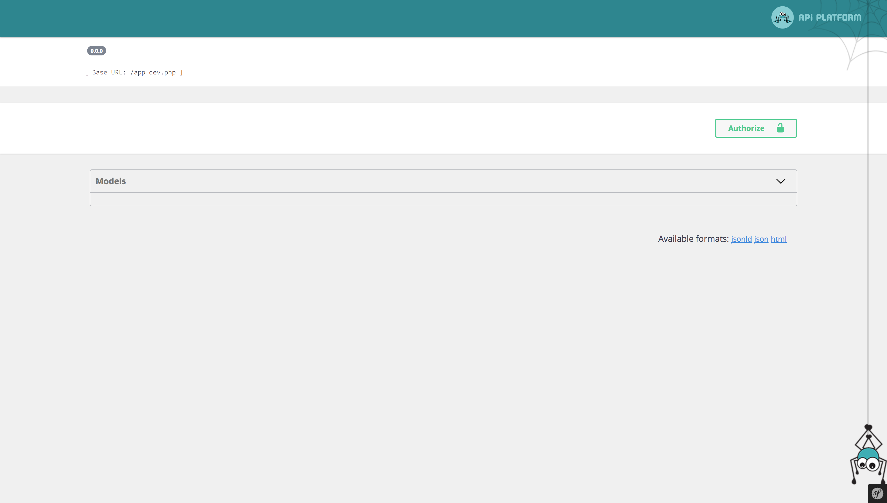
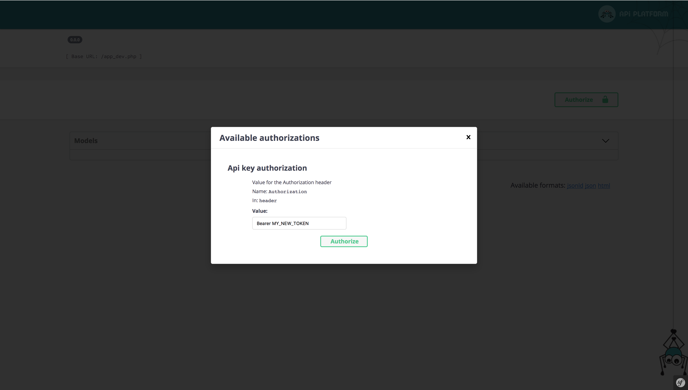
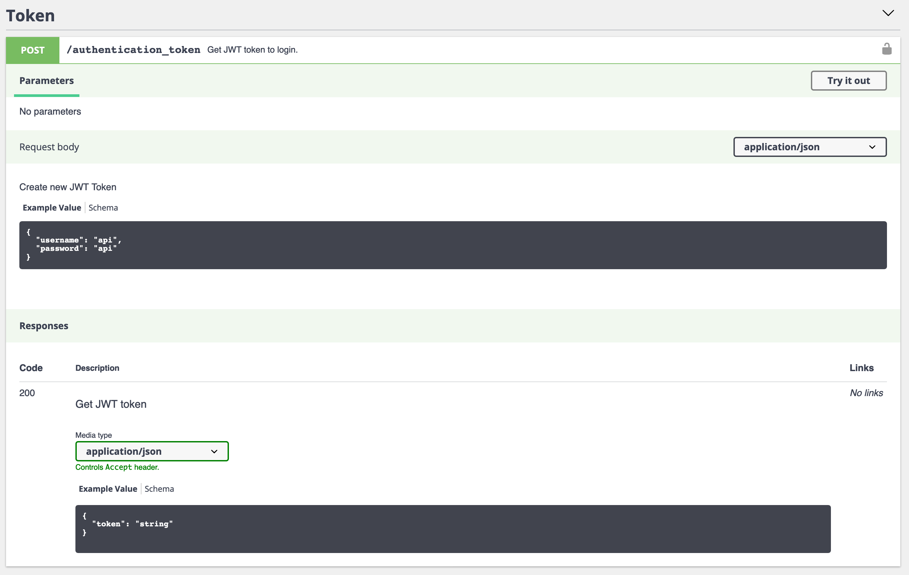

# JWT Authentication

> [JSON Web Token (JWT)](https://jwt.io/) is a JSON-based open standard ([RFC 7519](https://tools.ietf.org/html/rfc7519)) for creating access tokens that assert some number of claims. For example, a server could generate a token that has the claim "logged in as admin" and provide that to a client. The client could then use that token to prove that he/she is logged in as admin.
The tokens are signed by the server's key, so the server is able to verify that the token is legitimate. The tokens are designed to be compact, URL-safe and usable especially in web browser single sign-on (SSO) context.
>
> ―[Wikipedia](https://en.wikipedia.org/wiki/JSON_Web_Token)

API Platform allows to easily add a JWT-based authentication to your API using [LexikJWTAuthenticationBundle](https://github.com/lexik/LexikJWTAuthenticationBundle).

<p align="center" class="symfonycasts"><a href="https://symfonycasts.com/screencast/symfony-rest4/json-web-token?cid=apip"><br>Watch the LexikJWTAuthenticationBundle screencast</a></p>

## Installing LexikJWTAuthenticationBundle

We begin by installing the bundle:

```console
docker-compose exec php \
    composer require jwt-auth
```

Then we need to generate the public and private keys used for signing JWT tokens. If you're using the [API Platform distribution](../distribution/index.md), you may run this from the project's root directory:

```console
docker-compose exec php sh -c '
    set -e
    apk add openssl
    php bin/console lexik:jwt:generate-keypair
    setfacl -R -m u:www-data:rX -m u:"$(whoami)":rwX config/jwt
    setfacl -dR -m u:www-data:rX -m u:"$(whoami)":rwX config/jwt
'
```

Note that the `setfacl` command relies on the `acl` package. This is installed by default when using the API Platform docker distribution but may need be installed in your working environment in order to execute the `setfacl` command.

This takes care of keypair creation (including using the correct passphrase to encrypt the private key), and setting the correct permissions on the keys allowing the web server to read them.

Since these keys are created by the `root` user from a container, your host user will not be able to read them during the `docker-compose build caddy` process. Add the `config/jwt/` folder to the `.dockerignore` file so that they are skipped from the result image.

If you want the keys to be auto generated in `dev` environment, see an example in the [docker-entrypoint script of api-platform/demo](https://github.com/api-platform/demo/blob/master/api/docker/php/docker-entrypoint.sh).

The keys should not be checked in to the repository (i.e. it's in `.gitignore`). However, note that a JWT token could
only pass signature validation against the same pair of keys it was signed with. This is especially relevant in a production
environment, where you don't want to accidentally invalidate all your clients' tokens at every deployment.

For more information, refer to [the bundle's documentation](https://github.com/lexik/LexikJWTAuthenticationBundle/blob/2.x/Resources/doc/index.rst)
or read a [general introduction to JWT here](https://jwt.io/introduction/).

We're not done yet! Let's move on to configuring the Symfony SecurityBundle for JWT authentication.

## Configuring the Symfony SecurityBundle

It is necessary to configure a user provider. You can either use the [Doctrine entity user provider](https://symfony.com/doc/current/security/user_provider.html#entity-user-provider)
provided by Symfony (recommended), [create a custom user provider](https://symfony.com/doc/current/security/user_provider.html#creating-a-custom-user-provider)
or use [API Platform's FOSUserBundle integration](fosuser-bundle.md) (not recommended).

If you choose to use the Doctrine entity user provider, start by [creating your `User` class](https://symfony.com/doc/current/security.html#a-create-your-user-class).

Then update the security configuration:

```yaml
# config/packages/security.yaml
security:
    # https://symfony.com/doc/current/security.html#c-hashing-passwords
    password_hashers:
        App\Entity\User: 'auto'

    # https://symfony.com/doc/current/security/authenticator_manager.html
    enable_authenticator_manager: true
    # https://symfony.com/doc/current/security.html#where-do-users-come-from-user-providers
    providers:
        # used to reload user from session & other features (e.g. switch_user)
        app_user_provider:
            entity:
                class: App\Entity\User
                property: email

    firewalls:
        dev:
            pattern: ^/_(profiler|wdt)
            security: false
        main:
            stateless: true
            provider: app_user_provider
            json_login:
                check_path: /authentication_token
                username_path: email
                password_path: password
                success_handler: lexik_jwt_authentication.handler.authentication_success
                failure_handler: lexik_jwt_authentication.handler.authentication_failure
            jwt: ~

    access_control:
        - { path: ^/docs, roles: PUBLIC_ACCESS } # Allows accessing the Swagger UI
        - { path: ^/authentication_token, roles: PUBLIC_ACCESS }
        - { path: ^/, roles: IS_AUTHENTICATED_FULLY }
```

You must also declare the route used for `/authentication_token`:

```yaml
# config/routes.yaml
authentication_token:
    path: /authentication_token
    methods: ['POST']
```

If you want to avoid loading the `User` entity from database each time a JWT token needs to be authenticated, you may consider using
the [database-less user provider](https://github.com/lexik/LexikJWTAuthenticationBundle/blob/2.x/Resources/doc/8-jwt-user-provider.rst) provided by LexikJWTAuthenticationBundle. However, it means you will have to fetch the `User` entity from the database yourself as needed (probably through the Doctrine EntityManager).

Refer to the section on [Security](security.md) to learn how to control access to API resources and operations. You may
also want to [configure Swagger UI for JWT authentication](#documenting-the-authentication-mechanism-with-swaggeropen-api).

### Adding Authentication to an API Which Uses a Path Prefix

If your API uses a [path prefix](https://symfony.com/doc/current/routing/external_resources.html#prefixing-the-urls-of-imported-routes), the security configuration would look something like this instead:

```yaml
# config/packages/security.yaml
security:
    # https://symfony.com/doc/current/security.html#c-hashing-passwords
    password_hashers:
        App\Entity\User: 'auto'

    # https://symfony.com/doc/current/security/authenticator_manager.html
    enable_authenticator_manager: true
    # https://symfony.com/doc/current/security.html#where-do-users-come-from-user-providers
    providers:
        # used to reload user from session & other features (e.g. switch_user)
        app_user_provider:
            entity:
                class: App\Entity\User
                property: email

    firewalls:
        dev:
            pattern: ^/_(profiler|wdt)
            security: false
        api:
            pattern: ^/api/
            stateless: true
            provider: app_user_provider
            jwt: ~
        main:
            json_login:
                check_path: /authentication_token
                username_path: email
                password_path: password
                success_handler: lexik_jwt_authentication.handler.authentication_success
                failure_handler: lexik_jwt_authentication.handler.authentication_failure

    access_control:
        - { path: ^/docs, roles: PUBLIC_ACCESS } # Allows accessing API documentations and Swagger UI
        - { path: ^/authentication_token, roles: PUBLIC_ACCESS }
        - { path: ^/, roles: IS_AUTHENTICATED_FULLY }
```

### Be sure to have lexik_jwt_authentication configured on your user_identity_field

```yaml
# config/packages/lexik_jwt_authentication.yaml
lexik_jwt_authentication:
    secret_key: '%env(resolve:JWT_SECRET_KEY)%'
    public_key: '%env(resolve:JWT_PUBLIC_KEY)%'
    pass_phrase: '%env(JWT_PASSPHRASE)%'

    user_identity_field: email # Or the field you have setted using make:user
```

## Documenting the Authentication Mechanism with Swagger/Open API

Want to test the routes of your JWT-authentication-protected API?

### Configuring API Platform

```yaml
# config/packages/api_platform.yaml
api_platform:
    swagger:
         api_keys:
             JWT:
                name: Authorization
                type: header
```

The "Authorize" button will automatically appear in Swagger UI.



### Adding a New API Key

All you have to do is configure the API key in the `value` field.
By default, [only the authorization header mode is enabled](https://github.com/lexik/LexikJWTAuthenticationBundle/blob/2.x/Resources/doc/index.rst#2-use-the-token) in LexikJWTAuthenticationBundle.
You must set the [JWT token](https://github.com/lexik/LexikJWTAuthenticationBundle/blob/2.x/Resources/doc/index.rst#1-obtain-the-token) as below and click on the "Authorize" button.

`Bearer MY_NEW_TOKEN`



### Adding endpoint to SwaggerUI to retrieve a JWT token

We can add a `POST /authentication_token` endpoint to SwaggerUI to conveniently retrieve the token when it's needed.



To do it, we need to create a decorator:

```php
<?php
// api/src/OpenApi/JwtDecorator.php

declare(strict_types=1);

namespace App\OpenApi;

use ApiPlatform\Core\OpenApi\Factory\OpenApiFactoryInterface;
use ApiPlatform\Core\OpenApi\OpenApi;
use ApiPlatform\Core\OpenApi\Model;

final class JwtDecorator implements OpenApiFactoryInterface
{
    public function __construct(
        private OpenApiFactoryInterface $decorated
    ) {}

    public function __invoke(array $context = []): OpenApi
    {
        $openApi = ($this->decorated)($context);
        $schemas = $openApi->getComponents()->getSchemas();

        $schemas['Token'] = new \ArrayObject([
            'type' => 'object',
            'properties' => [
                'token' => [
                    'type' => 'string',
                    'readOnly' => true,
                ],
            ],
        ]);
        $schemas['Credentials'] = new \ArrayObject([
            'type' => 'object',
            'properties' => [
                'email' => [
                    'type' => 'string',
                    'example' => 'johndoe@example.com',
                ],
                'password' => [
                    'type' => 'string',
                    'example' => 'apassword',
                ],
            ],
        ]);

        $schemas = $openApi->getComponents()->getSecuritySchemes() ?? [];
        $schemas['JWT'] = new \ArrayObject([
            'type' => 'http',
            'scheme' => 'bearer',
            'bearerFormat' => 'JWT',
        ]);
        
        $pathItem = new Model\PathItem(
            ref: 'JWT Token',
            post: new Model\Operation(
                operationId: 'postCredentialsItem',
                tags: ['Token'],
                responses: [
                    '200' => [
                        'description' => 'Get JWT token',
                        'content' => [
                            'application/json' => [
                                'schema' => [
                                    '$ref' => '#/components/schemas/Token',
                                ],
                            ],
                        ],
                    ],
                ],
                summary: 'Get JWT token to login.',
                requestBody: new Model\RequestBody(
                    description: 'Generate new JWT Token',
                    content: new \ArrayObject([
                        'application/json' => [
                            'schema' => [
                                '$ref' => '#/components/schemas/Credentials',
                            ],
                        ],
                    ]),
                ),
                security: [],
            ),
        );
        $openApi->getPaths()->addPath('/authentication_token', $pathItem);

        return $openApi;
    }
}
```

And register this service in `config/services.yaml`:

```yaml
# config/services.yaml
services:
    # ...

    App\OpenApi\JwtDecorator:
        decorates: 'api_platform.openapi.factory'
        arguments: ['@.inner']
```

## Testing

To test your authentication with `ApiTestCase`, you can write a method as below:

```php
<?php
// tests/AuthenticationTest.php

namespace App\Tests;

use ApiPlatform\Core\Bridge\Symfony\Bundle\Test\ApiTestCase;
use App\Entity\User;
use Hautelook\AliceBundle\PhpUnit\ReloadDatabaseTrait;

class AuthenticationTest extends ApiTestCase
{
    use ReloadDatabaseTrait;

    public function testLogin(): void
    {
        $client = self::createClient();
        $container = self::getContainer();

        $user = new User();
        $user->setEmail('test@example.com');
        $user->setPassword(
            $container->get('security.user_password_hasher')->hashPassword($user, '$3CR3T')
        );

        $manager = $container->get('doctrine')->getManager();
        $manager->persist($user);
        $manager->flush();

        // retrieve a token
        $response = $client->request('POST', '/authentication_token', [
            'headers' => ['Content-Type' => 'application/json'],
            'json' => [
                'email' => 'test@example.com',
                'password' => '$3CR3T',
            ],
        ]);

        $json = $response->toArray();
        $this->assertResponseIsSuccessful();
        $this->assertArrayHasKey('token', $json);

        // test not authorized
        $client->request('GET', '/greetings');
        $this->assertResponseStatusCodeSame(401);

        // test authorized
        $client->request('GET', '/greetings', ['auth_bearer' => $json['token']]);
        $this->assertResponseIsSuccessful();
    }
}
```

Refer to [Testing the API](../distribution/testing.md) for more information about testing API Platform.

### Improving Tests Suite Speed

Since now we have a `JWT` authentication, functional tests require us to log in each time we want to test an API endpoint. This is where [Password Hashers](https://symfony.com/doc/current/security/passwords.html) come into play.

Hashers are used for 2 reasons:

1. To generate a hash for a raw password (`$container->get('security.user_password_hasher')->hashPassword($user, '$3CR3T')`)
2. To verify a password during authentication

While hashing and verifying 1 password is quite a fast operation, doing it hundreds or even thousands of times in a tests suite becomes a bottleneck, because reliable hashing algorithms are slow by their nature.

To significantly improve the test suite speed, we can use more simple password hasher specifically for the `test` environment.

```yaml
# override in api/config/packages/test/security.yaml for test env
security:
    password_hashers:
        App\Entity\User:
            algorithm: md5
            encode_as_base64: false
            iterations: 0
```
