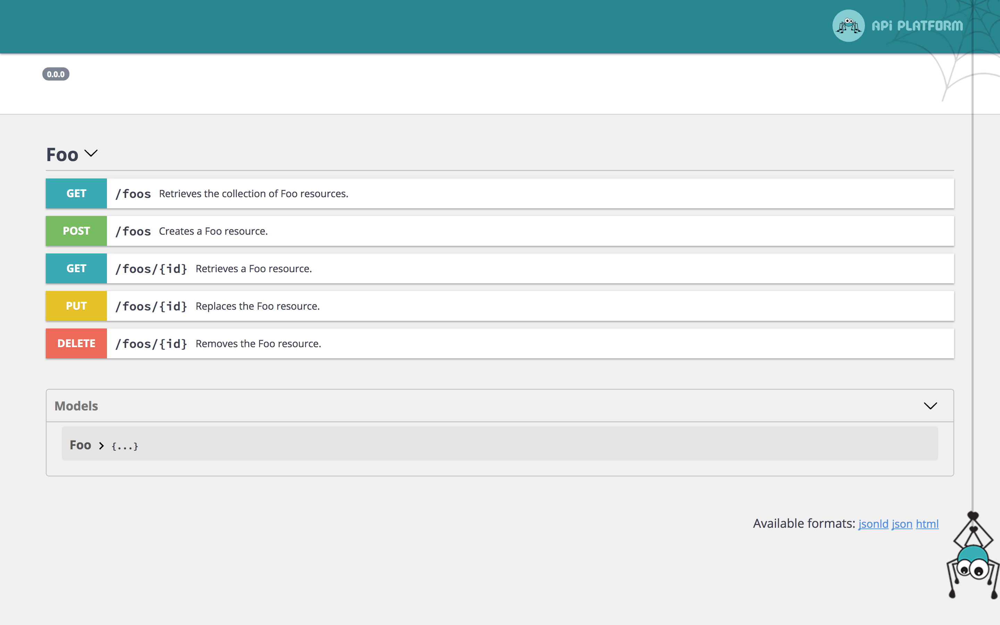
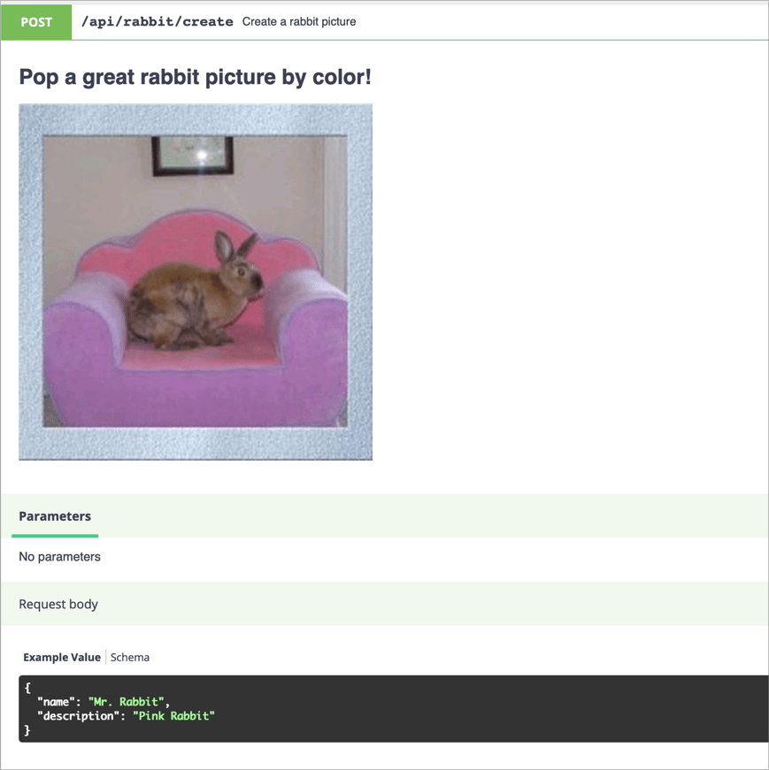

# OpenAPI Specification Support (formerly Swagger)

API Platform natively support the [OpenAPI](https://www.openapis.org/) API specification format.



<p align="center" class="symfonycasts"><a href="https://symfonycasts.com/screencast/api-platform/open-api-spec?cid=apip"><br>Watch the OpenAPI screencast</a></p>

The specification of the API is available at the `/docs.json` path.
By default, OpenAPI v3 is used.
You can also get an OpenAPI v3-compliant version thanks to the `spec_version` query parameter: `/docs.json?spec_version=3`

It also integrates a customized version of [Swagger UI](https://swagger.io/swagger-ui/) and [ReDoc](https://rebilly.github.io/ReDoc/), some nice tools to display the
API documentation in a user friendly way.

## Using the OpenAPI Command

You can also dump an OpenAPI specification for your API.

OpenAPI, JSON format:

```console
docker-compose exec php \
    bin/console api:openapi:export
```

OpenAPI, YAML format:

```console
docker-compose exec php \
    bin/console api:openapi:export --yaml
```

Create a file containing the specification:

```console
docker-compose exec php \
    bin/console api:openapi:export --output=swagger_docs.json
```

If you want to use the old OpenAPI v2 (Swagger) JSON format, use:

```console
docker-compose exec php \
    bin/console api:swagger:export
```

## Overriding the OpenAPI Specification

Symfony allows to [decorate services](https://symfony.com/doc/current/service_container/service_decoration.html), here we
need to decorate `api_platform.openapi.factory`.

In the following example, we will see how to override the title of the Swagger documentation and add a custom filter for
the `GET` operation of `/foos` path.

```yaml
# config/services.yaml
    App\OpenApi\OpenApiFactory:
        decorates: 'api_platform.openapi.factory'
        arguments: [ '@App\OpenApi\OpenApiFactory.inner' ]
        autoconfigure: false
```

```php
<?php
namespace App\OpenApi;

use ApiPlatform\Core\OpenApi\Factory\OpenApiFactoryInterface;
use ApiPlatform\Core\OpenApi\OpenApi;
use ApiPlatform\Core\OpenApi\Model;

class OpenApiFactory implements OpenApiFactoryInterface
{
    private $decorated;

    public function __construct(OpenApiFactoryInterface $decorated)
    {
        $this->decorated = $decorated;
    }

    public function __invoke(array $context = []): OpenApi
    {
        $openApi = $this->decorated->__invoke($context);
        $pathItem = $openApi->getPaths()->getPath('/api/grumpy_pizzas/{id}');
        $operation = $pathItem->getGet();

        $openApi->getPaths()->addPath('/api/grumpy_pizzas/{id}', $pathItem->withGet(
            $operation->withParameters(array_merge(
                $operation->getParameters(),
                [new Model\Parameter('fields', 'query', 'Fields to remove of the output')]
            ))
        ));

        $openApi = $openApi->withInfo((new Model\Info('New Title', 'v2', 'Description of my custom API'))->withExtensionProperty('info-key', 'Info value'));
        $openApi = $openApi->withExtensionProperty('key', 'Custom x-key value');
        $openApi = $openApi->withExtensionProperty('x-value', 'Custom x-value value');

        return $openApi;
    }
}
```

The impact on the swagger-ui is the following:


## Using the OpenAPI and Swagger Contexts

Sometimes you may want to change the information included in your OpenAPI documentation.
The following configuration will give you total control over your OpenAPI definitions:

<code-selector>

```php
<?php
// api/src/Entity/Product.php

namespace App\Entity;

use ApiPlatform\Core\Annotation\ApiResource;
use ApiPlatform\Core\Annotation\ApiProperty;
use Doctrine\ORM\Mapping as ORM;
use Symfony\Component\Validator\Constraints as Assert;

#[ORM\Entity]
#[ApiResource]
class Product // The class name will be used to name exposed resources
{
    #[ORM\Id, ORM\Column, ORM\GeneratedValue]
    private ?int $id = null;

    /**
     * @param string $name A name property - this description will be available in the API documentation too.
     *
     */
    #[ORM\Column]
    #[Assert\NotBlank]
    #[ApiProperty(
        attributes: [
            "openapi_context" => [
                "type" => "string",
                "enum" => ["one", "two"],
                "example" => "one",
            ],
        ],
    )]
    public string $name;

    #[ORM\Column(type: "datetime")] 
    #[Assert\DateTime]
    #[ApiProperty(
        openapi_context: ["type" => "string", "format" => "date-time"]
    )]
    public $timestamp;

    // ...
}
```

```yaml
# config/api_platform/resources.yaml
resources:
    App\Entity\Product:
      properties:
        name:
          attributes:
            openapi_context:
              type: string
              enum: ['one', 'two']
              example: one
        timestamp:
          attributes:
            openapi_context:
              type: string
              format: date-time
```

```xml
<?xml version="1.0" encoding="UTF-8" ?>
<resources xmlns="https://api-platform.com/schema/metadata"
           xmlns:xsi="http://www.w3.org/2001/XMLSchema-instance"
           xsi:schemaLocation="https://api-platform.com/schema/metadata https://api-platform.com/schema/metadata/metadata-2.0.xsd">
    <resource class="App\Entity\Product">
        <property name="name">
            <attribute name="openapi_context">
                <attribute name="type">type</attribute>
                <attribute name="enum">
                    <attribute>one</attribute>
                    <attribute>two</attribute>
                </attribute>
                <attribute name="example">one</attribute>
            </attribute>
        </property>
        <property name="timestamp">
            <attribute name="openapi_context">
                <attribute name="type">string</attribute>
                <attribute name="format">date-time</attribute>
            </attribute>
        </property>
    </resource>
</resources>
```

</code-selector>

This will produce the following Swagger documentation:

```json
"components": {
    "schemas": {
        "GrumpyPizza:jsonld": {
            "type": "object",
            "description": "",
            "properties": {
                "@context": {
                    "readOnly": true,
                    "type": "string"
                },
                "@id": {
                    "readOnly": true,
                    "type": "string"
                },
                "@type": {
                    "readOnly": true,
                    "type": "string"
                },
                "timestamp": {
                    "type": "string",
                    "format": "date-time"
                },
                "id": {
                    "readOnly": true,
                    "type": "integer"
                },
                "name": {
                    "type": "string",
                    "enum": [
                        "one",
                        "two"
                    ],
                    "example": "one"
                }
            }
        }
    }
}
```

To pass a context to the OpenAPI **v2** generator, use the `swagger_context` attribute (notice the prefix: `swagger_` instead of `openapi_`).

## Changing the Name of a Definition

API Platform generates a definition name based on the serializer `groups` defined
in the (`de`)`normalization_context`. It's possible to override the name
thanks to the `swagger_definition_name` option:

```php
#[ApiResource(
    collectionOperations: [
        "post" => [
            "denormalization_context" => [
                "groups" => ["user:read"],
                "swagger_definition_name" => "Read",
            ],
        ],
    ],
)]
class User
{
}
```

It's also possible to re-use the (`de`)`normalization_context`:

```php
#[ApiResource(
    collectionOperations: [
        "post" => [
            "denormalization_context" => User::API_WRITE,
        ],
    ],
)]
class User
{
    const API_WRITE = [
        'groups' => ['user:read'],
        'swagger_definition_name' => 'Read',
    ];
}
```

## Changing Operations in the OpenAPI Documentation

You also have full control over both built-in and custom operations documentation.

<code-selector>

```php
<?php
// api/src/Entity/Rabbit.php

use ApiPlatform\Core\Annotation\ApiProperty;
use ApiPlatform\Core\Annotation\ApiResource;
use App\Controller\RandomRabbit;

#[ApiResource(collectionOperations: [
        'create_rabbit' => [
            'method'          => 'post',
            'path'            => '/rabbit/create',
            'controller'      => RandomRabbit::class,
            'openapi_context' => [
                'summary'     => 'Create a rabbit picture',
                'description' => "# Pop a great rabbit picture by color!\n\n",
                'requestBody' => [
                    'content' => [
                        'application/json' => [
                            'schema'  => [
                                'type'       => 'object',
                                'properties' =>
                                    [
                                        'name'        => ['type' => 'string'],
                                        'description' => ['type' => 'string'],
                                    ],
                            ],
                            'example' => [
                                'name'        => 'Mr. Rabbit',
                                'description' => 'Pink Rabbit',
                            ],
                        ],
                    ],
                ],
            ],
        ],
    ]
)]
class Rabbit
{}
```

```yaml
resources:
  App\Entity\Rabbit:
    collectionOperations:
      create_rabbit:
        method: post
        path: '/rabbit/create'
        controller: App\Controller\RandomRabbit
        openapi_context:
          summary: Random rabbit picture
          description: >
            # Pop a great rabbit picture by color!

            

          requestBody:
            content:
              application/json:
                schema:
                  type: object
                  properties:
                    name: { type: string }
                    description: { type: string }
                example:
                  name: Mr. Rabbit
                  description: Pink rabbit

```

```xml
<?xml version="1.0" encoding="UTF-8" ?>
<resources xmlns="https://api-platform.com/schema/metadata"
           xmlns:xsi="http://www.w3.org/2001/XMLSchema-instance"
           xsi:schemaLocation="https://api-platform.com/schema/metadata
        https://api-platform.com/schema/metadata/metadata-2.0.xsd">
    <resource class="App\Entity\Rabbit">
        <collectionOperations>
            <collectionOperation name="create_rabbit">
                <attribute name="path">/rabbit/create</attribute>
                <attribute name="method">post</attribute>
                <attribute name="controller">App\Controller\RandomRabbit</attribute>
                <attribute name="openapi_context">
                    <attribute name="summary">Create a rabbit picture </attribute>
                    <attribute name="description"># Pop a great rabbit picture by color!!

</attribute>
                    <attribute name="content">
                        <attribute name="application/json">
                            <attribute name="schema">
                                <attribute name="type">object</attribute>
                                <attribute name="properties">
                                    <attribute name="name">
                                        <attribute name="type">string</attribute>
                                    </attribute>
                                    <attribute name="description">
                                        <attribute name="type">string</attribute>
                                    </attribute>
                                </attribute>
                            </attribute>
                        </attribute>
                    </attribute>
                </attribute>
            </collectionOperation>
        </collectionOperations>
    </resource>
</resources>
```

</code-selector>



## Changing the Location of Swagger UI

Sometimes you may want to have the API at one location, and the Swagger UI at a different location. This can be done by disabling the Swagger UI from the API Platform configuration file and manually adding the Swagger UI controller.

### Disabling Swagger UI or ReDoc

```yaml
# config/packages/api_platform.yaml
api_platform:
    # ...
    enable_swagger_ui: false
    enable_re_doc: false
```

### Manually Registering the Swagger UI Controller

```yaml
# config/routes.yaml
swagger_ui:
    path: /docs
    controller: api_platform.swagger.action.ui
```

Change `/docs` to the URI you wish Swagger to be accessible on.

## Using a custom Asset Package in Swagger UI

Sometimes you may want to use a different [Asset Package](https://symfony.com/doc/current/reference/configuration/framework.html#packages) for the Swagger UI.
In this way you'll have more fine-grained control over the asset URL generations.
This is useful i.e. if you want to use different base path, base URL or asset versioning strategy.

Specify a custom asset package name:

```yaml
# config/packages/api_platform.yaml
api_platform:
    asset_package: 'api_platform'
```

Set or override asset properties per package:

```yaml
# config/packages/framework.yaml
framework:
    # ...
    assets:
        base_path: '/custom_base_path' # the default
        packages:
            api_platform:
                base_path: '/'
```

## Overriding the UI Template

As described [in the Symfony documentation](https://symfony.com/doc/current/templating/overriding.html), it's possible to override the Twig template that loads Swagger UI and renders the documentation:

```twig
{# templates/bundles/ApiPlatformBundle/SwaggerUi/index.html.twig #}
<!DOCTYPE html>
<html>
<head>
    <meta charset="UTF-8">
    <title>{{ title }} My custom template</title>
    {# ... #}
</html>
```

You may want to copy the [one shipped with API Platform](https://github.com/api-platform/core/blob/2.6/src/Bridge/Symfony/Bundle/Resources/views/SwaggerUi/index.html.twig) and customize it.

## Compatibility Layer with Amazon API Gateway

[AWS API Gateway](https://aws.amazon.com/api-gateway/) supports OpenAPI partially, but it [requires some changes](https://docs.aws.amazon.com/apigateway/latest/developerguide/api-gateway-known-issues.html).
API Platform provides a way to be compatible with Amazon API Gateway.

To enable API Gateway compatibility on your OpenAPI docs, add `api_gateway=true` as query parameter: `http://www.example.com/docs.json?api_gateway=true`.
The flag `--api-gateway` is also available through the command-line.

## OAuth

If you implemented OAuth on your API, you should configure OpenApi's authorization using API Platform's configuration:

```yaml
api_platform:
    oauth:
        # To enable or disable oauth.
        enabled: false

        # The oauth client id.
        clientId: ''

        # The oauth client secret.
        clientSecret: ''

        # The oauth type.
        type: 'oauth2'

        # The oauth flow grant type.
        flow: 'application'

        # The oauth token url.
        tokenUrl: '/oauth/v2/token'

        # The oauth authentication url.
        authorizationUrl: '/oauth/v2/auth'

        # The oauth scopes.
        scopes: []
```

Note that `clientId` and `clientSecret` are being used by the SwaggerUI if enabled.

## Info Object

The [info object](https://swagger.io/specification/#info-object) provides metadata about the API like licensing information or a contact. You can specify this information using API Platform's configuration:

```yaml
api_platform:

    # The title of the API.
    title: 'API title'

    # The description of the API.
    description: 'API description'

    # The version of the API.
    version: '0.0.0'

    openapi:
        # The contact information for the exposed API.
        contact:
            # The identifying name of the contact person/organization.
            name:
            # The URL pointing to the contact information. MUST be in the format of a URL.
            url:
            # The email address of the contact person/organization. MUST be in the format of an email address.
            email:
        # A URL to the Terms of Service for the API. MUST be in the format of a URL.
        termsOfService:
        # The license information for the exposed API.
        license:
            # The license name used for the API.
            name:
            # URL to the license used for the API. MUST be in the format of a URL.
            url:
```
