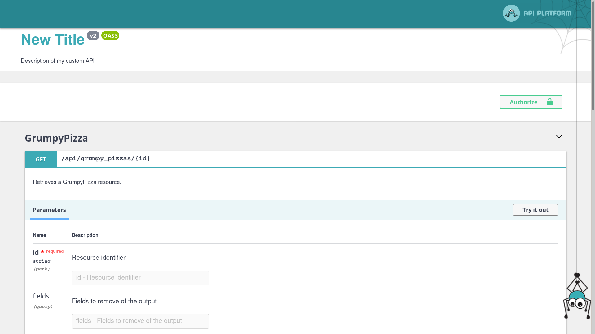

# OpenAPI Specification Support (formerly Swagger)

API Platform natively supports the [OpenAPI](https://www.openapis.org/) API specification format.


<p align="center" class="symfonycasts"><a href="https://symfonycasts.com/screencast/api-platform/open-api-spec?cid=apip"><br>Watch the OpenAPI screencast</a></p>

The specification of the API is available at the `/docs.jsonopenapi` path.
By default, OpenAPI v3 is used.
You can also get an OpenAPI v3-compliant version thanks to the `spec_version` query parameter: `/docs.jsonopenapi?spec_version=3`

It also integrates a customized version of [Swagger UI](https://swagger.io/swagger-ui/) and [ReDoc](https://rebilly.github.io/ReDoc/), some nice tools to display the
API documentation in a user friendly way.

## Using the OpenAPI Command

> [!WARNING]
> These commands are not yet available with Laravel, you're welcome to contribute [on GitHub](https://github.com/api-platform/core)

You can also dump an OpenAPI specification for your API.

OpenAPI, JSON format:

```console
bin/console api:openapi:export
```

OpenAPI, YAML format:

```console
bin/console api:openapi:export --yaml
```

Create a file containing the specification:

```console
bin/console api:openapi:export --output=swagger_docs.json
```

If you want to use the old OpenAPI v2 (Swagger) JSON format, use:

```console
bin/console api:swagger:export
```

It is also possible to use OpenAPI v3.0.0 format:

```console
bin/console api:openapi:export --spec-version=3.0.0
```

## Overriding the OpenAPI Specification

### Overriding the OpenAPI Specification with Symfony

Symfony allows to [decorate services](https://symfony.com/doc/current/service_container/service_decoration.html), here we
need to decorate `api_platform.openapi.factory`.

In the following example, we will see how to override the title and the base path URL of the Swagger documentation and add a custom filter for
the `GET` operation of `/foos` path.

```yaml
# api/config/services.yaml
App\OpenApi\OpenApiFactory:
  decorates: 'api_platform.openapi.factory'
  arguments: ['@App\OpenApi\OpenApiFactory.inner']
  autoconfigure: false
```

```php
<?php
namespace App\OpenApi;

use ApiPlatform\OpenApi\Factory\OpenApiFactoryInterface;
use ApiPlatform\OpenApi\OpenApi;
use ApiPlatform\OpenApi\Model;

class OpenApiFactory implements OpenApiFactoryInterface
{

    public function __construct(private OpenApiFactoryInterface $decorated)
    {
    }

    public function __invoke(array $context = []): OpenApi
    {
        $openApi = $this->decorated->__invoke($context);
        $pathItem = $openApi->getPaths()->getPath('/api/grumpy_pizzas/{id}');
        $operation = $pathItem->getGet();

        $openApi->getPaths()->addPath('/api/grumpy_pizzas/{id}', $pathItem->withGet(
            $operation->withParameters(array_merge(
                $operation->getParameters(),
                [new Model\Parameter('fields', 'query', 'Fields to remove of the output')]
            ))
        ));

        $openApi = $openApi->withInfo((new Model\Info('New Title', 'v2', 'Description of my custom API'))->withExtensionProperty('info-key', 'Info value'));
        $openApi = $openApi->withExtensionProperty('key', 'Custom x-key value');
        $openApi = $openApi->withExtensionProperty('x-value', 'Custom x-value value');

        // to define base path URL
        $openApi = $openApi->withServers([new Model\Server('https://foo.bar')]);

        return $openApi;
    }
}
```

The impact on the swagger-ui is the following:



### Overriding the OpenAPI Specification with Laravel

Laravel allows to [decorate services](https://laravel.com/docs/container#extending-bindings), here we
need to decorate `api_platform.openapi.factory`.

In the following example, we will see how to override the title and the base path URL of the Swagger documentation and add a custom filter for
the `GET` operation of `/foos` path.

```php
<?php

namespace App\Providers;

use Illuminate\Support\ServiceProvider;
use ApiPlatform\OpenApi\Factory\OpenApiFactoryInterface;
use App\OpenApi\OpenApiFactory;

class AppServiceProvider extends ServiceProvider
{
    public function register(): void
    {
        $this->app->extend(OpenApiFactoryInterface::class, function (OpenApiFactoryInterface $factory) {
            return new OpenApiFactory($factory);
        });
    }
}
```

```php
<?php
namespace App\OpenApi;

use ApiPlatform\OpenApi\Factory\OpenApiFactoryInterface;
use ApiPlatform\OpenApi\OpenApi;
use ApiPlatform\OpenApi\Model;

class OpenApiFactory implements OpenApiFactoryInterface
{

    public function __construct(private OpenApiFactoryInterface $decorated)
    {
    }

    public function __invoke(array $context = []): OpenApi
    {
        $openApi = $this->decorated->__invoke($context);
        $pathItem = $openApi->getPaths()->getPath('/api/grumpy_pizzas/{id}');
        $operation = $pathItem->getGet();

        $openApi->getPaths()->addPath('/api/grumpy_pizzas/{id}', $pathItem->withGet(
            $operation->withParameters(array_merge(
                $operation->getParameters(),
                [new Model\Parameter('fields', 'query', 'Fields to remove of the output')]
            ))
        ));

        $openApi = $openApi->withInfo((new Model\Info('New Title', 'v2', 'Description of my custom API'))->withExtensionProperty('info-key', 'Info value'));
        $openApi = $openApi->withExtensionProperty('key', 'Custom x-key value');
        $openApi = $openApi->withExtensionProperty('x-value', 'Custom x-value value');

        // to define base path URL
        $openApi = $openApi->withServers([new Model\Server('https://foo.bar')]);

        return $openApi;
    }
}
```

The impact on the swagger-ui is the following:


## Using the OpenAPI and Swagger Contexts

Sometimes you may want to change the information included in your OpenAPI documentation.

For the full list of available configurations, please refer to the [OpenAPI Specifications](https://spec.openapis.org/oas/latest.html). The current doc page only gives some examples but focuses mostly on the OpenAPI integration inside API Platform without telling you all you can pass into the attributes.

The following configuration will give you total control over your OpenAPI definitions:

<code-selector>

```php
<?php
// api/src/ApiResource/Product.php with Symfony or app/ApiResource/Product.php with Laravel
namespace App\ApiResource;

use ApiPlatform\Metadata\ApiResource;
use ApiPlatform\Metadata\ApiProperty;
use Symfony\Component\Validator\Constraints as Assert;

#[ApiResource]
class Product // The class name will be used to name exposed resources
{
    #[ApiProperty(
        identifier: true,
        description: 'Unique identifier for the product.',
        openapiContext: [
            'type' => 'integer',
            'example' => 1
        ]
    )]
    #[Assert\NotBlank]
    private ?int $id = null;

    /**
     * @param string $name A name property - this description will be available in the API documentation too.
     *
     */
    #[Assert\NotBlank]
    #[ApiProperty(
        description: 'A name property - this description will be available in the API documentation too.',
        openapiContext: [
            'type' => 'string',
            'enum' => ['one', 'two'],
            'example' => 'one'
        ]
    )]
    #[Assert\NotBlank]
    public string $name;

    #[ApiProperty(
        description: 'A timestamp property.',
        openapiContext: [
            'type' => 'string',
            'format' => 'date-time',
        ]
    )]
    #[Assert\DateTime]
    public string $timestamp;

    // Optionnel : Ajout d'un constructeur pour faciliter l'initialisation
    public function __construct(string $name, string $timestamp)
    {
        $this->name = $name;
        $this->timestamp = $timestamp;
    }
}

```

```yaml
# api/config/api_platform/properties.yaml
# The YAML syntax is only supported for Symfony
properties:
  App\ApiResource\Product:
    name:
      openapiContext:
        type: string
        enum: ['one', 'two']
        example: one
    timestamp:
      openapiContext:
        type: string
        format: date-time
```

```xml
<?xml version="1.0" encoding="UTF-8" ?>
<!-- api/config/api_platform/properties.xml -->
<!-- The XML syntax is only supported for Symfony -->
<properties xmlns="https://api-platform.com/schema/metadata/properties-3.0"
           xmlns:xsi="http://www.w3.org/2001/XMLSchema-instance"
           xsi:schemaLocation="https://api-platform.com/schema/metadata/properties-3.0
           https://api-platform.com/schema/metadata/properties-3.0.xsd">
    <property resource="App\ApiResource\Product" name="name">
        <openapiContext>
            <values>
                <value name="type">type</value>
                <value name="enum">
                    <values>
                        <value>one</value>
                        <value>two</value>
                    </values>
                </value>
                <value name="example">one</value>
            </values>
        </openapiContext>
    </property>
    <property resource="App\ApiResource\Product" name="timestamp">
        <openapiContext>
            <values>
                <value name="type">string</value>
                <value name="format">date-time</value>
            </values>
        </openapiContext>
    </property>
</properties>
```

</code-selector>

This will produce the following Swagger documentation:

```json
"components": {
    "schemas": {
        "GrumpyPizza:jsonld": {
            "type": "object",
            "description": "",
            "properties": {
                "@context": {
                    "readOnly": true,
                    "type": "string"
                },
                "@id": {
                    "readOnly": true,
                    "type": "string"
                },
                "@type": {
                    "readOnly": true,
                    "type": "string"
                },
                "timestamp": {
                    "type": "string",
                    "format": "date-time"
                },
                "id": {
                    "readOnly": true,
                    "type": "integer"
                },
                "name": {
                    "type": "string",
                    "enum": [
                        "one",
                        "two"
                    ],
                    "example": "one"
                }
            }
        }
    }
}
```

To pass a context to the OpenAPI **v2** generator, use the `swaggerContext` attribute (notice the prefix: `swagger` instead of `openapi`).

## Disabling an Operation From OpenAPI Documentation

Sometimes you may want to disable an operation from the OpenAPI documentation, for example to not exposing it.
Using the `openapi` boolean option disables this operation from the OpenAPI documentation:

<code-selector>

```php
<?php
// api/src/ApiResource/Product.php with Symfony or app/ApiResource/Product.php with Laravel
namespace App\ApiResource;

use ApiPlatform\Metadata\ApiResource;
use ApiPlatform\Metadata\GetCollection;

#[ApiResource(
    operations: [
        new GetCollection(openapi: false)
    ]
)]
class Product
{
    // ...
}
```

```yaml
# api/config/api_platform/resources.yaml
# The YAML syntax is only supported for Symfony
resources:
  App\Entity\Product:
    operations:
      ApiPlatform\Metadata\GetCollection:
        openapi: false
```

```xml
<?xml version="1.0" encoding="UTF-8" ?>
<!-- api/config/api_platform/resources.xml -->
<!-- The XML syntax is only supported for Symfony -->

<resources xmlns="https://api-platform.com/schema/metadata/resources-3.0"
           xmlns:xsi="http://www.w3.org/2001/XMLSchema-instance"
           xsi:schemaLocation="https://api-platform.com/schema/metadata/resources-3.0
           https://api-platform.com/schema/metadata/resources-3.0.xsd">
    <resource class="App\Entity\Product">
        <operations>
            <operation class="ApiPlatform\Metadata\GetCollection" openapi="false" />
        </operations>
    </resource>
</resources>
```

</code-selector>

Note: as your route is not exposed, you may want to return a HTTP 404 if it's called. Prefer using the `NotExposedAction` controller instead.

## Changing the Name of a Definition

API Platform generates a definition name based on the serializer `groups` defined in the (`de`)`normalizationContext`.
It's possible to override the name thanks to the `openapi_definition_name` option:

```php
use ApiPlatform\Metadata\ApiResource;
use ApiPlatform\Metadata\Post;

#[ApiResource]
#[Post(denormalizationContext: ['groups' => ['user:read'], 'openapi_definition_name' => 'Read'])]
class User
{
    // ...
}
```

It's also possible to re-use the (`de`)`normalizationContext`:

```php
use ApiPlatform\Metadata\ApiResource;
use ApiPlatform\Metadata\Post;

#[ApiResource]
#[Post(denormalizationContext: [User::API_WRITE])]
class User
{
    const API_WRITE = [
        'groups' => ['user:read'],
        'openapi_definition_name' => 'Read',
    ];
}
```

## Changing Operations in the OpenAPI Documentation

You also have full control over both built-in and custom operations documentation.

<code-selector>

```php
<?php
// api/src/ApiResource/Rabbit.php with Symfony or app/ApiResource/Rabbit.php with Laravel
namespace App\ApiResource;

use ApiPlatform\Metadata\ApiResource;
use ApiPlatform\Metadata\Post;
use ApiPlatform\OpenApi\Model;
use App\Controller\RandomRabbit;

#[ApiResource]
#[Post(
    name: 'create_rabbit',
    uriTemplate: '/rabbit/create',
    controller: RandomRabbit::class,
    openapi: new Model\Operation(
        summary: 'Create a rabbit picture',
        description: '# Pop a great rabbit picture by color!\n\n',
        requestBody: new Model\RequestBody(
            content: new \ArrayObject([
                'application/json' => [
                    'schema' => [
                        'type' => 'object',
                        'properties' => [
                            'name' => ['type' => 'string'],
                            'description' => ['type' => 'string']
                        ]
                    ],
                    'example' => [
                        'name' => 'Mr. Rabbit',
                        'description' => 'Pink Rabbit'
                    ]
                ]
            ])
        )
    )
)]
class Rabbit
{
    // ...
}
```

```yaml
# The YAML syntax is only supported for Symfony
resources:
  App\ApiResource\Rabbit:
    operations:
      create_rabbit:
        class: ApiPlatform\Metadata\Post
        path: '/rabbit/create'
        controller: App\Controller\RandomRabbit
        openapi:
          summary: Random rabbit picture
          description: >
            # Pop a great rabbit picture by color!

            
          requestBody:
            content:
              application/json:
                schema:
                  type: object
                  properties:
                    name: { type: string }
                    description: { type: string }
                example:
                  name: Mr. Rabbit
                  description: Pink rabbit
```

```xml
<?xml version="1.0" encoding="UTF-8" ?>
<!-- The XML syntax is only supported for Symfony -->

<resources xmlns="https://api-platform.com/schema/metadata/resources-3.0"
           xmlns:xsi="http://www.w3.org/2001/XMLSchema-instance"
           xsi:schemaLocation="https://api-platform.com/schema/metadata/resources-3.0
        https://api-platform.com/schema/metadata/resources-3.0.xsd">
    <resource class="App\Entity\Rabbit">
        <operations>
            <operation class="ApiPlatform\Metadata\Post" name="create_rabbit" uriTemplate="/rabbit/create"
                       controller="App\Controller\RandomRabbit">
                <openapi summary="Create a rabbit picture"
                         description="# Pop a great rabbit picture by color!!

    ">
                    <responses>
                        <response status="200">
                            <content>
                                <values>
                                    <value name="application/json">
                                        <values>
                                            <value name="schema">
                                                <values>
                                                    <value name="type">object</value>
                                                    <value name="properties">
                                                        <values>
                                                            <value name="name">
                                                                <values>
                                                                    <value name="type">string</value>
                                                                </values>
                                                            </value>
                                                            <value name="description">
                                                                <values>
                                                                    <value name="type">string</value>
                                                                </values>
                                                            </value>
                                                        </values>
                                                    </value>
                                                </values>
                                            </value>
                                        </values>
                                    </value>
                                </values>
                            </content>
                        </response>
                    </responses>
                </openapi>
            </operation>
        </operations>
    </resource>
</resources>
```

</code-selector>


## Disabling Swagger UI or ReDoc

### Disabling Swagger UI or ReDoc with Symfony

To disable Swagger UI (ReDoc will be shown by default):

```yaml
# api/config/packages/api_platform.yaml
api_platform:
  # ...
  enable_swagger_ui: false
```

To disable ReDoc:

```yaml
# api/config/packages/api_platform.yaml
api_platform:
  # ...
  enable_re_doc: false
```

### Disabling Swagger UI or ReDoc with Laravel

To disable Swagger UI (ReDoc will be shown by default):

```php
<?php
// config/api-platform.php
return [
    // ....
    'enable_swagger_ui' => false,
];
```

To disable ReDoc:

```php
<?php
// config/api-platform.php
return [
    // ....
    'enable_re_doc' => false,
];
```

## Changing the Location of Swagger UI

By default, the Swagger UI is available at the API location (when the HTML format is asked) and at the route `/docs`.

You may want to change its route and/or disable it at the API location.

### Changing the Route

#### Changing the Route with Symfony

Manually register the Swagger UI controller:

```yaml
# app/config/routes.yaml
api_doc:
  path: /api_documentation
  controller: api_platform.swagger_ui.processor
```

Change `/api_documentation` to the URI you wish Swagger UI to be accessible on.

#### Changing the Route with Laravel

Manually register the Swagger UI controller:

```php
// routes/web.php
use Illuminate\Support\Facades\Route;
use ApiPlatform\Laravel\State\SwaggerUiProcessor;

Route::post('/api_documentation', SwaggerUiProcessor::class)
    ->name('api_doc');
```

Change `/api_documentation` to the URI you wish Swagger UI to be accessible on.

### Disabling Swagger UI at the API Location

To disable the Swagger UI at the API location, disable both Swagger UI and ReDoc.

With Symfony use:

```yaml
# api/config/packages/api_platform.yaml
api_platform:
  # ...
  enable_swagger_ui: false
  enable_re_doc: false
```

Or with Laravel use:

```php
<?php
// config/api-platform.php
return [
    // ....
    'enable_swagger_ui' => false,
    'enable_re_doc' => false,
];
```

If you have manually registered the Swagger UI controller, the Swagger UI will still be accessible at the route you have chosen.

## Using a custom Asset Package in Swagger UI

> [!WARNING]
> This feature is not yet available with Laravel, you're welcome to contribute [on GitHub](https://github.com/api-platform/core)

Sometimes you may want to use a different [Asset Package](https://symfony.com/doc/current/reference/configuration/framework.html#packages) for the Swagger UI.
In this way you'll have more fine-grained control over the asset URL generations.
This is useful i.e. if you want to use different base path, base URL or asset versioning strategy.

Specify a custom asset package name:

```yaml
# config/packages/api_platform.yaml
api_platform:
  asset_package: 'api_platform'
```

Set or override asset properties per package:

```yaml
# config/packages/framework.yaml
framework:
  # ...
  assets:
    base_path: '/custom_base_path' # the default
    packages:
      api_platform:
        base_path: '/'
```

## Overriding the UI Template

You can extend the default UI Template using the Symfony and Laravel instructions below:

### Overriding the UI Template using Symfony

As described [in the Symfony documentation](https://symfony.com/doc/current/templating/overriding.html), it's possible to override the Twig template that loads Swagger UI and renders the documentation:

```twig
{# templates/bundles/ApiPlatformBundle/SwaggerUi/index.html.twig #}
<!DOCTYPE html>
<html>
<head>
    <meta charset="UTF-8">
    <title>{{ title }} My custom template</title>
    {# ... #}
</html>
```

You may want to copy the [one shipped with API Platform](https://github.com/api-platform/core/blob/main/src/Symfony/Bundle/Resources/views/SwaggerUi/index.html.twig) and customize it.

### Overriding the UI Template using Laravel

As described [in the Laravel documentation](https://laravel.com/docs/blade#extending-a-layout), it's possible to override the Blade template that loads Swagger UI and renders the documentation:

```blade
{# resources/views/swagger-ui.blade.php #}
<!DOCTYPE html>
<html>
<head>
    <meta charset="UTF-8">
    <title>
        @if(isset($title)) 
            {{ $title }} 
        @endif
        My custom template
    </title>
    {# ... #}
</html>
```

You may want to copy the [one shipped with API Platform](https://github.com/api-platform/core/blob/main/src/Laravel/resources/views/swagger-ui.blade.php) and customize it.

## Compatibility Layer with Amazon API Gateway

[AWS API Gateway](https://aws.amazon.com/api-gateway/) supports OpenAPI partially, but it [requires some changes](https://docs.aws.amazon.com/apigateway/latest/developerguide/api-gateway-known-issues.html).
API Platform provides a way to be compatible with Amazon API Gateway.

To enable API Gateway compatibility on your OpenAPI docs, add `api_gateway=true` as query parameter: `http://www.example.com/docs.jsonopenapi?api_gateway=true`.
The flag `--api-gateway` is also available through the command-line.

## OAuth

### OAuth using Symfony

If you implemented OAuth on your API, you should configure OpenApi's authorization using API Platform's configuration:

```yaml
# config/packages/api_platform.yaml
api_platform:
  oauth:
    # To enable or disable OAuth.
    enabled: false

    # The OAuth client ID.
    clientId: ''

    # The OAuth client secret.
    clientSecret: ''

    # The OAuth type.
    type: 'oauth2'

    # The OAuth flow grant type.
    flow: 'application'

    # The OAuth token url.
    tokenUrl: '/oauth/v2/token'

    # The OAuth authentication url.
    authorizationUrl: '/oauth/v2/auth'

    # The OAuth scopes.
    scopes: []
```

Note that `clientId` and `clientSecret` are being used by the SwaggerUI if enabled.

### OAuth using Laravel

If you implemented OAuth on your API, you should configure OpenApi's authorization using API Platform's configuration:

```php
<?php
// config/api-platform.php
return [
    // ....
    'oauth' => [
        'enabled' => false, // To enable or disable OAuth.
        'clientId' => '', // The OAuth client ID.
        'clientSecret' => '', // The OAuth client secret. 
        'type' => 'oauth2', // The OAuth flow grant type.
        'authorizationUrl' => '/oauth/v2/auth' // The OAuth authentication url.
        'scopes' => [], // The OAuth scopes.
    ],
];
```

Note that `clientId` and `clientSecret` are being used by the SwaggerUI if enabled.

### Configure the OAuth Scopes Option

#### Configure the OAuth Scopes Option using Symfony

The `api_platform.oauth.scopes` option requires an array value with the scopes name and description. For example:

```yaml
api_platform:
  oauth:
    scopes:
      profile: "This scope value requests access to the End-User's default profile Claims, which are: name, family_name, given_name, middle_name, nickname, preferred_username, profile, picture, website, gender, birthdate, zoneinfo, locale, and updated_at."
      email: 'This scope value requests access to the email and email_verified Claims.'
      address: 'This scope value requests access to the address Claim.'
      phone: 'This scope value requests access to the phone_number and phone_number_verified Claims.'
```

> [!NOTE]
> If you're using an OpenID Connect server (such as Keycloak or Auth0), the `openid` scope **must** be set according
> to the [OpenID Connect specification](https://openid.net/specs/openid-connect-core-1_0.html).

#### Configure the OAuth Scopes Option using Laravel

The `api_platform.oauth.scopes` option requires an array value with the scopes name and description. For example:

```php
<?php
// config/api-platform.php
return [
    // ....
    'oauth' => [
        'scopes' => [
            'profile' => "This scope value requests access to the End-User's default profile Claims, which are: name, family_name, given_name, middle_name, nickname, preferred_username, profile, picture, website, gender, birthdate, zoneinfo, locale, and updated_at.",
            'email' => 'This scope value requests access to the email and email_verified Claims.',
            'address' => 'This scope value requests access to the address Claim.',
            'phone' => 'This scope value requests access to the phone_number and phone_number_verified Claims.',
        ]
    ],
];
```

> [!NOTE]
> If you're using an OpenID Connect server (such as Keycloak or Auth0), the `openid` scope **must** be set according
> to the [OpenID Connect specification](https://openid.net/specs/openid-connect-core-1_0.html).

## Info Object

The [info object](https://swagger.io/specification/#info-object) provides metadata about the API like licensing
information or a contact. You can specify this information using API Platform's configuration below:

### Info Object Configuration using Symfony  

```yaml
api_platform:
  # The title of the API.
  title: 'API title'

  # The description of the API.
  description: 'API description'

  # The version of the API.
  version: '0.0.0'

  openapi:
    # The contact information for the exposed API.
    contact:
      # The identifying name of the contact person/organization.
      name:
      # The URL pointing to the contact information. MUST be in the format of a URL.
      url:
      # The email address of the contact person/organization. MUST be in the format of an email address.
      email:
    # A URL to the Terms of Service for the API. MUST be in the format of a URL.
    termsOfService:
    # The license information for the exposed API.
    license:
      # The license name used for the API.
      name:
      # URL to the license used for the API. MUST be in the format of a URL.
      url:
```

### Info Object Configuration using Laravel

```php
<?php
// config/api-platform.php
return [
    // ....
    'title' => 'API title', // The title of the API.
    'description' => 'API description', // The description of the API.
    'version' => '0.0.0', // The version of the API.
    //...
    'openapi' => [
        'contact' => [ // The contact information for the exposed API.
            'name' => '', // The identifying name of the contact person/organization.
            'url' => '', // The URL pointing to the contact information. MUST be in the format of a URL.
            'email' => '', // The email address of the contact person/organization. MUST be in the format of an email address.
        ],
        'termsOfService' => '', // A URL to the Terms of Service for the API. MUST be in the format of a URL.
        'license' => [ // The license information for the exposed API.
            'name' => '', // The license name used for the API.
            'url' => '', // URL to the license used for the API. MUST be in the format of a URL.
        ]
    ],
];
```
