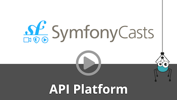

# Pagination

<p align="center" class="symfonycasts"><a href="https://symfonycasts.com/screencast/api-platform/pagination?cid=apip"><br>Watch the Pagination screencast</a></p>

API Platform has native support for paged collections. Pagination is enabled by default for all collections. Each collection
contains 30 items per page.
The activation of the pagination and the number of elements per page can be configured from:

- the server-side (globally or per resource)
- the client-side, via a custom GET parameter (disabled by default)

When issuing a `GET` request on a collection containing more than 1 page (here `/books`), a [Hydra collection](https://www.hydra-cg.com/spec/latest/core/#collections)
is returned. It's a valid JSON(-LD) document containing items of the requested page and metadata.

```json
{
  "@context": "/contexts/Book",
  "@id": "/books",
  "@type": "Collection",
  "member": [
    {
      "@id": "/books/1",
      "@type": "https://schema.org/Book",
      "name": "My awesome book"
    },
    {
      "_": "Other items in the collection..."
    }
  ],
  "totalItems": 50,
  "view": {
    "@id": "/books?page=1",
    "@type": "PartialCollectionView",
    "first": "/books?page=1",
    "last": "/books?page=2",
    "next": "/books?page=2"
  }
}
```

Hypermedia links to the first, the last, previous and the next page in the collection are displayed as well as the number
of total items in the collection.

The name of the page parameter can be changed with the following configuration:

## Changing page parameter name with Symfony

```yaml
# api/config/packages/api_platform.yaml
api_platform:
  collection:
    pagination:
      page_parameter_name: _page
```

## Changing page parameter name with Laravel

```php
<?php
// config/api-platform.php
return [
    // ....
    'collection' => [
        'pagination' => [
            'page_parameter_name' => '_page',
        ]
    ],
];
```

## Disabling the Pagination

Paginating collections is generally accepted as a good practice. It allows browsing large collections without too much
overhead as well as preventing [DOS attacks](https://en.wikipedia.org/wiki/Denial-of-service_attack).
However, for small collections, it can be convenient to fully disable the pagination.

### Disabling the Pagination Globally

#### Disabling the Pagination Globally with Symfony

The pagination can be disabled for all resources using this configuration:

```yaml
# api/config/packages/api_platform.yaml
api_platform:
  defaults:
    pagination_enabled: false
```

#### Disabling the Pagination Globally with Laravel

The pagination can be disabled for all resources using this configuration:

```php
<?php
// config/api-platform.php
return [
    // ....
    'defaults' => [
        'pagination_enabled' => false,
    ],
];
```

### Disabling the Pagination For a Specific Resource

It can also be disabled for a specific resource:

<code-selector>

```php
<?php
// api/src/ApiResource/Book.php with Symfony or app/ApiResource/Book.php with Laravel
namespace App\ApiResource;

use ApiPlatform\Metadata\ApiResource;

#[ApiResource(paginationEnabled: false)]
class Book
{
    // ...
}
```

```yaml
# api/config/api_platform/resources.yaml
# The YAML syntax is only supported for Symfony
resources:
  App\ApiResource\Book:
    paginationEnabled: false
```

</code-selector>

### Disabling the Pagination For a Specific Operation

You can also disable an operation for a specific operation:

<code-selector>

```php
<?php
// api/src/ApiResource/Book.php with Symfony or app/ApiResource/Book.php with Laravel
namespace App\Entity;

use ApiPlatform\Metadata\ApiResource;
use ApiPlatform\Metadata\GetCollection;

#[ApiResource(
    operations: [
        new GetCollection(
            paginationEnabled: false
        )
    ]
)]
class Book
{
    // ...
}
```

```yaml
# api/config/api_platform/resources.yaml
# The YAML syntax is only supported for Symfony
resources:
  App\ApiResource\Book:
    operations:
      ApiPlatform\Metadata\GetCollection:
        paginationEnabled: false
```

```xml
<?xml version="1.0" encoding="UTF-8" ?>
<!-- The XML syntax is only supported for Symfony -->
<!-- api/config/api_platform/resources.xml -->

<resources xmlns="https://api-platform.com/schema/metadata/resources-3.0"
        xmlns:xsi="http://www.w3.org/2001/XMLSchema-instance"
        xsi:schemaLocation="https://api-platform.com/schema/metadata/resources-3.0
        https://api-platform.com/schema/metadata/resources-3.0.xsd">
    <resource class="App\ApiResource\Book">
        <operations>
            <operation class="ApiPlatform\Metadata\GetCollection"
                       paginationEnabled="false" />
        </operations>
    </resource>
</resources>
```

</code-selector>

### Disabling the Pagination Client-side

#### Disabling the Pagination Client-side Globally

You can configure API Platform to let the client enable or disable the pagination.

##### Disabling the Pagination Client-side Globally with Symfony

To configure this feature globally, use the following configuration:

```yaml
# api/config/packages/api_platform.yaml
api_platform:
  defaults:
    pagination_client_enabled: false
  collection:
    pagination:
      enabled_parameter_name: pagination # optional
```

The pagination can now be enabled or disabled by adding a query parameter named `pagination`:

- `GET /books?pagination=false`: disabled
- `GET /books?pagination=true`: enabled

Any value accepted by the [`FILTER_VALIDATE_BOOLEAN`](https://www.php.net/manual/en/filter.filters.validate.php) filter can be
used as the value.

##### Disabling the Pagination Client-side Globally with Laravel

To configure this feature globally, use the following configuration:

```php
<?php
// config/api-platform.php
return [
    // ....
    'defaults' => [
        'pagination_client_enabled' => false,
    ],
    'collection' => [
        'pagination' => [
            'enabled_parameter_name' => 'pagination', // optional
        ],
    ],
];
```

The pagination can now be enabled or disabled by adding a query parameter named `pagination`:

- `GET /books?pagination=false`: disabled
- `GET /books?pagination=true`: enabled

Any value accepted by the [`FILTER_VALIDATE_BOOLEAN`](https://www.php.net/manual/en/filter.filters.validate.php) filter can be
used as the value.

#### Disabling the Pagination Client-side For a Specific Resource

The client ability to disable the pagination can also be set in the resource configuration:

```php
<?php
// api/src/ApiResource/Book.php with Symfony or app/ApiResource/Book.php with Laravel
namespace App\ApiResource;

use ApiPlatform\Metadata\ApiResource;

#[ApiResource(paginationClientEnabled: true)]
class Book
{
    // ...
}
```

## Changing the Number of Items per Page

In the same manner, the number of items per page is configurable and can be set client-side.

### Changing the Number of Items per Page Globally

The number of items per page can be configured for all resources.

#### Changing the Number of Items per Page Globally with Symfony

```yaml
# api/config/packages/api_platform.yaml
api_platform:
  defaults:
    pagination_items_per_page: 30 # Default value
```

#### Changing the Number of Items per Page Globally with Laravel

```php
<?php
// config/api-platform.php
return [
    // ....
    'defaults' => [
        'pagination_items_per_page' => 30,
    ],
];
```

### Changing the Number of Items per Page For a Specific Resource

```php
<?php
// api/src/ApiResource/Book.php with Symfony or app/ApiResource/Book.php with Laravel
namespace App\ApiResource;

use ApiPlatform\Metadata\ApiResource;

#[ApiResource(paginationItemsPerPage: 30)]
class Book
{
    // ...
}
```

### Changing the Number of Items per Page Client-side

#### Changing the Number of Items per Page Client-side Globally

#### Changing the Number of Items per Page Client-side Globally using Symfony

```yaml
# api/config/packages/api_platform.yaml
api_platform:
  defaults:
    pagination_client_items_per_page: true
  collection:
    pagination:
      items_per_page_parameter_name: itemsPerPage # Default value
```

The number of items per page can now be changed adding a query parameter named `itemsPerPage`: `GET /books?itemsPerPage=20`.

#### Changing the Number of Items per Page Client-side Globally using Laravel

```php
<?php
// config/api-platform.php
return [
    // ....
    'defaults' => [
        'pagination_client_items_per_page' => true,
    ],
    'collection' => [
        'pagination' => [
            'items_per_page_parameter_name' => 'itemsPerPage',
        ],
    ],
];
```

The number of items per page can now be changed adding a query parameter named `itemsPerPage`: `GET /books?itemsPerPage=20`.

#### Changing the Number of Items per Page Client-side For a Specific Resource

Changing the number of items per page can be enabled (or disabled) for a specific resource:

```php
<?php
// api/src/ApiResource/Book.php with Symfony or app/ApiResource/Book.php with Laravel
namespace App\ApiResource;

use ApiPlatform\Metadata\ApiResource;

#[ApiResource(paginationClientItemsPerPage: true)]
class Book
{
    // ...
}
```

## Changing Maximum Items Per Page

### Changing Maximum Items Per Page Globally

The number of maximum items per page can be configured for all resources.

#### Changing Maximum Items Per Page Globally using Symfony

```yaml
# api/config/packages/api_platform.yaml
api_platform:
  defaults:
    pagination_maximum_items_per_page: 50
```

#### Changing Maximum Items Per Page Globally using Laravel

```php
<?php
// config/api-platform.php
return [
    // ....
    'defaults' => [
        'pagination_maximum_items_per_page' => 50,
    ],
];
```

### Changing Maximum Items Per Page For a Specific Resource

```php
<?php
// api/src/ApiResource/Book.php with Symfony or app/ApiResource/Book.php with Laravel
namespace App\ApiResource;

use ApiPlatform\Metadata\ApiResource;

#[ApiResource(paginationMaximumItemsPerPage: 50)]
class Book
{
    // ...
}
```

### Changing Maximum Items Per Page For a Specific Resource Collection Operation

```php
<?php
// api/src/ApiResource/Book.php with Symfony or app/ApiResource/Book.php with Laravel
namespace App\ApiResource;

use ApiPlatform\Metadata\ApiResource;
use ApiPlatform\Metadata\GetCollection;

#[ApiResource]
#[GetCollection(paginationMaximumItemsPerPage: 50)]
class Book
{
    // ...
}
```

## Partial Pagination

When using the default pagination, a `COUNT` query will be issued against the current requested collection. This may have a
performance impact on huge collections. The downside is that the information about the last page is lost (ie: `last`).

### Partial Pagination Globally

The partial pagination retrieval can be configured for all resources.

#### Partial Pagination Globally using Symfony

```yaml
# api/config/packages/api_platform.yaml

api_platform:
  defaults:
    pagination_partial: true # Disabled by default
```

#### Partial Pagination Globally using Laravel

```php
<?php
// config/api-platform.php
return [
    // ....
    'defaults' => [
        'pagination_partial' => true, // Disabled by default
    ],
];
```

### Partial Pagination For a Specific Resource

```php
<?php
// api/src/ApiResource/Book.php with Symfony or app/ApiResource/Book.php with Laravel
namespace App\ApiResource;

use ApiPlatform\Metadata\ApiResource;

#[ApiResource(paginationPartial: true)]
class Book
{
    // ...
}
```

### Partial Pagination Client-side

#### Partial Pagination Client-side Globally

##### Partial Pagination Client-side Globally using Symfony

```yaml
# api/config/packages/api_platform.yaml

api_platform:
  defaults:
    pagination_client_partial: true # Disabled by default
  collection:
    pagination:
      partial_parameter_name: 'partial' # Default value
```

The partial pagination retrieval can now be changed by toggling a query parameter named `partial`: `GET /books?partial=true`.

##### Partial Pagination Client-side Globally using Laravel

```php
<?php
// config/api-platform.php
return [
    // ....
    'defaults' => [
        'pagination_client_partial' => true, // Disabled by default
    ],
    'collection' => [
        'pagination' => [
            'partial_parameter_name' => 'partial' // Default value
        ],
    ],
];
```

The partial pagination retrieval can now be changed by toggling a query parameter named `partial`: `GET /books?partial=true`.

#### Partial Pagination Client-side For a Specific Resource

```php
<?php
// api/src/ApiResource/Book.php with Symfony or app/ApiResource/Book.php with Laravel
namespace App\ApiResource;

use ApiPlatform\Metadata\ApiResource;

#[ApiResource(paginationClientPartial: true)]
class Book
{
    // ...
}
```

## Cursor-Based Pagination

To configure your resource to use the cursor-based pagination, select your unique sorted field as well as the direction
you’ll like the pagination to go via filters and enable the `paginationViaCursor` option.
Note that for now you have to declare a `RangeFilter` and an `OrderFilter` on the property used for the cursor-based pagination.

The following configuration also works on a specific operation:

```php
<?php
// api/src/ApiResource/Book.php with Symfony or app/ApiResource/Book.php with Laravel
namespace App\ApiResource;

use ApiPlatform\Metadata\ApiFilter;
use ApiPlatform\Metadata\ApiResource;
use ApiPlatform\Doctrine\Odm\Filter\OrderFilter;
use ApiPlatform\Doctrine\Odm\Filter\RangeFilter;

#[ApiResource(
    paginationPartial: true,
    paginationViaCursor: [
        ['field' => 'id', 'direction' => 'DESC']
    ]
)]
#[ApiFilter(RangeFilter::class, properties: ["id"])]
#[ApiFilter(OrderFilter::class, properties: ["id" => "DESC"])]
class Book
{
    // ...
}
```
> [!NOTE]
> The cursor-based pagination is only available if you are using numeric-based ids.
> `uuid` support does not exist yet.

To know more about cursor-based pagination take a look at [this blog post on medium (draft)](https://medium.com/@sroze/74fd1d324723).

## Pagination for Custom State Providers

If you are using custom state providers (not the provided Doctrine ORM, Doctrine ODM,  ElasticSearch or Laravel Eloquent ones)
and if you want your results to be paginated, you will need to return an instance of a
`ApiPlatform\State\Pagination\PartialPaginatorInterface` or
`ApiPlatform\State\Pagination\PaginatorInterface`.
A few existing classes are provided to make it easier to paginate the results:

- `ApiPlatform\State\Pagination\ArrayPaginator`
- `ApiPlatform\State\Pagination\TraversablePaginator`

## Controlling The Behavior of The Doctrine ORM Paginator

The [PaginationExtension](https://github.com/api-platform/core/blob/main/src/Doctrine/Orm/Extension/PaginationExtension.php)
of API Platform performs some checks on the `QueryBuilder` to guess, in most common cases, the correct values to use when
configuring the Doctrine ORM Paginator:

- `$fetchJoinCollection` argument: Whether there is a join to a collection-valued association. When set to `true`, the Doctrine ORM Paginator will perform an additional query, in order to get the correct number of results.

You can configure this using the `paginationFetchJoinCollection` attribute on a resource or on a per-operation basis:

```php
<?php
// api/src/Entity/Book.php
namespace App\Entity;

use ApiPlatform\Metadata\ApiResource;
use ApiPlatform\Metadata\GetCollection;

#[ApiResource(paginationFetchJoinCollection: false)]
#[GetCollection]
#[GetCollection(name: 'get_custom', paginationFetchJoinCollection: true)]
class Book
{
    // ...
}
```

- `setUseOutputWalkers` setter: Whether to use output walkers. When set to `true`, the Doctrine ORM Paginator will use output walkers, which are compulsory for some types of queries.

You can configure this using the `paginationUseOutputWalkers` attribute on a resource or on a per-operation basis:

```php
<?php
// api/src/Entity/Book.php
namespace App\Entity;

use ApiPlatform\Metadata\ApiResource;
use ApiPlatform\Metadata\GetCollection;

#[ApiResource(paginationUseOutputWalkers: false)]
#[GetCollection]
#[GetCollection(name: 'get_custom', paginationUseOutputWalkers: true)]
class Book
{
    // ...
}
```

For more information, please see the [Pagination](https://www.doctrine-project.org/projects/doctrine-orm/en/current/tutorials/pagination.html) entry in the Doctrine ORM documentation.

## Custom Symfony Controller Action

In case you're using a custom controller action, make sure you return the `Paginator` object to get the full Hydra response with `view` (which contains information about first, last, next and previous page). The following examples show how to handle it within a repository method.
The controller needs to pass through the page number. You will need to use the Doctrine Paginator and pass it to the API Platform Paginator.

First example:

```php
<?php
// api/src/Repository/BookRepository.php
namespace App\Repository;

use App\Entity\Book;
use Doctrine\Bundle\DoctrineBundle\Repository\ServiceEntityRepository;
use Doctrine\Persistence\ManagerRegistry;
use Symfony\Component\Security\Core\Authentication\Token\Storage\TokenStorageInterface;
use Doctrine\ORM\Tools\Pagination\Paginator as DoctrinePaginator;
use ApiPlatform\Doctrine\Orm\Paginator;
use Doctrine\Common\Collections\Criteria;

class BookRepository extends ServiceEntityRepository
{
    const ITEMS_PER_PAGE = 20;

    private $tokenStorage;

    public function __construct(
        ManagerRegistry $registry,
        TokenStorageInterface $tokenStorage
    ) {
        parent::__construct($registry, Book::class);

        $this->tokenStorage = $tokenStorage;
    }

    public function getBooksByFavoriteAuthor(int $page = 1): Paginator
    {
        $firstResult = ($page -1) * self::ITEMS_PER_PAGE;

        $user = $this->tokenStorage->getToken()->getUser();
        $queryBuilder = $this->createQueryBuilder();
        $queryBuilder->select('b')
            ->from(Book::class, 'b')
            ->where('b.author = :author')
            ->setParameter('author', $user->getFavoriteAuthor()->getId())
            ->andWhere('b.publicatedOn IS NOT NULL');

        $criteria = Criteria::create()
            ->setFirstResult($firstResult)
            ->setMaxResults(self::ITEMS_PER_PAGE);
        $queryBuilder->addCriteria($criteria);

        $doctrinePaginator = new DoctrinePaginator($queryBuilder);
        $paginator = new Paginator($doctrinePaginator);

        return $paginator;
    }
}
```

The Controller would look like this:

```php
<?php
// api/src/Controller/Book/GetBooksByFavoriteAuthorAction.php
namespace App\Controller\Book;

use ApiPlatform\Doctrine\Orm\Paginator;
use App\Repository\BookRepository;
use Symfony\Bundle\FrameworkBundle\Controller\AbstractController;
use Symfony\Component\HttpKernel\Attribute\AsController;
use Symfony\Component\HttpFoundation\Request;

#[AsController]
class GetBooksByFavoriteAuthorAction extends AbstractController
{
    public function __invoke(Request $request, BookRepository $bookRepository): Paginator
    {
        $page = (int) $request->query->get('page', 1);

        return $bookRepository->getBooksByFavoriteAuthor($page);
    }
}
```

The service needs to use the proper repository method.
You can also use the Query object inside the repository method and pass it to the Paginator instead of passing the QueryBuilder and using Criteria. Second Example:

```php
<?php
// api/src/Repository/BookRepository.php

namespace App\Repository;

// use...

class BookRepository extends ServiceEntityRepository
{
    // constant, variables and constructor...

    public function getBooksByFavoriteAuthor(int $page = 1): Paginator
    {
        $firstResult = ($page -1) * self::ITEMS_PER_PAGE;

        $user = $this->tokenStorage->getToken()->getUser();
        $queryBuilder = $this->createQueryBuilder();
        $queryBuilder->select('b')
            ->from(Book::class, 'b')
            ->where('b.author = :author')
            ->setParameter('author', $user->getFavoriteAuthor()->getId())
            ->andWhere('b.publicatedOn IS NOT NULL');

        $query = $queryBuilder->getQuery()
            ->setFirstResult($firstResult)
            ->setMaxResults(self::ITEMS_PER_PAGE);

        $doctrinePaginator = new DoctrinePaginator($query);
        $paginator = new Paginator($doctrinePaginator);

        return $paginator;
    }
}
```

