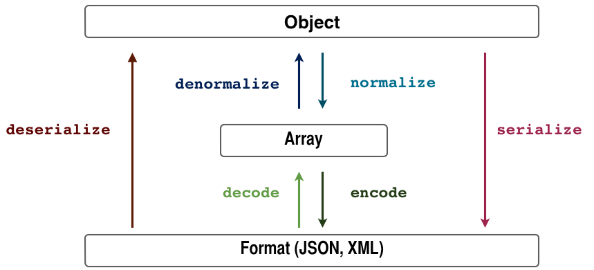

# The Serialization Process

## Overall Process

API Platform embraces and extends the Symfony Serializer Component to transform PHP entities in (hypermedia) API responses.

<p align="center" class="symfonycasts"><a href="https://symfonycasts.com/screencast/api-platform/serializer?cid=apip"><br>Watch the Serializer screencast</a></p>

The main serialization process has two stages:



> As you can see in the picture above, an array is used as a man-in-the-middle. This way, Encoders will only deal with turning specific formats into arrays and vice versa. The same way, Normalizers will deal with turning specific objects into arrays and vice versa.
-- [The Symfony documentation](https://symfony.com/doc/current/components/serializer.html)

Unlike Symfony itself, API Platform leverages custom normalizers, its router and the [data provider](data-providers.md) system to perform an advanced transformation. Metadata are added to the generated document including links, type information, pagination data or available filters.

The API Platform Serializer is extendable. You can register custom normalizers and encoders in order to support other formats. You can also decorate existing normalizers to customize their behaviors.

## Available Serializers

* [JSON-LD](https://json-ld.org) serializer
`api_platform.jsonld.normalizer.item`

JSON-LD, or JavaScript Object Notation for Linked Data, is a method of encoding Linked Data using JSON. It is a World Wide Web Consortium Recommendation.

* [HAL](https://en.wikipedia.org/wiki/Hypertext_Application_Language) serializer
`api_platform.hal.normalizer.item`

* JSON, XML, CSV, YAML serializer (using the Symfony serializer)
`api_platform.serializer.normalizer.item`

## The Serialization Context, Groups and Relations

<p align="center" class="symfonycasts"><a href="https://symfonycasts.com/screencast/api-platform/serialization-groups?cid=apip"><br>Watch the Serialization Groups screencast</a></p>

API Platform allows you to specify the `$context` variable used by the Symfony Serializer. This variable is an associative array that has a handy `groups` key allowing you to choose which attributes of the resource are exposed during the normalization (read) and denormalization (write) processes.
It relies on the [serialization (and deserialization) groups](https://symfony.com/doc/current/components/serializer.html#attributes-groups)
feature of the Symfony Serializer component.

In addition to groups, you can use any option supported by the Symfony Serializer. For example, you can use [`enable_max_depth`](https://symfony.com/doc/current/components/serializer.html#handling-serialization-depth)
to limit the serialization depth.

### Configuration

Just like other Symfony and API Platform components, the Serializer component can be configured using annotations, XML
or YAML. Since annotations are easy to understand, we will use them in the following examples.

Note: if you aren't using the API Platform distribution, you will need to enable annotation support in the serializer configuration:

```yaml
# config/packages/framework.yaml
framework:
    serializer: { enable_annotations: true }
```

If you use [Symfony Flex](https://github.com/symfony/flex), just execute `composer req doctrine/annotations` and you are
all set!

If you want to use YAML or XML, please add the mapping path in the serializer configuration:

```yaml
# config/packages/framework.yaml
framework:
    serializer:
        mapping:
            paths: ['%kernel.project_dir%/config/serialization']
```

## Using Serialization Groups

It is simple to specify what groups to use in the API system:

1. Add the normalization context and denormalization context attributes to the resource, and specify which groups to use. Here you see that we add `read` and `write`, respectively. You can use any group names you wish.
2. Apply the groups to properties in the object.

<code-selector>

```php
<?php
// api/src/Entity/Book.php

namespace App\Entity;

use ApiPlatform\Core\Annotation\ApiResource;
use Symfony\Component\Serializer\Annotation\Groups;

#[ApiResource(
    normalizationContext: ['groups' => ['read']],
    denormalizationContext: ['groups' => ['write']],
)]
class Book
{
    #[Groups(["read", "write"])]
    public $name;

    #[Groups("write")]
    public $author;

    // ...
}
```

```yaml
# config/api_platform/resources.yaml
resources:
    App\Entity\Book:
        attributes:
            normalization_context:
                groups: ['read']
            denormalization_context:
                groups: ['write']

# config/serialization/Book.yaml
App\Entity\Book:
    attributes:
        name:
            groups: ['read', 'write']
        author:
            groups: ['write']
```

</code-selector>

Alternatively, you can use the more verbose syntax:

```php
<?php
// ...

#[ApiResource(attributes: [
    'normalization_context' => ['groups' => ['read']],
    'denormalization_context' => ['groups' => ['write']],
])]
```

In the previous example, the `name` property will be visible when reading (`GET`) the object, and it will also be available
to write (`PUT` / `PATCH` / `POST`). The `author` property will be write-only; it will not be visible when serialized responses are
returned by the API.

Internally, API Platform passes the value of the `normalization_context` as the 3rd argument of [the `Serializer::serialize()` method](https://api.symfony.com/master/Symfony/Component/Serializer/SerializerInterface.html#method_serialize) during the normalization
process. `denormalization_context` is passed as the 4th argument of [the `Serializer::deserialize()` method](https://api.symfony.com/master/Symfony/Component/Serializer/SerializerInterface.html#method_deserialize) during denormalization (writing).

To configure the serialization groups of classes's properties, you must use directly [the Symfony Serializer's configuration files or annotations](https://symfony.com/doc/current/components/serializer.html#attributes-groups).

In addition to the `groups` key, you can configure any Symfony Serializer option through the `$context` parameter
(e.g. the `enable_max_depth`key when using [the `@MaxDepth` annotation](https://symfony.com/doc/current/components/serializer.html#handling-serialization-depth)).

Any serialization and deserialization group that you specify will also be leveraged by the built-in actions and the Hydra
documentation generator.

## Using Serialization Groups per Operation

It is possible to specify normalization and denormalization contexts (as well as any other attribute) on a per-operation
basis. API Platform will always use the most specific definition. For instance, if normalization groups are set both
at the resource level and at the operation level, the configuration set at the operation level will be used and the resource
level ignored.

In the following example we use different serialization groups for the `GET` and `PUT` operations:

<code-selector>

```php
<?php
// api/src/Entity/Book.php

namespace App\Entity;

use ApiPlatform\Core\Annotation\ApiResource;
use Symfony\Component\Serializer\Annotation\Groups;

#[ApiResource(
    normalizationContext: ['groups' => ['get']],
    itemOperations: [
        'get',
        'put' => [
            'normalization_context' => ['groups' => ['put']],
        ],
    ],
)]
class Book
{
    #[Groups(["get", "put"])]
    public $name;

    #[Groups("get")]
    public $author;

    // ...
}
```

```yaml
# config/api_platform/resources/Book.yaml
App\Entity\Book:
    attributes:
        normalization_context:
            groups: ['get']
    itemOperations:
        get: ~
        put:
            normalization_context:
                groups: ['put']

# config/serializer/Book.yaml
App\Entity\Book:
    attributes:
        name:
            groups: ['get', 'put']
        author:
            groups: ['get']
```

</code-selector>

The `name` and `author` properties will be included in the document generated during a `GET` operation because the configuration
defined at the resource level is inherited. However the document generated when a `PUT` request will be received will only
include the `name` property because of the specific configuration for this operation.

Refer to the [operations](operations.md) documentation to learn more.

## Embedding Relations

<p align="center" class="symfonycasts"><a href="https://symfonycasts.com/screencast/api-platform/relations?cid=apip"><br>Watch the Relations screencast</a></p>

By default, the serializer provided with API Platform represents relations between objects using [dereferenceable IRIs](https://en.wikipedia.org/wiki/Internationalized_Resource_Identifier).
They allow you to retrieve details for related objects by issuing extra HTTP requests. However, for performance reasons, it is sometimes preferable to avoid forcing the client to issue extra HTTP requests.

**Note:** We strongly recommend using [Vulcain](https://vulcain.rocks) instead of this feature. Vulcain allows creating faster (better hit rate) and better designed APIs than relying on compound documents, and is supported out of the box in the API Platform distribution.

### Normalization

In the following JSON document, the relation from a book to an author is by default represented by an URI:

```json
{
  "@context": "/contexts/Book",
  "@id": "/books/62",
  "@type": "Book",
  "name": "My awesome book",
  "author": "/people/59"
}
```

It is possible to embed related objects (in their entirety, or only some of their properties) directly in the parent
response through the use of serialization groups. By using the following serialization groups annotations (`#[Groups]`),
a JSON representation of the author is embedded in the book response. As soon as any of the author's attributes is in
the `book` group, the author will be embedded.

<code-selector>

```php
<?php
// api/src/Entity/Book.php

namespace App\Entity;

use ApiPlatform\Core\Annotation\ApiResource;
use Symfony\Component\Serializer\Annotation\Groups;

#[ApiResource(normalizationContext: ['groups' => ['book']])]
class Book
{
    #[Groups("book")]
    public $name;

    #[Groups("book")]
    public $author;

    // ...
}
```

```yaml
# config/api_platform/resources/Book.yaml
App\Entity\Book:
    attributes:
        normalization_context:
            groups: ['book']

# config/serializer/Book.yaml
App\Entity\Book:
    attributes:
        name:
            groups: ['book']
        author:
            groups: ['book']
```

</code-selector>

<code-selector>

```php
<?php
// api/src/Entity/Person.php

namespace App\Entity;

use ApiPlatform\Core\Annotation\ApiResource;
use Symfony\Component\Serializer\Annotation\Groups;

#[ApiResource]
class Person
{
    #[Groups("book")]
    public $name;

    // ...
}
```

```yaml
# config/serializer/Person.yaml
App\Entity\Person:
    attributes:
        name:
            groups: ['book']
```

</code-selector>

The generated JSON using previous settings is below:

```json
{
  "@context": "/contexts/Book",
  "@id": "/books/62",
  "@type": "Book",
  "name": "My awesome book",
  "author": {
    "@id": "/people/59",
    "@type": "Person",
    "name": "Kévin Dunglas"
  }
}
```

In order to optimize such embedded relations, the default Doctrine data provider will automatically join entities on relations
marked as [`EAGER`](https://www.doctrine-project.org/projects/doctrine-orm/en/current/reference/annotations-reference.html#manytoone).
This avoids the need for extra queries to be executed when serializing the related objects.

Instead of embedding relations in the main HTTP response, you may want [to "push" them to the client using HTTP/2 server push](push-relations.md).

### Denormalization

It is also possible to embed a relation in `PUT`, `PATCH` and `POST` requests. To enable that feature, set the serialization groups
the same way as normalization. For example:

<code-selector>

```php
<?php
// api/src/Entity/Book.php

namespace App\Entity;

use ApiPlatform\Core\Annotation\ApiResource;

#[ApiResource(denormalizationContext: ['groups' => ['book']])]
class Book
{
    // ...
}
```

```yaml
# config/api_platform/resources/Book.yaml
App\Entity\Book:
    attributes:
        denormalization_context:
            groups: ['book']
```

</code-selector>

The following rules apply when denormalizing embedded relations:

* If an `@id` key is present in the embedded resource, then the object corresponding to the given URI will be retrieved through
the data provider. Any changes in the embedded relation will also be applied to that object.
* If no `@id` key exists, a new object will be created containing data provided in the embedded JSON document.

You can specify as many embedded relation levels as you want.

### Force IRI with relations of the same type (parent/childs relations)

It is a common problem to have entities that reference other entities of the same type:

<code-selector>

```php
<?php
// api/src/Entity/Person.php

namespace App\Entity;

use ApiPlatform\Core\Annotation\ApiResource;
use Symfony\Component\Serializer\Annotation\Groups;

#[ApiResource(
    normalizationContext: [
        'groups' => ['person'],
    ],
    denormalizationContext: [
        'groups' => ['person'],
    ],
)]
class Person
{
    #[Groups("person")]
    public $name;

   /**
    * @var Person
    */
    #[Groups("person")]
   public $parent;  // Note that a Person instance has a relation with another Person.
 
    // ...
}
```

```yaml
# config/api_platform/resources/Person.yaml
App\Entity\Person:
    attributes:
        normalization_context:
            groups: ['person']
        denormalization_context:
            groups: ['person']

# config/serializer/Person.yaml
App\Entity\Person:
    attributes:
        name:
            groups: ['person']
        parent:
            groups: ['person']
```

</code-selector>

The problem here is that the **$parent** property become automatically an embedded object. Besides, the property won't be shown on the OpenAPI view.

To force the **$parent** property to be used as an IRI, add an **#[ApiProperty(readableLink: false, writableLink: false)]** annotation:

<code-selector>

```php
<?php
// api/src/Entity/Person.php

namespace App\Entity;

use ApiPlatform\Core\Annotation\ApiResource;
use Symfony\Component\Serializer\Annotation\Groups;

#[ApiResource(
    normalizationContext: [
        'groups' => ['person'],
    ],
    denormalizationContext: [
        'groups' => ['person'],
    ],
)]
class Person
{
    #[Groups("person")]
    public string $name;

   #[Groups("person")]
   #[ApiProperty(readableLink: false, writableLink: false)]
   public Person $parent;  // This property is now serialized/deserialized as an IRI.
 
    // ...
}

```

```yaml
# config/api_platform/resources/Person.yaml
App\Entity\Person:
    attributes:
        normalization_context:
            groups: ['person']
        denormalization_context:
            groups: ['person']
    properties:
        parent:
            readableLink: false
            writableLink: false

# config/serializer/Person.yaml
App\Entity\Person:
    attributes:
        name:
            groups: ['person']
        parent:
            groups: ['person']
```

</code-selector>

## Property Normalization Context

If you want to change the (de)normalization context of a property, for instance if you want to change the format of the date time,
you can do so by using the `#[Context]` attribute from the Symfony Serializer component.

For instance:

```php
<?php
// api/src/Entity/Book.php

declare(strict_types=1);

namespace App\Entity;

use ApiPlatform\Core\Annotation\ApiResource;
use Doctrine\ORM\Mapping as ORM;
use Symfony\Component\Serializer\Annotation\Context;
use Symfony\Component\Serializer\Normalizer\DateTimeNormalizer;

#[ORM\Entity]
#[ApiResource]
class Book
{
    #[ORM\Column] 
    #[Context([DateTimeNormalizer::FORMAT_KEY => 'Y-m-d'])]
    public ?\DateTimeInterface $publicationDate = null;
}
```

In the above example, you will receive the book's data like this:

```json
{
  "@context": "/contexts/Book",
  "@id": "/books/3",
  "@type": "https://schema.org/Book",
  "publicationDate": "1989-06-16"
}
```

It's also possible to only change the denormalization or normalization context:

```php
<?php
// api/src/Entity/Book.php

declare(strict_types=1);

namespace App\Entity;

use ApiPlatform\Core\Annotation\ApiResource;
use Doctrine\ORM\Mapping as ORM;
use Symfony\Component\Serializer\Annotation\Context;
use Symfony\Component\Serializer\Normalizer\DateTimeNormalizer;

#[ORM\Entity]
#[ApiResource]
class Book
{
    #[ORM\Column]
    #[Context(normalizationContext: [DateTimeNormalizer::FORMAT_KEY => 'Y-m-d'])]
    public ?\DateTimeInterface $publicationDate = null;
}
```

Groups are also supported:

```php
<?php
// api/src/Entity/Book.php

declare(strict_types=1);

namespace App\Entity;

use ApiPlatform\Core\Annotation\ApiResource;
use Doctrine\ORM\Mapping as ORM;
use Symfony\Component\Serializer\Annotation\Context;
use Symfony\Component\Serializer\Annotation\Groups;
use Symfony\Component\Serializer\Normalizer\DateTimeNormalizer;

#[ORM\Entity]
#[ApiResource]
class Book
{
    #[ORM\Column]
    #[Groups(["extended"])]
    #[Context([DateTimeNormalizer::FORMAT_KEY => \DateTime::RFC3339])]
    #[Context(
        context: [DateTimeNormalizer::FORMAT_KEY => \DateTime::RFC3339_EXTENDED],
        groups: ['extended'],
    )]
    public ?\DateTimeInterface $publicationDate = null;
}
```

## Calculated Field

Sometimes you need to expose calculated fields. This can be done by leveraging the groups. This time not on a property, but on a method.

<code-selector>

```php
<?php

declare(strict_types=1);

namespace App\Entity;

use ApiPlatform\Core\Annotation\ApiResource;
use Doctrine\ORM\Mapping as ORM;
use Symfony\Component\Serializer\Annotation\Groups;

#[ORM\Entity]
#[ApiResource(
    collectionOperations: [
        'get' => ['normalization_context' => ['groups' => 'greeting:collection:get']],
    ],
)]
class Greeting
{
    #[ORM\Id, ORM\Column, ORM\GeneratedValue]
    #[Groups("greeting:collection:get")]
    private ?int $id = null;
    
    private $a = 1;
    
    private $b = 2;

    #[ORM\Column]
    #[Groups("greeting:collection:get")]
    public string $name = '';

    public function getId(): int
    {
        return $this->id;
    }

    #[Groups("greeting:collection:get")] // <- MAGIC IS HERE, you can set a group on a method.
    public function getSum(): int
    {
        return $this->a + $this->b;
    }
}
```

```yaml
# config/api_platform/resources/Greeting.yaml
App\Entity\Greeting:
    collectionOperations:
        get:
            normalization_context:
                groups: 'greeting:collection:get'

# config/serializer/Greeting.yaml
App\Entity\Greeting:
    attributes:
        id:
            groups: 'greeting:collection:get'
        name:
            groups: 'greeting:collection:get'
        sum:
            groups: 'greeting:collection:get'
```

</code-selector>

## Changing the Serialization Context Dynamically

<p align="center" class="symfonycasts"><a href="https://symfonycasts.com/screencast/api-platform-security/service-decoration?cid=apip"><br>Watch the Context Builder & Service Decoration screencast</a></p>

Let's imagine a resource where most fields can be managed by any user, but some can be managed only by admin users:

<code-selector>

```php
<?php
// api/src/Entity/Book.php

namespace App\Entity;

use ApiPlatform\Core\Annotation\ApiResource;
use Symfony\Component\Serializer\Annotation\Groups;

#[ApiResource(
    normalizationContext: ['groups' => ['book:output']],
    denormalizationContext: ['groups' => ['book:input']],
)]
class Book
{
    // ...

    /**
     * This field can be managed only by an admin
     */
    #[Groups(["book:output", "admin:input"])]
    public bool $active = false;

    /**
     * This field can be managed by any user
     */
    #[Groups(["book:output", "book:input"])]
    public string $name;

    // ...
}
```

```yaml
# config/api_platform/resources/Book.yaml
App\Entity\Book: 
    attributes:
        normalization_context:
            groups: ['book:output']
        denormalization_context:
            groups: ['book:input']

# config/serializer/Book.yaml
App\Entity\Book:
    attributes:
        active:
            groups: ['book:output', 'admin:input']
        name:
            groups: ['book:output', 'book:input']
```

</code-selector>

All entry points are the same for all users, so we should find a way to detect if the authenticated user is an admin, and if so
dynamically add the `admin:input` value to deserialization groups in the `$context` array.

API Platform implements a `ContextBuilder`, which prepares the context for serialization & deserialization. Let's
[decorate this service](http://symfony.com/doc/current/service_container/service_decoration.html) to override the
`createFromRequest` method:

```yaml
# config/services.yaml
services:
    # ...
    'App\Serializer\BookContextBuilder':
        decorates: 'api_platform.serializer.context_builder'
        arguments: [ '@App\Serializer\BookContextBuilder.inner' ]
        autoconfigure: false
```

```php
<?php
// api/src/Serializer/BookContextBuilder.php

namespace App\Serializer;

use ApiPlatform\Core\Serializer\SerializerContextBuilderInterface;
use Symfony\Component\HttpFoundation\Request;
use Symfony\Component\Security\Core\Authorization\AuthorizationCheckerInterface;
use App\Entity\Book;

final class BookContextBuilder implements SerializerContextBuilderInterface
{
    private $decorated;
    private $authorizationChecker;

    public function __construct(SerializerContextBuilderInterface $decorated, AuthorizationCheckerInterface $authorizationChecker)
    {
        $this->decorated = $decorated;
        $this->authorizationChecker = $authorizationChecker;
    }

    public function createFromRequest(Request $request, bool $normalization, ?array $extractedAttributes = null): array
    {
        $context = $this->decorated->createFromRequest($request, $normalization, $extractedAttributes);
        $resourceClass = $context['resource_class'] ?? null;

        if ($resourceClass === Book::class && isset($context['groups']) && $this->authorizationChecker->isGranted('ROLE_ADMIN') && false === $normalization) {
            $context['groups'][] = 'admin:input';
        }

        return $context;
    }
}
```

If the user has the `ROLE_ADMIN` permission and the subject is an instance of Book, `admin:input` group will be dynamically added to the
denormalization context. The `$normalization` variable lets you check whether the context is for normalization (if `TRUE`) or denormalization
(`FALSE`).

## Changing the Serialization Context on a Per-item Basis

The example above demonstrates how you can modify the normalization/denormalization context based on the current user
permissions for all books. Sometimes, however, the permissions vary depending on what book is being processed.

Think of ACL's: User "A" may retrieve Book "A" but not Book "B". In this case, we need to leverage the power of the
Symfony Serializer and register our own normalizer that adds the group on every single item (note: priority `64` is
an example; it is always important to make sure your normalizer gets loaded first, so set the priority to whatever value
is appropriate for your application; higher values are loaded earlier):

```yaml
# config/services.yaml
services:
    'App\Serializer\BookAttributeNormalizer':
        arguments: [ '@security.token_storage' ]
        tags:
            - { name: 'serializer.normalizer', priority: 64 }
```

The Normalizer class is a bit harder to understand, because it must ensure that it is only called once and that there is no recursion.
To accomplish this, it needs to be aware of the parent Normalizer instance itself.

Here is an example:

```php
<?php
// api/src/Serializer/BookAttributeNormalizer.php

namespace App\Serializer;

use Symfony\Component\Security\Core\Authentication\Token\Storage\TokenStorageInterface;
use Symfony\Component\Serializer\Normalizer\ContextAwareNormalizerInterface;
use Symfony\Component\Serializer\Normalizer\NormalizerAwareInterface;
use Symfony\Component\Serializer\Normalizer\NormalizerAwareTrait;

class BookAttributeNormalizer implements ContextAwareNormalizerInterface, NormalizerAwareInterface
{
    use NormalizerAwareTrait;

    private const ALREADY_CALLED = 'BOOK_ATTRIBUTE_NORMALIZER_ALREADY_CALLED';

    private $tokenStorage;

    public function __construct(TokenStorageInterface $tokenStorage)
    {
        $this->tokenStorage = $tokenStorage;
    }

    public function normalize($object, $format = null, array $context = [])
    {
        if ($this->userHasPermissionsForBook($object)) {
            $context['groups'][] = 'can_retrieve_book';
        }

        $context[self::ALREADY_CALLED] = true;

        return $this->normalizer->normalize($object, $format, $context);
    }

    public function supportsNormalization($data, $format = null, array $context = [])
    {
        // Make sure we're not called twice
        if (isset($context[self::ALREADY_CALLED])) {
            return false;
        }

        return $data instanceof Book;
    }

    private function userHasPermissionsForBook($object): bool
    {
        // Get permissions from user in $this->tokenStorage
        // for the current $object (book) and
        // return true or false
    }
}
```

This will add the serialization group `can_retrieve_book` only if the currently logged-in user has access to the given book
instance.

Note: In this example, we use the `TokenStorageInterface` to verify access to the book instance. However, Symfony
provides many useful other services that might be better suited to your use case. For example, the [`AuthorizationChecker`](https://symfony.com/doc/current/components/security/authorization.html#authorization-checker).

## Name Conversion

The Serializer Component provides a handy way to map PHP field names to serialized names. See the related [Symfony documentation](http://symfony.com/doc/master/components/serializer.html#converting-property-names-when-serializing-and-deserializing).

To use this feature, declare a new name converter service. For example, you can convert `CamelCase` to
`snake_case` with the following configuration:

```yaml
# config/services.yaml
services:
    'Symfony\Component\Serializer\NameConverter\CamelCaseToSnakeCaseNameConverter': ~
```

```yaml
# config/packages/api_platform.yaml
api_platform:
    name_converter: 'Symfony\Component\Serializer\NameConverter\CamelCaseToSnakeCaseNameConverter'
```

If symfony's `MetadataAwareNameConverter` is available it'll be used by default. If you specify one in ApiPlatform configuration, it'll be used. Note that you can use decoration to benefit from this name converter in your own implementation.

## Decorating a Serializer and Adding Extra Data

In the following example, we will see how we add extra information to the serialized output. Here is how we add the
date on each request in `GET`:

```yaml
# config/services.yaml
services:
    'App\Serializer\ApiNormalizer':
        # By default .inner is passed as argument
        decorates: 'api_platform.jsonld.normalizer.item'
```

Note: this normalizer will work only for JSON-LD format, if you want to process JSON data too, you have to decorate another service:

```yaml
    # Need a different name to avoid duplicate YAML key
    'app.serializer.normalizer.item.json':
        class: 'App\Serializer\ApiNormalizer'
        decorates: 'api_platform.serializer.normalizer.item'
```

```php
<?php
// api/src/Serializer/ApiNormalizer.php

namespace App\Serializer;

use Symfony\Component\Serializer\Normalizer\DenormalizerInterface;
use Symfony\Component\Serializer\Normalizer\NormalizerInterface;
use Symfony\Component\Serializer\SerializerAwareInterface;
use Symfony\Component\Serializer\SerializerInterface;

final class ApiNormalizer implements NormalizerInterface, DenormalizerInterface, SerializerAwareInterface
{
    private $decorated;

    public function __construct(NormalizerInterface $decorated)
    {
        if (!$decorated instanceof DenormalizerInterface) {
            throw new \InvalidArgumentException(sprintf('The decorated normalizer must implement the %s.', DenormalizerInterface::class));
        }

        $this->decorated = $decorated;
    }

    public function supportsNormalization($data, $format = null)
    {
        return $this->decorated->supportsNormalization($data, $format);
    }

    public function normalize($object, $format = null, array $context = [])
    {
        $data = $this->decorated->normalize($object, $format, $context);
        if (is_array($data)) {
            $data['date'] = date(\DateTime::RFC3339);
        }

        return $data;
    }

    public function supportsDenormalization($data, $type, $format = null)
    {
        return $this->decorated->supportsDenormalization($data, $type, $format);
    }

    public function denormalize($data, string $type, string $format = null, array $context = [])
    {
        return $this->decorated->denormalize($data, $type, $format, $context);
    }

    public function setSerializer(SerializerInterface $serializer)
    {
        if($this->decorated instanceof SerializerAwareInterface) {
            $this->decorated->setSerializer($serializer);
        }
    }
}
```

## Entity Identifier Case

API Platform is able to guess the entity identifier using Doctrine metadata ([ORM](https://www.doctrine-project.org/projects/doctrine-orm/en/current/reference/basic-mapping.html#identifiers-primary-keys), [MongoDB ODM](https://www.doctrine-project.org/projects/doctrine-mongodb-odm/en/latest/reference/basic-mapping.html#identifiers)).
For ORM, it also supports [composite identifiers](https://www.doctrine-project.org/projects/doctrine-orm/en/current/tutorials/composite-primary-keys.html).

If you are not using the Doctrine ORM or MongoDB ODM Provider, you must explicitly mark the identifier using the `identifier` attribute of
the `ApiPlatform\Core\Annotation\ApiProperty` annotation. For example:

```php
#[ApiResource]
class Book
{
    // ...

    #[ApiProperty(identifier: true)]
    private $id;

    /**
     * This field can be managed only by an admin
     */
    public bool $active = false;

    /**
     * This field can be managed by any user
     */
    public string $name;

    // ...
}
```

You can also use the YAML configuration format:

```yaml
# config/api_platform/resources.yaml
App\Entity\Book:
    properties:
        id:
            identifier: true
```

In some cases, you will want to set the identifier of a resource from the client (e.g. a client-side generated UUID, or a slug).
In such cases, you must make the identifier property a writable class property. Specifically, to use client-generated IDs, you
must do the following:

1. create a setter for the identifier of the entity (e.g. `public function setId(string $id)`) or make it a `public` property ,
2. add the denormalization group to the property (only if you use a specific denormalization group), and,
3. if you use Doctrine ORM, be sure to **not** mark this property with [the `@GeneratedValue` annotation](http://docs.doctrine-project.org/projects/doctrine-orm/en/latest/reference/basic-mapping.html#identifier-generation-strategies)
  or use the `NONE` value

## Embedding the JSON-LD Context

By default, the generated [JSON-LD context](https://www.w3.org/TR/json-ld/#the-context) (`@context`) is only referenced by
an IRI. A client that uses JSON-LD must send a second HTTP request to retrieve it:

```json
{
  "@context": "/contexts/Book",
  "@id": "/books/62",
  "@type": "Book",
  "name": "My awesome book",
  "author": "/people/59"
}
```

You can configure API Platform to embed the JSON-LD context in the root document by adding the `jsonld_embed_context`
attribute to the `#[ApiResource]` annotation:

<code-selector>

```php
<?php
// api/src/Entity/Book.php

namespace App\Entity;

use ApiPlatform\Core\Annotation\ApiResource;

#[ApiResource(normalizationContext: ['jsonld_embed_context' => true])]
class Book
{
    // ...
}
```

```yaml
# config/api_platform/resources/Book.yaml
App\Entity\Book:
    attributes:
        normalization_context:
            jsonld_embed_context: true
```

</code-selector>

The JSON output will now include the embedded context:

```json
{
  "@context": {
    "@vocab": "http://localhost:8000/apidoc#",
    "hydra": "http://www.w3.org/ns/hydra/core#",
    "name": "https://schema.org/name",
    "author": "https://schema.org/author"
  },
  "@id": "/books/62",
  "@type": "Book",
  "name": "My awesome book",
  "author": "/people/59"
}
```

## Collection Relation

This is a special case where, in an entity, you have a `toMany` relation. By default, Doctrine will use an `ArrayCollection` to store your values. This is fine when you have a *read* operation, but when you try to *write* you can observe an issue where the response is not reflecting the changes correctly. It can lead to client errors even though the update was correct.
Indeed, after an update on this relation, the collection looks wrong because `ArrayCollection`'s indexes are not sequential. To change this, we recommend to use a getter that returns `$collectionRelation->getValues()`. Thanks to this, the relation is now a real array which is sequentially indexed.

```php
<?php

namespace App\Entity;

use ApiPlatform\Core\Annotation\ApiResource;
use Doctrine\Common\Collections\ArrayCollection;
use Doctrine\ORM\Mapping as ORM;

#[ORM\Entity]
#[ApiResource]
final class Brand
{
    #[ORM\Id, ORM\Column, ORM\GeneratedValue]
    private ?int $id = null;

    #[ORM\ManyToMany(targetEntity: Car::class, inversedBy: 'brands')]
    #[ORM\JoinTable(name: 'CarToBrand')]
    #[ORM\JoinColumn(name: 'brand_id', referencedColumnName: 'id', nullable: false)]
    #[ORM\InverseJoinColumn(name: 'car_id', referencedColumnName: 'id', nullable: false)]
    private $cars;

    public function __construct()
    {
        $this->cars = new ArrayCollection();
    }

    public function addCar(DummyCar $car)
    {
        $this->cars[] = $car;
    }

    public function removeCar(DummyCar $car)
    {
        $this->cars->removeElement($car);
    }

    public function getCars()
    {
        return $this->cars->getValues();
    }

    public function getId()
    {
        return $this->id;
    }
}
```

For reference please check [#1534](https://github.com/api-platform/core/pull/1534).
