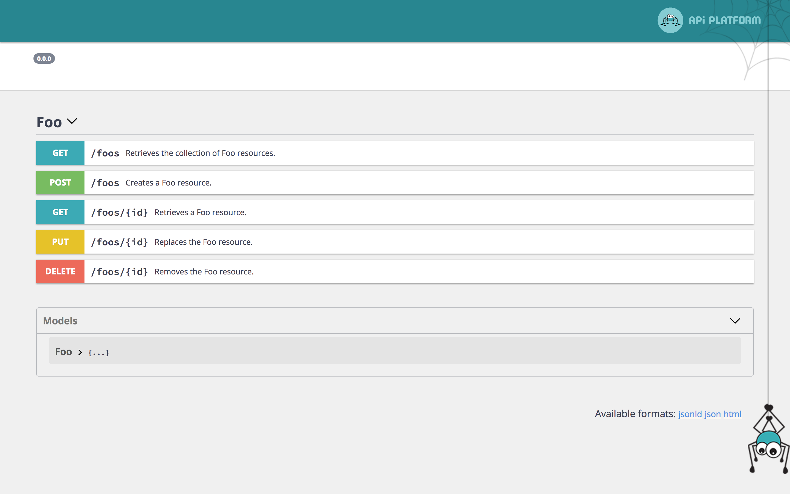

# OpenAPI Specification Support (formerly Swagger)

API Platform natively support the [Open API](https://www.openapis.org/) API specification format.



The specification of the API is available at the `/docs.json` path.
By default, OpenAPI v2 is used.
You can also get an OpenAPI v3 compliant version thanks to the `spec_version` query parameter: `/docs.json?spec_version=3`

It also integrates a customized version of [Swagger UI](https://swagger.io/swagger-ui/) and [ReDoc](https://rebilly.github.io/ReDoc/), some nice tools to display the
API documentation in a user friendly way.

## Using the OpenAPI Command

You can also dump an OpenAPI specification for your API by using the provided command:

```
$ docker-compose exec php bin/console api:openapi:export
# OpenAPI v2, JSON format

$ docker-compose exec php bin/console api:openapi:export --yaml
# OpenAPI v2, YAML format

$ docker-compose exec php bin/console api:openapi:export --spec-version=3
# OpenAPI v3, JSON format

$ docker-compose exec php bin/console api:openapi:export --spec-version=3 --yaml
# OpenAPI v3, YAML format

$ docker-compose exec php bin/console api:openapi:export --output=swagger_docs.json
# Create a file containing the specification
```

## Overriding the OpenAPI Specification

Symfony allows to [decorate services](https://symfony.com/doc/current/service_container/service_decoration.html), here we
need to decorate `api_platform.swagger.normalizer.documentation`.

In the following example, we will see how to override the title of the Swagger documentation and add a custom filter for
the `GET` operation of `/foos` path

```yaml
# api/config/services.yaml
services:
    'App\Swagger\SwaggerDecorator':
        decorates: 'api_platform.swagger.normalizer.documentation'
        arguments: [ '@App\Swagger\SwaggerDecorator.inner' ]
        autoconfigure: false
```

```php
<?php
// api/src/Swagger/SwaggerDecorator.php

namespace App\Swagger;

use Symfony\Component\Serializer\Normalizer\NormalizerInterface;

final class SwaggerDecorator implements NormalizerInterface
{
    private $decorated;

    public function __construct(NormalizerInterface $decorated)
    {
        $this->decorated = $decorated;
    }

    public function normalize($object, $format = null, array $context = [])
    {
        $docs = $this->decorated->normalize($object, $format, $context);

        $customDefinition = [
            'name' => 'fields',
            'description' => 'Fields to remove of the output',
            'default' => 'id',
            'in' => 'query',
        ];


	// e.g. add a custom parameter
	$docs['paths']['/foos']['get']['parameters'][] = $customDefinition;

        // e.g. remove an existing parameter
        $docs['paths']['/foos']['get']['parameters'] = array_values(array_filter($docs['paths']['/foos']['get']['parameters'], function ($param){
            return $param['name'] !== 'bar';
        }));

	// Override title
	$docs['info']['title'] = 'My Api Foo';

        return $docs;
    }

    public function supportsNormalization($data, $format = null)
    {
        return $this->decorated->supportsNormalization($data, $format);
    }
}
```

## Using the OpenAPI and Swagger Contexts

Sometimes you may want to change the information included in your OpenAPI documentation.
The following configuration will give you total control over your OpenAPI definitions:

```php
<?php
// api/src/Entity/Product.php

namespace App\Entity;

use ApiPlatform\Core\Annotation\ApiResource;
use ApiPlatform\Core\Annotation\ApiProperty;
use Doctrine\ORM\Mapping as ORM;
use Symfony\Component\Validator\Constraints as Assert;

/**
 * @ApiResource
 * @ORM\Entity
 */
class Product // The class name will be used to name exposed resources
{
    /**
     * @ORM\Column(type="integer")
     * @ORM\Id
     * @ORM\GeneratedValue(strategy="AUTO")
     */
    private $id;

    /**
     * @param string $name A name property - this description will be available in the API documentation too.
     *
     * @ORM\Column
     * @Assert\NotBlank
     *
     * @ApiProperty(
     *     attributes={
     *         "openapi_context"={
     *             "type"="string",
     *             "enum"={"one", "two"},
     *             "example"="one"
     *         }
     *     }
     * )
     */
    public $name;

    /**
     * @ORM\Column
     * @Assert\DateTime
     *
     * @ApiProperty(
     *     attributes={
     *         "swagger_context"={"type"="string", "format"="date-time"}
     *     }
     * )
     */
    public $timestamp;
    
    // ...
}
```

Or in YAML:

```yaml
# api/config/api_platform/resources.yaml
resources:
    App\Entity\Product:
      properties:
        name:
          attributes:
            swagger_context:
              type: string
              enum: ['one', 'two']
              example: one
        timestamp:
          attributes:
            swagger_context:
              type: string
              format: date-time
```

Will produce the following Swagger documentation:
```json
{
  "swagger": "2.0",
  "basePath": "/",

  "definitions": {
    "Product": {
      "type": "object",
      "description": "This is a product.",
      "properties": {
        "id": {
          "type": "integer",
          "readOnly": true
        },
        "name": {
          "type": "string",
          "description": "This is a name.",
          "enum": ["one", "two"],
          "example": "one"
        },
        "timestamp": {
          "type": "string",
          "format": "date-time"
        }
      }
    }
  }
}
```

To pass a context to the OpenAPI **v3** generator, use the `openapi_context` attribute (notice the prefix: `openapi_` instead of `swagger_`).

## Changing the Name of a Definition

API Platform generates a definition name based on the serializer `groups` defined
in the (`de`)`normalization_context`. It's possible to override the name
thanks to the `swagger_definition_name` option:

```php
/**
 * @ApiResource(
 *      collectionOperations={
 *          "post"={
 *              "denormalization_context"={
 *                  "groups"={"user:read"},
 *                  "swagger_definition_name": "Read",
 *              },
 *          },
 *      },
 * )
 */
class User
{
}
```

It's also possible to re-use the (`de`)`normalization_context`:

```php
/**
 * @ApiResource(
 *      collectionOperations={
 *          "post"={
 *              "denormalization_context"=User::API_WRITE,
 *          },
 *      },
 * )
 */
class User
{
    const API_WRITE = [
        'groups' => ['user:read'],
        'swagger_definition_name' => 'Read',
    ];
}
```

## Changing Operations in the OpenAPI Documentation

You also have full control over both built-in and custom operations documentation:

In Yaml:

```yaml
resources:
  App\Entity\Rabbit:
    collectionOperations:
      create_user:
        method: get
        path: '/rabbit/rand'
        controller: App\Controller\RandomRabbit
        swagger_context:
          summary: Random rabbit picture
          description: >
            # Pop a great rabbit picture by color!

            

          parameters:
            -
               in: body
               schema:
                   type: object
                   properties:
                       name: {type: string}
                       description: {type: string}
               example:
                   name: Rabbit
                   description: Pink rabbit
```

or with XML:

```xml
<?xml version="1.0" encoding="UTF-8" ?>
<resources xmlns="https://api-platform.com/schema/metadata"
           xmlns:xsi="http://www.w3.org/2001/XMLSchema-instance"
           xsi:schemaLocation="https://api-platform.com/schema/metadata
           https://api-platform.com/schema/metadata/metadata-2.0.xsd">
    <resource class="App\Entity\Rabbit">
        <collectionOperations>
            <collectionOperation name="create_user">
                <attribute name="method">get</attribute>
                <attribute name="path">/rabbit/rand</attribute>
                <attribute name="controller">App\Controller\RandomRabbit</attribute>
                <attribute name="swagger_context">
                    <attribute name="summary">Random rabbit picture</attribute>
                    <attribute name="description">
                        # Pop a great rabbit picture by color!

                        
                    </attribute>
                    <attribute name="parameters">
                        <attribute>
                            <attribute name="in">body</attribute>
                            <attribute name="schema">
                                <attribute name="type">object</attribute>
                                <attribute name="properties">
                                    <attribute name="name">
                                        <attribute name="type">string</attribute>
                                    </attribute>
                                    <attribute name="description">
                                        <attribute name="type">string</attribute>
                                    </attribute>
                                </attribute>
                            </attribute>
                            <attribute name="example">
                                <attribute name="name">Rabbit</attribute>
                                <attribute name="description">Pink rabbit</attribute>
                            </attribute>
                        </attribute>
                    </attribute>
                </attribute>
            </collectionOperation>
        </collectionOperations>
    </resource>
</resources>
```


Again, you can use the `openapi_context` key instead of the `swagger_context` one to tweak the OpenAPI **v3** specification.

## Changing the Location of Swagger UI

Sometimes you may want to have the API at one location, and the Swagger UI at a different location. This can be done by disabling the Swagger UI from the API Platform configuration file and manually adding the Swagger UI controller.

### Disabling Swagger UI or of ReDoc

```yaml
# api/config/packages/api_platform.yaml
api_platform:
    # ...
    enable_swagger_ui: false
    enable_re_doc: false
```

### Manually Registering the Swagger UI Controller

```yaml
# app/config/routes.yaml
swagger_ui:
    path: /docs
    controller: api_platform.swagger.action.ui
```

Change `/docs` to your desired URI you wish Swagger to be accessible on.

## Overriding the UI Template

As described [in the Symfony documentation](https://symfony.com/doc/current/templating/overriding.html), it's possible to override the Twig template that loads Swagger UI and renders the documentation:

```twig
{# templates/bundles/ApiPlatformBundle/SwaggerUi/index.html.twig #}
<!DOCTYPE html>
<html>
<head>
    <meta charset="UTF-8">
    <title>{{ title }} My custom template</title>
    {# ... #}
</html>
```

You may want to copy the [one shipped with API Platform](https://github.com/api-platform/core/blob/master/src/Bridge/Symfony/Bundle/Resources/views/SwaggerUi/index.html.twig) and customize it.

## Compatibilily Layer with Amazon API Gateway

[AWS API Gateway](https://aws.amazon.com/api-gateway/) supports OpenAPI partially, but it [requires some changes](https://docs.aws.amazon.com/apigateway/latest/developerguide/api-gateway-known-issues.html).
Fortunately, API Platform provides a way to be compatible with Amazon API Gateway.

To enable API Gateway compatibility on your OpenAPI docs, add `api_gateway=true` as query parameter: `http://www.example.com/docs.json?api_gateway=true`
