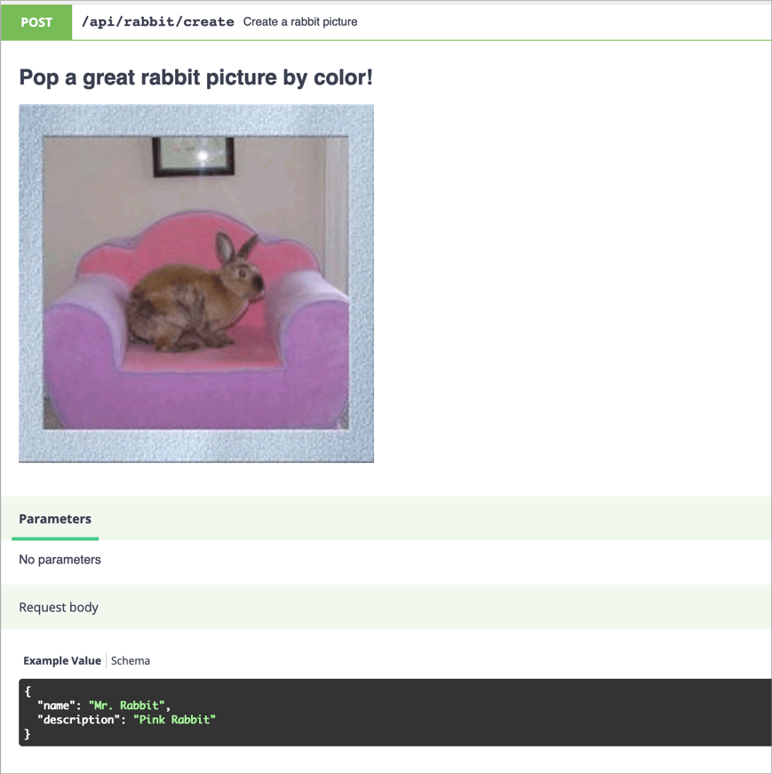

# Swagger / Open API Support

API Platform natively support the [Open API](https://www.openapis.org/) (formerly Swagger) API documentation format.
It also integrates a customized version of [Swagger UI](https://swagger.io/swagger-ui/), a nice tool to display the
API documentation in a user friendly way.


## Overriding the Swagger Documentation

Symfony allows to [decorate services](https://symfony.com/doc/current/service_container/service_decoration.html), here we
need to decorate `api_platform.swagger.normalizer.documentation`.

In the following example, we will see how to override the title of the Swagger documentation and add a custom filter for
the `GET` operation of `/foos` path

```yaml
# api/config/services.yaml
services:
    'App\Swagger\SwaggerDecorator':
        decorates: 'api_platform.swagger.normalizer.documentation'
        arguments: [ '@App\Swagger\SwaggerDecorator.inner' ]
        autoconfigure: false
```

```php
<?php
// api/src/Swagger/SwaggerDecorator.php

namespace App\Swagger;

use Symfony\Component\Serializer\Normalizer\NormalizerInterface;

final class SwaggerDecorator implements NormalizerInterface
{
    private $decorated;

    public function __construct(NormalizerInterface $decorated)
    {
        $this->decorated = $decorated;
    }

    public function normalize($object, $format = null, array $context = [])
    {
        $docs = $this->decorated->normalize($object, $format, $context);

        $customDefinition = [
            'name' => 'fields',
            'definition' => 'Fields to remove of the output',
            'default' => 'id',
            'in' => 'query',
        ];


	// e.g. add a custom parameter
	$docs['paths']['/foos']['get']['parameters'][] = $customDefinition;

	// Override title
	$docs['info']['title'] = 'My Api Foo';

        return $docs;
    }

    public function supportsNormalization($data, $format = null)
    {
        return $this->decorated->supportsNormalization($data, $format);
    }
}
```

## Using the Swagger Context

Sometimes you may want to change the information included in your Swagger documentation.
The following configuration will give you total control over your Swagger definitions:

```php
<?php
// api/src/Entity/Product.php

namespace App\Entity;

use ApiPlatform\Core\Annotation\ApiResource;
use ApiPlatform\Core\Annotation\ApiProperty;
use Doctrine\ORM\Mapping as ORM;
use Symfony\Component\Validator\Constraints as Assert;

/**
 * @ApiResource
 * @ORM\Entity
 */
class Product // The class name will be used to name exposed resources
{
    /**
     * @ORM\Column(type="integer")
     * @ORM\Id
     * @ORM\GeneratedValue(strategy="AUTO")
     */
    public $id;

    /**
     * @param string $name A name property - this description will be avaliable in the API documentation too.
     *
     * @ORM\Column
     * @Assert\NotBlank
     *
     * @ApiProperty(
     *     attributes={
     *         "swagger_context"={
     *             "type"="string",
     *             "enum"={"one", "two"},
     *             "example"="one"
     *         }
     *     }
     * )
     */
    public $name;

    /**
     * @ORM\Column
     * @Assert\DateTime
     *
     * @ApiProperty(
     *     attributes={
     *         "swagger_context"={"type"="string", "format"="date-time"}
     *     }
     * )
     */
    public $timestamp;
}
```

Or in YAML:

```yaml
# api/config/api_platform/resources.yaml
resources:
    App\Entity\Product:
      properties:
        name:
          attributes:
            swagger_context:
              type: string
              enum: ['one', 'two']
              example: one
        timestamp:
          attributes:
            swagger_context:
              type: string
              format: date-time
```

Will produce the following Swagger documentation:
```json
{
  "swagger": "2.0",
  "basePath": "/",

  "definitions": {
    "Product": {
      "type": "object",
      "description": "This is a product.",
      "properties": {
        "id": {
          "type": "integer",
          "readOnly": true
        },
        "name": {
          "type": "string",
          "description": "This is a name.",
          "enum": ["one", "two"],
          "example": "one"
        },
        "timestamp": {
          "type": "string",
          "format": "date-time"
        }
      }
    }
  }
}
```

## Changing the Name of a Definition

API Platform generates a definition name based on the serializer `groups` defined
in the (`de`)`normalization_context`. It's possible to override the name
thanks to the `swagger_definition_name` option:

```php
/**
 * @ApiResource(
 *      collectionOperations={
 *          "post"={
 *              "denormalization_context"={
 *                  "groups"={"user_read"},
 *                  "swagger_definition_name": "Read",
 *              },
 *          },
 *      },
 * )
 */
class User
{
}
```

It's also possible to re-use the (`de`)`normalization_context`:

```php
/**
 * @ApiResource(
 *      collectionOperations={
 *          "post"={
 *              "denormalization_context"=User::API_WRITE,
 *          },
 *      },
 * )
 */
class User
{
    const API_WRITE = [
        'groups' => ['user_read'],
        'swagger_definition_name' => 'Read',
    ];
}
```

## Changing Operations in the Swagger Documentation

You also have full control over both built-in and custom operations documentation:

```yaml
resources:
  App\Entity\Rabbit:
    collectionOperations:
      create_user:
        method: get
        path: '/rabbit/rand'
        controller: App\Controller\RandomRabbit
        swagger_context:
          summary: Random rabbit picture
          description: >
            # Pop a great rabbit picture by color!

            

          requestBody: '{"days": 23}'
          parameters:
            - {name: 'theme', description: 'dark'}
```



## Changing the Swagger UI Location

Sometimes you may want to have the API at one location, and the Swagger UI at a different location. This can be done by disabling the Swagger UI from the API Platform configuration file and manually adding the Swagger UI controller.

### Disabling Swagger UI

```yaml
# api/config/packages/api_platform.yaml
api_platform:
    # ...
    enable_swagger_ui: false
```

### Manually Registering the Swagger UI Controller

```yaml
# app/config/routes.yaml
swagger_ui:
    path: /docs
    controller: api_platform.swagger.action.ui
```

Change `/docs` to your desired URI you wish Swagger to be accessible on.

## Using the Swagger Command

You can also dump your current Swagger documentation using the provided command:

```
$ docker-compose exec php bin/console api:swagger:export
# Swagger documentation in JSON format...
```

## Overriding the UI Template

As described [in the Symfony documentation](https://symfony.com/doc/current/templating/overriding.html), it's possible to override the Twig template that loads Swagger UI and renders the documentation:

```twig
{# templates/bundles/ApiPlatformBundle/SwaggerUi/index.html.twig #}
<!DOCTYPE html>
<html>
<head>
    <meta charset="UTF-8">
    <title>{{ title }} My custom template</title>
    {# ... #}
</html>
```

You may want to copy the [one shipped with API Platform](https://github.com/api-platform/core/blob/master/src/Bridge/Symfony/Bundle/Resources/views/SwaggerUi/index.html.twig) and customize it.

### Enable Swagger doc for API Gateway

[AWS API Gateway](https://aws.amazon.com/api-gateway/) supports Swagger 2.0 partially, but it [requires some changes](https://docs.aws.amazon.com/apigateway/latest/developerguide/api-gateway-known-issues.html).
Fortunately, API Platform provides a way to be compatible with both Swagger 2.0 & API Gateway.

To enable API Gateway compatibility on your Swagger doc, add `api_gateway=true` query parameter:

`http://www.example.com/docs.json?api_gateway=true`
