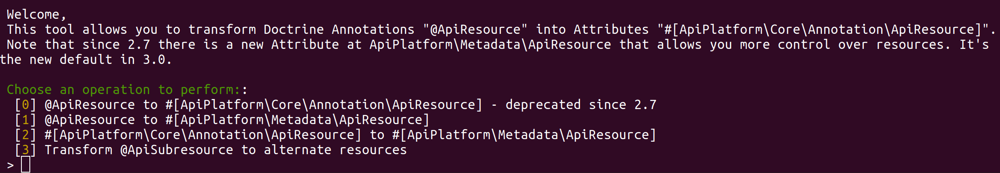

# Upgrade guide

## What changed?

Note that you can find these changes in the [CHANGELOG](https://github.com/api-platform/core/blob/main/CHANGELOG.md).

The definition of resource is no longer done with `ApiPlatform\Core\Annotation\ApiResource` but with `ApiPlatform\Metadata\ApiResource`.

For example:

Before
```php
use ApiPlatform\Core\Annotation\ApiResource;

#[ApiResource(
    iri: 'http://schema.org/Book',
    itemOperations: [
        'get',
        'post_publication' => [
            'method' => 'POST',
            'path' => '/books/{id}/publication',
        ],
    ])
]
class Book
{
```

After
```php
use ApiPlatform\Metadata\ApiResource;
use ApiPlatform\Metadata\Get;
use ApiPlatform\Metadata\Post;
use App\Controller\CreateBookPublication;

#[ApiResource(types: ['http://schema.org/Book'])]
#[Get]
#[Post(
    name: 'publication', 
    uriTemplate: '/books/{id}/publication',
)]
class Book
{
```
You can use Rector to upgrade your class automatically, [see instructions here](#upgrade-your-class-with-rector).

### Removal of item/collection operations

We removed the notion of item and collection and used instead http verbs matching the operation you want to declare. There is also a `collection` flag instructing wether the operation returns an array or an object.
The default ApiResource attribute still declares a CRUD:
```php
#[ApiResource]
```
is the same as
```php
#[ApiResource]
#[Get]
#[Put]
#[Patch]
#[Delete]
#[GetCollection]
#[Post]
```

### Metadata changes

#### #[ApiResource]

|Before|After|
|---|---|
|`iri: 'http://schema.org/Book'`|`types: ['http://schema.org/Book']`|
|`path: '/books/{id}/publication'`|`uriTemplate: '/books/{id}/publication'`|
|`identifiers: []`|`uriVariables: []`|
|`attributes: []`|`extraProperties: []`|
|`attributes: ['validation_groups' => ['a', 'b']]`|`validationContext: ['groups' => ['a', 'b']]`|

#### #[ApiProperty]

|Before|After|
|---|---|
|`iri: 'http://schema.org/Book'`|`types: ['http://schema.org/Book']`|
|`type: 'string'`|`builtinTypes: ['string']`|

Note that builtinTypes are computed automatically from php types. 

For example:

```php
class Book
{
    public string|Isbn $isbn;
}
```

Will compute: `builtinTypes: ['string', Isbn::class]`


### Upgrade your class with Rector

#### Install Rector
```console
composer config minimum-stability dev
composer require --dev -W rector/rector-src
```

#### Run upgrade command
`php bin/console api:rector:upgrade myfile.php`



* `[0]` transform your ApiResource annotation to attribute
* `[1]` transform your ApiResource annotation to ApiPlatform\Metadata\ApiResource and corresponding operation attributes.
* `[2]` transform your ApiResource attribute to ApiPlatform\Metadata\ApiResource and corresponding operation attributes.
* `[3]` transform your ApiSubresource annotation to ApiPlatform\Metadata\ApiResource and corresponding operation attributes.

**If you have declared ApiSubresource, you must transform them before your ApiResource.**


