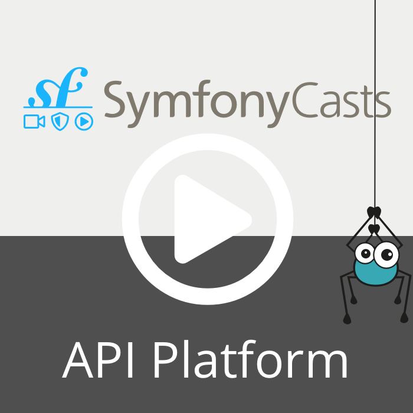

# Validation

API Platform takes care of validating the data sent to the API by the client (usually user data entered through forms).
By default, the framework relies on [the powerful Symfony Validator Component](https://symfony.com/doc/current/validation.html)
for this task, but you can replace it with your preferred validation library such as [the PHP filter extension](https://www.php.net/manual/en/intro.filter.php) if you want to.

<p align="center" class="symfonycasts"><a href="https://symfonycasts.com/screencast/api-platform/validation?cid=apip"><br>Watch the Validation screencast</a></p>

## Validating Submitted Data

Validating submitted data is as simple as adding [Symfony's built-in constraints](https://symfony.com/doc/current/reference/constraints.html)
or [custom constraints](https://symfony.com/doc/current/validation/custom_constraint.html) directly in classes marked with
the `#[ApiResource]` attribute:

```php
<?php
// api/src/Entity/Product.php
namespace App\Entity;

use ApiPlatform\Metadata\ApiResource;
use App\Validator\Constraints\MinimalProperties; // A custom constraint
use Doctrine\ORM\Mapping as ORM;
use Symfony\Component\Validator\Constraints as Assert; // Symfony's built-in constraints

/**
 * A product.
 *
 */
#[ORM\Entity]
#[ApiResource]
class Product
{
    #[ORM\Id, ORM\Column, ORM\GeneratedValue]
    private ?int $id = null;

    #[ORM\Column]
    #[Assert\NotBlank]
    public string $name;

    /**
     * @var string[] Describe the product
     */
    #[MinimalProperties]
    #[ORM\Column(type: 'json')]
    public $properties;

    // Getters and setters...
}
```

And here is the custom `MinimalProperties` constraint and the related validator:

```php
<?php
// api/src/Validator/Constraints/MinimalProperties.php

namespace App\Validator\Constraints;

use Symfony\Component\Validator\Constraint;

#[\Attribute]
class MinimalProperties extends Constraint
{
    public $message = 'The product must have the minimal properties required ("description", "price")';
}
```

```php
<?php
// api/src/Validator/Constraints/MinimalPropertiesValidator.php

namespace App\Validator\Constraints;

use Symfony\Component\Validator\Constraint;
use Symfony\Component\Validator\ConstraintValidator;

final class MinimalPropertiesValidator extends ConstraintValidator
{
    public function validate($value, Constraint $constraint): void
    {
        if (array_diff(['description', 'price'], $value)) {
            $this->context->buildViolation($constraint->message)->addViolation();
        }
    }
}
```

If the data submitted by the client is invalid, the HTTP status code will be set to `422 Unprocessable Entity` and the response's
body will contain the list of violations serialized in a format compliant with the requested one. For instance, a validation
error will look like the following if the requested format is JSON-LD (the default):

```json
{
  "@context": "/contexts/ConstraintViolationList",
  "@type": "ConstraintViolationList",
  "hydra:title": "An error occurred",
  "hydra:description": "properties: The product must have the minimal properties required (\"description\", \"price\")",
  "violations": [
    {
      "propertyPath": "properties",
      "message": "The product must have the minimal properties required (\"description\", \"price\")"
    }
  ]
}
```

Take a look at the [Errors Handling guide](errors.md) to learn how API Platform converts PHP exceptions like validation
errors to HTTP errors.

## Using Validation Groups

Without specific configuration, the default validation group is always used, but this behavior is customizable: the framework
is able to leverage Symfony's [validation groups](https://symfony.com/doc/current/validation/groups.html).

You can configure the groups you want to use when the validation occurs directly through the `ApiResource` attribute:

```php
<?php
// api/src/Entity/Book.php

use ApiPlatform\Metadata\ApiResource;
use Symfony\Component\Validator\Constraints as Assert;

#[ApiResource(validationContext: ['groups' => ['a', 'b']])]
class Book
{
    #[Assert\NotBlank(groups: ['a'])]
    public string $name;

    #[Assert\NotNull(groups: ['b'])]
    public string $author;

    // ...
}
```

With the previous configuration, the validation groups `a` and `b` will be used when validation is performed.

Like for [serialization groups](serialization.md#using-different-serialization-groups-per-operation),
you can specify validation groups globally or on a per-operation basis.

Of course, you can use XML or YAML configuration format instead of attributes if you prefer.

You may also pass in a [group sequence](https://symfony.com/doc/current/validation/sequence_provider.html) in place of
the array of group names.

## Using Validation Groups on Operations

You can have different validation for each [operation](operations.md) related to your resource.

```php
<?php
// api/src/Entity/Book.php

use ApiPlatform\Metadata\ApiResource;
use ApiPlatform\Metadata\Delete;
use ApiPlatform\Metadata\Get;
use ApiPlatform\Metadata\Put;
use ApiPlatform\Metadata\GetCollection;
use ApiPlatform\Metadata\Post;
use ApiPlatform\Metadata\ApiResource;
use Symfony\Component\Validator\Constraints as Assert;

#[ApiResource]
#[Delete]
#[Get]
#[Put(validationContext: ['groups' => ['Default', 'putValidation']])]
#[GetCollection]
#[Post(validationContext: ['groups' => ['Default', 'postValidation']])]
class Book
{
    #[Assert\Uuid]
    private $id;

    #[Assert\NotBlank(groups: ['postValidation'])]
    public $name;

    #[Assert\NotNull]
    #[Assert\Length(min: 2, max: 50, groups: ['postValidation'])]
    #[Assert\Length(min: 2, max: 70, groups: ['putValidation'])]
    public $author;

    // ...
}
```

With this configuration, there are three validation groups:

`Default` contains the constraints that belong to no other group.

`postValidation` contains the constraints on the name and author (length from 2 to 50) fields only.

`putValidation` contains the constraints on the author (length from 2 to 70) field only.

## Dynamic Validation Groups

If you need to dynamically determine which validation groups to use for an entity in different scenarios, just pass in a
[callable](https://www.php.net/manual/en/language.types.callable.php). The callback will receive the entity object as its first
argument, and should return an array of group names or a [group sequence](https://symfony.com/doc/current/validation/sequence_provider.html).

In the following example, we use a static method to return the validation groups:

```php
<?php
// api/src/Entity/Book.php

use ApiPlatform\Metadata\ApiResource;
use Symfony\Component\Validator\Constraints as Assert;

#[ApiResource(
    validationContext: ['groups' => [Book::class, 'validationGroups']]
)]
class Book
{
    /**
     * Return dynamic validation groups.
     *
     * @param self $book Contains the instance of Book to validate.
     *
     * @return string[]
     */
    public static function validationGroups(self $book)
    {
        return ['a'];
    }

    #[Assert\NotBlank(groups: ['a'])]
    public $name;

    #[Assert\NotNull(groups: ['b'])]
    public $author;

    // ...
}
```

Alternatively, you can use a service to retrieve the groups to use:

```php
<?php
// api/src/Validator/AdminGroupsGenerator.php

namespace App\Validator;

use ApiPlatform\Symfony\Validator\ValidationGroupsGeneratorInterface;
use App\Entity\Book;
use Symfony\Component\Security\Core\Authorization\AuthorizationCheckerInterface;

final class AdminGroupsGenerator implements ValidationGroupsGeneratorInterface
{
    private $authorizationChecker;

    public function __construct(AuthorizationCheckerInterface $authorizationChecker)
    {
        $this->authorizationChecker = $authorizationChecker;
    }

    public function __invoke($book): array
    {
        assert($book instanceof Book);

        return $this->authorizationChecker->isGranted('ROLE_ADMIN', $book) ? ['a', 'b'] : ['a'];
    }
}
```

This class selects the groups to apply based on the role of the current user: if the current user has the `ROLE_ADMIN` role, groups `a` and `b` are returned. In other cases, just `a` is returned.

This class is automatically registered as a service thanks to [the autowiring feature of the Symfony DependencyInjection component](https://symfony.com/doc/current/service_container/autowiring.html).

Then, configure the entity class to use this service to retrieve validation groups:

```php
<?php
// api/src/Entity/Book.php
namespace App\Entity;

use ApiPlatform\Metadata\ApiResource;
use App\Validator\AdminGroupsGenerator;
use Symfony\Component\Validator\Constraints as Assert;

#[ApiResource(validationContext: ['groups' => AdminGroupsGenerator::class])
class Book
{
    #[Assert\NotBlank(groups: ['a'])]
    public $name;

    #[Assert\NotNull(groups: ['b'])]
    public $author;

    // ...
}
```

## Sequential Validation Groups

If you need to specify the order in which your validation groups must be tested against, you can use a [group sequence](https://symfony.com/doc/current/validation/sequence_provider.html).
First, you need to create your sequenced group.

```php
<?php
namespace App\Validator;

use Symfony\Component\Validator\Constraints\GroupSequence;

class MySequencedGroup
{
    public function __invoke()
    {
        return new GroupSequence(['first', 'second']); // now, no matter which is first in the class declaration, it will be tested in this order.
    }
}
```

Just creating the class is not enough because Symfony does not see this service as being used. Therefore to prevent the service to be removed, you need to enforce it to be public.

```yaml
# api/config/services.yaml
services:
    App\Validator\MySequencedGroup: ~
        public: true
```

And then, you need to use your class as a validation group.

```php
<?php
// api/src/Entity/Greeting.php
namespace App\Entity;

use ApiPlatform\Metadata\ApiResource;
use ApiPlatform\Metadata\Post;
use App\Validator\One; // classic custom constraint
use App\Validator\Two; // classic custom constraint
use App\Validator\MySequencedGroup; // the sequence group to use
use Doctrine\ORM\Mapping as ORM;

#[ORM\Entity]
#[ApiResource]
#[Post(validationContext: ['groups' => MySequencedGroup::class])]
class Greeting
{
    #[ORM\Id, ORM\Column, ORM\GeneratedValue]
    private ?int $id = null;

    /**
     * @var A nice person
     *
     * I want this "second" validation to be executed after the "first" one even though I wrote them in this order.
     * @One(groups={"second"})
     * @Two(groups={"first"})
     */
    #[ORM\Column]
    public string $name = '';

    public function getId(): int
    {
        return $this->id;
    }
}
```

## Validating Delete Operations

By default, validation rules that are specified on the API resource are not evaluated during DELETE operations. You need to trigger the validation in your code, if needed.

Assume that you have the following entity that uses a custom delete validator:

```php
<?php
// api/src/Entity/MyEntity.php

namespace App\Entity;

use ApiPlatform\Metadata\ApiResource;
use ApiPlatform\Metadata\Delete;
use App\State\MyEntityRemoveProcessor;
use App\Validator\AssertCanDelete;
use Doctrine\ORM\Mapping as ORM;

#[ORM\Entity]
#[ApiResource(
    operations: [
        new Delete(validationContext: ['groups' => ['deleteValidation']], processor: MyEntityRemoveProcessor::class)
    ]
)]
#[AssertCanDelete(groups: ['deleteValidation'])]
class MyEntity
{
    #[ORM\Id, ORM\Column, ORM\GeneratedValue]
    private ?int $id = null;

    #[ORM\Column]
    public string $name = '';
}
```

Create a processor, which receives the default processor, where you will trigger the validation:

```php
<?php
// api/src/State/MyEntityRemoveProcessor.php

namespace App\State;

use ApiPlatform\Doctrine\Common\State\RemoveProcessor as DoctrineRemoveProcessor;
use ApiPlatform\State\ProcessorInterface;
use ApiPlatform\Validator\ValidatorInterface;
use App\Entity\MyEntity;

final readonly class MyEntityRemoveProcessor implements ProcessorInterface
{
    public function __construct(
        private DoctrineRemoveProcessor $doctrineProcessor,
        private ValidatorInterface $validator,
    )
    {
    }

    public function process(mixed $data, Operation $operation, array $uriVariables = [], array $context = [])
    {
        $violations = $this->validator->validate($data, groups: ['deleteValidation']]);
        if(0 !== \count($violations)) {
            //trigger some error / throw some exception...for example :
            throw new ValidationException($violations);
        }
        $this->doctrineProcessor->process($data, $operation, $uriVariables, $context);
    }
}
```

## Error Levels and Payload Serialization

As stated in the [Symfony documentation](https://symfony.com/doc/current/validation/severity.html), you can use the payload field to define error levels.
You can retrieve the payload field by setting the `serialize_payload_fields` to an empty `array` in the API Platform config:

```yaml
# api/config/packages/api_platform.yaml

api_platform:
    validator:
        serialize_payload_fields: ~
```

Then, the serializer will return all payload values in the error response.

If you want to serialize only some payload fields, define them in the config like this:

```yaml
# api/config/packages/api_platform.yaml

api_platform:
    validator:
        serialize_payload_fields: [ severity, anotherPayloadField ]
```

In this example, only `severity` and `anotherPayloadField` will be serialized.

## Validation on Collection Relations

Use the [Valid](https://symfony.com/doc/current/reference/constraints/Valid.html) constraint.

Note: this is related to the [collection relation denormalization](./serialization.md#collection-relation).
You may have an issue when trying to validate a relation representing a Doctrine's `ArrayCollection` (`toMany`). Fix the denormalization using the property getter. Return an `array` instead of an `ArrayCollection` with `$collectionRelation->getValues()`. Then, define your validation on the getter instead of the property.

For example:

```xml
<getter property="cars">
    <constraint name="Valid"/>
</getter>
```

```php
<?php
// api/src/Entity/Brand.php

namespace App\Entity;

use Doctrine\Common\Collections\ArrayCollection;
use Symfony\Component\Validator\Constraints as Assert;

final class Brand
{
    // ...

    public function __construct()
    {
        $this->cars = new ArrayCollection();
    }

    #[Assert\Valid]
    public function getCars()
    {
        return $this->cars->getValues();
    }
}
```

## Open Vocabulary Generated from Validation Metadata

API Platform automatically detects Symfony's built-in validators and generates schema.org IRI metadata accordingly. This allows for rich clients such as the Admin component to infer the field types for most basic use cases.

The following validation constraints are covered:

Constraints                                                                           | Vocabulary                        |
--------------------------------------------------------------------------------------|-----------------------------------|
[`Url`](https://symfony.com/doc/current/reference/constraints/Url.html)               | `https://schema.org/url`           |
[`Email`](https://symfony.com/doc/current/reference/constraints/Email.html)           | `https://schema.org/email`         |
[`Uuid`](https://symfony.com/doc/current/reference/constraints/Uuid.html)             | `https://schema.org/identifier`    |
[`CardScheme`](https://symfony.com/doc/current/reference/constraints/CardScheme.html) | `https://schema.org/identifier`    |
[`Bic`](https://symfony.com/doc/current/reference/constraints/Bic.html)               | `https://schema.org/identifier`    |
[`Iban`](https://symfony.com/doc/current/reference/constraints/Iban.html)             | `https://schema.org/identifier`    |
[`Date`](https://symfony.com/doc/current/reference/constraints/Date.html)             | `https://schema.org/Date`          |
[`DateTime`](https://symfony.com/doc/current/reference/constraints/DateTime.html)     | `https://schema.org/DateTime`      |
[`Time`](https://symfony.com/doc/current/reference/constraints/Time.html)             | `https://schema.org/Time`          |
[`Image`](https://symfony.com/doc/current/reference/constraints/Image.html)           | `https://schema.org/image`         |
[`File`](https://symfony.com/doc/current/reference/constraints/File.html)             | `https://schema.org/MediaObject`   |
[`Currency`](https://symfony.com/doc/current/reference/constraints/Currency.html)     | `https://schema.org/priceCurrency` |
[`Isbn`](https://symfony.com/doc/current/reference/constraints/Isbn.html)             | `https://schema.org/isbn`          |
[`Issn`](https://symfony.com/doc/current/reference/constraints/Issn.html)             | `https://schema.org/issn`          |

## Specification Property Restrictions

API Platform generates specification property restrictions based on Symfony’s built-in validator.

For example, from [`Regex`](https://symfony.com/doc/4.4/reference/constraints/Regex.html) constraint API
 Platform builds [`pattern`](https://swagger.io/docs/specification/data-models/data-types/#pattern) restriction.

For building custom property schema based on custom validation constraints you can create a custom class
for generating property scheme restriction.

To create property schema, you have to implement the [`PropertySchemaRestrictionMetadataInterface`](https://github.com/api-platform/core/blob/main/src/Symfony/Validator/Metadata/Property/Restriction/PropertySchemaRestrictionMetadataInterface.php).
This interface defines only 2 methods:

* `create`: to create property schema
* `supports`: to check whether the property and constraint is supported

Here is an implementation example:

```php
// api/src/PropertySchemaRestriction/CustomPropertySchemaRestriction.php

namespace App\PropertySchemaRestriction;

use ApiPlatform\Metadata\ApiProperty;
use Symfony\Component\Validator\Constraint;
use App\Validator\CustomConstraint;

final class CustomPropertySchemaRestriction implements PropertySchemaRestrictionMetadataInterface
{
    public function supports(Constraint $constraint, ApiProperty $propertyMetadata): bool
    {
        return $constraint instanceof CustomConstraint;
    }

    public function create(Constraint $constraint, ApiProperty $propertyMetadata): array
    {
      // your logic to create property schema restriction based on constraint
      return $restriction;
    }
}
```

If you use a custom dependency injection configuration, you need to register the corresponding service and add the
`api_platform.metadata.property_schema_restriction` tag. The `priority` attribute can be used for service ordering.

```yaml
# api/config/services.yaml

services:
    # ...
    'App\PropertySchemaRestriction\CustomPropertySchemaRestriction': ~
        # Uncomment only if autoconfiguration is disabled
        #tags: [ 'api_platform.metadata.property_schema_restriction' ]
```

## Collecting Denormalization Errors

When submitting data you can collect denormalization errors using the [COLLECT_DENORMALIZATION_ERRORS option](https://symfony.com/doc/current/components/serializer.html#collecting-type-errors-while-denormalizing).

It can be done directly in the `#[ApiResource]` attribute (or in the operations):

```php
<?php
// api/src/Entity/Book.php

namespace App\Entity;

use ApiPlatform\Metadata\ApiResource;

#[ApiResource(
    collectDenormalizationErrors: true
)]
class Book
{
    public ?bool $boolean;
    public ?string $property1;
}
```

If the submitted data has denormalization errors, the HTTP status code will be set to `422 Unprocessable Content` and the response body will contain the list of errors:

```json
{
    "@context": "/api/contexts/ConstraintViolationList",
    "@type": "ConstraintViolationList",
    "hydra:title": "An error occurred",
    "hydra:description": "boolean: This value should be of type bool.\nproperty1: This value should be of type string.",
    "violations": [
        {
            "propertyPath": "boolean",
            "message": "This value should be of type bool.",
            "code": "0"
        },
        {
            "propertyPath": "property1",
            "message": "This value should be of type string.",
            "code": "0"
        }
    ]
}
```

You can also enable collecting of denormalization errors globally in the [Global Resources Defaults](https://api-platform.com/docs/core/configuration/#global-resources-defaults).
