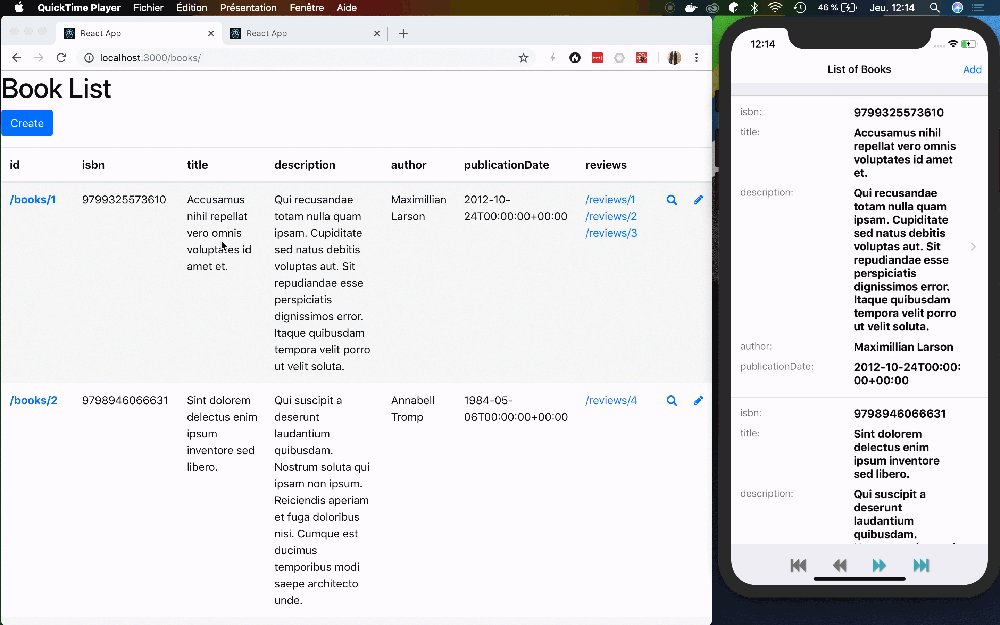

# API Platform Create Client

Create Client is the fastest way to scaffold fully featured webapps
and native mobile apps from APIs supporting the [Hydra](https://www.hydra-cg.com/) or [OpenAPI](https://www.openapis.org/) format.

## Generated React and React Native Apps, Updated in Real Time

It is able to generate apps using the following frontend stacks:

- [Next.js](nextjs.md)
- [Nuxt](nuxt.md)
- [Quasar](quasar.md)
- [Vuetify](vuetify.md)
- [React](react.md)
- [React Native](react-native.md)
- [Vue.js](vuejs.md)
- [Or bring your custom generator](custom.md)

Create Client works especially well with APIs built with the [API Platform](https://api-platform.com) framework.

## Features

- Generates high-quality TypeScript:
  - list view (with pagination)
  - detail view
  - creation form
  - update form
  - delete button
- Supports to-one and to-many relations
- Uses the appropriate input type (`number`, `date`...)
- Client-side validation
- Subscribes to data updates pushed by servers supporting [the Mercure protocol](https://mercure.rocks)
- Displays server-side validation errors under the related input (if using API Platform Core)
- Integration with [Tailwind CSS](https://tailwindcss.com) (Next.js) or [Bootstrap](https://getbootstrap.com/) and [Font Awesome](https://fontawesome.com/) (other generators)
- Integration with [React Native Elements](https://react-native-training.github.io/react-native-elements/)
- Accessible to people with disabilities ([ARIA](https://www.w3.org/WAI/intro/aria) support in webapps)
