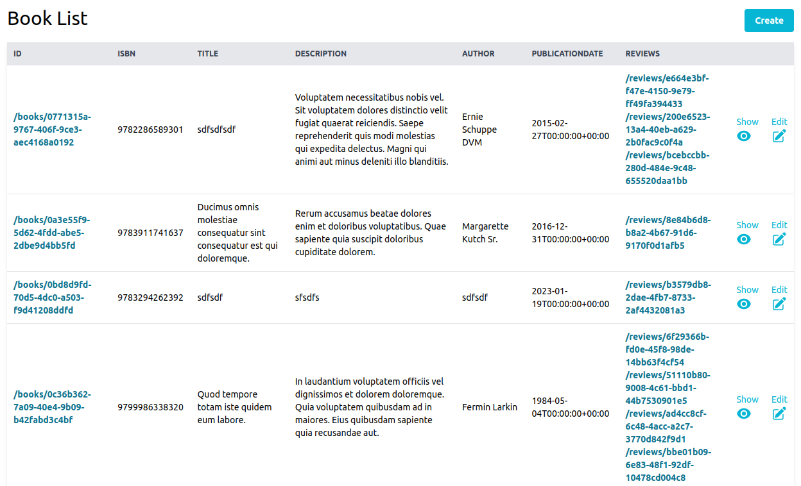
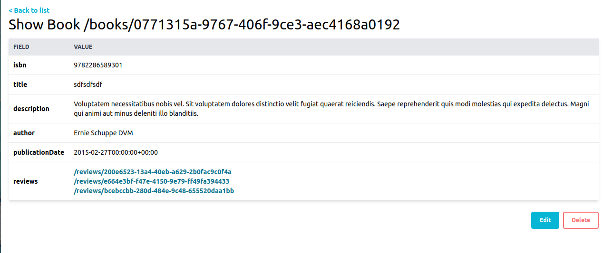

# Next.js Generator



The Next.js generator scaffolds components for server-side rendered (SSR) applications using [Next.js](https://nextjs.org/).

## Install

The easiest way to get started is to install [the API Platform Symfony variant](../symfony/index.md).
It contains a Next.js skeleton generated with Create Next App,
a development Docker container to serve the webapp, and all the API Platform components you may need, including an API server
supporting Hydra and OpenAPI.

If you use API Platform, jump to the next section!

Alternatively, create a Next.js application by executing:

- Pnpm (recommended)
    ```console
    pnpm create next-app --typescript
    ```
- Npm
    ```console
    npm init next-app --typescript
    ```
- Yarn
    ```console
    yarn reate next-app --typescript
    ```


Install the required dependencies:

- Pnpm (recommended)
    ```console
    pnpm install isomorphic-unfetch formik react-query
    ```
- Npm
    ```console
    npm install isomorphic-unfetch formik react-query
    ```
- Yarn
    ```console
    yarn add isomorphic-unfetch formik react-query
    ```

The generated HTML will contain [Tailwind CSS](https://tailwindcss.com) classes.
Optionally, [follow the Tailwind installation guide for Next.js projects](https://tailwindcss.com/docs/guides/nextjs)
(Tailwind is preinstalled in [the API Platform Symfony variant](../symfony/index.md))

## Generating Routes

If you are using the [API Platform Distribution with Symfony](../symfony/index.md) generating all the code you need for a given resource is as simple as running the following command:

```console
docker compose exec pwa \
    pnpm create @api-platform/client --resource book -g next
```

Omit the resource flag to generate files for all resource types exposed by the API.

Or if you don't use the standalone installation, run the following command instead:

- Pnpm (recommended)
    ```console
    pnpm create @api-platform/client https://demo.api-platform.com . --generator next --resource book
    ```
- Npm
    ```console
    npm init @api-platform/client https://demo.api-platform.com . -- --generator next --resource book
    ```
- Yarn
    ```console
    yarn create @api-platform/client https://demo.api-platform.com . --generator next --resource book
    ```

Replace the URL by the entrypoint of your Hydra-enabled API.
You can also use an OpenAPI documentation with `-f openapi3`.

The code has been generated, and is ready to be executed!

Add the layout to the app:

```typescript
import type { AppProps } from "next/app";
import type { DehydratedState } from "react-query";

import Layout from "../components/common/Layout";

const App = ({ Component, pageProps }: AppProps<{dehydratedState: DehydratedState}>) => (
  <Layout dehydratedState={pageProps.dehydratedState}>
    <Component {...pageProps} />
  </Layout>
);

export default App;
```

## Starting the Project

You can launch the server with:

- Pnpm (recommended)
    ```console
    pnpm dev
    ```
- Npm
    ```console
    npm run dev
    ```
- Yarn
    ```console
    yarn dev
    ```
  
Go to `http://localhost:3000/books/` to start using your app.

## Generating a production build locally with docker compose

If you want to generate a production build locally with docker compose, follow [these instructions](../deployment/docker-compose.md).

## Screenshots



