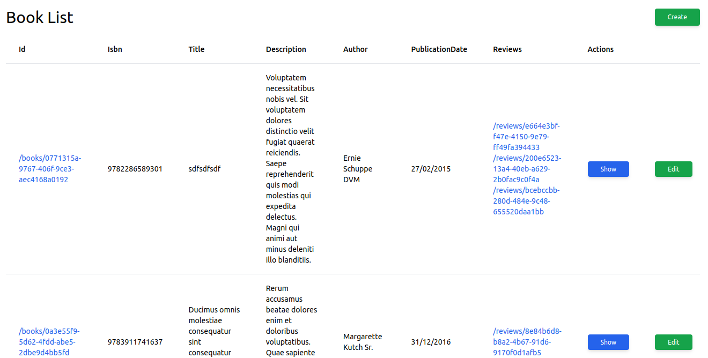
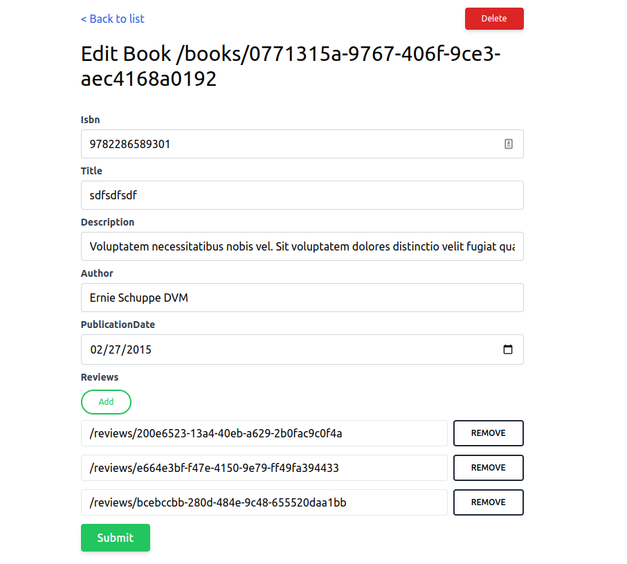

# Nuxt Generator

Bootstrap a [Nuxt 3](https://nuxt.com/) application:

```console
npx nuxi init my-app
cd my-app
```

Install the required dependencies:

```console
yarn add dayjs @pinia/nuxt qs @types/qs
```

To generate the code you need for a given resource, run the following command:

```console
yarn create @api-platform/client https://demo.api-platform.com . --generator nuxt --resource foo
```

Replace the URL with the entrypoint of your Hydra-enabled API. You can also use an OpenAPI documentation with `https://demo.api-platform.com/docs.jsonopenapi` and `-f openapi3`.

Omit the resource flag to generate files for all resource types exposed by the API.

Add Pinia module in `nuxt.config.ts`:

```typescript
// https://nuxt.com/docs/api/configuration/nuxt-config
export default defineNuxtConfig({
  // ...
  modules: ['@pinia/nuxt'],
  // ...
});
```

Delete `app.vue` as it will prevent Nuxt router to work correctly.

Optionally, install Tailwind to get an app that looks good:

```console
yarn add -D tailwindcss postcss autoprefixer
yarn tailwindcss init -p
```

Add this code in `nuxt.config.ts`:

```typescript
// https://nuxt.com/docs/api/configuration/nuxt-config
export default defineNuxtConfig({
  // ...
  css: ['~/assets/css/main.css'],
  postcss: {
    plugins: {
      tailwindcss: {},
      autoprefixer: {},
    },
  },
  // ...
});
```

And this code in `tailwind.config.js`:

```javascript
/** @type {import('tailwindcss').Config} */
module.exports = {
  content: [
    './components/**/*.{js,vue,ts}',
    './layouts/**/*.vue',
    './pages/**/*.vue',
    './plugins/**/*.{js,ts}',
    './nuxt.config.{js,ts}',
    './app.vue',
  ],
  theme: {
    extend: {},
  },
  plugins: [],
};
```

Create the file `assets/css/main.css` and add this code in it:

```css
@tailwind base;
@tailwind components;
@tailwind utilities;
```

You can launch the server with:

```console
yarn dev -o
```

Go to `https://localhost:3000/books/` to start using your app.

## Screenshots



