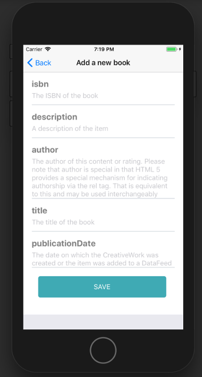

# React Native generator


## Install

To use this generator you need [Node.js](https://nodejs.org/).

Create a React Native application using [Expo CLI](https://docs.expo.io/workflow/expo-cli/):

```console
npm install -g expo-cli
npm init expo-app my-app
```

When asked, choose to use the blank template, then move to the created directory:

```console
cd my-app
```

Install the required dependencies:

```console
npm install redux react-redux redux-thunk redux-form react-native-elements react-native-router-flux react-native-vector-icons prop-types whatwg-url buffer react-native-event-source react-native-gesture-handler react-native-reanimated react-native-screens
```

## Generating a Native App

In the app directory, generate the files for the resource you want:

```console
npm init @api-platform/client https://demo.api-platform.com . -- --generator react-native --resource book
```

Replace the URL with the entrypoint of your Hydra-enabled API.
You can also use an OpenAPI documentation with `-f openapi3`.

Omit the resource flag to generate files for all resource types exposed by the API.

Create a `Router.js` file to import all routes:

```javascript
// Router.js
import React from 'react';
import { Router, Stack } from 'react-native-router-flux';
// Replace "book" with the name of the resource type
import BookRoutes from './routes/book';

const RouterComponent = () => (
  <Router>
    <Stack key="root">{BookRoutes}</Stack>
  </Router>
);

export default RouterComponent;
```

Here is an example of an `App.js` file:

```javascript
// App.js
import React, { Component } from 'react';
import { Provider } from 'react-redux';
import thunk from 'redux-thunk';
import { createStore, applyMiddleware, combineReducers } from 'redux';
import { View } from 'react-native';
import { reducer as form } from 'redux-form';

// see https://github.com/facebook/react-native/issues/14796
import { Buffer } from 'buffer';
global.Buffer = Buffer;

// see https://github.com/facebook/react-native/issues/16434
import { URL, URLSearchParams } from 'whatwg-url';
global.URL = URL;
global.URLSearchParams = URLSearchParams;

// see https://github.com/facebook/react-native/issues/12890
import RNEventSource from 'react-native-event-source';
global.EventSource = RNEventSource;

// Replace "book" with the name of resource type
import book from './reducers/book';
import Router from './Router';

export default class App extends Component {
  render() {
    const store = createStore(
      combineReducers({
        book,
        form,
      }),
      {},
      applyMiddleware(thunk)
    );
    return (
      <Provider store={store}>
        <View style={{ flex: 1 }}>
          <Router />
        </View>
      </Provider>
    );
  }
}
```

The code is ready to be executed!

```console
expo start
```

## Screenshots in iOS Simulator

 
 
