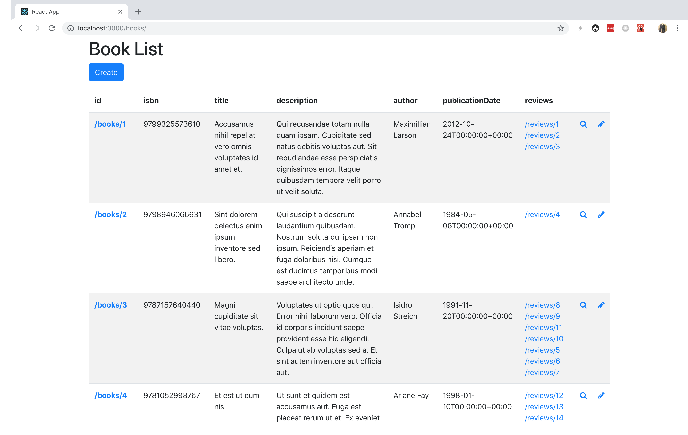
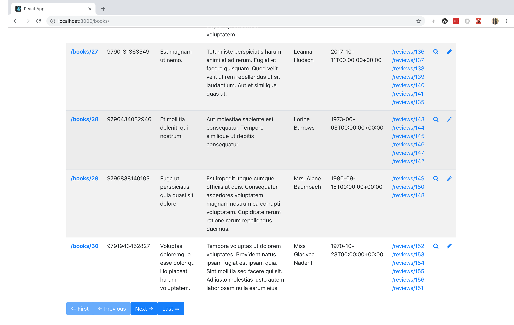
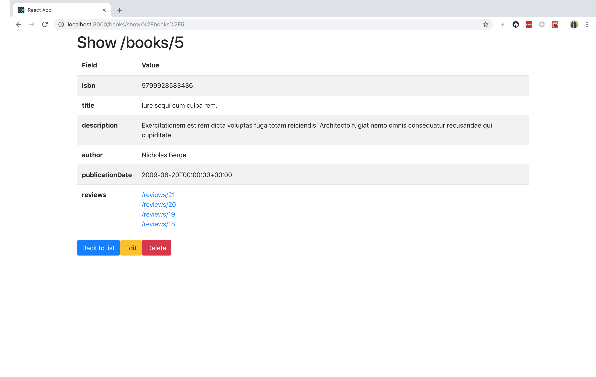
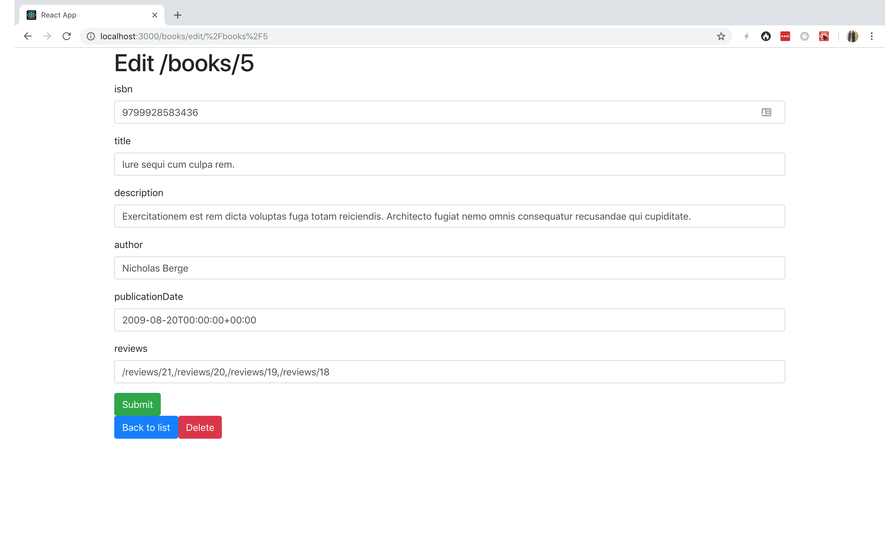
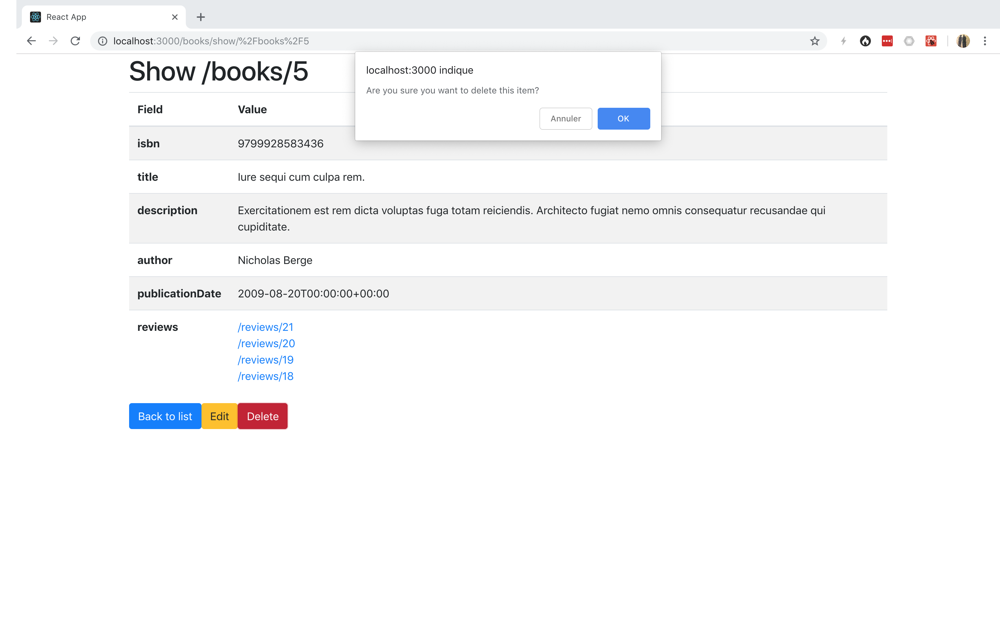

# React Generator



The React generator scaffolds a Single Page Application or a Progressive Web App built with battle-tested libraries
from the ecosystem:

- [React](https://reactjs.org/)
- [React Router](https://reactrouter.com/)
- [React Hook Form](https://react-hook-form.com/)

## Install

Bootstrap a React application:

```console
npm create vite@latest my-app -- --template react-ts
cd my-app
```

Install the required dependencies:

```console
npm install react-router-dom react-hook-form
```

Optionally, install Bootstrap and Font Awesome to get an app that looks good:

```console
npm install bootstrap font-awesome
```

Finally, start the integrated web server:

```console
npm run dev
```

## Generating a Web App

```console
npm init @api-platform/client https://demo.api-platform.com src/ -- --generator react --resource book
```

Replace the URL by the entrypoint of your Hydra-enabled API.
You can also use an OpenAPI documentation with `-f openapi3`.

Omit the resource flag to generate files for all resource types exposed by the API.

The code has been generated, and is ready to be executed!

Register the reducers and the routes:

```typescript
// my-app/src/main.tsx
import React from 'react';
import ReactDOM from 'react-dom/client';
import { BrowserRouter as Router, Route, Routes } from 'react-router-dom';
import 'bootstrap/dist/css/bootstrap.css';
import 'font-awesome/css/font-awesome.css';
// Import your routes here
import App from './App';

const NotFound = () => (
  <h1>Not Found</h1>
);

const root = ReactDOM.createRoot(
  document.getElementById('root') as HTMLElement
);
root.render(
  <React.StrictMode>
    <Router>
      <Routes>
        <Route path="/" element={<App/>}/>
        {/* Add your routes here */}
        <Route path='*' element={<NotFound/>} />
      </Routes>
    </Router>
  </React.StrictMode>
);
```

Go to `https://localhost/books/` to start using your app.

## Screenshots






