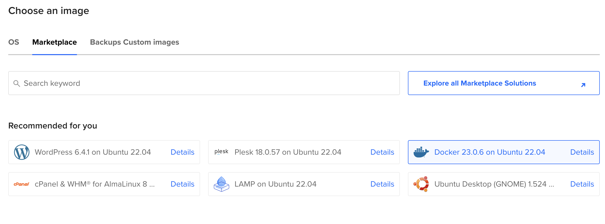
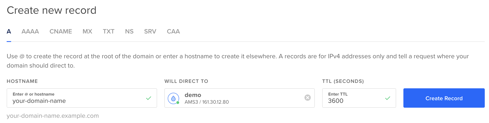

# Deploying with Docker Compose

While [Docker Compose](https://docs.docker.com/compose/) is mainly known and used in a development environment, it [can be used in production too](https://docs.docker.com/compose/production/). This is especially suitable for prototyping
or small-scale deployments, where the robustness (and the associated complexity) of [Kubernetes](kubernetes.md) is not
required.

API Platform provides Docker images and a Docker Compose definition optimized for production usage.
In this tutorial, we will learn how to deploy our Symfony application on a single server using Docker Compose.

Note: this tutorial has been adapted from [the Symfony Docker documentation](https://github.com/dunglas/symfony-docker/blob/main/docs/production.md).

## Preparing a Server

To deploy your application in production, you need a server.
In this tutorial, we will use a virtual machine provided by DigitalOcean, but any Linux server can work.
If you already have a Linux server with Docker Compose installed, you can skip straight to [the next section](#configuring-a-domain-name).

Otherwise, use [this affiliate link](https://m.do.co/c/5d8aabe3ab80) to get $100 of free credit, create an account, then click on "Create a Droplet".
Then, click on the "Marketplace" tab under the "Choose an image" section and search for the app named "Docker".
This will provision an Ubuntu server with the latest versions of Docker and Docker Compose already installed!

For test purposes, the cheapest plans will be enough, even though you might want at least 2GB of RAM to execute Docker Compose for the first time. For real production usage, you'll probably want to pick a plan in the "general purpose" section to fit your needs.



You can keep the defaults for other settings, or tweak them according to your needs.
Don't forget to add your SSH key or create a password then press the "Finalize and create" button.

Then, wait a few seconds while your Droplet is provisioning.
When your Droplet is ready, use SSH to connect:

```console
ssh root@<droplet-ip>
```

## Configuring a Domain Name

In most cases, you'll want to associate a domain name with your site.
If you don't own a domain name yet, you'll have to buy one through a registrar.

Then create a DNS record of type `A` for your domain name pointing to the IP address of your server:

```dns
your-domain-name.example.com.  IN  A     207.154.233.113
```

Example with the DigitalOcean Domains service ("Networking" > "Domains"):



> [!NOTE]
> Let's Encrypt, the service used by default by API Platform to automatically generate a TLS certificate, doesn't support using bare IP addresses.
> Using a domain name is mandatory to use Let's Encrypt.

## Deploying

Copy your project on the server using `git clone`, `scp`, or any other tool that may fit your needs.
If you use GitHub, you may want to use [a deploy key](https://docs.github.com/en/developers/overview/managing-deploy-keys#deploy-keys).
Deploy keys are also [supported by GitLab](https://docs.gitlab.com/ee/user/project/deploy_keys/).

Example with Git:

```console
git clone git@github.com:<username>/<project-name>.git
```

Go into the directory containing your project (`<project-name>`), and start the app in production mode:

```console
SERVER_NAME=your-domain-name.example.com \
APP_SECRET=ChangeMe \
POSTGRES_PASSWORD=ChangeMe \
CADDY_MERCURE_JWT_SECRET=ChangeThisMercureHubJWTSecretKey \
docker compose -f compose.yaml -f compose.prod.yaml up --wait
```

Be sure to replace `your-domain-name.example.com` with your actual domain name and to set the values of `APP_SECRET`, `CADDY_MERCURE_JWT_SECRET` to cryptographically secure random values.

> [!CAUTION]
> Docker can have a cache layer, make sure you have the right build for each deployment or rebuild your project with --no-cache option to avoid cache issue.

Your server is up and running, and a Let's Encrypt HTTPS certificate has been automatically generated for you.
Go to `https://your-domain-name.example.com` and enjoy!

> [!NOTE]
> The worker mode of FrankenPHP is enabled by default in prod. To disable it, add the env var FRANKENPHP_CONFIG as empty to the compose.prod.yaml file.

## Disabling HTTPS

Alternatively, if you don't want to expose an HTTPS server but only an HTTP one, run the following command:

```bash
SERVER_NAME=http://localhost \
MERCURE_PUBLIC_URL=http://localhost/.well-known/mercure \
TRUSTED_HOSTS='^localhost|php$' \
APP_SECRET=ChangeMe \
CADDY_MERCURE_JWT_SECRET=ChangeThisMercureHubJWTSecretKey \
docker compose -f -compose.yaml -f compose.prod.yaml up --wait
```

## Deploying on Multiple Nodes

If you want to deploy your app on a cluster of machines, we recommend using [Kubernetes](kubernetes.md).
You can use [Docker Swarm](https://docs.docker.com/engine/swarm/stack-deploy/),
which is compatible with the provided Compose files.

## Configuring a Load Balancer or a Reverse Proxy

Since Caddy 2.5, XFF values of incoming requests will be ignored to prevent spoofing.
So if Caddy is not the first server being connected to by your clients (for example when a CDN is in front of Caddy), you may configure `trusted_proxies` with a list of IP ranges (CIDRs) from which incoming requests are trusted to have sent good values for these headers.
As a shortcut, `private_ranges` may be configured to trust all private IP ranges.

```diff
-php_fastcgi unix//var/run/php/php-fpm.sock
+php_fastcgi unix//var/run/php/php-fpm.sock {
+    trusted_proxies private_ranges
+}
```

## Building Next.js client locally with SSG

When deploying API Platform with Docker Compose and you need to build a Next.js client that utilizes Static Site Generation (SSG), a specific setup is required.  
This setup ensures the Next.js client can access the API at build time to generate static pages.

### Configuration Steps

#### 1. Adjust the compose.prod.yaml file

Modify the pwa service to ensure network communication between the pwa and php services during the build:

```yaml
pwa:
  build:
    context: ./pwa
    target: prod
    network: host
    extra_hosts:
      - php=127.0.0.1
```

#### 2. Build and start the php service

Begin by starting the php service container:

```bash
SERVER_NAME=http://localhost \
MERCURE_PUBLIC_URL=http://localhost/.well-known/mercure \
TRUSTED_HOSTS='^localhost|php$' \
APP_SECRET=!ChangeMe! \
CADDY_MERCURE_JWT_SECRET=ChangeThisMercureHubJWTSecretKey \
POSTGRES_PASSWORD=!ChangeMe! \
docker compose -f compose.yaml -f compose.prod.yaml up -d --build --wait php
```

#### 3. Optional: Env file with create-client

If your are using the [create-client](../create-client/nextjs.md) generator inside your Next.js client, you need to create a `.env` file in the `pwa` directory with the `NEXT_PUBLIC_ENTRYPOINT` environment variable to ensure the Next.js client knows where to find the API:

```dotenv
NEXT_PUBLIC_ENTRYPOINT=http://php
```

#### 4. Build the pwa service

```bash
docker compose -f compose.yaml -f compose.prod.yaml build pwa
```

#### 5. Finally, bring up the full project

```bash
SERVER_NAME=http://localhost \
MERCURE_PUBLIC_URL=http://localhost/.well-known/mercure \
TRUSTED_HOSTS='^localhost|php$' \
APP_SECRET=!ChangeMe! \
CADDY_MERCURE_JWT_SECRET=ChangeThisMercureHubJWTSecretKey \
POSTGRES_PASSWORD=!ChangeMe! \
docker compose -f compose.yaml -f compose.prod.yaml up -d --wait
```

These steps ensure the Next.js client can statically generate pages by accessing the API during the build process.
