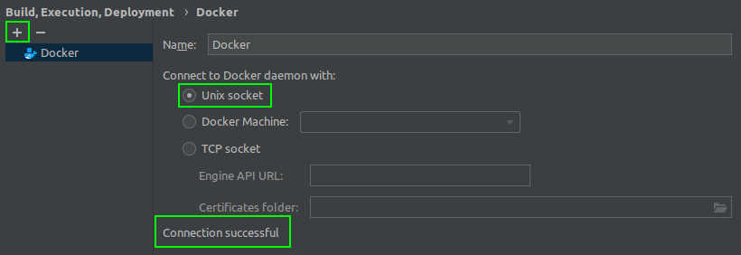
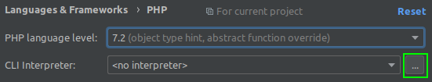
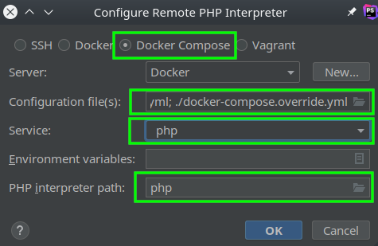
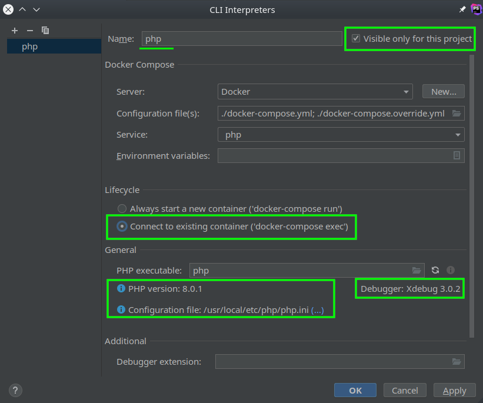
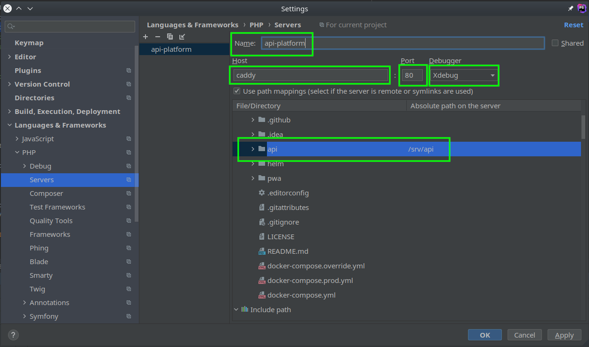
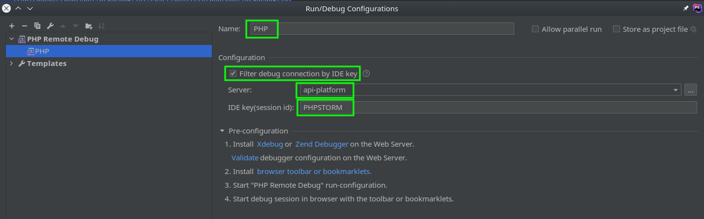

# Debugging

<p align="center" class="symfonycasts"><a href="https://symfonycasts.com/screencast/api-platform/profiler?cid=apip"><br>Watch the Debugging API Platform screencast</a></p>

## Xdebug

The default Docker stack is shipped without a Xdebug stage. It's easy
though to add [Xdebug](https://xdebug.org/) to your project, for development
purposes such as debugging tests or remote API requests.

## Add a Development Stage to the Dockerfile

To avoid deploying API Platform to production with an active Xdebug extension,
it's recommended to add a custom stage to the end of the `api/Dockerfile`.

```Dockerfile
# api/Dockerfile
FROM api_platform_php as api_platform_php_dev

ARG XDEBUG_VERSION=3.0.2
RUN set -eux; \
 apk add --no-cache --virtual .build-deps $PHPIZE_DEPS; \
 pecl install xdebug-$XDEBUG_VERSION; \
 docker-php-ext-enable xdebug; \
 apk del .build-deps
```

## Create new php config file xdebug.ini

Create new file xdebug.ini in folder "api/docker/php/conf.d"

```api/docker/php/conf.d/xdebug.ini
[XDebug]
xdebug.mode = debug
# See https://docs.docker.com/docker-for-mac/networking/#i-want-to-connect-from-a-container-to-a-service-on-the-host
# See https://github.com/docker/for-linux/issues/264
# The `remote_host` below may optionally be replaced with `remote_connect_back`
xdebug.client_host = host.docker.internal
xdebug.discover_client_host = 1
xdebug.client_port = 9000
xdebug.idekey = PHPSTORM
```

Note for Mac environments use the following:

```api/docker/php/conf.d/xdebug.ini
[XDebug]
xdebug.mode = debug
# See https://docs.docker.com/docker-for-mac/networking/#i-want-to-connect-from-a-container-to-a-service-on-the-host
# See https://github.com/docker/for-linux/issues/264
# The `remote_host` below may optionally be replaced with `remote_connect_back`
xdebug.client_host = docker.for.mac.localhost
xdebug.discover_client_host = 1
xdebug.client_port = 9000
xdebug.idekey = PHPSTORM
```

## Configure Xdebug with Docker Compose Override

Using an [override](https://docs.docker.com/compose/reference/overview/#specifying-multiple-compose-files) file named
`docker-compose.override.yml` ensures that the production configuration remains untouched.

As an example, an override could look like this:

```yml
version: "3.4"

services:
  php:
    build:
      target: api_platform_php_dev
    volumes:
      - ./api/docker/php/conf.d/xdebug.ini:/usr/local/etc/php/conf.d/xdebug.ini
    environment:
      # See https://docs.docker.com/docker-for-mac/networking/#i-want-to-connect-from-a-container-to-a-service-on-the-host
      # See https://github.com/docker/for-linux/issues/264
      # The `remote_host` below may optionally be replaced with `remote_connect_back`
      # XDEBUG_MODE required for step debugging
      XDEBUG_MODE: debug
      # default port for Xdebug 3 is 9003
      # idekey=VSCODE if you are debugging with VSCode
      XDEBUG_CONFIG: >-
        client_host=host.docker.internal
        idekey=PHPSTORM
      # This should correspond to the server declared in PHPStorm `Preferences | Languages & Frameworks | PHP | Servers`
      # Then PHPStorm will use the corresponding path mappings
      PHP_IDE_CONFIG: serverName=api-platform
```


Note for Mac environments use the following:

```yml
      XDEBUG_CONFIG: >-
        idekey=PHPSTORM
        client_host=docker.for.mac.localhost
```

In VSCode, alongside the default PHP configuration in `launch.json`, you'll need path mappings for the Docker image.
```json
{
    "version": "0.2.0",
    "configurations": [
        {
            "name": "Listen for Xdebug",
            "type": "php",
            "request": "launch",
            "port": 9003,
            "log": true,
            "pathMappings": {
                "/srv/api": "${workspaceFolder}/api"
            },
        },
    ]
}
```

Note: For Linux environments, the `client_host` setting of `host.docker.internal` will not work, you will need the actual local IP address of your computer.

## Troubleshooting

Inspect the installation with the following command. The requested Xdebug
version should be displayed in the output.

```console
$ docker-compose exec php \
    php --version

PHP …
    with Xdebug v3.0.2, Copyright (c) 2002-2021, by Derick Rethans
    …
```

## Setting PhpStorm

### Add host to /etc/hosts

```/etc/hosts
127.0.0.1 caddy 
```

### Add Docker server

1. In the Settings/Preferences dialog Ctrl+Alt+S, select **Build, Execution, Deployment | Docker.**
2. Click + The Add button to add a Docker configuration and specify how to connect to the Docker daemon.



### Add external php interpreter

1. In the Settings/Preferences dialog Ctrl+Alt+S, select **«Languages & Frameworks» — PHP**
2. On the PHP page that opens, click ... the Browse button next to the CLI Interpreter list.



3. In the CLI Interpreters dialog that opens, click + the Add button in the left-hand pane, then choose **From Docker, Vagrant, VM, WSL, Remote...** from the popup menu.
4. Select **Docker Compose**

Set **Server: Docker**  
Set **Configuration file(s): ./docker-compose.yml; ./docker-compose.override.yml**  
Set **Service: php**  
Set **PHP interpreter path: php**



5. Select **Connect to existent container**



### Add PHP server

1. In the Settings/Preferences dialog Ctrl+Alt+S, selec **«Languages & Frameworks» — PHP — Servers**
2. Click + The Add button to add a PHP server configuration
3. Set name server **api-platform**(must match the **PHP_IDE_CONFIG** environment variable in docker-compose.yml)
4. Set host **caddy**
5. Set port **80**
6. Select **Use path mappings (select if the server is remote or systemlinks are used)
7. Set Directory **api** Absolute path on the server **/srv/api**




### Add Run/Debug configuration

1. Select menu Run->Edit Configurations...
2. Click + The Add button
3. Select **PHP Remote Debug**
4. Set name **PHP**
5. Select **Filter debug connection by IDE key
6. Set server **api-platfor**
7. Set IDE key(session id) **PHPSTORM**


