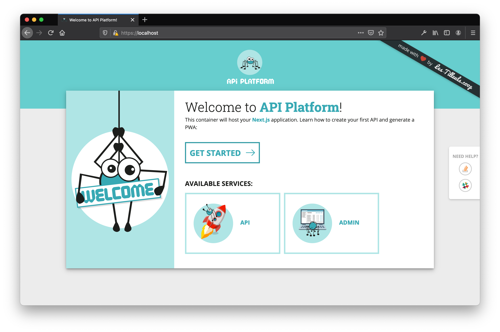
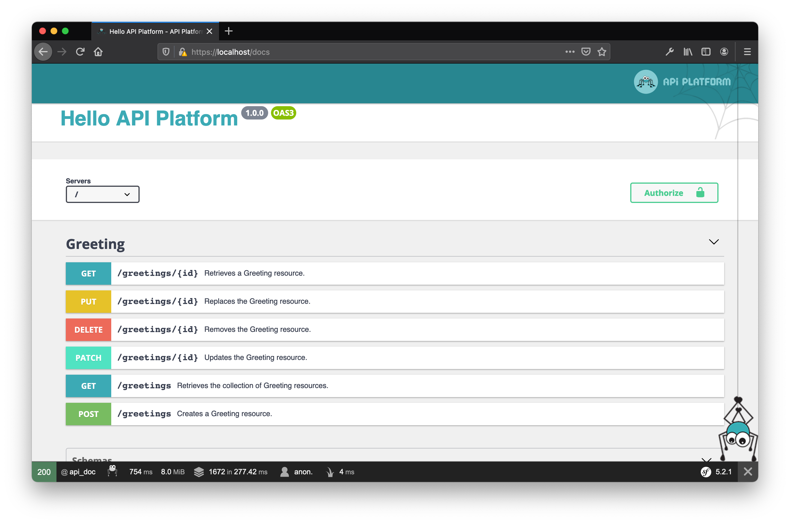
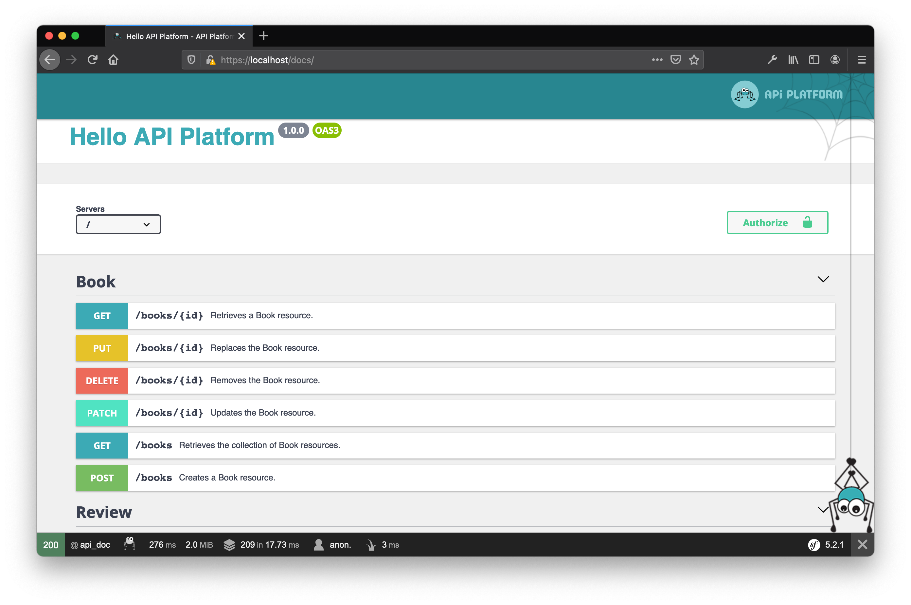
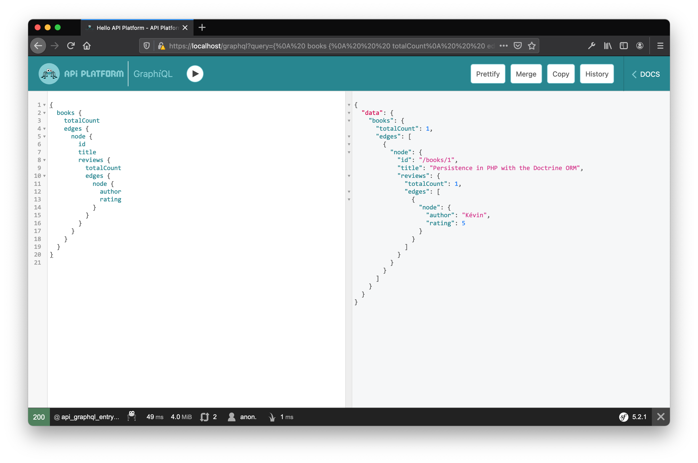
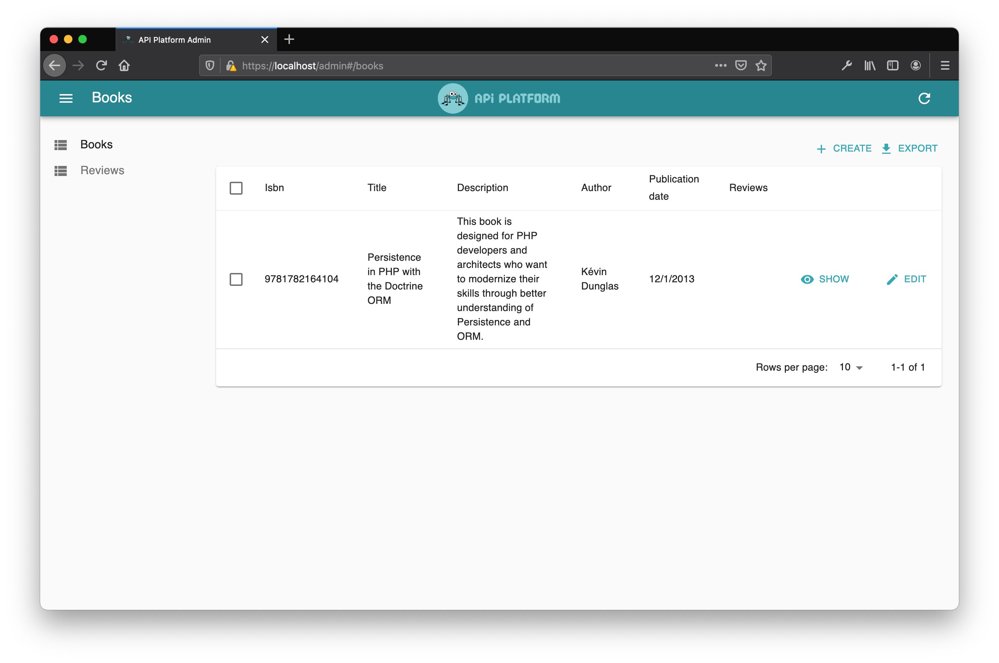
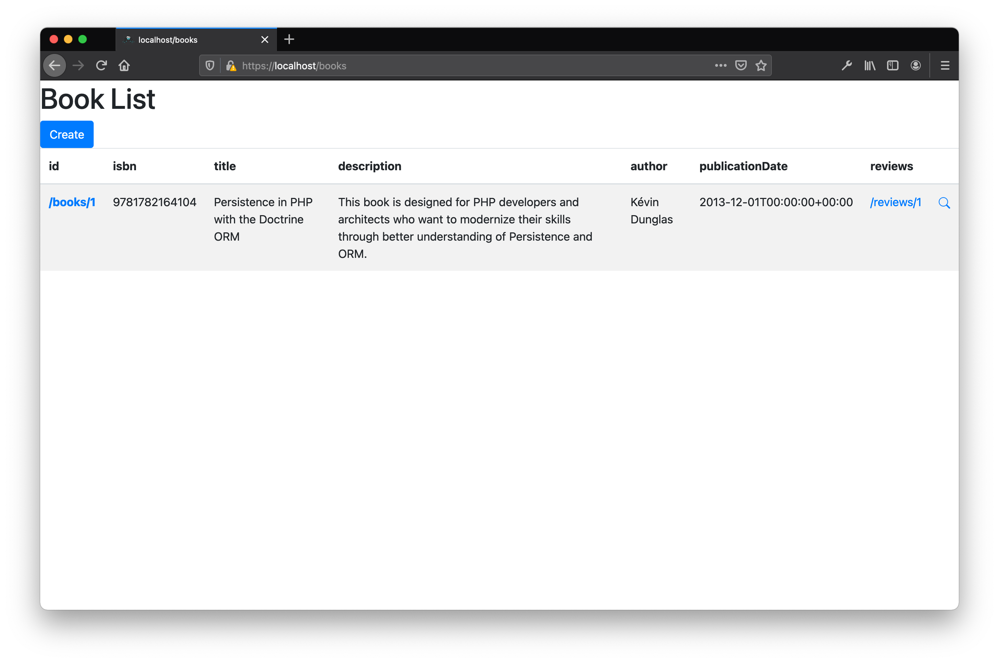

# Getting Started With API Platform: Create Your API and Your Jamstack Site



> *API Platform* is the most advanced API platform, in any framework or language.
>
> —Fabien Potencier (creator of Symfony)

[API Platform](https://api-platform.com) is a powerful yet easy to use **full stack** framework dedicated to API-driven projects and implementing the [Jamstack](https://jamstack.org/) architecture.

## Introduction

API Platform contains [a **PHP** library (Core)](../core/index.md) to create fully featured hypermedia (or [GraphQL](../core/graphql.md)) web APIs supporting industry-leading standards: [JSON-LD](https://json-ld.org) with [Hydra](https://www.hydra-cg.com), [OpenAPI](../core/swagger.md)...

API Platform also provides ambitious **JavaScript** tools to create web and mobile applications based on the most popular frontend technologies in a snap. These tools parse the documentation of the API (or of any other API supporting Hydra or OpenAPI).

 API Platform is shipped with **[Docker](../deployment/docker-compose.md)** and **[Kubernetes](../deployment/kubernetes.md)** definitions, to develop and deploy instantly on the cloud.

The easiest and most powerful way to get started is [to download the API Platform distribution](https://github.com/api-platform/api-platform/releases). It contains:

* the API skeleton, including [the Core library](../core/index.md), [the Symfony framework](https://symfony.com/) ([optional](../core/bootstrap.md)) and [the Doctrine ORM](https://www.doctrine-project.org/projects/orm.html) ([optional](../core/extending.md))
* [the client scaffolding tool](../client-generator/) to generate [Next.js](../client-generator/
) web applications from the API documentation ([Nuxt.js](https://nuxtjs.org/), [Vue](https://vuejs.org/), [Create React App](https://reactjs.org), [React Native](https://facebook.github.io/react-native/), [Quasar](https://quasar.dev/) and [Vuetify](https://vuetifyjs.com/) are also supported)
* [a beautiful admin interface](../admin/), built on top of React Admin, dynamically created by parsing the API documentation
* all you need to [create real-time and async APIs using the Mercure protocol](../core/mercure.md)
* a [Docker](../deployment/docker-compose.md) definition to start a working development environment in a single command, providing containers for the API and the Next.js web application
* a [Helm](https://helm.sh/) chart to deploy the API in any [Kubernetes](../deployment/kubernetes.md) cluster

## A Bookshop API

To discover how the framework works, we will create an API to manage a bookshop.

To create a fully featured API, an admin interface and a Progressive Web App using Next.js, all you need is to design **the public data
model of our API** and handcraft it as *Plain Old PHP Objects*.

API Platform uses these model classes to expose and document a web API having a bunch of built-in features:

* creating, retrieving, updating and deleting (CRUD) resources
* data validation
* pagination
* filtering
* sorting
* hypermedia/[HATEOAS](https://en.wikipedia.org/wiki/HATEOAS) and content negotiation support ([JSON-LD](https://json-ld.org) and [Hydra](https://www.hydra-cg.com/), [JSON:API](https://jsonapi.org/), [HAL](https://tools.ietf.org/html/draft-kelly-json-hal-08)...)
* [GraphQL support](../core/graphql.md)
* Nice UI and machine-readable documentations ([Swagger UI/OpenAPI](https://swagger.io), [GraphiQL](https://github.com/graphql/graphiql)...)
* authentication ([Basic HTTP](https://en.wikipedia.org/wiki/Basic_access_authentication), cookies as well as [JWT](../core/jwt.md) and [OAuth](https://oauth.net) through extensions)
* [CORS headers](https://developer.mozilla.org/en-US/docs/Web/HTTP/Access_control_CORS)
* security checks and headers (tested against [OWASP recommendations](https://www.owasp.org/index.php/REST_Security_Cheat_Sheet))
* [invalidation-based HTTP caching](../core/performance.md)
* and basically everything needed to build modern APIs.

One more thing, before we start: as the API Platform distribution includes [the Symfony framework](https://symfony.com),
it is compatible with most [Symfony bundles](https://flex.symfony.com)
(plugins) and benefits from [the numerous extensions points](../core/extending.md) provided by this rock-solid foundation (events, Dependency Injection Container...).
Adding features like custom or service-oriented API endpoints, JWT or OAuth authentication, HTTP caching, mail sending or
asynchronous jobs to your APIs is straightforward.

## Installing the Framework

### Using the API Platform Distribution (Recommended)

Start by [downloading the API Platform distribution](https://github.com/api-platform/api-platform/releases/latest), or [generate a GitHub repository from the template we provide](https://github.com/api-platform/api-platform/generate).
You will add your own code and configuration inside this skeleton.

**Note**: Avoid downloading the `.zip` archive, as it may cause potential [permission](https://github.com/api-platform/api-platform/issues/319#issuecomment-307037562) [issues](https://github.com/api-platform/api-platform/issues/777#issuecomment-412515342), prefer the `.tar.gz` archive.

API Platform is shipped with a [Docker](https://docker.com) definition that makes it easy to get a containerized development
environment up and running. If you do not already have Docker on your computer, it's the right time to [install it](https://docs.docker.com/get-docker/).

**Note**: On Mac, only [Docker for Mac](https://docs.docker.com/docker-for-mac/) is supported.
Similarly, on Windows, only [Docker for Windows](https://docs.docker.com/docker-for-windows/) is supported. Docker Machine **is not** supported out of the box.

Open a terminal, and navigate to the directory containing your project skeleton. Run the following command to start all
services using [Docker Compose](https://docs.docker.com/compose/):

Download and build the latest versions of the images:

```console
docker-compose build --pull --no-cache
```

Start Docker Compose in detached mode:

```console
docker-compose up -d 
```

**Tip:** be sure that the ports `80`, `443` and `5432` of the host are not already in use. The usual offenders are Apache, NGINX and Postgres. If they are running, stop them and run `docker-compose up -d` again.

This starts the following services:

| Name     | Description                                                                                                                                                                  |
|----------|------------------------------------------------------------------------------------------------------------------------------------------------------------------------------|
| caddy    | [Caddy web server](caddy.md) with the [Mercure](../core/mercure.md) (real-time and async) and [Vulcain](https://vulcain.rocks) (relations preloading) modules |
| php      | The API with PHP 8, Composer and sensitive configs                                                                                                                           |
| pwa      | Next.js webapp with API Platform Admin and Client Generator preinstalled                                                                                                     |
| database | PostgreSQL database server                                                                                                                                                   |

The following components are available:

| URL                        | Path               | Language   | Description             |
|----------------------------|--------------------|------------|-------------------------|
| `https://localhost/docs/`  | `api/`             | PHP        | The API                 |
| `https://localhost/`       | `pwa/`             | JavaScript | The Next.js application |
| `https://localhost/admin/` | `pwa/pages/admin/` | JavaScript | The Admin               |

To see the container's logs, run:

```console
docker-compose logs -f
```

The `-f` option is to follow the logs.

Project files are automatically shared between your local host machine and the container thanks to a pre-configured [Docker
volume](https://docs.docker.com/engine/tutorials/dockervolumes/). It means that you can edit files of your project locally
using your preferred IDE or code editor, they will be transparently taken into account in the container.
Speaking about IDEs, our favorite software to develop API Platform apps is [PhpStorm](https://www.jetbrains.com/phpstorm/)
with its awesome [Symfony](https://confluence.jetbrains.com/display/PhpStorm/Getting+Started+-+Symfony+Development+using+PhpStorm)
and [Php Inspections](https://plugins.jetbrains.com/plugin/7622-php-inspections-ea-extended-) plugins. Give them a try,
you'll get auto-completion for almost everything and awesome quality analysis.

[PHP IntelliSense for Visual Studio Code](https://marketplace.visualstudio.com/items?itemName=felixfbecker.php-intellisense) also works well, and is free and open source.

The API Platform distribution comes with a dummy entity for test purpose: `src/Entity/Greeting.php`. We will remove
it later.

If you're used to the PHP ecosystem, you probably guessed that this test entity uses the industry-leading [Doctrine ORM](https://www.doctrine-project.org/projects/orm.html)
library as persistence system. It is shipped, in the API Platform distribution.

Doctrine ORM is the easiest way to persist and query data in an API Platform project thanks to the bridge shipped with the
distribution, but it's also entirely optional, and [you may prefer to plug your own persistence system](../core/design.md).

The Doctrine Bridge is optimized for performance and development convenience. For instance, when using Doctrine, API Platform
is able to automatically optimize the generated SQL queries by adding the appropriate `JOIN` clauses. It also provides a
lot of powerful [built-in filters](../core/filters.md).
Doctrine ORM and its bridge support most popular RDBMS including PostgreSQL, MySQL, MariaDB, SQL Server, Oracle and SQLite.
There is also a shipped [Doctrine MongoDB ODM](https://www.doctrine-project.org/projects/mongodb-odm.html) optional support.

That being said, keep in mind that API Platform is 100% independent of the persistence system. You can use the one(s) that
best suit(s) your needs (including NoSQL databases or remote web services) by implementing the [right interfaces](../core/data-providers.md). API Platform even supports using several persistence
systems together in the same project.

### Using Symfony CLI

Alternatively, the API Platform server component can also be installed directly on a local machine.
**This method is recommended only for users who want full control over the directory structure and the installed
dependencies.**

[For a good introduction, watch how to install API Platform without the distribution on SymfonyCasts](https://symfonycasts.com/screencast/api-platform/install?cid=apip).

The rest of this tutorial assumes that you have installed API Platform using the official distribution. Go straight to the
next section if it's your case.

API Platform has an official Symfony Flex recipe. It means that you can easily install it from any Symfony
application using [the Symfony binary](https://symfony.com/download):

Create a new Symfony project:

```console
symfony new bookshop-api
```

Enter the project directory:

```console
cd bookshop-api
```

Install the API Platform's server component in this skeleton:

```console
symfony composer require api
```

Then, create the database and its schema:

```console
symfony console doctrine:database:create
symfony console doctrine:schema:create
```

And start the built-in PHP server:

```console
symfony serve
```

All JavaScript components are also [available as standalone libraries](https://github.com/api-platform?language=javascript)
installable with npm or Yarn.  

**Note:** when installing API Platform this way, the API will be exposed as the `/api/` path. You need to open `http://localhost:8000/api/` to see the API documentation.
If you are deploying API Platform directly on an Apache or NGINX webserver and getting a 404 error on opening this link, you will need to enable the [rewriting rules](https://symfony.com/doc/current/setup/web_server_configuration.html) for your specific webserver software.

## It's Ready

Open `https://localhost` in your favorite web browser:


You'll need to add a security exception in your browser to accept the self-signed TLS certificate that has been generated
for this container when installing the framework.

Later you will probably replace this welcome screen by the homepage of your Next.js application. If you don't plan to create
a Progressive Web App, you can remove the `pwa/` directory as well as the related lines in `docker-compose*.yml` and in `api/docker/caddy/Caddyfile` (don't do it
now, we'll use this container later in this tutorial).

Click on the "API" button, or go to `https://localhost/docs/`:



API Platform exposes a description of the API in the [OpenAPI](https://www.openapis.org/) format (formerly known as Swagger).
It also integrates a customized version of [Swagger UI](https://swagger.io/swagger-ui/), a nice interface rendering the
OpenAPI documentation.
Click on an operation to display its details. You can also send requests to the API directly from the UI.
Try to create a new *Greeting* resource using the `POST` operation, then access it using the `GET` operation and, finally,
delete it by executing the `DELETE` operation.
If you access any API URL with the `.html` extension appended, API Platform displays
the corresponding API request in the UI. Try it yourself by browsing to `https://localhost/greetings.html`. If the no extension is present, API Platform will use the `Accept` header to select the format to use. By default, a JSON-LD response is sent ([configurable behavior](../core/content-negotiation.md)).

So, if you want to access the raw data, you have two alternatives:

* Add the correct `Accept` header (or don't set any `Accept` header at all if you don't care about security) - preferred when writing API clients
* Add the format you want as the extension of the resource - for debug purpose only

For instance, go to `https://localhost/greetings.jsonld` to retrieve the list of `Greeting` resources in JSON-LD, or to
`https://localhost/greetings.json` to retrieve data in raw JSON.

Of course, you can also use your favorite HTTP client to query the API.
We are fond of [Postman](https://www.getpostman.com/). It works perfectly well with API Platform, has native OpenAPI support,
allows to easily write functional tests and has good team collaboration features.

## Bringing your Own Model

Your API Platform project is now 100% functional. Let's expose our own data model.
Our bookshop API will start simple. It will be composed of a `Book` resource type and a `Review` one.

Books have an id, an ISBN, a title, a description, an author, a publication date and are related to a list of reviews.
Reviews have an id, a rating (between 0 and 5), a body, an author, a publication date and are related to one book.

Let's describe this data model as a set of Plain Old PHP Objects (POPO):

```php
<?php
// api/src/Entity/Book.php

namespace App\Entity;

use ApiPlatform\Core\Annotation\ApiResource;
use Doctrine\Common\Collections\ArrayCollection;

/** A book. */
#[ApiResource]
class Book
{
    /** The id of this book. */
    private ?int $id = null;

    /** The ISBN of this book (or null if doesn't have one). */
    public ?string $isbn = null;

    /** The title of this book. */
    public string $title = '';

    /** The description of this book. */
    public string $description = '';

    /** The author of this book. */
    public string $author = '';

    /** The publication date of this book. */
    public ?\DateTimeImmutable $publicationDate = null;

    /** @var Review[] Available reviews for this book. */
    public iterable $reviews;

    public function __construct()
    {
        $this->reviews = new ArrayCollection();
    }

    public function getId(): ?int
    {
        return $this->id;
    }
}
```

```php
<?php
// api/src/Entity/Review.php

namespace App\Entity;

use ApiPlatform\Core\Annotation\ApiResource;

/** A review of a book. */
#[ApiResource]
class Review
{
    /** The id of this review. */
    private ?int $id = null;

    /** The rating of this review (between 0 and 5). */
    public int $rating = 0;

    /** The body of the review. */
    public string $body = '';

    /** The author of the review. */
    public string $author = '';

    /** The date of publication of this review.*/
    public ?\DateTimeImmutable $publicationDate = null;

    /** The book this review is about. */
    public ?Book $book = null;

    public function getId(): ?int
    {
        return $this->id;
    }
}
```

We created two typical PHP objects with the corresponding PHPDoc, both marked with the `#[ApiResource]` attribute. For convenience, we also used the Doctrine Collection library (that is independent from Doctrine ORM), but it's not mandatory.

Reload `https://localhost/docs/`: API Platform used these classes to generate an OpenAPI documentation (a Hydra documentation is also exposed), and registered for us [the typical REST routes](../core/operations.md).



Operations available for our 2 resource types appear in the UI. We can also see the awesome [Web Debug Toolbar](https://symfonycasts.com/screencast/symfony/profiler?cid=apip).

Note that entities' and properties' descriptions in the API documentation, and that API Platform use PHP types to generate the appropriate JSON Schemas.


The framework also use these metadata to serialize and deserialize data from JSON (and other formats) to PHP objects (back and forth)!

For the sake of simplicity, in this example we used public properties (except for the id, see below). API Platform (as well
as Symfony and Doctrine) also supports accessor methods (getters/setters), use them if you want to.
We used a private property and a getter for the ID to enforce the fact that it is read only (we will let the DBMS generating it). API Platform also has first-grade support for UUIDs. [You should
probably use them instead of auto-incremented IDs](https://www.clever-cloud.com/blog/engineering/2015/05/20/why-auto-increment-is-a-terrible-idea/).

Because API Platform provides all the infrastructure for us, our API is almost ready!

The only remaining task to have a working API is to be able to query and persist data.

## Plugging the Persistence System

To retrieve and save data, API Platform proposes two main options (and we can mix them):

1. Writing our own [data providers](../core/data-providers.md) and [data persisters](../core/data-persisters.md) to fetch and save data in any persistence system and trigger our custom business logic. This is what we recommend if you want to separate the public data model exposed by the API from the internal one, and to implement a layered architecture such as Clean Architecture or Hexagonal Architecture;
2. Using one of the various existing data providers and persisters allowing to automatically fetch and persist data using popular persistence libraries. Out of the box, data providers and persisters are provided for [Doctrine ORM](https://www.doctrine-project.org/projects/orm.html) and [Doctrine MongoDB ODM](../core/mongodb.md).
A data provider (but no persister yet) is also available for [Elasticsearch](../core/elasticsearch.md). [Pomm](https://github.com/pomm-project/pomm-api-platform) and [PHP Extended SQL](https://github.com/soyuka/esql#api-platform-bridge) also provides data providers and persisters for API Platform. We recommend this approach for Rapid Application Development.

Be sure to read the [General Design Considerations](../core/design.md) document to learn more about the architecture of API Platform and how to choose between these two approaches.

Here, we will use the built-in Doctrine ORM data provider in the rest of this tutorial.

Modify the classes to map them to database tables using the annotations provided by the Doctrine ORM.

Modify these files as described in these patches:

`src/Entity/Book.php`

```diff
 use ApiPlatform\Core\Annotation\ApiResource;
 use Doctrine\Common\Collections\ArrayCollection;
+use Doctrine\ORM\Mapping as ORM;
 
 /** A book. */
+#[ORM\Entity]
 #[ApiResource]
 class Book
 {
     /** The id of this book. */
+    #[ORM\Id, ORM\Column, ORM\GeneratedValue]
     private ?int $id = null;
 
     /** The ISBN of this book (or null if doesn't have one). */
+    #[ORM\Column(nullable: true)]
     public ?string $isbn = null;
 
     /** The title of this book. */
+    #[ORM\Column]
     public string $title = '';
 
     /** The description of this book. */
+    #[ORM\Column(type: 'text')]
     public string $description = '';
 
     /** The author of this book. */
+    #[ORM\Column]
     public string $author = '';
 
     /** The publication date of this book. */
+    #[ORM\Column]
     public ?\DateTimeImmutable $publicationDate = null;
 
     /** @var Review[] Available reviews for this book. */
+    #[ORM\OneToMany(targetEntity: Review::class, mappedBy: 'book', cascade: ['persist', 'remove'])]
     public iterable $reviews;
 
     public function __construct()
```

`src/Entity/Review.php`

```diff
 namespace App\Entity;
 
 use ApiPlatform\Core\Annotation\ApiResource;
+use Doctrine\ORM\Mapping as ORM;
 
 /** A review of a book. */
+#[ORM\Entity]
 #[ApiResource]
 class Review
 {
     /** The id of this review. */
+    #[ORM\Id, ORM\Column, ORM\GeneratedValue]
     private ?int $id = null;
 
     /** The rating of this review (between 0 and 5). */
+    #[ORM\Column(type: 'smallint')]
     public int $rating = 0;
 
     /** The body of the review. */
+    #[ORM\Column(type: 'text')]
     public string $body = '';
 
     /** The author of the review. */
+    #[ORM\Column]
     public string $author = '';
 
     /** The date of publication of this review.*/
+    #[ORM\Column]
     public ?\DateTimeImmutable $publicationDate = null;
 
     /** The book this review is about. */
+    #[ORM\ManyToOne(inversedBy: 'reviews')]
     public ?Book $book = null;
 
     public function getId(): ?int
```

**Tip**: you can also use Symfony [MakerBundle](https://symfonycasts.com/screencast/symfony-fundamentals/maker-command?cid=apip) thanks to the `--api-resource` option:

```console
docker-compose exec php \
    bin/console make:entity --api-resource
```

Doctrine's annotations map these entities to tables in the database. Annotations are convenient as they allow grouping
the code and the configuration but, if you want to decouple classes from their metadata, you can switch to XML or YAML mappings.
They are supported as well.

Learn more about how to map entities with the Doctrine ORM in [the project's official documentation](https://docs.doctrine-project.org/projects/doctrine-orm/en/latest/reference/association-mapping.html)
or in Kévin's book "[Persistence in PHP with the Doctrine ORM](https://www.amazon.fr/gp/product/B00HEGSKYQ/ref=as_li_tl?ie=UTF8&camp=1642&creative=6746&creativeASIN=B00HEGSKYQ&linkCode=as2&tag=kevidung-21)".

Now, delete the file `src/Entity/Greeting.php`. This demo entity isn't useful anymore.
Finally, generate a new database migration using [Doctrine Migrations](https://symfony.com/doc/current/doctrine.html#migrations-creating-the-database-tables-schema) and apply it:

```console
docker-compose exec php \
    bin/console doctrine:migrations:diff
docker-compose exec php \
    bin/console doctrine:migrations:migrate
```

The `php` container is where your API app stands. Prefixing a command by `docker-compose exec php` allows executing the
given command in this container. You may want [to create an alias](http://www.linfo.org/alias.html) to make your life easier.

**We now have a working API with read and write capabilities!**

In Swagger UI, click on the `POST` operation of the `Book` resource type, click on "Try it out" and send the following JSON document as request body:

```json
{
  "isbn": "9781782164104",
  "title": "Persistence in PHP with the Doctrine ORM",
  "description": "This book is designed for PHP developers and architects who want to modernize their skills through better understanding of Persistence and ORM.",
  "author": "Kévin Dunglas",
  "publicationDate": "2013-12-01"
}
```

You just saved a new book resource through the bookshop API! API Platform automatically transforms the JSON document to
an instance of the corresponding PHP entity class and uses Doctrine ORM to persist it in the database.

By default, the API supports `GET` (retrieve, on collections and items), `POST` (create), `PUT` (replace), `PATCH` (partial update) and `DELETE` (self-explanatory)
HTTP methods. Don't forget to [disable the ones you don't want](../core/operations.md#enabling-and-disabling-operations)!

Try the `GET` operation on the collection. The book we added appears. When the collection contains more than 30 items,
the pagination will automatically show up, [and this is entirely configurable](../core/pagination.md). You may be interested
in [adding some filters and adding sorts to the collection](../core/filters.md) as well.

You may have noticed that some keys start with the `@` symbol in the generated JSON response (`@id`, `@type`, `@context`...)?
API Platform comes with a full support of the [JSON-LD](https://json-ld.org/) format (and its [Hydra](https://www.hydra-cg.com/)
extension). It allows to build smart clients, with auto-discoverability capabilities such as the API Platform Admin that
we will discover in a few lines.
It is useful for open data, SEO and interoperability, especially when [used with open vocabularies such as Schema.org](http://blog.schema.org/2013/06/schemaorg-and-json-ld.html)
and allows to [give access to Google to your structured data](https://developers.google.com/search/docs/guides/intro-structured-data)
or to query your APIs in [SPARQL](https://en.wikipedia.org/wiki/SPARQL) using [Apache Jena](https://jena.apache.org/documentation/io/#formats)).

We think that JSON-LD is the best default format for a new API.
However, API Platform natively [supports many other formats](../core/content-negotiation.md) including [GraphQL](https://graphql.org/)
(we'll get to it), [JSON:API](https://jsonapi.org/), [HAL](https://github.com/zircote/Hal), raw [JSON](https://www.json.org/),
[XML](https://www.w3.org/XML/) (experimental) and even [YAML](https://yaml.org/) and [CSV](https://en.wikipedia.org/wiki/Comma-separated_values).
You can also easily [add support for other formats](../core/content-negotiation.md) and it's up to you to choose which format
to enable and to use by default.

Now, add a review for this book using the `POST` operation for the `Review` resource:

```json
{
    "book": "/books/1",
    "rating": 5,
    "body": "Interesting book!",
    "author": "Kévin",
    "publicationDate": "September 21, 2016"
}
```

**Note:** If you have installed API Platform in an existing project using `composer`, the content of the key `book` must be `"/api/books/1"`

There are two interesting things to mention about this request:

First, we learned how to work with relations. In a hypermedia API, every resource is identified by an (unique) [IRI](https://en.wikipedia.org/wiki/Internationalized_Resource_Identifier).
A URL is a valid IRI, and it's what API Platform uses. The `@id` property of every JSON-LD document contains the IRI identifying
it. You can use this IRI to reference this document from other documents. In the previous request, we used the IRI of the
book we created earlier to link it with the `Review` we were creating. API Platform is smart enough to deal with IRIs.
By the way, you may want to [embed documents](../core/serialization.md) instead of referencing them
(e.g. to reduce the number of HTTP requests). You can even [let the client select only the properties it needs](../core/filters.md#property-filter).

The other interesting thing is how API Platform handles dates (the `publicationDate` property). API Platform understands
[any date format supported by PHP](https://www.php.net/manual/en/datetime.formats.date.php). In production we strongly recommend
using the format specified by the [RFC 3339](https://tools.ietf.org/html/rfc3339), but, as you can see, most common formats
including `September 21, 2016` can be used.

To summarize, if you want to expose any entity you just have to:

1. Put it under the `App\Entity\` namespace
2. Write your data providers and persisters, or if you use Doctrine, map it with the database
3. Mark it with the `#[ApiPlatform\Core\Annotation\ApiResource]` attribute

Could it be any easier?!

## Validating Data

Now try to add another book by issuing a `POST` request to `/books` with the following body:

```json
{
  "isbn": "2815840053",
  "description": "Hello",
  "author": "Me",
  "publicationDate": "today"
}
```

The book is successfully created but there is a problem; we did not give it a title. It makes no sense to create a book record without a title so we really should have some validation measures in place to prevent this from being possible.

API Platform comes with a bridge with [the Symfony Validator Component](https://symfony.com/doc/current/validation.html).
Adding some of [its numerous validation constraints](https://symfony.com/doc/current/validation.html#supported-constraints)
(or [creating custom ones](https://symfony.com/doc/current/validation/custom_constraint.html)) to our entities is enough
to validate user-submitted data. Let's add some validation rules to our data model.

Modify the following files as described in these patches:

`src/Entity/Book.php`

```diff
 use ApiPlatform\Core\Annotation\ApiResource;
 use Doctrine\Common\Collections\ArrayCollection;
 use Doctrine\ORM\Mapping as ORM;
+use Symfony\Component\Validator\Constraints as Assert;

     #[ORM\Column(nullable: true)] 
+    #[Assert\Isbn]
     public ?string $isbn = null;     
 
     #[ORM\Column]
+    #[Assert\NotBlank]
     public string $title = '';
 
     #[ORM\Column(type: 'text')]
+    #[Assert\NotBlank]
     public string $description = '';
 
     #[ORM\Column] 
+    #[Assert\NotBlank]
     public string $author = '';
 
     #[ORM\Column]
+    #[Assert\NotNull]
     public ?\DateTimeImmutable $publicationDate = null;
```

`src/Entity/Review.php`

```diff
 use ApiPlatform\Core\Annotation\ApiResource;
 use Doctrine\ORM\Mapping as ORM;
+use Symfony\Component\Validator\Constraints as Assert;

     #[ORM\Column(type: 'smallint')]   
+    #[Assert\Range(min: 0, max: 5)]
     public int $rating = 0;
 
     #[ORM\Column(type: 'text')]
+    #[Assert\NotBlank]
     public string $body = '';
 
     #[ORM\Column]
+    #[Assert\NotBlank]
     public string $author = '';
 
     #[ORM\Column] 
+    #[Assert\NotNull]
     public ?\DateTimeImmutable $publicationDate = null;
 
     #[ORM\ManyToOne(inversedBy: 'reviews')] 
+    #[Assert\NotNull]
     public ?Book $book = null;
 
     public function getId(): ?int
```

After updating the entities by adding those `#[Assert\*]` attributes (as with Doctrine, you can also use XML or YAML), try
again the previous `POST` request.

```json
{
  "@context": "/contexts/ConstraintViolationList",
  "@type": "ConstraintViolationList",
  "hydra:title": "An error occurred",
  "hydra:description": "isbn: This value is neither a valid ISBN-10 nor a valid ISBN-13.\ntitle: This value should not be blank.",
  "violations": [
    {
      "propertyPath": "isbn",
      "message": "This value is neither a valid ISBN-10 nor a valid ISBN-13."
    },
    {
      "propertyPath": "title",
      "message": "This value should not be blank."
    }
  ]
}
```

You now get proper validation error messages, always serialized using the Hydra error format ([RFC 7807](https://tools.ietf.org/html/rfc7807)
is also supported).
Those errors are easy to parse client-side. By adding the proper validation constraints, we also noticed that the provided
ISBN isn't valid...

## Adding GraphQL Support

Isn't API Platform a REST **and** GraphQL framework? That's true! GraphQL support isn't enabled by default. To add it we
need to install the [graphql-php](https://webonyx.github.io/graphql-php/) library. Run the following command:

```console
docker-compose exec php sh -c '
    composer require webonyx/graphql-php
    bin/console cache:clear
'
````

You now have a GraphQL API! Open `https://localhost/graphql` (or `https://localhost/api/graphql` if you used Symfony Flex to install API Platform) to play with it using the nice [GraphiQL](https://github.com/graphql/graphiql)
UI that is shipped with API Platform:



Try it out by creating a greeting:

```graphql
mutation {
  createGreeting(input: {name: "Test2"}) {
    greeting {
      id
      name
    }
  }
}
```

And by reading out the greeting:

```graphql
{
  greeting(id: "/greetings/1") {
    id
    name
    _id
  }
}
```

You can also try things a bit more complex:

```graphql
{
  books {
    totalCount
    edges {
      node {
        id
        title
        reviews {
          totalCount
          edges {
            node {
              author
              rating
            }
          }
        }
      }
    }
  }
}
```

The GraphQL implementation supports [queries](https://graphql.org/learn/queries/), [mutations](https://graphql.org/learn/queries/#mutations),
[100% of the Relay server specification](https://facebook.github.io/relay/docs/en/graphql-server-specification.html), pagination,
[filters](../core/filters.md) and [access control rules](../core/security.md).
You can use it with the popular [RelayJS](https://facebook.github.io/relay/) and [Apollo](https://www.apollographql.com/docs/react/)
clients.

## The Admin

Wouldn't it be nice to have an administration backend to manage the data exposed by your API?
Wait... You already have one!

Open `https://localhost/admin/` in your browser:



This [Material Design](https://material.io/guidelines/) admin is a [Progressive Web App](https://developers.google.com/web/progressive-web-apps/)
built with [API Platform Admin](../admin/index.md) ([React Admin](https://marmelab.com/react-admin/) inside!). It is powerful and fully customizable.
Refer to its documentation to learn more.
It leverages the Hydra documentation exposed by the API component to build itself. It's 100% dynamic - **no code generation
occurs**.

## A Next.js Web App

API Platform also has an awesome [client generator](../client-generator/index.md) able to scaffold fully working Next.js, Nuxt.js, React/Redux, Vue.js, Quasar and Vuetify Progressive Web Apps that you can easily tune and customize. The generator also supports
[React Native](https://facebook.github.io/react-native/) if you prefer to leverage all capabilities of mobile devices.

The distribution comes with a skeleton ready to welcome the [Next.js](https://nextjs.org/) flavor of the generated code. To bootstrap your app, run:

```console
docker-compose exec pwa \
    generate-api-platform-client
```

Open `https://localhost/books/` in your browser:



You can also choose to generate the code for a specific resource with the `--resource` argument (example:
`generate-api-platform-client --resource books`).

The generated code contains a list (including pagination), a delete button, a creation and an edition form. It also includes
[Bootstrap](https://getbootstrap.com) markup and [ARIA roles](https://developer.mozilla.org/en-US/docs/Web/Accessibility/ARIA)
to make the app usable by people with disabilities.

If you prefer to generate a PWA built on top of another frontend stack, read [the dedicated documentation](../client-generator/index.md).

## Hooking Your Own Business Logic

Now that you learned the basics, be sure to read [the general design considerations](../core/design.md) and [how to extend API Platform](../core/extending.md) to understand how API Platform is designed, and how to hook your custom business logic!

## Other Features

First, you may want to learn [how to deploy your application](../deployment/index.md) in the cloud using [the built-in Kubernetes
integration](../deployment/kubernetes.md).

Then, there are many more features to learn! Read [the full documentation](../core/index.md) to discover how to use them
and how to extend API Platform to fit your needs.
API Platform is incredibly efficient for prototyping and Rapid Application Development (RAD), but the framework is mostly
designed to create complex API-driven projects, far beyond simple CRUD apps. It benefits from [**strong extension points**](../core/extending.md)
and it is **continuously optimized for [performance](../core/performance.md).** It powers numerous high traffic websites.

API Platform has a built-in HTTP cache invalidation system which allows to make API Platform apps blazing fast using [Varnish](https://varnish-cache.org/). Read more in the chapter
[API Platform Core Library: Enabling the Built-in HTTP Cache Invalidation System](../core/performance.md#enabling-the-built-in-http-cache-invalidation-system).

Keep in mind that you can use your favorite client-side technology: API Platform provides generators for popular JavaScript frameworks, but you can also use your preferred client-side technology including Angular, Ionic and Swift directly. Any language able to send HTTP
requests is OK (even COBOL can do that).

To go further, the API Platform team maintains a demo application showing more advanced use cases like leveraging serialization
groups, user management or JWT and OAuth authentication. [Checkout the demo code source on GitHub](https://github.com/api-platform/demo)
and [browse it online](https://demo.api-platform.com).

## Screencasts

<p align="center" class="symfonycasts"><a href="https://symfonycasts.com/tracks/rest?cid=apip#api-platform"></a></p>

The easiest and funniest way to learn how to use API Platform is to watch [the more than 60 screencasts available on SymfonyCasts](https://symfonycasts.com/tracks/rest?cid=apip#api-platform)!
