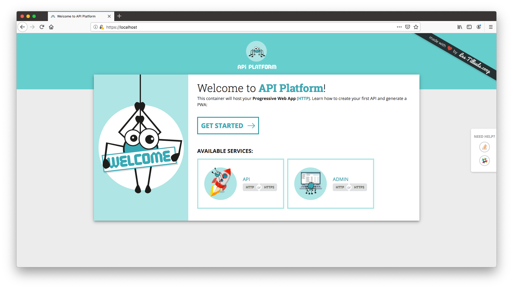
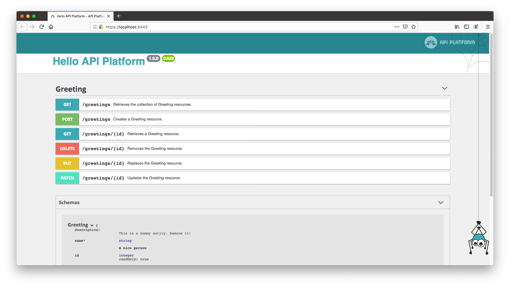
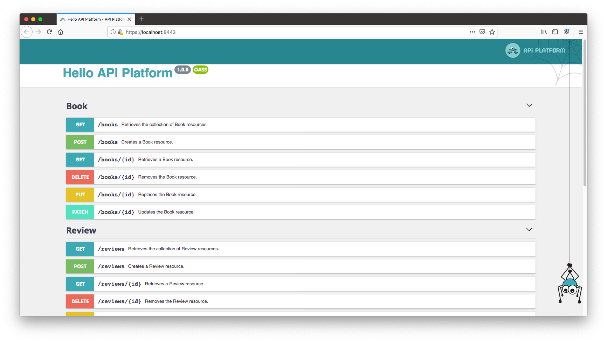
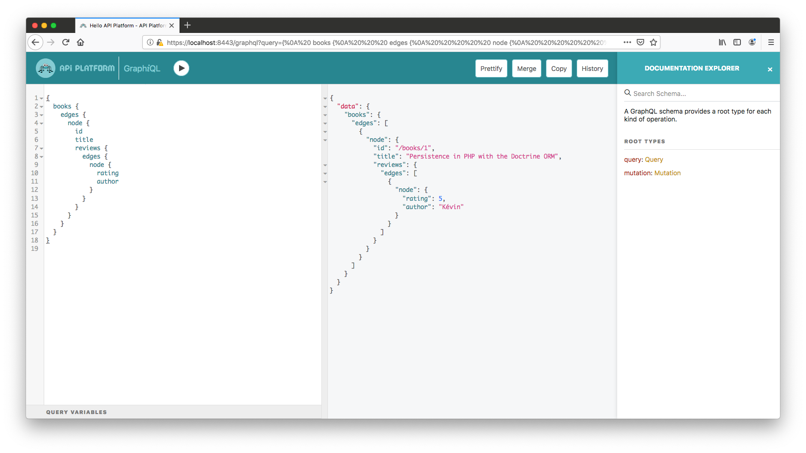
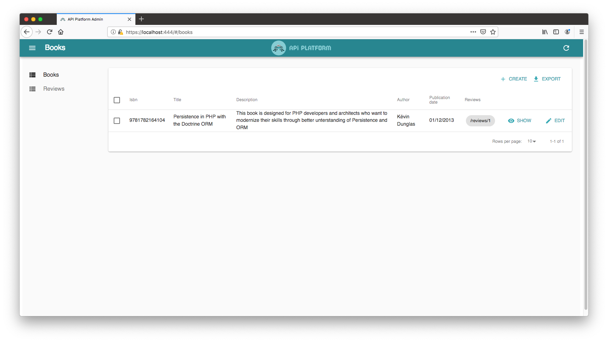
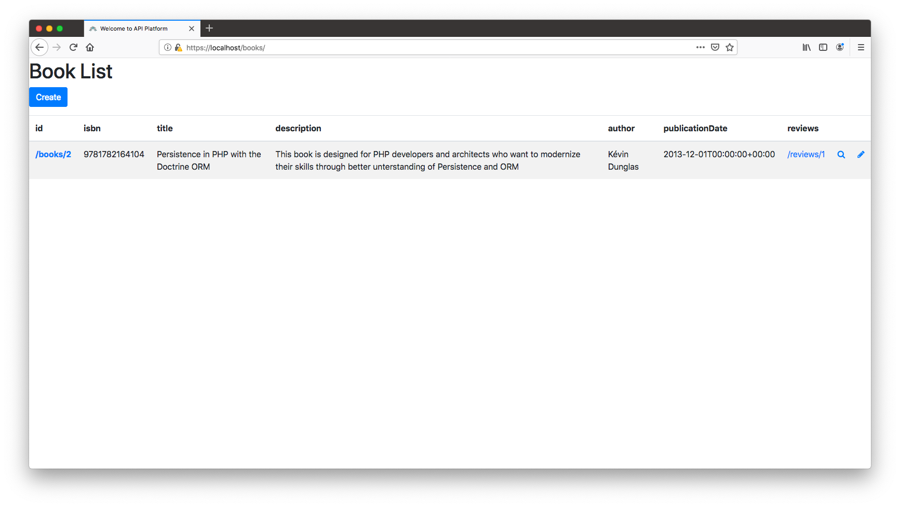

# Getting Started with API Platform: Hypermedia and GraphQL API, Admin and Progressive Web App



> *API Platform* is the most advanced API platform, in any framework or language.
>
> —Fabien Potencier (creator of Symfony), SymfonyCon 2017

[API Platform](https://api-platform.com) is a powerful but easy to use **full stack** framework dedicated to API-driven
projects. It contains a **PHP** library to create fully featured APIs supporting industry-leading standards ([JSON-LD](https://json-ld.org/) and **[Hydra](https://www.hydra-cg.com/)**, [GraphQL](https://graphql.org/), [OpenAPI](https://www.openapis.org/)...), provides ambitious **JavaScript** tooling to consume those APIs in a snap (admin, PWA and mobile
app generators, hypermedia client...) and is shipped with a nice **[Docker](https://www.docker.com/)** and **[Kubernetes](https://kubernetes.io/)**integration to develop and deploy instantly on the cloud.

The easiest and most powerful way to get started is to download the API Platform distribution. It contains:

* an API skeleton, including with [the server-side component](../core/index.md), [the Symfony 4
  microframework](https://symfony.com/doc/current/setup/flex.html) and [the Doctrine ORM](https://www.doctrine-project.org/projects/orm.html) (optional)
* [a dynamic JavaScript admin](../admin/), leveraging the hypermedia capabilities of API Platform (or any Hydra API), built on top of [React Admin](https://marmelab.com/react-admin/)
* [a client generator](../client-generator/) to scaffold [React](https://reactjs.org), [Vue](https://vuejs.org/), [React Native](https://facebook.github.io/react-native/), [Next.js](https://nextjs.org/) and [Quasar](https://quasar.dev/) apps in one command, from any Hydra API
* a [Docker](https://docker.com)-based setup to bootstrap the project in a single command, providing:
  * servers for the API and JavaScript apps
  * a [Varnish Cache](https://varnish-cache.org/) server enabling [API Platform's built-in invalidation cache mechanism](../core/performance.md#enabling-the-built-in-http-cache-invalidation-system)
  * a development HTTP/2 and HTTPS proxy (allowing, for instance, to test the provided [service workers](https://developer.mozilla.org/fr/docs/Web/API/Service_Worker_API))
  * a [Helm](https://helm.sh/) chart to deploy the API in any [Kubernetes](https://kubernetes.io/) cluster

To discover how the framework works, we will create an API to manage a bookshop.

To create a fully featured API, an admin interface and a Progressive Web App, we will only have to design the public data
model of our API and handcraft it as *Plain Old PHP Objects*.

API Platform uses these model classes to expose and document a web API having a bunch of built-in features:

* creating, retrieving, updating and deleting (CRUD) resources
* data validation
* pagination
* filtering
* sorting
* hypermedia/[HATEOAS](https://en.wikipedia.org/wiki/HATEOAS) and content negotiation support ([JSON-LD](https://json-ld.org) and [Hydra](https://www.hydra-cg.com/), [JSON:API](https://jsonapi.org/), [HAL](https://tools.ietf.org/html/draft-kelly-json-hal-08)...)
* [GraphQL support](https://graphql.org/)
* Nice UI and machine-readable documentations ([Swagger UI/OpenAPI](https://swagger.io), [GraphiQL](https://github.com/graphql/graphiql)...)
* authentication ([Basic HTTP](https://en.wikipedia.org/wiki/Basic_access_authentication), cookies as well as [JWT](https://jwt.io/)
  and [OAuth](https://oauth.net/) through extensions)
* [CORS headers](https://developer.mozilla.org/en-US/docs/Web/HTTP/Access_control_CORS)
* security checks and headers (tested against [OWASP recommendations](https://www.owasp.org/index.php/REST_Security_Cheat_Sheet))
* invalidation-based HTTP caching
* and basically everything needed to build modern APIs.

One more thing, before we start: as the API Platform distribution includes [the Symfony framework](https://symfony.com),
it is compatible with most [Symfony bundles](https://flex.symfony.com)
(plugins) and benefits from [the numerous extensions points](../core/extending.md) provided by this rock-solid foundation (events, DIC...).
Adding features like custom, service-oriented, API endpoints, JWT or OAuth authentication, HTTP caching, mail sending or
asynchronous jobs to your APIs is straightforward.

## Installing the Framework

### Using the API Platform Distribution (Recommended)

Start by [downloading the API Platform distribution `.tar.gz` file](https://github.com/api-platform/api-platform/releases/latest), or [generate a GitHub repository from the template we provide](https://github.com/api-platform/api-platform/generate).
Once you have extracted its contents, the resulting directory contains the API Platform project structure. You will add your own code and configuration inside it.

**Note**: Try to avoid using the `.zip` file, as it may cause potential [permission](https://github.com/api-platform/api-platform/issues/319#issuecomment-307037562) [issues](https://github.com/api-platform/api-platform/issues/777#issuecomment-412515342).

API Platform is shipped with a [Docker](https://docker.com) setup that makes it easy to get a containerized development
environment up and running. If you do not already have Docker on your computer, [it's the right time to install it](https://docs.docker.com/install/).

On Mac, only [Docker for Mac](https://docs.docker.com/docker-for-mac/) is supported.
Similarly, on Windows, only [Docker for Windows](https://docs.docker.com/docker-for-windows/) is supported. Docker Machine **is not** supported out of the box.

Open a terminal, and navigate to the directory containing your project skeleton. Run the following command to start all
services using [Docker Compose](https://docs.docker.com/compose/):

    $ docker-compose pull # Download the latest versions of the pre-built images
    $ docker-compose up -d # Running in detached mode

This starts the following services:

| Name     | Description                                                       | Port(s)                                                     | Environment(s)                                     |
|----------|-------------------------------------------------------------------|-------------------------------------------------------------|----------------------------------------------------|
| php      | The API with PHP, PHP-FPM 7.3, Composer and sensitive configs     | n/a                                                         | all                                                |
| db       | A PostgreSQL database server                                      | 5432                                                        | all (prefer using a managed service in prod)       |
| client   | A development server for the Progressive Web App                  | 80                                                          | dev (use a static website hosting service in prod) |
| admin    | A development server for the admin                                | 81                                                          | dev (use a static website hosting service in prod) |
| api      | The HTTP server for the API (NGINX)                               | 8080                                                        | all                                                |
| mercure  | The Mercure hub, [for real-time capabilities](../core/mercure.md) | 1337                                                        | all (prefer using the managed version in prod)     |
| h2-proxy | A HTTP/2 and HTTPS development proxy for all apps                 | 443 (client)<br>444 (admin)<br>8443 (api)<br>1338 (mercure) | dev (configure properly your web server in prod)   |

To see the container's logs, run:

    $ docker-compose logs -f # follow the logs

Project files are automatically shared between your local host machine and the container thanks to a pre-configured [Docker
volume](https://docs.docker.com/engine/tutorials/dockervolumes/). It means that you can edit files of your project locally
using your preferred IDE or code editor, they will be transparently taken into account in the container.
Speaking about IDEs, our favorite software to develop API Platform apps is [PHPStorm](https://www.jetbrains.com/phpstorm/)
with its awesome [Symfony](https://confluence.jetbrains.com/display/PhpStorm/Getting+Started+-+Symfony+Development+using+PhpStorm)
and [Php Inspections](https://plugins.jetbrains.com/plugin/7622-php-inspections-ea-extended-) plugins. Give them a try,
you'll get auto-completion for almost everything and awesome quality analysis.

The API Platform distribution comes with a dummy entity for test purpose: `api/src/Entity/Greeting.php`. We will remove
it later.

If you're used to the PHP ecosystem, you probably guessed that this test entity uses the industry-leading [Doctrine ORM](https://www.doctrine-project.org/projects/orm.html)
library as persistence system. It is shipped, in the API Platform distribution.
Doctrine ORM is the easiest way to persist and query data in an API Platform project thanks to the bridge shipped with the
distribution. It is optimized for performance and development convenience. For instance, when using Doctrine, API Platform
is able to automatically optimize the generated SQL queries by adding the appropriate `JOIN` clauses. It also provides a
lot of powerful built-in filters.
Doctrine ORM and its bridge support most popular RDBMS including PostgreSQL, MySQL, MariaDB, SQL Server, Oracle and SQLite.
There is also a shipped [Doctrine MongoDB ODM](https://www.doctrine-project.org/projects/mongodb-odm.html) optional support.

That being said, keep in mind that API Platform is 100% independent of the persistence system. You can use the one(s) that
best suit(s) your needs (including NoSQL databases or remote web services) by implementing the [right interfaces](../core/data-providers.md). API Platform even supports using several persistence
systems together in the same project.

### Using Symfony Flex and Composer (Advanced Users)

Alternatively, the API Platform server component can also be installed directly on a local machine.
**This method is recommended only for advanced users who want full control over the directory structure and the installed
dependencies.**

[For a good introduction, watch how to install API Platform without the distribution on SymfonyCasts](https://symfonycasts.com/screencast/api-platform/install?cid=apip).

The rest of this tutorial assumes that you have installed API Platform using the official distribution. Go straight to the
next section if it's your case.

API Platform has an official Symfony Flex recipe. It means that you can easily install it from any Flex-compatible Symfony
application using [Composer](https://getcomposer.org/):

    # Create a new Symfony Flex project
    $ composer create-project symfony/skeleton bookshop-api
    # Enter the project folder
    $ cd bookshop-api
    # Install the API Platform's server component in this skeleton
    $ composer req api

Then, create the database and its schema:

    $ bin/console doctrine:database:create
    $ bin/console doctrine:schema:create

And start the built-in PHP server:

    # Built-in PHP server
    $ php -S 127.0.0.1:8000 -t public

All JavaScript components are also [available as standalone libraries](https://github.com/api-platform?language=javascript)
installable with npm or Yarn.  

**Note:** when installing API Platform this way, the API will be exposed as the `/api/` path. You need to open `http://localhost:8000/api/` to see the API documentation. If you are deploying API Platform directly on an Apache or NGINX webserver and getting a 404 error on opening this link, you will need to enable the [rewriting rules](https://symfony.com/doc/current/setup/web_server_configuration.html) for your specific webserver software.

## It's Ready!

Open `https://localhost` in your favorite web browser:


You'll need to add a security exception in your browser to accept the self-signed TLS certificate that has been generated
for this container when installing the framework. Repeat this step for all other services available through HTTPS.

Later you will probably replace this welcome screen by the homepage of your Progressive Web App. If you don't plan to create
a Progressive Web App, you can remove the `client/` directory and the related lines in `docker-compose.yaml` (don't do it
now, we'll use this container later in this tutorial).

Click on the "HTTPS API" button, or go to `https://localhost:8443/`:



API Platform exposes a description of the API in the [OpenAPI](https://www.openapis.org/) format (formerly known as Swagger).
It also integrates a customized version of [Swagger UI](https://swagger.io/swagger-ui/), a nice interface rendering the
Open API documentation.
Click on an operation to display its details. You can also send requests to the API directly from the UI.
Try to create a new *Greeting* resource using the `POST` operation, then access it using the `GET` operation and, finally,
delete it by executing the `DELETE` operation.
If you access any API URL using a web browser, API Platform detects it (by scanning the `Accept` HTTP header) and displays
the corresponding API request in the UI. Try it yourself by browsing to `http://localhost:8080/greetings`. If the `Accept` header
doesn't contain `text/html` as the preferred format, a JSON-LD response is sent ([configurable behavior](../core/content-negotiation.md)).

So, if you want to access the raw data, you have two alternatives:

* Add the correct `Accept` header (or don't set any `Accept` header at all if you don't care about security) - preferred
  when writing API clients
* Add the format you want as the extension of the resource - for debug purpose only

For instance, go to `http://localhost:8080/greetings.jsonld` to retrieve the list of `Greeting` resources in JSON-LD, or to
`http://localhost:8080/greetings.json` to retrieve data in raw JSON.

Of course, you can also use your favorite HTTP client to query the API.
We are fond of [Postman](https://www.getpostman.com/). It works perfectly well with API Platform, has native Open API support,
allows to easily write functional tests and has good team collaboration features.

## Bringing your Own Model

Your API Platform project is now 100% functional. Let's expose our own data model.
Our bookshop API will start simple. It will be composed of a `Book` resource type and a `Review` one.

Books have an id, an ISBN, a title, a description, an author, a publication date and are related to a list of reviews.
Reviews have an id, a rating (between 0 and 5), a body, an author, a publication date and are related to one book.

Let's describe this data model as a set of Plain Old PHP Objects (POPO) and map it to database tables using annotations
provided by the Doctrine ORM:

```php
<?php
// api/src/Entity/Book.php

namespace App\Entity;

use Doctrine\Common\Collections\ArrayCollection;
use Doctrine\ORM\Mapping as ORM;

/**
 * A book.
 *
 * @ORM\Entity
 */
class Book
{
    /**
     * @var int The id of this book.
     *
     * @ORM\Id
     * @ORM\GeneratedValue
     * @ORM\Column(type="integer")
     */
    private $id;

    /**
     * @var string|null The ISBN of this book (or null if doesn't have one).
     *
     * @ORM\Column(nullable=true)
     */
    public $isbn;

    /**
     * @var string The title of this book.
     *
     * @ORM\Column
     */
    public $title;

    /**
     * @var string The description of this book.
     *
     * @ORM\Column(type="text")
     */
    public $description;

    /**
     * @var string The author of this book.
     *
     * @ORM\Column
     */
    public $author;

    /**
     * @var \DateTimeInterface The publication date of this book.
     *
     * @ORM\Column(type="datetime")
     */
    public $publicationDate;

    /**
     * @var Review[] Available reviews for this book.
     *
     * @ORM\OneToMany(targetEntity="Review", mappedBy="book", cascade={"persist", "remove"})
     */
    public $reviews;
    
    public function __construct()
    {
        $this->reviews = new ArrayCollection();
    }

    public function getId(): ?int
    {
        return $this->id;
    }
}
```

```php
<?php
// api/src/Entity/Review.php

namespace App\Entity;

use Doctrine\ORM\Mapping as ORM;

/**
 * A review of a book.
 *
 * @ORM\Entity
 */
class Review
{
    /**
     * @var int The id of this review.
     *
     * @ORM\Id
     * @ORM\GeneratedValue
     * @ORM\Column(type="integer")
     */
    private $id;

    /**
     * @var int The rating of this review (between 0 and 5).
     *
     * @ORM\Column(type="smallint")
     */
    public $rating;

    /**
     * @var string the body of the review.
     *
     * @ORM\Column(type="text")
     */
    public $body;

    /**
     * @var string The author of the review.
     *
     * @ORM\Column
     */
    public $author;

    /**
     * @var \DateTimeInterface The date of publication of this review.
     *
     * @ORM\Column(type="datetime")
     */
    public $publicationDate;

    /**
     * @var Book The book this review is about.
     *
     * @ORM\ManyToOne(targetEntity="Book", inversedBy="reviews")
     */
    public $book;

    public function getId(): ?int
    {
        return $this->id;
    }
}
```

**Tip**: you can also use Symfony [MakerBundle](https://symfony.com/doc/current/bundles/SymfonyMakerBundle/index.html) thanks to the `--api-resource` option:

    $ docker-compose exec php bin/console make:entity --api-resource

As you can see there are two typical PHP objects with the corresponding PHPDoc (note that entities' and properties' descriptions
included in their PHPDoc will appear in the API documentation).

Doctrine's annotations map these entities to tables in the database. Annotations are convenient as they allow grouping
the code and the configuration but, if you want to decouple classes from their metadata, you can switch to XML or YAML mappings.
They are supported as well.

Learn more about how to map entities with the Doctrine ORM in [the project's official documentation](https://docs.doctrine-project.org/projects/doctrine-orm/en/latest/reference/association-mapping.html)
or in Kévin's book "[Persistence in PHP with the Doctrine ORM](https://www.amazon.fr/gp/product/B00HEGSKYQ/ref=as_li_tl?ie=UTF8&camp=1642&creative=6746&creativeASIN=B00HEGSKYQ&linkCode=as2&tag=kevidung-21)".

For the sake of simplicity, in this example we used public properties (except for the id, see below). API Platform as well
as Doctrine also support accessor methods (getters/setters), use them if you want to.
We used a private property for the id and a getter for the id to enforce the fact that it is read only (the ID will be generated
by the RDMS because of the `@ORM\GeneratedValue` annotation). API Platform also has first-grade support for UUIDs. [You should
probably use them instead of auto-incremented ids](https://www.clever-cloud.com/blog/engineering/2015/05/20/why-auto-increment-is-a-terrible-idea/).

Then, delete the file `api/src/Entity/Greeting.php`. This demo entity isn't useful anymore.
Finally, tell Doctrine to sync the database tables structure with our new data model:

    $ docker-compose exec php bin/console doctrine:schema:update --force


The `php` container is where your API app stands. Prefixing a command by `docker-compose exec php` allows to execute the
given command in this container. You may want [to create an alias](http://www.linfo.org/alias.html) to make your life easier.

Later, you'll want to use [Doctrine Migrations](https://symfony.com/doc/current/doctrine.html#migrations-creating-the-database-tables-schema)
when changing the database's structure.

We now have a working data model that you can persist and query. To create an API endpoint with CRUD capabilities corresponding
to an entity class, we just have to mark it with an annotation called `@ApiResource`:

```php
<?php
// api/src/Entity/Book.php

namespace App\Entity;

use ApiPlatform\Core\Annotation\ApiResource;

/**
 * ...
 *
 * @ApiResource
 */
class Book
{
    // ...
}
```

```php
<?php
// api/src/Entity/Review.php

namespace App\Entity;

use ApiPlatform\Core\Annotation\ApiResource;

/**
 * ...
 *
 * @ApiResource
 */
class Review
{
    // ...
}
```

**Our API is (almost) ready!**
Browse `https://localhost:8443` to load the development environment (including the awesome [Symfony profiler](https://symfony.com/blog/new-in-symfony-2-8-redesigned-profiler)).



Operations available for our 2 resource types appear in the UI.

Click on the `POST` operation of the `Book` resource type, click on "Try it out" and send the following JSON document as request body:

```json
{
  "isbn": "9781782164104",
  "title": "Persistence in PHP with the Doctrine ORM",
  "description": "This book is designed for PHP developers and architects who want to modernize their skills through better understanding of Persistence and ORM.",
  "author": "Kévin Dunglas",
  "publicationDate": "2013-12-01"
}
```

You just saved a new book resource through the bookshop API! API Platform automatically transforms the JSON document to
an instance of the corresponding PHP entity class and uses Doctrine ORM to persist it in the database.

By default, the API supports `GET` (retrieve, on collections and items), `POST` (create), `PUT` (replace), `PATCH` (partial update) and `DELETE` (self-explanatory)
HTTP methods. Don't forget to [disable the ones you don't want](../core/operations.md#enabling-and-disabling-operations)!

Try the `GET` operation on the collection. The book we added appears. When the collection contains more than 30 items,
the pagination will automatically show up, [and this is entirely configurable](../core/pagination.md). You may be interested
in [adding some filters and adding sorts to the collection](../core/filters.md) as well.

You may have noticed that some keys start with the `@` symbol in the generated JSON response (`@id`, `@type`, `@context`...)?
API Platform comes with a full support of the [JSON-LD](https://json-ld.org/) format (and its [Hydra](https://www.hydra-cg.com/)
extension). It allows to build smart clients, with auto-discoverability capabilities such as the API Platform Admin that
we will discover in a few lines.
It is useful for open data, SEO and interoperability, especially when [used with open vocabularies such as Schema.org](http://blog.schema.org/2013/06/schemaorg-and-json-ld.html)
and allows to [give access to Google to your structured data](https://developers.google.com/search/docs/guides/intro-structured-data)
or to query your APIs in [SPARQL](https://en.wikipedia.org/wiki/SPARQL) using [Apache Jena](https://jena.apache.org/documentation/io/#formats)).

We think that JSON-LD is the best default format for a new API.
However, API Platform natively [supports many other formats](../core/content-negotiation.md) including [GraphQL](https://graphql.org/)
(we'll get to it), [JSON API](https://jsonapi.org/), [HAL](https://github.com/zircote/Hal), raw [JSON](https://www.json.org/),
[XML](https://www.w3.org/XML/) (experimental) and even [YAML](https://yaml.org/) and [CSV](https://en.wikipedia.org/wiki/Comma-separated_values).
You can also easily [add support for other formats](../core/content-negotiation.md) and it's up to you to choose which format
to enable and to use by default.

Now, add a review for this book using the `POST` operation for the `Review` resource:

```json
{
    "book": "/books/1",
    "rating": 5,
    "body": "Interesting book!",
    "author": "Kévin",
    "publicationDate": "September 21, 2016"
}
```
**Note:** If you have installed API Platform in an existing project using `composer`, the content of the key `book` must be `"/api/books/1"`

There are two interesting things to mention about this request:

First, we learned how to work with relations. In a hypermedia API, every resource is identified by an (unique) [IRI](https://en.wikipedia.org/wiki/Internationalized_Resource_Identifier).
A URL is a valid IRI, and it's what API Platform uses. The `@id` property of every JSON-LD document contains the IRI identifying
it. You can use this IRI to reference this document from other documents. In the previous request, we used the IRI of the
book we created earlier to link it with the `Review` we were creating. API Platform is smart enough to deal with IRIs.
By the way, you may want to [embed documents](../core/serialization.md) instead of referencing them
(e.g. to reduce the number of HTTP requests). You can even [let the client select only the properties it needs](../core/filters.md#property-filter).

The other interesting thing is how API Platform handles dates (the `publicationDate` property). API Platform understands
[any date format supported by PHP](https://www.php.net/manual/en/datetime.formats.date.php). In production we strongly recommend
using the format specified by the [RFC 3339](https://tools.ietf.org/html/rfc3339), but, as you can see, most common formats
including `September 21, 2016` can be used.

To summarize, if you want to expose any entity you just have to:

1. Put it in the `Entity` directory of a bundle
2. If you use Doctrine, map it with the database
3. Mark it with the `@ApiPlatform\Core\Annotation\ApiResource` annotation

Could it be any easier?!

## Validating Data

Now try to add another book by issuing a `POST` request to `/books` with the following body:

```json
{
  "isbn": "2815840053",
  "description": "Hello",
  "author": "Me",
  "publicationDate": "today"
}
```

Oops, we forgot to add the title. Submit the request anyway, you should get a 500 error with the following message:

    An exception occurred while executing 'INSERT INTO book [...] VALUES [...]' with params [...]:
    SQLSTATE[23000]: Integrity constraint violation: 1048 Column 'title' cannot be null

Did you notice that the error was automatically serialized in JSON-LD and respects the Hydra Core vocabulary for errors?
It allows the client to easily extract useful information from the error. Anyway, it's bad to get a SQL error when submitting
a request. It means that we didn't use a valid input, and [it's a bad and dangerous practice](https://github.com/OWASP/CheatSheetSeries/blob/master/cheatsheets/Input_Validation_Cheat_Sheet.md).

API Platform comes with a bridge with [the Symfony Validator Component](https://symfony.com/doc/current/validation.html).
Adding some of [its numerous validation constraints](https://symfony.com/doc/current/validation.html#supported-constraints)
(or [creating custom ones](https://symfony.com/doc/current/validation/custom_constraint.html)) to our entities is enough
to validate user-submitted data. Let's add some validation rules to our data model:

```php
<?php
// api/src/Entity/Book.php

namespace App\Entity;

use Symfony\Component\Validator\Constraints as Assert;

// ...
class Book
{
    /**
     * ...
     * @Assert\Isbn
     */
    public $isbn;

    /**
     * ...
     * @Assert\NotBlank
     */
    public $title;

    /**
     * ...
     * @Assert\NotBlank
     */
    public $description;

    /**
     * ...
     * @Assert\NotBlank
     */
    public $author;

    /**
     * ...
     * @Assert\NotNull
     */
    public $publicationDate;

    // ...
}
```

```php
<?php
// api/src/Entity/Review.php

namespace App\Entity;

use Symfony\Component\Validator\Constraints as Assert;

// ...
class Review
{
    /**
     * ...
     * @Assert\Range(min=0, max=5)
     */
    public $rating;

    /**
     * ...
     * @Assert\NotBlank
     */
    public $body;

    /**
     * ...
     * @Assert\NotBlank
     */
    public $author;

    /**
     * ...
     * @Assert\NotNull
     */
    public $publicationDate;

    /**
     * ...
     * @Assert\NotNull
     */
    public $book;

    // ...
}
```

After updating the entities by adding those `@Assert\*` annotations (as with Doctrine, you can also use XML or YAML), try
again the previous `POST` request.

```json
{
  "@context": "/contexts/ConstraintViolationList",
  "@type": "ConstraintViolationList",
  "hydra:title": "An error occurred",
  "hydra:description": "isbn: This value is neither a valid ISBN-10 nor a valid ISBN-13.\ntitle: This value should not be blank.",
  "violations": [
    {
      "propertyPath": "isbn",
      "message": "This value is neither a valid ISBN-10 nor a valid ISBN-13."
    },
    {
      "propertyPath": "title",
      "message": "This value should not be blank."
    }
  ]
}
```

You now get proper validation error messages, always serialized using the Hydra error format ([RFC 7807](https://tools.ietf.org/html/rfc7807)
is also supported).
Those errors are easy to parse client-side. By adding the proper validation constraints, we also noticed that the provided
ISBN isn't valid...

## Adding GraphQL Support

Isn't API Platform a REST **and** GraphQL framework? That's true! GraphQL support isn't enabled by default. To add it we
need to install the [graphql-php](https://webonyx.github.io/graphql-php/) library. Run the following command (the cache needs to be cleared twice):

    $ docker-compose exec php composer req webonyx/graphql-php && docker-compose exec php bin/console cache:clear

You now have a GraphQL API! Open `https://localhost:8443/graphql` (or `https://localhost:8443/api/graphql` if you used Symfony Flex to install API Platform) to play with it using the nice [GraphiQL](https://github.com/graphql/graphiql)
UI that is shipped with API Platform:



Try it out by creating a greeting:

```graphql
mutation {
  createGreeting(input: {name: "Test2"}) {
    greeting {
      id
      name
    }
  }
}
```

And by reading out the greeting:
```graphql
{
  greeting(id: "/greetings/1") {
    id
    name
    _id
  }
}
```

The GraphQL implementation supports [queries](https://graphql.org/learn/queries/), [mutations](https://graphql.org/learn/queries/#mutations),
[100% of the Relay server specification](https://facebook.github.io/relay/docs/en/graphql-server-specification.html), pagination,
[filters](../core/filters.md) and [access control rules](../core/security.md).
You can use it with the popular [RelayJS](https://facebook.github.io/relay/) and [Apollo](https://www.apollographql.com/docs/react/)
clients.

## The Admin

Wouldn't it be nice to have an administration backend to manage the data exposed by your API?
Wait... You already have one!

Open `https://localhost:444` in your browser:



This [Material Design](https://material.io/guidelines/) admin is a [Progressive Web App](https://developers.google.com/web/progressive-web-apps/)
built with [API Platform Admin](../admin/index.md) (React Admin, React and Redux inside). It is powerful and fully customizable.
Refer to its documentation to learn more.
It leverages the Hydra documentation exposed by the API component to build itself. It's 100% dynamic - **no code generation
occurs**.

## A React Progressive Web App

API Platform also has an awesome [client generator](../client-generator/index.md) able to scaffold fully working React/Redux
and [Vue.js](https://vuejs.org/) Progressive Web Apps that you can easily tune and customize. The generator also supports
[React Native](https://facebook.github.io/react-native/) if you prefer to leverage all capabilities of mobile devices.

The distribution comes with a skeleton ready to welcome the React flavor of the generated code. To bootstrap your app, run:

    $ docker-compose exec client generate-api-platform-client

Open `client/src/index.js` and follow the copy/pasting instructions displayed in the console. Then open `https://localhost/books/`
in your browser:



You can also choose to generate the code for a specific resource with the `--resource` argument (example:
`generate-api-platform-client --resource books`). 

The generated code contains a list (including pagination), a delete button, a creation and an edition form. It also includes
[Bootstrap 4](https://getbootstrap.com) markup and [ARIA roles](https://developer.mozilla.org/en-US/docs/Web/Accessibility/ARIA)
to make the app usable by people with disabilities.

If you prefer to generate a PWA built on top of Vue.js, or a native mobile app, read [the dedicated documentation](../client-generator/index.md).

## Hooking Your Own Business Logic

Now that you learned the basics, be sure to read [the general design considerations](../core/design.md) and [how to extend API Platform](../core/extending.md) to understand how API Platform is designed, and how to hook your custom business logic!

## Other Features

First, you may want to learn [how to deploy your application](../deployment/index.md) in the cloud using [the built-in Kubernetes
integration](../deployment/kubernetes.md).

Then, there are many more features to learn! Read [the full documentation](../core/index.md) to discover how to use them
and how to extend API Platform to fit your needs.
API Platform is incredibly efficient for prototyping and Rapid Application Development (RAD), but the framework is mostly
designed to create complex API-driven projects, far beyond simple CRUD apps. It benefits from [**strong extension points**](../core/extending.md)
and it is **continuously optimized for [performance](../core/performance.md).** It powers numerous high traffic websites.

API Platform has a built-in HTTP cache invalidation system which allows to make API Platform apps blazing fast, and it uses
[Varnish](https://varnish-cache.org/) by default. Read more in the chapter
[API Platform Core Library: Enabling the Built-in HTTP Cache Invalidation System](../core/performance.md#enabling-the-built-in-http-cache-invalidation-system).

Keep in mind that you can use your favorite client-side technology: API Platform provides React and Vue.js components, but you can use your preferred client-side technology including Angular, Ionic and Swift. Any language able to send HTTP
requests is OK (even COBOL can do that).

To go further, the API Platform team maintains a demo application showing more advanced use cases like leveraging serialization
groups, user management or JWT and OAuth authentication. [Checkout the demo code source on GitHub](https://github.com/api-platform/demo)
and [browse it online](https://demo.api-platform.com).

## Screencasts

<p align="center" class="symfonycasts"><a href="https://symfonycasts.com/tracks/rest?cid=apip#api-platform"></a></p>

The easiest and funniest way to learn how to use API Platform is to watch [the more than 60 screencasts available on SymfonyCasts](https://symfonycasts.com/tracks/rest?cid=apip#api-platform)!
