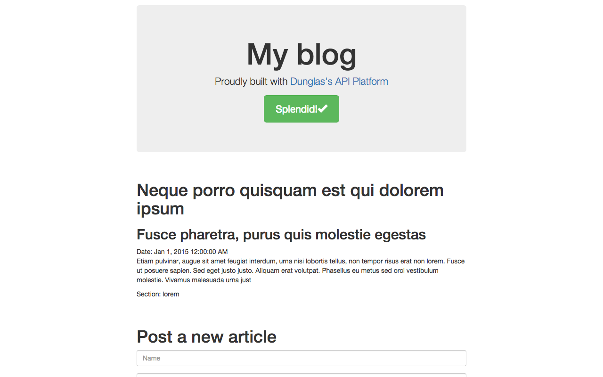

# Creating your first API with API Platform

In this tutorial, we will create a typical blog application with API Platform.

If you are in a hurry, a demo is available online and all sources created during this tutorial are available on GitHub:

* the blog API : [demo](https://api-platform-demo-blog-api.herokuapp.com) (we recommend to browse it with [Postman](http://getpostman.com))
  / [sources](https://github.com/dunglas/blog-api)
* the Angular client: [demo](https://dunglas.github.io/blog-client/) / [sources](https://github.com/dunglas/blog-client)



To create the API-side of our project we will:

* Bootstrap a fully featured and working data model including ORM mapping, validation rules and semantic metadata with the
  generator provided by API platform (of course you can also handcraft your data model or modify the generated one to fit
  your needs).
* Expose this data model trough a read/write (CRUD) API following JSON-LD and [Hydra Core Vocabulary](http://www.hydra-cg.com/)
  open standards, having Schema.org metadata and with a ton of features out of the box: pagination, validation, error serialization,
  filters and a lot of other awesome features (here too, everything is extensible thanks to a powerful event system and
  strong OOP).

Then we will develop a tiny AngularJS webapp to illustrate how to create and consume data from the API. Keep in mind that
you can use your preferred client-side technology (tested and approved with Angular, React, Ionic, Swift but can work with
any language able to send HTTP requests).

## Prerequisites

Only PHP 5.5+ must be installed to run API Platform. A built-in web server is shipped with the framework for the
development environment.

To follow this tutorial a database must be installed (but its not a strong dependency of the framework). We recommend MySQL
or MariaDB but other major DBMS are supported including SQLite, PostgreSQL, Oracle and SQL server are supported trough
[Doctrine](http://doctrine-project.org).

## Installing the framework

Let's start our new blog API project. The easiest way to create a new project is to use [Composer](https://getcomposer.org/)
(you need to have it installed on your box):

    composer create-project api-platform/api-platform blog-api

Composer creates the skeleton of the new blog API then retrieve the framework and all its dependencies.

At the end of the installation, you will be prompted for some configuration parameters including database credentials.
All configuration parameters can be changed later by editing the `app/config/parameters.yml` file.

API Platform is pre-configured to use the popular [Doctrine ORM](http://www.doctrine-project.org/projects/orm.html).
It is supported natively by all API Platform components. However the Doctrine ORM is fully optional: you can replace it
by your favorite ORM, no ORM at all and even no database.

The installer will ask for:

* mail server credentials (to send mails)
* the locale of the application
* the URL of your default web client application to automatically set appropriate [CORS](http://en.wikipedia.org/wiki/Cross-origin_resource_sharing)
  headers, **set it to `http://locahost:9000` (the default URL of the built-in Grunt server) to follow this tutorial**
* a name and a description of the API that will be used in the generated documentation
* a secret token (choose a long one) for cryptographic features

Take a look at [the content of the generated directory](https://github.com/dunglas/blog-api). You should recognize a [Symfony
application directory structure](https://symfony.com/doc/current/quick_tour/the_architecture.html). It's fine and intended:
**the generated skeleton is a perfectly valid Symfony full-stack application** that follows [Symfony Best Practices](https://symfony.com/doc/current/best_practices/index.html).
It means that you can:

* [use thousands of exiting Symfony bundles](http://knpbundles.com) with API Platform
* use API Platform in any existing Symfony application
* reuse all your Symfony skills and benefit of the high quality [Symfony documentation](https://symfony.com/doc/current/index.html)

The skeleton comes with a demonstration bookstore API. Remove it:

* empty `app/config/schema.yml` and  `app/config/services.yml`
* delete all files in the `src/AppBundle/Entity/` directory

## Generating the data model

The first incredibly useful tool provided by API platform is [its data model generator](../shema-generator/index.md).
This API Platform component can also be used standalone to bootstrap any PHP data model.

To kickstart our blog data model we browse [Schema.org](http://schema.org) and find an existing schema that describe perfectly
what we want: [https://schema.org/BlogPosting](https://schema.org/BlogPosting)

The `schema` command line tool will instantly generate a PHP data model from the [Schema.org](http://schema.org/) vocabulary:

Browse Schema.org, choose the types and properties you need (there is a bunch of schemas available), run our code generator. You're done! You get a fully featured PHP data model including:

* A set of PHP entities with properties, constants (enum values), getters, setters, adders and removers. The class hierarchy
  provided by Schema.org will be translated to a PHP class hierarchy with parents as `abstract` classes. The generated code
  complies with [PSR](http://www.php-fig.org/) coding standards.
* Full high-quality PHPDoc for classes, properties, constants and methods extracted from Schema.org.
* Doctrine ORM annotation mapping including database columns with type guessing, relations with cardinality guessing, class
  inheritance (through the `@AbstractSuperclass` annotation).
* Data validation through [Symfony Validator](https://symfony.com/doc/current/book/validation.html) annotations including
  data type validation, enum support (choices) and check for required properties.
* Interfaces and [Doctrine `ResolveTargetEntityListener`](http://doctrine-orm.readthedocs.org/en/latest/cookbook/resolve-target-entity-listener.html)
  support.
* List of values provided by Schema.org with [PHP Enum](https://github.com/myclabs/php-enum) classes.

Reusing an existing semantic schema has many advantages:

**Don't Reinvent The Wheel**

Data models provided by Schema.org are popular and have been proved efficient. They cover a broad spectrum of topics including
creative work, e-commerce, event, medicine, social networking, people, postal address, organization, place or review. Schema.org
has its root in [a ton of preexisting well designed vocabularies](http://schema.rdfs.org/mappings.html) and is successfully
used by more and more website and applications.

Pick up schemas applicable to your application, generate your PHP model, then customize and specialize it to fit your needs.

**Improve SEO and user experience**

Adding Schema.org markup to websites and apps increase their ranking in search engines results and enable awesome features
such as [Google Rich Snippets](https://support.google.com/webmasters/answer/99170?hl=en) and [Gmail markup](https://developers.google.com/gmail/markup/overview).

Mapping your app data model to Schema.org structures can be a tedious task. Using the generator, your data model will be
a derived from Schema.org. Serializing your data as JSON-LD will not require specific mapping nor adaptation. It's a matter
of minutes.

**Be ready for the future**

Schema.org improves the interoperability of your applications. Used with hypermedia technologies such as [Hydra](http://www.hydra-cg.com/)
it's a big step towards the semantic and machine readable web. It opens the way to generic web API clients able to extract
and process data from any website or app using such technologies.

To generate our data model form Schema.org types, we must create a YAML configuration file for PHP schema:

```yaml
# app/config/schema.yml
 
annotationGenerators: # Generators we want to use, keep it as is for any API Platform project
    - ApiPlatform\SchemaGenerator\AnnotationGenerator\PhpDocAnnotationGenerator
    - ApiPlatform\SchemaGenerator\AnnotationGenerator\DoctrineOrmAnnotationGenerator
    - ApiPlatform\SchemaGenerator\AnnotationGenerator\ConstraintAnnotationGenerator
    - ApiPlatform\SchemaGenerator\AnnotationGenerator\DunglasApiAnnotationGenerator
namespaces:
  entity: AppBundle\Entity # The default namespace for entities, following API Platform and Symfony best practices
types: # The list of type to generated (a PHP entity class by type will be generated)
  BlogPosting: ~ # A type to generate a PHP entity class from, including all its properties (here this type has no specific property, they are all inherited)
  Article: # Schema.org has an inheritance system, we will configure all types of the hierarchy
    properties: # The list of properties we want to use
      articleBody: ~
      articleSection: ~
  CreativeWork:
    properties:
      author:
        range: Person # PHP Schema handle relations. Here we force the type of the property to Person
        cardinality: (*..0) # Force the cardinality of the relation
      headline: ~
      isFamilyFriendly: ~
      datePublished: ~
  Thing:
    properties:
      name: ~
  Person: # Person is a relation of the "CreativeWork" type (property "author"), PHP Schema will generate relations for us
    properties: {} # We don't want any specific property for a person except "name" inherited from Thing
Then execute the generator:
```

Then execute the generator:

    bin/schema generate-types src/ app/config/schema.yml

Take a look at the content of the [src/AppBundle/Entity/](https://github.com/dunglas/blog-api/tree/master/src/AppBundle/Entity) directory. PHP Schema generated for us a set of Plain-Old-PHP entities representing our data model. As promised our entities include:

* type documentation from Schema.org and converted it to PHPDoc
* Doctrine ORM mapping annotations (including for relations)
* Symfony validation annotations
* Schema.org IRI mapping (the @Iri annotations), we will see later that the API bundle use them to expose structured semantic
  data
* and they follow the [PSR-2 coding style](http://www.php-fig.org/psr/psr-2/)

The data model is fully functional. You can hack it (modify entities, properties, indexes, validation rules...), or use it
as is!

Ask Doctrine to create the database of the project:

    app/console doctrine:database:create

Then generate database tables related to the generated entities:

    app/console doctrine:schema:create

PHP Schema provides a lot of configuration options. Take a look at [its dedicated documentation](../schema-generator/index.md).
Keep in mind that PHP Schema is also available as a standalone tool (and a PHAR will be available soon) and can be used
to bootstrap any PHP project (works fine with raw PHP, API Platform and Symfony but has an extension mechanism allowing
to use it with other technologies such as Zend Framework and Laravel).

Sometimes we will have to make a data model with very specific business types, not available in Schema.org. Sometimes we
will find Schema.org types that partially matches what we want but needs to be adapted.

Keep in mind that you can always create your very own data model from scratch. It's perfectly OK and you can still use API
Platform without PHP Schema.

Anyway, PHP Schema is a tool intended **to bootstrap** the data model. You can and **you will** edit manually generated
PHP entities. When you start to edit manually the generated files, be careful to not run the generator again, it will
overwrite your changes (this behavior will be enhanced in future versions). When you do such things, the best to do is to
remove `dunglas/php-schema` from your `composer.json` file.

## Exposing the API

We have a working data model backed by a database. Now we will create a hypermedia REST API thanks to another component
of API Platform: **[ApiBundle](../api-bundle/index.md)**.

As PHP Schema, it is already preinstalled and properly configured. We just need to declare resources we want to expose.

Exposing a resource collection basically consist to register a new [Symfony service](https://symfony.com/doc/current/book/service_container.html).
For our blog app we will expose trough the API the two entity classes generated by PHP Schema: `BlogPosting` (blog post)
and `Person` (author of the post):

```yaml
# app/config/services.yml
 
services:
    resource.blog_posting:
        parent:    "api.resource"
        arguments: [ "AppBundle\\Entity\\BlogPosting" ]
        tags:      [ { name: "api.resource" } ]
 
    resource.person:
        parent:    "api.resource"
        arguments: [ "AppBundle\\Entity\\Person" ]
        tags:      [ { name: "api.resource" } ]
```

And our API is already finished! How would it be easier?

Start the integrated development web server: `app/console server:start`

Then open `http://localhost:8000/doc` with a web browser:

]

Thanks to [NelmioApiDocBundle](https://github.com/nelmio/NelmioApiDocBundle) support of ApiBundle and its integration
with API Platform, you get for a free **an automatically generated human-readable documentation** of the API (Swagger-like).
The doc also **includes a sandbox** to try the API.

You can also use your favorite HTTP client to query the API. I strongly recommend [Postman](https://www.getpostman.com).
It is lower level than the sandbox and will allow to inspect forge and inspect JSON requests and responses easily.

Open `http://localhost:8000` with Postman. This URL is the entry point of the API. It gives to access to all exposed
resources. As you can see, the API returns minified JSON-LD. For better readability, JSON snippets have been prettified
in this document.

## Trying the API

Add a person named Kévin by issuing a POST request on `http://localhost:8000/users` with the following JSON document as
raw body:

```json
{"name": "Kévin"}
```

The data is inserted in database. The server replies with a JSON-LD representation of the freshly created resource. Thanks to PHP Schema, the <span id="crayon-559138917f5b1290623877" class="crayon-syntax crayon-syntax-inline  crayon-theme-classic crayon-theme-classic-inline crayon-font-monaco" style="font-size: 12px !important; line-height: 15px !important;font-size: 12px !important;"><span class="crayon-pre crayon-code" style="font-size: 12px !important; line-height: 15px !important;font-size: 12px !important; -moz-tab-size:4; -o-tab-size:4; -webkit-tab-size:4; tab-size:4;"><span class="crayon-sy">@</span><span class="crayon-v">type</span></span></span> property of the JSON-LD document is referencing a Schema.org type:

```json
{
    "@context": "/contexts/Person",
    "@id": "/people/1",
    "@type": "http://schema.org/Person",
    "name": "Kévin"
}
```

The JSON-LD spec is fully supported by the bundle. Want a proof? Browse `http://localhost:8000/contexts/Person`.

By default, the API allows `GET` (retrieve, on collections and items), `POST` (create), `PUT` (update) and `DELETE` (self-explaining)
HTTP methods. [You can add and remove any other operation you want](../api-bundle/operations.md).
Try it!

Now, browse `http://localhost:8000/people`:

```json
{
    "@context": "/contexts/Person",
    "@id": "/people",
    "@type": "hydra:PagedCollection",
    "hydra:totalItems": 1,
    "hydra:itemsPerPage": 30,
    "hydra:firstPage": "/people",
    "hydra:lastPage": "/people",
    "hydra:member": [
        {
            "@id": "/people/1",
            "@type": "http://schema.org/Person",
            "name": "Kévin"
        }
    ]
}
```

Pagination is also supported (and enabled) out of the box.

It's time to post our first article. Run a POST request on `http://locahost:8000/blog_posting` with the following JSON document
as body:

```json
{
    "name": "API Platform is great",
    "headline": "You'll love that framework!",
    "articleBody": "The body of my article.",
    "articleSection": "technology",
    "author": "/people/1",
    "isFamilyFriendly": "maybe",
    "datePublished": "2015-05-11"
}
```

Oops... the `isFamilyFriendly` property is a boolean. Our JSON contains an incorrect string. Fortunately the bundle is smart
enough to detect the error: it uses Symfony validation annotations generated by PHP Schema previously. It returns a detailed
error message in the Hydra error serialization format:

```json
{
    "@context": "/contexts/ConstraintViolationList",
    "@type": "ConstraintViolationList",
    "hydra:title": "An error occurred",
    "hydra:description": "isFamilyFriendly: This value should be of type boolean.\n",
    "violations": [
        {
            "propertyPath": "isFamilyFriendly",
            "message": "This value should be of type boolean."
        }
    ]
}
```

Correct the body and send the request again:

```json
{
    "name": "API Platform is great",
    "headline": "You'll love that framework!",
    "articleBody": "The body of my article.",
    "articleSection": "technology",
    "author": "/people/1",
    "isFamilyFriendly": true,
    "datePublished": "2015-05-11"
}
```

We fixed it! By the way you learned how to to work with relations. In a hypermedia API, every resource is identified with
an unique IRI (an URL is a an IRI). They are in the `@id` property of every JSON-LD document generated by the API and you
can use it as reference to set relations like we done in the previous snippet for the author property.

API Platform is smart enough to understand [any date format supported by PHP](http://php.net/manual/en/datetime.formats.date.php)
date functions. In production we recommend the format specified by the [RFC 3339](http://tools.ietf.org/html/rfc3339).

We already have a powerful hypermedia REST API (always without writing a single line of PHP), but there is more.

**Our API is auto-discoverable**. Open `http://localhost:8000/vocab` and take a look at the content. Capabilities of the
API are fully described in a machine-readable format: available resources, properties and operations, description of elements,
readable and writable properties, types returned and expected...

As for errors, the whole API is described using [the Hydra Core Vocabulary](http://www.w3.org/ns/hydra/spec/latest/core/),
an open web standard for describing hypermedia REST APIs in JSON-LD. Any Hydra-compliant client or library is able to interact
with the API without knowing anything about it! The most popular Hydra client is [Hydra Console](http://www.markus-lanthaler.com/hydra/console/).
Open an URL of the API with it you'll get a nice management interface.

]

You can also give a try to the brand new [hydra-core Javascript library](https://github.com/bergos/hydra-core).

ApiBundle offers a lot of other features including:

* [filters](../api-bundle/filters.md)
* [serialization groups and child resource embedding](../api-bundle/serialization-groups-and-relations.md)
* [custom operations](../api-bundle/operations.md): deactivate
  some methods, create custom operations, URL and controllers
* [data providers](../api-bundle/data-providers.md): retrieve and
  modify data trough a web-service or a MongoDB database or anything else instead of Doctrine ORM
* a powerful [event system](../api-bundle/the-event-system.md)

Read [its dedicated documentation](../api-bundle/index.md) to see how to leverage them and how to
hook your own code everywhere into it.

## Specifying and testing the API

[Behat](http://docs.behat.org/) (a [Behavior-driven development](http://en.wikipedia.org/wiki/Behavior-driven_development)
framework) is pre-configured with contexts useful to spec and test REST API and JSON documents.

With Behat, you can write the API specification (as user stories) in natural language then execute scenarios against the
application to validate its behavior.

Create a [Gherkin](http://docs.behat.org/en/latest/guides/1.gherkin.html) feature file containing the scenarios we run manually
in the previous chapter:

```gherkin
Feature: Blog
  In order to post news
  As a client software developer
  I need to be able to retrieve, create, update and delete authors and posts trough the API.

  # "@createSchema" creates a temporary SQLite database for testing the API
  @createSchema
  Scenario: Create a person
    When I send a "POST" request to "/people" with body:
    """
    {"name": "Kévin"}
    """
    Then the response status code should be 201
    And the response should be in JSON
    And the header "Content-Type" should be equal to "application/ld+json"
    And the JSON should be equal to:
    """
    {
      "@context": "/contexts/Person",
      "@id": "/people/1",
      "@type": "http://schema.org/Person",
      "name": "Kévin"
    }
    """

  Scenario: Retrieve the user list
    When I send a "GET" request to "/people"
    Then the response status code should be 200
    And the response should be in JSON
    And the header "Content-Type" should be equal to "application/ld+json"
    And the JSON should be equal to:
    """
    {
      "@context": "/contexts/Person",
      "@id": "/people",
      "@type": "hydra:PagedCollection",
      "hydra:totalItems": 1,
      "hydra:itemsPerPage": 30,
      "hydra:firstPage": "/people",
      "hydra:lastPage": "/people",
      "hydra:member": [
          {
              "@id": "/people/1",
              "@type": "http://schema.org/Person",
              "name": "Kévin"
          }
      ]
    }
    """

  Scenario: Throw errors when a post is invalid
    When I send a "POST" request to "/blog_postings" with body:
    """
    {
        "name": "API Platform is great",
        "headline": "You'll that framework!",
        "articleBody": "The body of my article.",
        "articleSection": "technology",
        "author": "/people/1",
        "isFamilyFriendly": "maybe",
        "datePublished": "2015-05-11"
    }
    """
    Then the response status code should be 400
    And the response should be in JSON
    And the header "Content-Type" should be equal to "application/ld+json"
    And the JSON should be equal to:
    """
    {
        "@context": "/contexts/ConstraintViolationList",
        "@type": "ConstraintViolationList",
        "hydra:title": "An error occurred",
        "hydra:description": "isFamilyFriendly: This value should be of type boolean.\n",
        "violations": [
            {
                "propertyPath": "isFamilyFriendly",
                "message": "This value should be of type boolean."
            }
        ]
    }
    """

  # "@dropSchema" is mandatory to cleanup the temporary database on the last scenario
  @dropSchema
  Scenario: Post a new blog post
    When I send a "POST" request to "/blog_postings" with body:
    """
    {
        "name": "API Platform is great",
        "headline": "You'll that framework!",
        "articleBody": "The body of my article.",
        "articleSection": "technology",
        "author": "/people/1",
        "isFamilyFriendly": true,
        "datePublished": "2015-05-11"
    }
    """
    Then the response status code should be 201
    And the response should be in JSON
    And the header "Content-Type" should be equal to "application/ld+json"
    And print last JSON response
    And the JSON should be equal to:
    """
    {
      "@context": "/contexts/BlogPosting",
      "@id": "/blog_postings/1",
      "@type": "http://schema.org/BlogPosting",
      "articleBody": "The body of my article.",
      "articleSection": "technology",
      "author": "/people/1",
      "datePublished": "2015-05-11T00:00:00+02:00",
      "headline": "You'll that framework!",
      "isFamilyFriendly": true,
      "name": "API Platform is great"
    }
    """
```

The API Platform flavor of Behat also comes with a temporary SQLite database dedicated to tests. It works out of the box.

Just run `bin/behat`. Everything should be green:

    4 scenarios (4 passed)
    21 steps (21 passed)

Then you get a powerful hypermedia API exposing structured data, specified and tested thanks to Behat. And still without
a line of PHP!

It's incredibly useful for prototyping and Rapid Application Development (RAD). But the framework is designed to run in prod.
It benefits from **strong extension points** and is **has been optimized for very high-traffic websites** (API Platform
powers the new version of a major world-wide media site).

## Other features

API Platform has a lot of other features and can extended with PHP libraries and Symfony bundles. [Stay tuned](https://twitter.com/ApiPlatform),
more documentation and cookbooks are coming!

Here is a non exhaustive list of what you can do with API Platform:

* Add [a user management system](../api-bundle/fosuser-bundle.md)
  (FOSUser integration)
* [Secure the API with JWT](https://github.com/lexik/LexikJWTAuthenticationBundle) (LexikJwtAuthenticationBundle) or [OAuth](https://github.com/FriendsOfSymfony/FOSOAuthServerBundle)
  (FosOAuthServer)
* [Add a Varnish reverse proxy and adopt a expiration or invalidation HTTP cache strategy](http://foshttpcachebundle.readthedocs.org)
  (FosHttpCache)
* [Add CSRF protection when the API authentication relies on cookies](https://github.com/dunglas/DunglasAngularCsrfBundle)
  (DunglasAngularCsrfBundle – you should prefer using a stateless authentication mode such as a JWT token stored in the
  browser session storage when possible)
* [Send mails](https://symfony.com/doc/current/cookbook/email/email.html) (Swift Mailer)
* [Deploy](../deployment/index.md)

The next step? [Learn how to create an AngularJS client for the API](angularjs.md).
