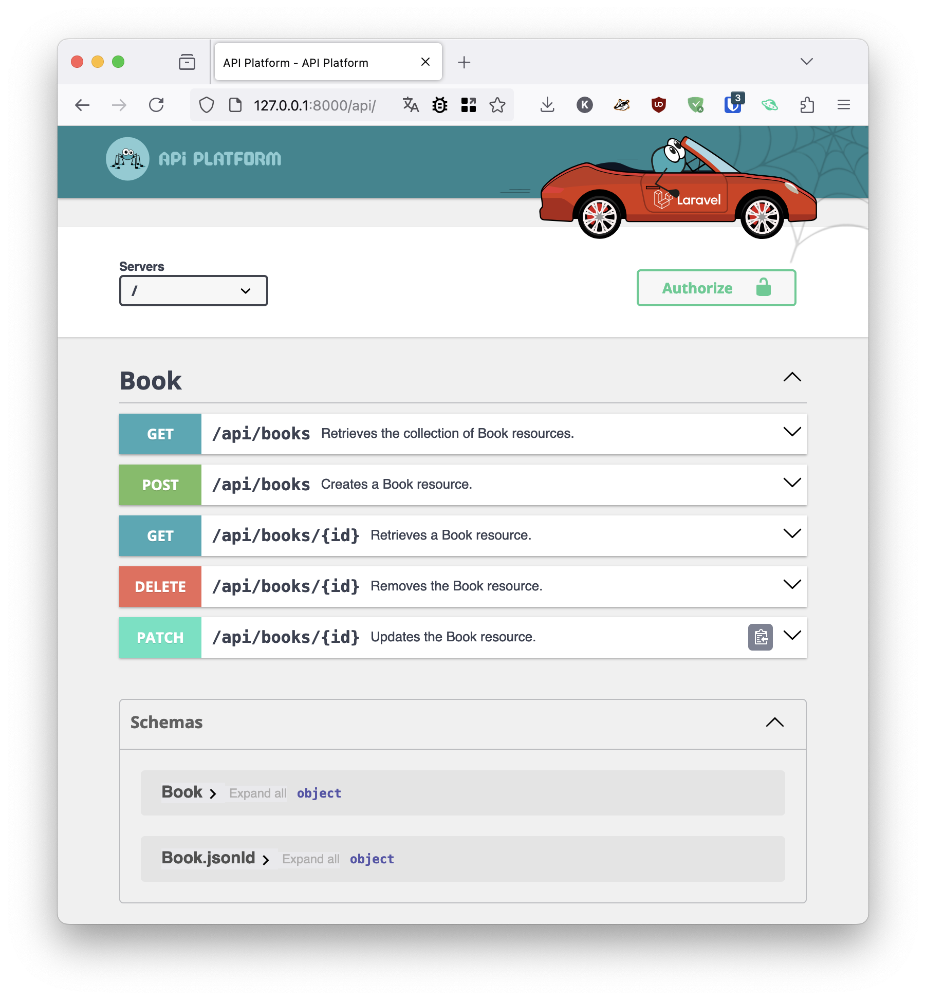
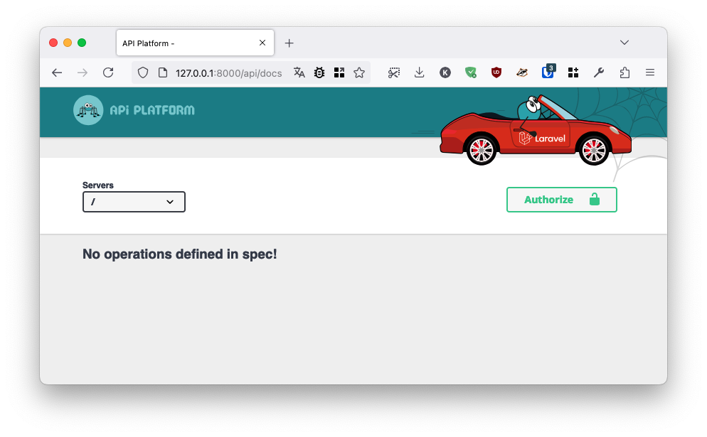
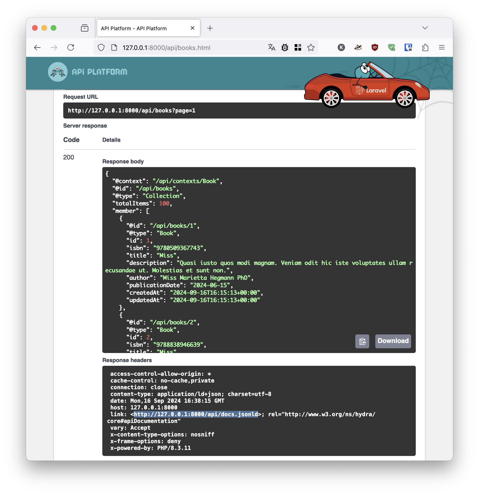
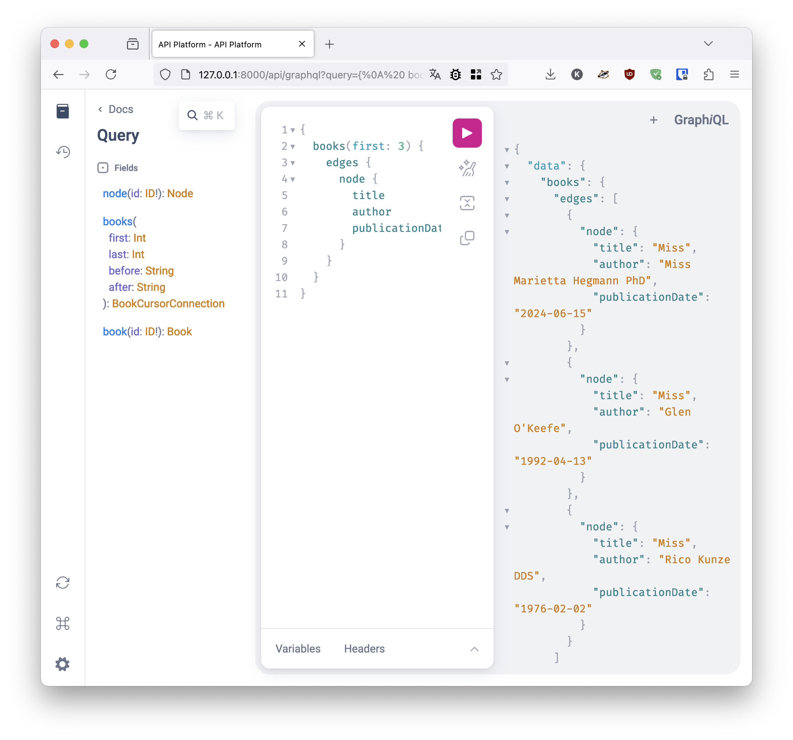
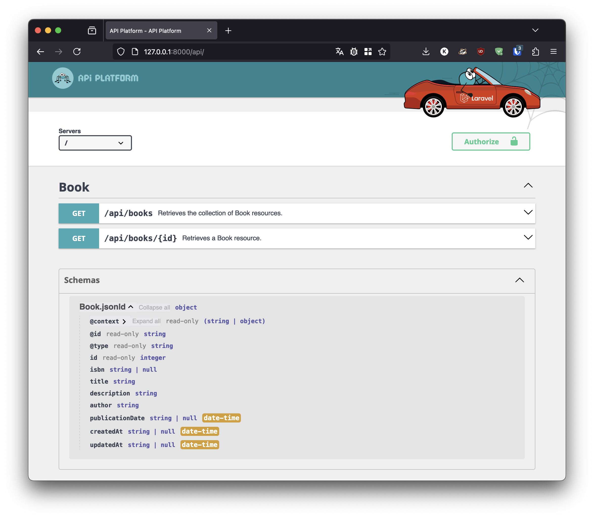
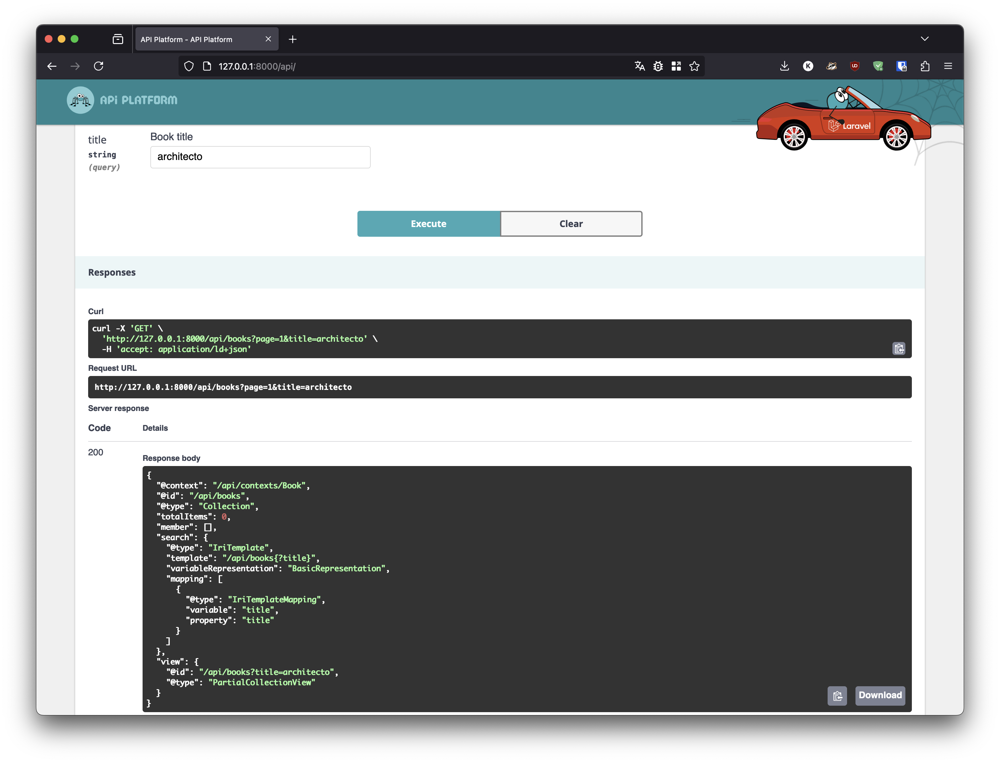
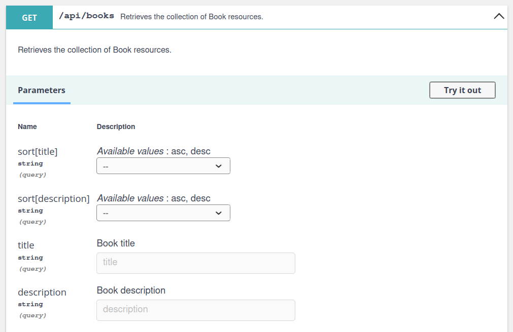
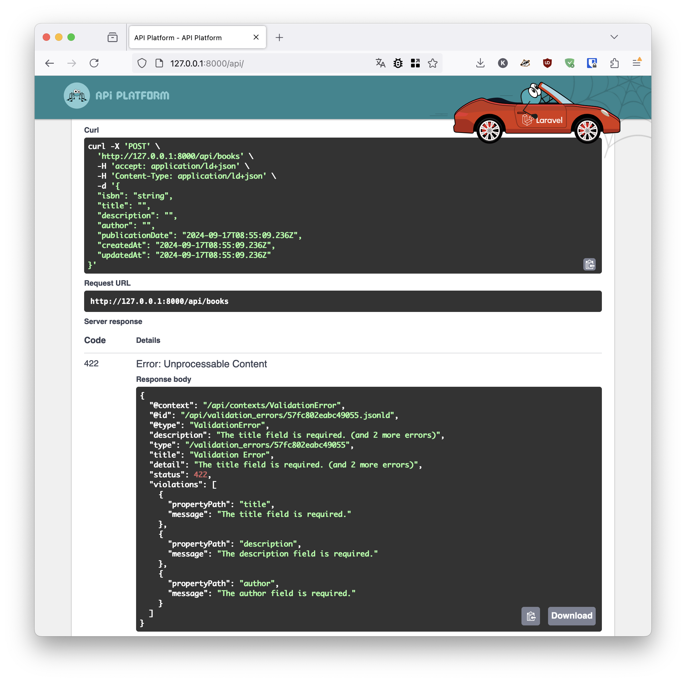

# API Platform for Laravel Projects

API Platform is **the easiest way** to create **state-of-the-art** web APIs
using Laravel!



With API Platform, you can:

- [expose your Eloquent](./#exposing-a-model) models in minutes as:
  - a REST API implementing the industry-leading standards, formats and best practices: [JSON-LD](https://en.wikipedia.org/wiki/JSON-LD)/[RDF](https://en.wikipedia.org/wiki/Resource_Description_Framework), [JSON:API](https://jsonapi.org), [HAL](https://stateless.group/hal_specification.html), and many RFCs...
  - a [GraphQL](./#enabling-graphql) API
  - or both at the same time, with the same code!
- automatically expose an [OpenAPI](https://www.openapis.org) specification (formerly Swagger), dynamically generated from your Eloquent models and always up to date
- automatically expose nice UIs and playgrounds to develop using your API ([Swagger UI](https://swagger.io/tools/swagger-ui/) and [GraphiQL](https://github.com/graphql/graphiql))
- automatically paginate your collections
- add validation logic using Laravel [Form Request Validation](./#write-operations-authorization-and-validation)
- add authorization logic using [gates and policies](./#authorization) ([compatible with Sanctum, Passport, Socialite...](./#authentication))
- add [filtering logic](./#adding-filters)
<!--* push changed data to the clients in real-time using Laravel Broadcast and [Mercure](https://mercure.rocks) (a popular WebSockets alternative, created by Kévin Dunglas, the original author of API Platform) and receive them using Laravel Echo-->
- benefits from the API Platform JavaScript tools: [admin](../admin/index.md) and [create client](../create-client/index.md) (supports Next/React, Nuxt/Vue.js, Quasar, Vuetify and more!)
<!-- * benefits from native HTTP cache (with automatic invalidation) -->
- boost your app with [Octane](https://laravel.com/docs/octane) and [FrankenPHP](https://frankenphp.dev) (the default Octane engine, also created by Kévin)
- [decouple your API from your models](../core/state-providers.md) and implement patterns such as CQRS
- test your API using convenient ad-hoc assertions that work with Pest and PHPUnit

Let's discover how to use API Platform with Laravel!

## Installing Laravel

API Platform can be installed easily on new and existing Laravel projects.
If you already have an existing project, skip directly to the next section.

If you don't have an existing Laravel project, [create one](https://laravel.com/docs/installation).
All Laravel installation methods are supported. For instance, you can use Composer:

```console
composer create-project laravel/laravel my-api-platform-laravel-app
cd my-api-platform-laravel-app
```

## Installing API Platform

In your Laravel project, install the API Platform integration for Laravel:

```console
composer require api-platform/laravel
```

After installing API Platform, publish its assets and config:

```console
php artisan api-platform:install
```

If it's not already done, start the built-in web server:

```console
php artisan serve
```

Open `http://127.0.0.1:8000/api/`, your API is already active and documented... but empty!



## Publishing the Config File and Assets

After installing API Platform, you can publish its assets and config using the `api-platform:install` Artisan command.

```console
php artisan api-platform:install
```

## Creating an Eloquent Model

To discover how API Platform framework works, we will create an API to manage a bookshop.

Let's start by creating a `Book` model:

```console
php artisan make:model Book
```

By default, Laravel uses SQLite. You can open the `database/database.sqlite` file with your preferred SQLite client (PhpStorm works like a charm), create a table named `books`, and add some columns, Eloquent and API Platform will detect these columns automatically.

But there is a better alternative: using a migration class.

### Creating a Migration

First, create a migration class for the `books` table:

```console
 php artisan make:migration create_books_table
```

Open the generated migration class (`database/migrations/<timestamp>_create_books_table.php`) and add some columns:

```patch
    public function up(): void
    {
        Schema::create('books', function (Blueprint $table) {
            $table->id();

+            $table->string('isbn')->nullable();
+            $table->string('title');
+            $table->text('description');
+            $table->string('author');
+            $table->date('publication_date')->nullable();

            $table->timestamps();
        });
    }
```

Finally, execute the migration:

```console
php artisan migrate
```

The table and columns have been created for you!

## Exposing A Model

Open `app/Models/Book.php` that we generated in the previous step and mark the class it contains with the `#[ApiResource]` attribute:

```patch
namespace App\Models;

+use ApiPlatform\Metadata\ApiResource;
 use Illuminate\Database\Eloquent\Model;

+#[ApiResource]
 class Book extends Model
 {
 }
```

Open `http://127.0.0.1:8000/api/`, tadam, your API is ready and **entirely functional** 🎉:


You can play with your API with the sandbox provided by SwaggerUI.

Under the hood, API Platform:

1. Registered the standard REST routes in Laravel's router and a controller that implements a state-of-the-art, fully-featured, and secure API endpoint using the services provided by the [API Platform Core library](../core/index.md)
2. Used its built-in Eloquent [state provider](../core/state-providers.md) to introspect the database and gather metadata about all columns to expose through the API
3. Generated machine-readable documentations of the API in the [OpenAPI (formerly known as Swagger)](../core/openapi.md) (available at `http://127.0.0.1:8000/api/docs.json`) and [JSON-LD](https://json-ld.org)/[Hydra](https://www.hydra-cg.com) formats using this metadata
4. Generated nice human-readable documentation and a sandbox for the API with [SwaggerUI](https://swagger.io/tools/swagger-ui/) (Redoc is also available out-of-the-box)

Imagine doing it all again, properly, by hand? How much time have you saved? Weeks, months? And you've seen nothing yet!

## Playing With The API



If you access any API URL with the `.html` extension appended, API Platform displays
the corresponding API request in the UI. Try it yourself by browsing to `http://127.0.0.1:8000/api/books.html`. If no extension is present, API Platform will use the `Accept` header to select the format to use.

So, if you want to access the raw data, you have two alternatives:

- Add the correct `Accept` header (or don't set any `Accept` header at all if you don't care about security) - preferred when writing API clients
- Add the format you want as the extension of the resource - for debug purposes only

For instance, go to `http://127.0.0.1:8000/api/books.jsonld` to retrieve the list of `Book` resources in JSON-LD.

> [!NOTE]
> Documentation for Eloquent "API resources" encourages using the JSON:API community format.
> While we recommend preferring JSON-LD when possible, JSON:API is also supported by API Platform,
> read the [Content Negotiation](./#content-negotiation) section to learn how to enable it.

Of course, you can also use your favorite HTTP client to query the API.
We are fond of [Hoppscotch](https://hoppscotch.com), a free and open source API client with good support of API Platform.

## Using Data Transfer Objects and Hooking Custom Logic

While exposing directly the data in the database is convenient for Rapid Application Development, using different classes
for the internal data and the public data is a good practice for more complex projects.

As explained in our [general design considerations](../core/design.md), API Platform allows us to use the data source of our choice
using a [provider](../core/state-providers.md) and Data Transfer Objects (DTOs) are first-class citizens!

Let's create our DTO:

```php
<?php

namespace App\ApiResource;

use ApiPlatform\Metadata\Get;

#[Get(uriTemplate: '/my_custom_book/{id}')]
class Book
{
    public function __construct(public string $id, public string $title) {}
}
```

and register our new directory to API Platform:

```php
// config/api-platform.php

// ...
return [
    'resources' => [
        app_path('ApiResource'),
        app_path('Models'),
    ],

    // ...
];
```

Then we can create the logic to retrieve the state of our `Book` DTO:

```php
<?php

namespace App\State;

use ApiPlatform\Metadata\Operation;
use ApiPlatform\State\ProviderInterface;
use App\Models\Book as BookModel;
use App\ApiResource\Book;

final class BookProvider implements ProviderInterface
{
    public function provide(Operation $operation, array $uriVariables = [], array $context = []): object|array|null
    {
        $book = BookModel::find($uriVariables['id']);
        return new Book(id: $book->id, title: $book->title);
    }
}
```

Register the state provider:

```php
<?php

namespace App\Providers;

use App\State\BookProvider;
use ApiPlatform\State\ProviderInterface;
use Illuminate\Contracts\Foundation\Application;
use Illuminate\Support\ServiceProvider;

class ApiServiceProvider extends ServiceProvider
{
    public function register(): void
    {
        $this->app->singleton(BookProvider::class, function (Application $app) {
            return new BookProvider();
        });

        $this->app->tag([BookProvider::class], ProviderInterface::class);
    }
}
```

Apply the provider to your operation:

```php
<?php

namespace App\ApiResource;

use ApiPlatform\Metadata\Get;
use App\State\BookProvider;

#[Get(uriTemplate: '/my_custom_book/{id}', provider: BookProvider::class)]
class Book
{
    public function __construct(public string $id, public string $title) {}
}
```

## Content Negotiation

By default, a JSON-LD response is sent [but many other formats, including CSV and JSON:API are supported](../core/content-negotiation.md).
You can enable or disable formats in `config/api-platform.php`:

```php
// config/api-platform.php

// ...
return [
    'formats' => [
        'jsonld' => ['application/ld+json'],
        'jsonapi' => ['application/vnd.api+json'],
        'csv' => ['text/csv'],
    ],

    'patch_formats' => [
        'json' => ['application/merge-patch+json'],
    ],

    'docs_formats' => [
        'jsonld' => ['application/ld+json'],
        'jsonapi' => ['application/vnd.api+json'],
        'jsonopenapi' => ['application/vnd.openapi+json'],
        'html' => ['text/html'],
    ],

    // ...
];
```

## Enabling GraphQL



By default, only the REST endpoints are enabled, but API Platform also [supports GraphQL](../core/graphql.md)!

Install the GraphQL support package:

```console
composer require api-platform/graphql:^4
```

Then, enable GraphQL in `config/api-platform.php`:

```patch
     'graphql' => [
-        'enabled' => false,
+        'enabled' => true,
```

Then open `http://127.0.0.1:8000/api/graphql` and replace the default GraphQL query example with:

```graphql
{
  books(first: 3) {
    edges {
      node {
        title
        author
        publicationDate
      }
    }
  }
}
```

You now have a REST and a GraphQL API with the same code!

As you can see, a nice UI ([GraphiQL](https://github.com/graphql/graphiql)) is also available. The documentation is automatically generated using the GraphQL introspection endpoint.

## Hiding Fields

API Platform allows to control which fields will be publicly exposed by the API using [the same syntax as Eloquent serialization](https://laravel.com/docs/eloquent-serialization#hiding-attributes-from-json):

```php
namespace App\Models;

use ApiPlatform\Metadata\ApiResource;
use Illuminate\Database\Eloquent\Model;

#[ApiResource]
class Book extends Model
{
    /**
     * The attributes that should be hidden (deny list).
     *
     * @var array
     */
    protected $hidden = ['isbn'];
}
```

```php
namespace App\Models;

use ApiPlatform\Metadata\ApiResource;
use Illuminate\Database\Eloquent\Model;

#[ApiResource]
class Book extends Model
{
    /**
     * The attributes that should be visible (allow list).
     *
     * @var array
     */
    protected $visible = ['title', 'description'];
}
```

## Relations and Nested Resources

Let's replace our author column with a relation to a new `author` table:

```patch
    public function up(): void
    {
        Schema::create('books', function (Blueprint $table) {
            $table->id();

            $table->string('description');
-            $table->string('author');
+            $table->integer('author_id')->unsigned();
+            $table->foreign('author_id')->references('id')->on('authors');

            $table->timestamps();
        });

+       Schema::create('authors', function (Blueprint $table): void {
+           $table->id();
+           $table->string('name');
+           $table->timestamps();
+       });
    }
```

By doing so, API Platform will automatically handle links to that relation using your preferred format (JSON:API, JSON-LD, etc)
and when we request a Book we obtain:

```json
{
  "@context": "/api/contexts/Book",
  "@id": "/api/books/1",
  "@type": "Book",
  "name": "Miss Nikki Senger V",
  "isbn": "9784291624633",
  "publicationDate": "1971-09-04",
  "author": "/api/authors/1"
}
```

To create a Book related to an author, you should use IRIs to reference the relation:

```http
PATCH /api/books/1
Content-Type: application/merge-patch+json

{
    "author": "/api/authors/2"
}
```

There's a powerful mechanism inside API Platform to create routes using relation (e.g.: `/api/authors/2/books`), read more about [subresources here](../core/subresources.md).

## Paginating Data

A must have feature for APIs is pagination. Without pagination, collection responses quickly become huge and slow,
and can even lead to crashes (Out of Memory, timeouts...).

Fortunately, the Eloquent state provider provided by API Platform automatically paginates data!

To test this feature, let's inject some fake data into the database.

### Seeding the Database

Instead of manually creating the data you need to test your API,
it can be convenient to automatically insert fake data in the database.

Laravel provides a convenient way to do that: [Eloquent Factories](https://laravel.com/docs/eloquent-factories).

First, create a factory class for our `Book` model:

```console
php artisan make:factory BookFactory
```

Then, edit `database/factories/BookFactory.php` to specify which generator to use for each property of the model:

```patch
 namespace Database\Factories;

 use Illuminate\Database\Eloquent\Factories\Factory;

 /**
  * @extends \Illuminate\Database\Eloquent\Factories\Factory<\App\Models\Book>
  */
 class BookFactory extends Factory
 {
     /**
      * Define the model's default state.
      *
      * @return array<string, mixed>
      */
     public function definition(): array
     {
         return [
-            //
+            'title' => mb_convert_case(fake()->words(4, true), MB_CASE_TITLE),
+            'isbn' => fake()->isbn13(),
+            'description' => fake()->text(),
+            'author' => fake()->name(),
+            'publication_date' => fake()->date(),
         ];
     }
 }
```

Then, update the `app/Models/Book.php` to hint Eloquent that it has an associated factory:

```patch
 namespace App\Models;

 use ApiPlatform\Metadata\ApiResource;
+use Illuminate\Database\Eloquent\Factories\HasFactory;
 use Illuminate\Database\Eloquent\Model;

 #[ApiResource]
 class Book extends Model
 {
+    use HasFactory;
 }
```

Reference this factory in the seeder (`database/seeder/DatabaseSeeder.php`):

```patch
 namespace Database\Seeders;

+use App\Models\Book;
 use App\Models\User;
 // use Illuminate\Database\Console\Seeds\WithoutModelEvents;
 use Illuminate\Database\Seeder;

 class DatabaseSeeder extends Seeder
 {
     /**
      * Seed the application's database.
      */
     public function run(): void
     {
         // User::factory(10)->create();

         User::factory()->create([
             'name' => 'Test User',
             'email' => 'test@example.com',
         ]);

+        Book::factory(100)->create();
     }
 }
```

Finally, seed the database:

```console
php artisan db:seed
```

> [!NOTE]
> The `fake()` helper provided by Laravel lets you generate different types of random data for testing and seeding purposes. It uses [the Faker library](https://fakerphp.org), which has been created by François Zaninotto.
> François is also a member of the API Platform Core Team.
> He maintains [API Platform Admin](../admin/index.md), a tool built on top of his popular [React-Admin](https://marmelab.com/react-admin/) library that makes creating admin interfaces consuming your API data super easy.
> What a small world!

### Configuring The Pagination

Send a `GET` request on `http://127.0.0.1:8000/api/books`.

By default, API Platform paginates collections by slices of 30 items.

This is configurable, to change to 10 items per page, change `app/Models/Book.php` like this:

```patch
 namespace App\Models;

 use ApiPlatform\Metadata\ApiResource;
 use Illuminate\Database\Eloquent\Factories\HasFactory;
 use Illuminate\Database\Eloquent\Model;

-#[ApiResource]
+#[ApiResource(
+    paginationItemsPerPage: 10,
+)]
 class Book extends Model
 {
     use HasFactory;
 }
```

Read the [pagination documentation](../core/pagination.md) to learn all you can do!

## Customizing the API

API Platform has a ton of knobs and gives you full control over what is exposed.

For instance, here is how to make your API read-only by enabling only the `GET` [operations](../core/operations.md):

```patch
 // app/Models/Book.php
 namespace App\Models;

+use ApiPlatform\Metadata\Get;
+use ApiPlatform\Metadata\GetCollection;
 use Illuminate\Database\Eloquent\Model;

-#[ApiResource]
 #[ApiResource(
     paginationItemsPerPage: 10,
+    operations: [
+        new GetCollection(),
+        new Get(),
+    ],
 )]
 class Book extends Model
 {
 }
```



We'll use configuration options provided by API Platform all along this getting started guide, but there are tons of features!

A good way to discover them is to inspect the properties of the `ApiResource` and `ApiProperty` attributes and, of course, to [read the core library documentation](../core/index.md).

You can change the default configuration (for instance, which operations are enabled by default) in the config (`config/api-platform.php`).

For the rest of this tutorial, we'll assume that at least all default operations are enabled (you can also enable `PUT` if you want to support upsert operations).

## Adding Filters

API Platform provides an easy shortcut to some [useful filters](./filters.md), for starters you can enable a `PartialSearchFilter` the title property:

```patch
 // app/Models/Book.php
 namespace App\Models;

 use ApiPlatform\Metadata\ApiResource;
+use ApiPlatform\Metadata\QueryParameter;
+use ApiPlatform\Laravel\Eloquent\Filter\PartialSearchFilter;
 use Illuminate\Database\Eloquent\Model;

 #[ApiResource]
+#[QueryParameter(key: 'title', filter: PartialSearchFilter::class)]
 class Book extends Model
 {
 }
```



It's also possible to enable filters on every exposed property:

```patch
 // app/Models/Book.php
 namespace App\Models;

 use ApiPlatform\Metadata\ApiResource;
+use ApiPlatform\Metadata\QueryParameter;
+use ApiPlatform\Laravel\Eloquent\Filter\PartialSearchFilter;
+use ApiPlatform\Laravel\Eloquent\Filter\OrderFilter;
 use Illuminate\Database\Eloquent\Model;

 #[ApiResource]
+#[QueryParameter(key: ':property', filter: PartialSearchFilter::class)]
+#[QueryParameter(key: 'sort[:property]', filter: OrderFilter::class)]
 class Book extends Model
 {
 }
```

The `OrderFilter` allows us to sort the collection.

The `:property` placeholder gives the ability to create a parameter for each exposed property. These filters will be automatically documented:



On top of that, some validation rules are automatically added based on the given JSON Schema. You can customize the set of rules inside the `constraints` option of a `QueryParameter`.

API Platform comes with several filters dedicated to Laravel, [check them out](filters.md)!

## Authentication

API Platform hooks into the native [Laravel authentication mechanism](https://laravel.com/docs/authentication).

It also natively supports:

- [Laravel Sanctum](https://laravel.com/docs/sanctum), an authentication system for SPAs (single page applications), mobile applications, and simple, token-based APIs
- [Laravel Passport](https://laravel.com/docs/passport), a full OAuth 2 server
- [Laravel Socialite](https://laravel.com/docs/socialite), OAuth providers including Facebook, X, LinkedIn, Google, GitHub, GitLab, Bitbucket, and Slack

Follow the official instructions for the tool(s) you want to use.

### Login With Swagger UI

In Swagger UI, you can authenticate your requests using the `Authorize` button in the top right corner.
To use it, you need to add some configuration in the `config/api-platform.php` file.

Here is an example of how to configure API key authentication:

```php
// config/api-platform.php
'swagger_ui' => [
    'enabled' => true,
    'apiKeys' => [
        'api' => [
            'type' => 'header',
            'name' => 'X-API-Key'
        ]
    ]
]
```

Or if you are using Laravel Passport (or any other OAuth server):

```php
// config/api-platform.php
'swagger_ui' => [
    'enabled' => true,
    'oauth' => [
        'enabled' => true,
        'type' => 'oauth2',
        'flow' => 'authorizationCode',
        'tokenUrl' => '<oauth_token_endpoint>',
        'authorizationUrl' =>'<oauth_authorization_endpoint>',
        'refreshUrl' => '<oauth_refresh_endpoint>',
        'scopes' => ['scope' => 'Description of the scope'],
        'pkce' => true,
    ]
]
```

A combination of both is also possible.
For more information, you can also check the [Swagger UI documentation](https://swagger.io/docs/specification/authentication/).

### Middlewares

It's sometimes convenient to enforce the use of middleware for all API routes.

In the following example, we enable the Laravel Sanctum middleware for all API routes:

```php
// config/api-platform.php
return [
    // ..
    'defaults' => [
        'middleware' => 'auth:sanctum',
    ],
];
```

## Write Operations Authorization and Validation



To authorize write operations (`POST`, `PATCH`, `PUT`) and validate user input, you may generate a [Form Request class](https://laravel.com/docs/validation#creating-form-requests):

```console
php artisan make:request BookFormRequest
```

Then, add validation rules to the generated class (`app/Http/Requests/BookFormRequest.php` in our example):

```patch
 namespace App\Http\Requests;

 use Illuminate\Foundation\Http\FormRequest;

 class BookFormRequest extends FormRequest
 {
     /**
      * Determine if the user is authorized to make this request.
      */
     public function authorize(): bool
     {
-        return false;
+        return user()->isAdmin();
     }

     /**
      * Get the validation rules that apply to the request.
      *
      * @return array<string, \Illuminate\Contracts\Validation\ValidationRule|array<mixed>|string>
      */
     public function rules(): array
     {
         return [
-             //
+            'title' => 'required|unique:books|max:255',
+            'description' => 'required',
+            'author' => 'required|max:100',
         ];
     }
 }
```

In this example, we only authorize admin users to do write operations, and we add some validation rules.

If the standard Laravel conventions are followed, the Form Request class is autodetected and used automatically.
Otherwise, reference it explicitly in the `rules` parameter:

```patch
 // app/Models/Book.php
 namespace App\Models;

+use App\Http\Requests\BookFormRequest;
 use Illuminate\Database\Eloquent\Model;

-#[ApiResource]
+#[ApiResource(
+    rules: BookFormRequest::class,
+)]
 class Book extends Model
 {
 }
```

API Platform will transform any exception in the [RFC 7807](https://www.rfc-editor.org/rfc/rfc7807) (Problem Details for HTTP APIs) format.
You can create your own `Error` resource following [this guide](https://api-platform.com/docs/guides/error-resource/).

Read the detailed documentation about [Laravel data validation in API Platform](validation.md).

## Authorization

To protect an operation and ensure that only authorized users can access it, start by creating a Laravel [policy](https://laravel.com/docs/authorization#creating-policies):

```console
php artisan make:policy BookPolicy --model=Book
```

Laravel will automatically detect your new policy and use it when manipulating a Book.

Read the detailed documentation about using [Laravel gates and policies with API Platform](security.md).

<!-- ## Testing the API

TODO-->

## Using the JavaScript Tools

### The Admin

Wouldn't it be nice to have an administration backend to manage the data exposed by your API? Checkout [API Platform Admin](../admin/index.md)!


This [Material Design](https://material.io/guidelines/) admin is a Single Page App built with [React Admin](https://marmelab.com/react-admin/). It is powerful and fully customizable.

It leverages the Hydra documentation exposed by the API component to build itself. It's 100% dynamic - **no code generation
occurs**.

### SPA/PWA Scaffolding


API Platform also has an awesome [client generator](../create-client/index.md) able to scaffold fully working [Next.js](../create-client/nextjs.md), [Nuxt.js](../create-client/nuxt.md), [React/Redux](../create-client/react.md), [Vue.js](../create-client/vuejs.md), [Quasar](../create-client/quasar.md),
and [Vuetify](../create-client/vuetify.md) Progressive Web Apps/Single Page Apps that you can easily tune and customize. The generator also supports
[React Native](../create-client/react-native.md) if you prefer to leverage all capabilities of mobile devices.

The generated code contains a list (including pagination), a delete button, a creation and an edit form. It also includes
[Tailwind CSS](https://tailwindcss.com) classes and [ARIA roles](https://developer.mozilla.org/en-US/docs/Web/Accessibility/ARIA)
to make the app usable by people with disabilities.

Checkout [the dedicated documentation](../create-client/index.md).

## Caching

API Platform supports Caching Metadata out of the box. It uses the Laravel cache system to store that information.
Caching is automatically enabled in production environments (when `APP_DEBUG` is set to `false`).

Calling `php artisan optimize` will cache the metadata and improve the performance of your API drastically.

To clear the cache, use `php artisan optimize:clear`.

## Hooking Your Own Business Logic

Now that you learned the basics, be sure to read [the general design considerations](../core/design.md) and [how to extend API Platform](../core/extending.md) to understand how API Platform is designed, and how to hook your custom business logic!

## Using The `IsApiResourceTrait` Instead of Attributes

While attributes (introduced in PHP 8) are the preferred way to configure your API Platform resources,
it's also possible to use a trait instead.

These two classes are strictly equivalent:

```php
// Attributes
namespace App\Models;

use ApiPlatform\Metadata\ApiResource;
use Illuminate\Database\Eloquent\Model;

#[ApiResource]
class Book extends Model
{
}
```

```php
// Trait
namespace App\Models;

use ApiPlatform\Metadata\IsApiResource;
use Illuminate\Database\Eloquent\Model;

class Book extends Model
{
    use IsApiResource;
}
```

When using the `IsApiResourceTrait`, it's also possible to return advanced configuration by defining an `apiResource()` static method.

These two classes are strictly equivalent:

```php
// Attributes
namespace App\Models;

use ApiPlatform\Metadata\ApiResource;
use Illuminate\Database\Eloquent\Model;

#[ApiResource(
    paginationItemsPerPage: 10,
    operations: [
       new GetCollection(),
       new Get(),
    ],
)]
class Book extends Model
{
}
```

```php
// Trait
namespace App\Models;

use ApiPlatform\Metadata\IsApiResource;
use Illuminate\Database\Eloquent\Model;

class Book extends Model
{
    use IsApiResource;

    public static function apiResource(): ApiResource
    {
        return new ApiResource(
            paginationItemsPerPage: 10,
            operations: [
                new GetCollection(),
                new Get(),
            ],
        );
    }
}
```

It's quite common to define multiple `ApiResource`, `ApiProperty`, and `Filter` attributes on the same class.
To mimic this behavior, the `apiResource()` function can return an array instead of a single instance of metadata class.

These two classes are strictly equivalent:

```php
// Attributes
namespace App\Models;

use ApiPlatform\Metadata\ApiResource;
use ApiPlatform\Metadata\QueryParameter;
use ApiPlatform\Laravel\Eloquent\Filter\PartialSearchFilter;
use App\Http\Requests\BookFormRequest;
use Illuminate\Database\Eloquent\Model;

#[ApiResource(
    paginationEnabled: true,
    paginationItemsPerPage: 5,
    rules: BookFormRequest::class,
    operations: [
        new Put(),
        new Patch(),
        new Get(),
        new Post(),
        new Delete(),
        new GetCollection(),
    ]
)]
#[QueryParameter(key: ':property', filter: PartialSearchFilter::class)]
class Book extends Model
{
}
```

```php
// Trait
namespace App\Models;

use ApiPlatform\Metadata\IsApiResource;
use ApiPlatform\Metadata\QueryParameter;
use ApiPlatform\Laravel\Eloquent\Filter\PartialSearchFilter;
use App\Http\Requests\BookFormRequest;
use Illuminate\Database\Eloquent\Model;

class Book extends Model
{
    use IsApiResource;

    public static function apiResource(): array
    {
        return [
            new ApiResource(
                paginationEnabled: true,
                paginationItemsPerPage: 5,
                rules: BookFormRequest::class,
                operations: [
                    new Put(),
                    new Patch(),
                    new Get(),
                    new Post(),
                    new Delete(),
                    new GetCollection(),
                ]
            ),
            new QueryParameter(key: ':property', filter: PartialSearchFilter::class),
        ];
    }
}
```
