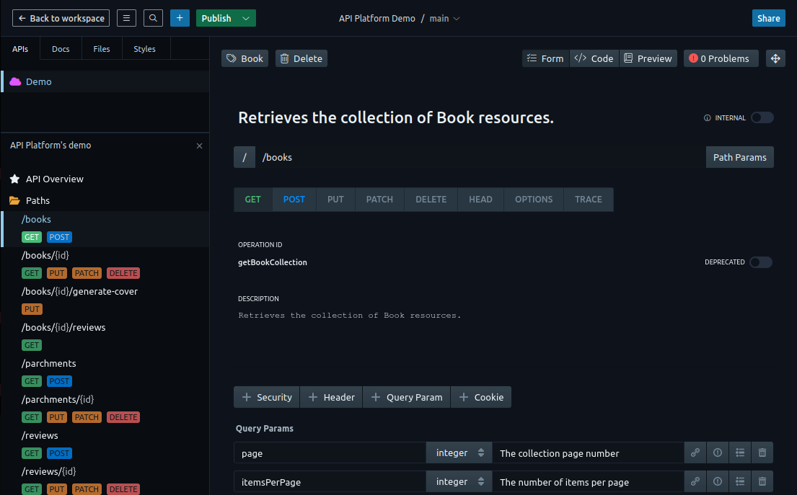

# The Schema Generator

`schema` is a command line tool part of [the API Platform framework](https://api-platform.com) that instantly generates a set
of PHP classes from [RDF](https://en.wikipedia.org/wiki/Resource_Description_Framework) vocabularies such as (but not limited to)
[Schema.org](https://schema.org) or [ActivityStreams](https://www.w3.org/TR/activitystreams-core/).
Alternatively, it can generate PHP classes from an [OpenAPI](https://www.openapis.org/) documentation.

[Find and browse](https://lov.linkeddata.es/) (or create) a vocabulary that fits your needs, choose the types and properties you need, run our code generator and you're done!
Alternatively, design your API with tools like [Stoplight](https://stoplight.io/), export the OpenAPI documentation, run our code generator and your API is ready!

You get a fully featured PHP data model including:

* A set of PHP entities with properties, constants (enum values), getters, setters, adders and removers. The class
hierarchy provided by the vocabulary will be translated to a PHP class hierarchy with parents as `abstract` classes.
The generated code complies with [PSR](http://www.php-fig.org/) coding standards;
* Full, high-quality PHPDoc and type declarations for classes, properties, constants and methods extracted from the vocabulary;
* Doctrine ORM or MongoDB ODM attributes mapping including database columns / fields with type guessing, relations with cardinality guessing,
smart class inheritance (through the `#[MappedSuperclass]` or `#[InheritanceType]` attributes depending on if the resource is used in a relation);
* Data validation through [Symfony Validator](https://symfony.com/doc/current/book/validation.html) attributes including enum support (choices) and check for required properties;
* API Platform attributes;
* Interfaces and [Doctrine `ResolveTargetEntityListener`](https://www.doctrine-project.org/projects/doctrine-orm/en/current/cookbook/resolve-target-entity-listener.html)
support;
* Custom PHP namespace support;
* List of values provided the vocabulary with [PHP Enum](https://github.com/myclabs/php-enum) classes.

Bonus:

* The code generator is fully configurable and extendable. All features can be deactivated (e.g., the Doctrine mapping generator)
and a custom generator can be added;
* The code generator can load previously generated files and add new changes while keeping the user-added ones;
* The generated code can be used as is in a [Symfony](https://symfony.com) app (but it will work too in a raw PHP project
or any other framework including [Laravel](https://laravel.com) and [Zend Framework](http://framework.zend.com/)).

## What Is Schema.org?

Schema.org is a vocabulary representing common data structures and their relations. Schema.org can be exposed as [JSON-LD](https://en.wikipedia.org/wiki/JSON-LD),
[microdata](https://en.wikipedia.org/wiki/Microdata_(HTML)) and [RDF](https://en.wikipedia.org/wiki/Resource_Description_Framework).
Extracting semantical data exposed in the Schema.org vocabulary is supported by a growing number of companies including
Google (Search, Gmail), Yahoo!, Bing and Yandex.

## Why Use Schema.org Data to Generate a PHP Model?

### Don't Reinvent the Wheel

Data models provided by Schema.org are popular and were proven efficient. They cover a broad spectrum of topics including
creative works, e-commerce, events, medicine, social networking, people, postal addresses, organization data, places or reviews.
Schema.org has its root in a ton of preexisting well-designed vocabularies and is
successfully used by more and more websites and applications.

Pick schemas applicable to your application, generate your PHP model, then customize and specialize it to fit your needs.

### Improve SEO and User Experience

Adding Schema.org markup to websites and apps increases their ranking in search engines results and enables awesome features
such as [Google Rich Snippets](https://support.google.com/webmasters/answer/99170?hl=en) and [Gmail markup](https://developers.google.com/gmail/markup/overview).

Mapping your app data model to Schema.org structures can be tedious. When using the generator, your data model will be
derived from Schema.org. Adding microdata markup to your templates or serializing your data as JSON-LD will not require
specific mapping nor adaptation. It's a matter of minutes.

### Be Ready for The Future

Schema.org improves the interoperability of your applications. Used with hypermedia technologies such as [Hydra](http://www.hydra-cg.com/)
it's a big step towards the semantic and machine-readable web.
It opens the way to generic web API clients able to extract and process data from any website or app using such technologies.

## Documentation

* [Getting Started](getting-started.md)
* [Configuration](configuration.md)
