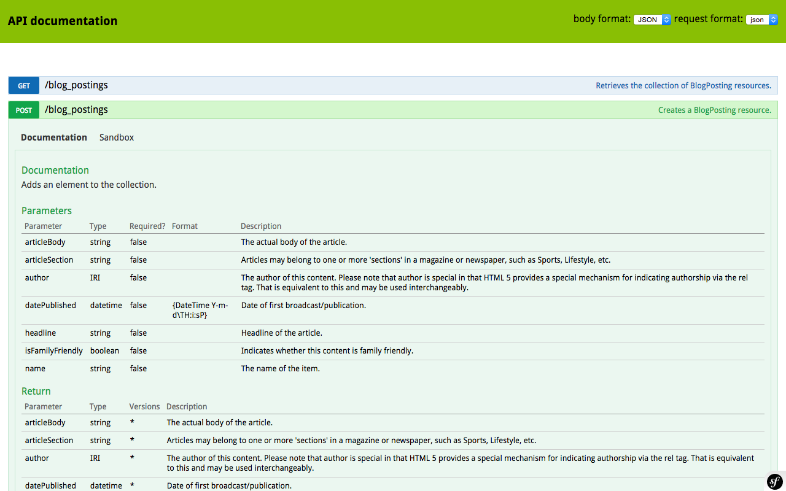
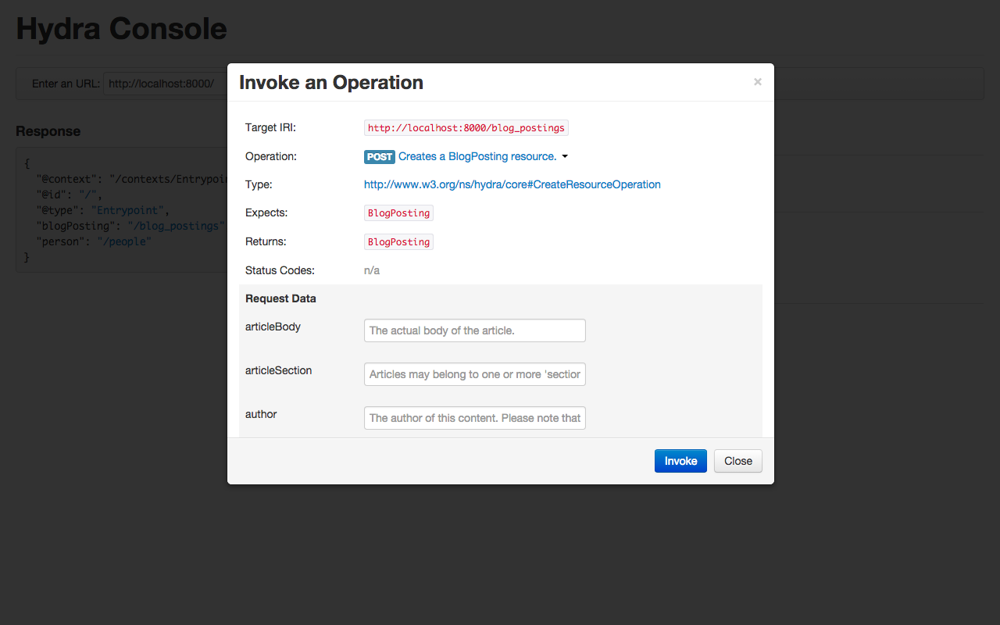

# Creating your First API with API Platform, in 5 Minutes

In this getting started guide, we will learn how easy and efficient is [API Platform](https://api-platform.com) to create
web APIs by creating an API to power a typical blog application. It will take us less than 5 minutes to have a fully featured
API up and running, promised!

To create our API we will basically have to:

* install API Platform
* handcraft our data model, map it with the database and add some validation rules

API Platform will be able to deal directly with our data model to expose a powerful read/write web API having a ton of built-in
features including data validation, pagination, [Swagger/Open API](https://swagger.io), [Hydra](http://hydra-cg.com)
and human-readable documentation, filtering, sorting, hypermedia/HATEOAS support ([JSON-LD](http://json-ld.org) and [HAL](blog.stateless.co/post/13296666138/json-linking-with-hal)),
CORS support...

Our API will rely on well established open standards (HTTP, JSON, RDF...), support content negotiation and will be easily extensible
thanks to strong [OOP](https://en.wikipedia.org/wiki/Object-oriented_programming) and to [the Symfony framework][https://symfony.com].
Adding features like custom service-oriented API endpoints, JWT or OAuth authentication, HTTP caching, mail sending or
asynchronous jobs will be very easy.

## Installing the framework

API Platform is shipped with a complete [https://docker.com](Docker) setup that makes it easy to get a containerized development
environment up and running. The setup contains a PHP 7 + Apache image pre-configured with everything required to run API Platform
and a MySQL image to host the database.

[Download](https://api-platform.com/download) and unzip the last version of the API Platform Standard Edition.
If you don't already have Docker installed on your computer, [it's time to install it](https://www.docker.com/products/overview#/install_the_platform).

Open in a terminal an go inside the folder containing your API Platform installation. Then run the following command to
install locally the dependencies of the project:

    docker-compose run web composer install

The `web` container is where your project belongs. Prefixing a command by `docker-compose run web` allow to run this command
in this container. You may want [to create an alias](http://www.linfo.org/alias.html) to run command in the container easier.
Here, we installed libraries required by our project using the `composer` command shipped with the API Platform image.

The first time you will run a command, Docker will download and build images. It take some time, but don't worry, it will
be lightning fast next time you run commands ins the container.

Project files are automatically shared between your local machine and the container thanks to pre-configured a [Docker volume](https://docs.docker.com/engine/tutorials/dockervolumes/).
It means that you can edit files of your project locally using your preferred IDE or code editor, they will be transparently
taken into account.

Now, it's time to start the Apache and the MySQL servers. Run the following command:


Alternatively to using Docker, you can install API Platform on your local computer using [Composer](https://getcomposer.org/):

    composer create-project api-platform/api-platform blog-api

API Platform can work with all major RDBMS including MySQL but also PostgreSQL, SQLite, SQL Server and MariaDB. The persistence
system can also be replaced with anything else like a noSQL database or a remote web service if you want to.

##

Let's start our new blog API project. The easiest way to create a new project is to

Composer creates the skeleton of the new blog API then retrieve the framework and all its dependencies.

At the end of the installation, you will be prompted for some configuration parameters including database credentials.
All configuration parameters can be changed later by editing the `app/config/parameters.yml` file.

API Platform is pre-configured to use the popular and powerful [Doctrine ORM](http://www.doctrine-project.org/projects/orm.html).
It's supported natively by all API Platform components. However the Doctrine ORM is fully optional: you can replace it
by your favorite ORM, no ORM at all and even no database.

The installer will also ask you for some configuration parameters:

* `database_*`: database credentials (MySQL is configured by default, but other popular RDBMS are supported)
* `mailer_*`: mail server credentials (to send mails)
* `cors_allow_origin`: the URL of your default web client application to automatically set appropriate [CORS](http://en.wikipedia.org/wiki/Cross-origin_resource_sharing)
  headers, **set it to `http://locahost:9000` (the default URL of the built-in Grunt server of our AngularJS client) to follow this tutorial**
* `api_*`: a name and a description of the API that will be used in the generated documentation
* `secret`: a secret token (choose a long one) for cryptographic features

Finally, the installer will ask if you want to remove the existing VCS history, type `Y`.

Take a look at [the content of the generated directory](https://github.com/dunglas/blog-api). You maybe recognize a [Symfony
application directory structure](https://symfony.com/doc/current/quick_tour/the_architecture.html). It's fine and intended:
**the generated skeleton is a perfectly valid Symfony full-stack application** that follows [Symfony Best Practices](https://symfony.com/doc/current/best_practices/index.html).

It means that with this default API Platform setup, you can:

* [use thousands of exiting Symfony bundles](http://knpbundles.com)
* reuse all your Symfony skills and benefit of the high quality [Symfony documentation](https://symfony.com/doc/current/index.html)

You can also use API Platform in any existing Symfony application.

While API Platform is perfectly integrated with Symfony, keep in mind that it's basically a set of standalone PHP components.
You can also use those components in raw PHP (without framework) as well as with other frameworks.

The skeleton comes with a demonstration bookstore API. You can play with it by running the following commands:

Create the database:

    $ bin/console doctrine:database:create

Create the database schema:

    $ bin/console doctrine:schema:create

Run the built-in web server:

    $ bin/console server:start

You can open `http://localhost:8000` with you preferred REST client.
We recommend [Postman](https://www.getpostman.com), and you will see later that API Platform is nicely integrated with it.

When you're done with the demo app and want to create your own API:

* empty the `app/config/schema.yml` file
* delete all PHP files in the `src/AppBundle/Entity/` directory

## Generating the data model

The first incredibly useful tool provided by API platform is [its data model generator](../schema-generator/index.md).

It is 100% independent of other components but fits well with them: you can use this generator to scaffold the data model
of any PHP application. But you can also expose any hand-crafted PHP data model with the API system.
**Those components are not coupled together.**

To scaffold our blog data model we'll browse [Schema.org](https://schema.org) and find types matching our needs.
We're lucky, the [https://schema.org/BlogPosting](https://schema.org/BlogPosting) describes exactly the data model we want
for our blog. As you can see, there is a bunch of schemas available.

Report types you're interested in a YAML configuration file like in the following snippet: 

```yaml
# app/config/schema.yml
 
types:                      # The list of type to generated (a PHP entity class by type will be generated)
    BlogPosting:
        parent: false           # It's a best practice to have entity without parents
        properties:             # The list of properties we want to use
            name: ~               # You can include properties from the current type and of all these parents
            articleBody: ~
            articleSection: ~
            headline: ~
            isFamilyFriendly: ~
            datePublished: ~
            author:
                range: Person       # You can specify relations, here we force the type of the property to Person
                cardinality: (*..0) # We also the cardinality of the relation
            kevinReview:          # You can also define custom properties, not available in Schema.org
                range: Text         # For custom properties, type must always be specified
                cardinality: (*..0) # Using the cardinality here (not a relation) allows to deal with the nullable option
    Person:                   # Person is a relation of the BlogPosting type (author property), relations will be automatically generated
        parent: false
        properties:
            familyName: ~         # We add some common properties defined by Schema.org
            givenName: ~
            description: ~
            birthDate: ~
            deathDate: ~

namespaces:
    entity: AppBundle\Entity # The default namespace for entities, following API Platform and Symfony best practices

annotationGenerators: # Enabled generators
    - ApiPlatform\SchemaGenerator\AnnotationGenerator\PhpDocAnnotationGenerator          # PHPDoc
    - ApiPlatform\SchemaGenerator\AnnotationGenerator\DoctrineOrmAnnotationGenerator     # Doctrine ORM mapping
    - ApiPlatform\SchemaGenerator\AnnotationGenerator\ConstraintAnnotationGenerator      # Symfony Validation Constraints
    - ApiPlatform\SchemaGenerator\AnnotationGenerator\ApiPlatformCoreAnnotationGenerator # API Platform resource mapping
```

The `types` key contains the list of classes we want to generate. Each class will be generated from the corresponding
Schema.org type.

Report properties of the class you want to generate in the `properties` key of the type. Similarly PHP properties are
generated using properties coming from Schema.org. If the value of the `properties` key is null (`~`), all properties
of the Schema.org type will be generated.
As you can see with `kevinReview`, it's also possible to define custom properties.

The schema generator is smart enough to guess types (`range` in the Schema.org terminology) and cardinalities of properties.
Use the `range` and `cardinality` keys if you want to override those values.

The `namespaces` key contain the namespace where generates entities belong. The generator is also able to generate enums,
interfaces and abstract class. Here we use the default Symfony directory for entities.

Finally, the `annotationGenerators` key contains the list of annotation generators we want to register. With those settings
it will generate the PHPDoc, Doctrine ORM mappings, Symfony Validation annotations and API Platform annotations.
The last one is only useful to generate Schema.org IRI when exposing the API instead of custom ones. If you don't want to
expose a Schema.org enabled API, you can remove this generator. You can also create you own annotation generators and register them in this configuration section.

If you don't find types or properties matching your specific needs, it's not a big deal. You can create entity classes
by yourself (directly in PHP) and still benefit from the bunch of other API Platform features.
You can also pick some classes and properties from Schema.org then add more custom types to your model.

It's time to run the model generator:

    $ vendor/bin/schema generate-types src/ app/config/schema.yml

Take a look at the content of the [src/AppBundle/Entity/](https://github.com/dunglas/blog-api/tree/master/src/AppBundle/Entity) directory.
We generated a set of Plain-Old-PHP entities representing our data model. As promised we generated:

* A set of PHP entities with properties, constants (enum values), getters, setters, adders and removers. The class hierarchy
  provided by Schema.org is translated to a PHP class hierarchy with parents as `abstract` classes. The generated code
  complies with [PSR](http://www.php-fig.org/) coding standards.
* [Doctrine ORM mapping annotations](https://doctrine-orm.readthedocs.org/projects/doctrine-orm/en/latest/reference/annotations-reference.html)
  including database columns with type guessing, relations with cardinality guessing and class inheritance (through the
  `@AbstractSuperclass` annotation).
* [Symfony validation annotations](https://symfony.com/doc/current/book/validation.html#constraints)
* API Platform `@ApiResource` and `@ApiProperty` annotations
* Full high-quality [PHPDoc](https://www.phpdoc.org) for classes, properties, constants and methods extracted from Schema.org

The data model is fully functional. You can hack it (modify entities, properties, indexes, validation rules...), or use it
as is!

Reusing an existing semantic schema like we've done has many advantages:

**Don't Reinvent The Wheel**

Data models provided by Schema.org are popular and have been proved efficient. They cover a broad spectrum of topics including
creative work, e-commerce, event, medicine, social networking, people, postal address, organization, place or review. Schema.org
has its root in [a ton of preexisting well designed vocabularies](http://schema.rdfs.org/mappings.html) and is successfully
used by more and more website and applications.

Pick up schemas applicable to your application, generate your PHP model, then customize and specialize it to fit your needs.

**Improve SEO and user experience**

Adding Schema.org markup to websites and apps increase their ranking in search engines results and enable awesome features
such as [Google Rich Snippets](https://support.google.com/webmasters/answer/99170?hl=en) and [Gmail markup](https://developers.google.com/gmail/markup/overview).

Mapping your app data model to Schema.org structures can be a tedious task. Using the generator, your data model will be
a derived from Schema.org. Serializing your data as JSON-LD will not require specific mapping nor adaptation. It's a matter
of minutes.

**Ready for the future**

Schema.org improves the interoperability of your applications. Used with hypermedia technologies such as [Hydra](http://www.hydra-cg.com/)
it's a big step towards the semantic and machine readable web. It opens the way to generic web API clients able to extract
and process data from any website or app using such technologies.

Ask Doctrine to create the database of the project:

    $ bin/console doctrine:database:drop --force # Just in case you created the DB to play with the bookstore app, be careful with this command it deletes data permanently
    $ bin/console doctrine:database:create

Then generate database tables related to the generated entities:

    $ bin/console doctrine:schema:create

The schema generator provides a lot of configuration options. Take a look at [its dedicated documentation](../schema-generator/index.md).
Keep in mind that it is also available as a standalone tool (PHAR) and can be used to bootstrap any PHP project (works fine
with raw PHP, API Platform and Symfony but also has an extension mechanism allowing to use it with other technologies.

You can always create your very own data model from scratch. It's perfectly OK and you can still use API Platform without
the generator.

Sometimes we will have to make a data model with very specific business types, not available in Schema.org. Sometimes we
will find Schema.org types that partially matches what we want but needs to be adapted.

Anyway, the schema generator is a tool intended **to bootstrap** the data model. You can and **you will** edit manually
generated PHP entities. When you start to edit manually the generated files, be careful to not run the generator again,
it will overwrite your changes (this behavior will be enhanced in future versions). When you do such things, the best to
do is to remove `api-platform/schema-generator` from your `composer.json` file.

## Exposing the API

We have a working data model backed by a database. But we also got a working hypermedia REST API thanks to **[API Platform Core](../core/index.md)**.

The core, like the schema generator, is already pre-installed and properly configured.
We just need to mark resources we want to expose with an `@ApiResource` annotation. Open any of the generated entities, and
you'll see that the schema generator already added this annotation for us.

And our API is already finished! How would it be easier?

When you create new entities, you need to clear the cache:

    $ bin/console cache:clear

Start the integrated development web server:

    $ bin/console server:start

Then open `http://localhost:8000/doc` with a web browser:

]

Thanks to [NelmioApiDocBundle](https://github.com/nelmio/NelmioApiDocBundle) support of ApiBundle and its integration
with API Platform, you get for a free **an automatically generated human-readable documentation** of the API (Swagger-like).
The doc also **includes a sandbox** to try the API.

You can also use your favorite HTTP client (yeah, we already talked about Postman) to query the API.
It is lower level than the sandbox and will allow to inspect forge and inspect JSON requests and responses easily.

Open `http://localhost:8000` with Postman. This URL is the entry point of the API. It gives to access to all exposed
resources. As you can see, the API returns minified JSON-LD. For better readability, JSON snippets have been prettified
in this document.

If you want to expose any entity:

* Put it in the `Entity` directory of a bundle
* Mark it with the `@ApiPlatform\Core\Annotation\ApiResource` annotation

It's as easy as it looks.

## Trying the API

Add a person named Olivier Lenancker by issuing a POST request on `http://localhost:8000/people` with the following JSON document as
raw body:

```json
{
  "familyName": "Lenancker",
  "givenName": "Olivier",
  "description": "A famous author from the North.",
  "birthDate": "666-06-06"
}
```

As you can see, we omitted some optional properties such as `description` and `deathDate`.

The data is inserted in database. The server replies with a JSON-LD representation of the freshly created resource.
Thanks to the schema generator, the `@type` property of the JSON-LD document is referencing a Schema.org type:

```json
{
  "@context": "/contexts/Person",
  "@id": "/people/1",
  "@type": "http://schema.org/Person",
  "birthDate": "0666-06-06T00:00:00+00:00",
  "deathDate": null,
  "description": "A famous author from the North.",
  "familyName": "Lenancker",
  "givenName": "Olivier"
}
```

The JSON-LD spec is fully supported by API Platform. Want a proof? Browse `http://localhost:8000/contexts/Person`.

By default, the API allows `GET` (retrieve, on collections and items), `POST` (create), `PUT` (update) and `DELETE` (self-explaining)
HTTP methods. [You can add and remove any other operation you want](../core/operations.md).
Try it!

Now, browse `http://localhost:8000/people`:

```json
{
  "@context": "/contexts/Person",
  "@id": "/people",
  "@type": "hydra:Collection",
  "hydra:member": [
    {
      "@id": "/people/1",
      "@type": "http://schema.org/Person",
      "birthDate": "0666-06-06T00:00:00+00:00",
      "deathDate": null,
      "description": "A famous author from the North.",
      "familyName": "Lenancker",
      "givenName": "Olivier"
    }
  ],
  "hydra:totalItems": 1
}
```

Pagination is also supported (and enabled) out of the box.

It's time to post our first article. Run a POST request on `http://locahost:8000/blog_postings` with the following JSON document
as body:

```json
{
  "name": "API Platform is great",
  "headline": "You'll love that framework!",
  "articleBody": "The body of my article.",
  "articleSection": "technology",
  "author": "/people/1",
  "isFamilyFriendly": "maybe",
  "datePublished": "2015-05-11",
  "kevinReview": "nice"
}
```

Oops... the `isFamilyFriendly` property is a boolean. Our JSON contains an incorrect type value (a `string`).
Fortunately API Platform is smart enough to detect the error: it uses Symfony validation constraints generated previously.
It returns a detailed error message in the Hydra error serialization format:

```json
{
  "@context": "/contexts/ConstraintViolationList",
  "@type": "ConstraintViolationList",
  "hydra:title": "An error occurred",
  "hydra:description": "isFamilyFriendly: This value should be of type boolean.",
  "violations": [
    {
      "propertyPath": "isFamilyFriendly",
      "message": "This value should be of type boolean."
    }
  ]
}
```

Correct the body and send the request again:

```json
{
  "name": "API Platform is great",
  "headline": "You'll love that framework!",
  "articleBody": "The body of my article.",
  "articleSection": "technology",
  "author": "/people/1",
  "isFamilyFriendly": true,
  "datePublished": "2015-05-11",
  "kevinReview": "nice"
}
```

We fixed it! By the way you learned how to work with relations. In a hypermedia API, every resource is identified with
an unique IRI (an URL is an IRI). They are in the `@id` property of every JSON-LD document generated by the API and you
can use it as reference to set relations like we done in the previous snippet for the author property.

API Platform is smart enough to understand [any date format supported by PHP](http://php.net/manual/en/datetime.formats.date.php)
date functions. In production we recommend the format specified by the [RFC 3339](http://tools.ietf.org/html/rfc3339).

We already have a powerful hypermedia REST API (always without writing a single line of PHP), but there is more.

**Our API is auto-discoverable**. Open `http://localhost:8000/apidoc` and take a look at the content. Capabilities of the
API are fully described in a machine-readable format: available resources, properties and operations, description of elements,
readable and writable properties, types returned and expected...

As for errors, the whole API is described using [the Hydra Core Vocabulary](http://www.w3.org/ns/hydra/spec/latest/core/),
an open web standard for describing hypermedia REST APIs in JSON-LD. Any Hydra-compliant client or library is able to interact
with the API without knowing anything about it! The most popular Hydra client is [Hydra Console](http://www.markus-lanthaler.com/hydra/console/).
Open an URL of the API with it you'll get a nice management interface.

]

You can also give a try to the [hydra-core Javascript library](https://github.com/bergos/hydra-core).

API Platform offers a lot of other features including:

* [filters](../core/filters.md)
* [serialization groups and child resource embedding](../core/serialization-groups-and-relations.md)
* [data providers](../core/data-providers.md): retrieve and modify data trough a web-service or a MongoDB database or anything
  else instead of Doctrine ORM
* [custom operations](../core/operations.md): deactivate some methods, create custom operations, URL and controllers
* a powerful [event system](../core/the-event-system.md)

Read [its dedicated documentation](../core/index.md) to see how to leverage them and how to
hook your own code everywhere into it.

## Specifying and testing the API

[Behat](http://docs.behat.org/) (a [Behavior-driven development](http://en.wikipedia.org/wiki/Behavior-driven_development)
framework) is pre-configured with contexts useful to spec and test REST API and JSON documents.

With Behat, you can write the API specification (as user stories) in natural language then execute scenarios against the
application to validate its behavior.

Create a [Gherkin](http://docs.behat.org/en/latest/user_guide/gherkin.html) feature file containing the scenarios we run manually
in the previous chapter:

```gherkin
# features/blog.feature

Feature: Blog
  In order to post news
  As a client software developer
  I need to be able to retrieve, create, update and delete authors and posts trough the API.

  # "@createSchema" creates a temporary SQLite database for testing the API
  @createSchema
  Scenario: Create a person
    When I send a "POST" request to "/people" with body:
    """
    {
      "familyName": "Lenancker",
      "givenName": "Olivier",
      "description": "A famous author from the North.",
      "birthDate": "666-06-06"
    }
    """
    Then the response status code should be 201
    And the response should be in JSON
    And the header "Content-Type" should be equal to "application/ld+json"
    And the JSON should be equal to:
    """
    {
      "@context": "/contexts/Person",
      "@id": "/people/1",
      "@type": "http://schema.org/Person",
      "birthDate": "0666-06-06T00:00:00+00:00",
      "deathDate": null,
      "description": "A famous author from the North.",
      "familyName": "Lenancker",
      "givenName": "Olivier"
    }
    """

  Scenario: Retrieve the user list
    When I send a "GET" request to "/people"
    Then the response status code should be 200
    And the response should be in JSON
    And the header "Content-Type" should be equal to "application/ld+json"
    And the JSON should be equal to:
    """
    {
      "@context": "/contexts/Person",
      "@id": "/people",
      "@type": "hydra:Collection",
      "hydra:member": [
        {
          "@id": "/people/1",
          "@type": "http://schema.org/Person",
          "birthDate": "0666-06-06T00:00:00+00:00",
          "deathDate": null,
          "description": "A famous author from the North.",
          "familyName": "Lenancker",
          "givenName": "Olivier"
        }
      ],
      "hydra:totalItems": 1
    }
    """

  Scenario: Throw errors when a post is invalid
    When I send a "POST" request to "/blog_postings" with body:
    """
    {
      "name": "API Platform is great",
      "headline": "You'll love that framework!",
      "articleBody": "The body of my article.",
      "articleSection": "technology",
      "author": "/people/1",
      "isFamilyFriendly": "maybe",
      "datePublished": "2015-05-11",
      "kevinReview": "nice"
    }
    """
    Then the response status code should be 400
    And the response should be in JSON
    And the header "Content-Type" should be equal to "application/ld+json"
    And the JSON should be equal to:
    """
    {
      "@context": "/contexts/ConstraintViolationList",
      "@type": "ConstraintViolationList",
      "hydra:title": "An error occurred",
      "hydra:description": "isFamilyFriendly: This value should be of type boolean.",
      "violations": [
        {
          "propertyPath": "isFamilyFriendly",
          "message": "This value should be of type boolean."
        }
      ]
    }
    """

  # "@dropSchema" is mandatory to cleanup the temporary database on the last scenario
  @dropSchema
  Scenario: Post a new blog post
    When I send a "POST" request to "/blog_postings" with body:
    """
    {
      "name": "API Platform is great",
      "headline": "You'll love that framework!",
      "articleBody": "The body of my article.",
      "articleSection": "technology",
      "author": "/people/1",
      "isFamilyFriendly": true,
      "datePublished": "2015-05-11",
      "kevinReview": "nice"
    }
    """
    Then the response status code should be 201
    And the response should be in JSON
    And the header "Content-Type" should be equal to "application/ld+json"
    And the JSON should be equal to:
    """
    {
      "@context": "/contexts/BlogPosting",
      "@id": "/blog_postings/1",
      "@type": "http://schema.org/BlogPosting",
      "articleBody": "The body of my article.",
      "articleSection": "technology",
      "author": "/people/1",
      "datePublished": "2015-05-11T00:00:00+00:00",
      "headline": "You'll love that framework!",
      "isFamilyFriendly": true,
      "name": "API Platform is great",
      "kevinReview": "nice"
    }
    """
```

The API Platform flavor of Behat also comes with a temporary SQLite database dedicated to tests. It works out of the box.

Simply run `vendor/bin/behat`. Everything should be green:

    4 scenarios (4 passed)
    21 steps (21 passed)

Then you get a powerful hypermedia API exposing structured data, specified and tested thanks to Behat. And still without
a line of PHP!

It's incredibly useful for prototyping and Rapid Application Development (RAD). But the framework is designed to run in prod.
It benefits from **strong extension points** and is **has been optimized for very high-traffic websites** (API Platform
powers the new version of a major world-wide media site).

## Other features

API Platform has a lot of other features and can extended with PHP libraries and Symfony bundles. [Stay tuned](https://twitter.com/ApiPlatform),
more documentation and cookbooks are coming!

Here is a non exhaustive list of what you can do with API Platform:

* Add [a user management system](../core/fosuser-bundle.md)
  (FOSUser integration)
* [Secure the API with JWT](https://github.com/lexik/LexikJWTAuthenticationBundle) (LexikJwtAuthenticationBundle) or [OAuth](https://github.com/FriendsOfSymfony/FOSOAuthServerBundle)
  (FosOAuthServer)
* [Add a Varnish reverse proxy and adopt a expiration or invalidation HTTP cache strategy](http://foshttpcachebundle.readthedocs.org)
  (FosHttpCache)
* [Add CSRF protection when the API authentication relies on cookies](https://github.com/dunglas/DunglasAngularCsrfBundle)
  (DunglasAngularCsrfBundle – you should prefer using a stateless authentication mode such as a JWT token stored in the
  browser session storage when possible)
* [Send mails](https://symfony.com/doc/current/cookbook/email/email.html) (Swift Mailer)
* [Deploy](../deployment/index.md)

Keep in mind that you can use your preferred client-side technology: API Platform is tested and approved with React, Angular
1 & 2, Ionic and Swift but can work with any language able to send HTTP requests.
[Checkout our AngularJS client for API Platform tutorial](angularjs.md) to learn how to consume the API with AngularJS.

To go further, the API Platform team maintains a demo application showing more advanced use cases like leveraging serialization
groups, user management or JWT and OAuth authentication. [Checkout the demo code source on GitHub]https://github.com/api-platform/demo)
and [browse it online](https://demo.api-platform.com).

Previous chapter: [Introduction](index.md)
Next chapter: [An AngularJS Client](angularjs.md)
