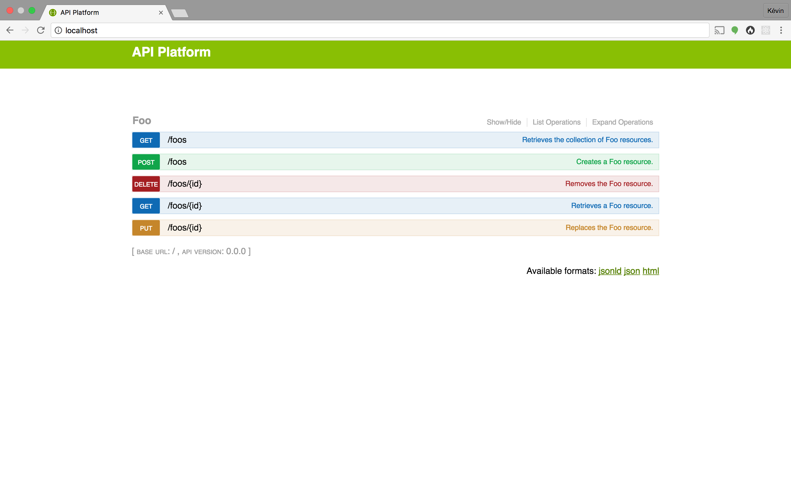
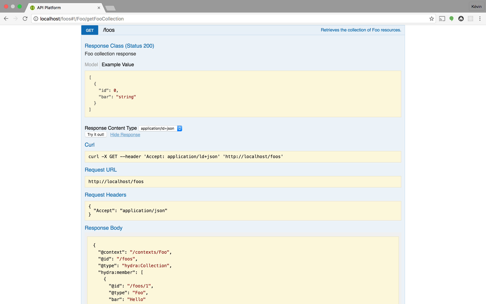

# Creating your First API with API Platform, in 5 Minutes

[API Platform](https://api-platform.com) is one of the most efficient framework out there to create web APIs. It makes it
easy to create simple APIs while giving you the ability to do create complex features with style. To discover the basics,
we will create an API to manage a bookshop.

In a few minutes, we will create a fully featured API relying on industry leading open standards:

1. Install API Platform
2. Handcraft the API data model as *Plain Old PHP Objects*, it will be automatically exposed

API Platform will use the data model to expose a read/write web API having a ton of built-in features:

* data validation
* pagination
* filtering
* sorting
* a nice UI and machine-readable documentations ([Swagger/OpenAPI](https://swagger.io), [Hydra](http://hydra-cg.com))
* hypermedia/[HATEOAS](https://en.wikipedia.org/wiki/HATEOAS) and content negotiation support ([JSON-LD](http://json-ld.org),
[HAL](http://blog.stateless.co/post/13296666138/json-linking-with-hal))
* authentication ([Basic HTTP](https://en.wikipedia.org/wiki/Basic_access_authentication), cookies as well as [JWT](https://jwt.io/)
  and [OAuth](https://oauth.net/) through extensions)
* [CORS headers support](https://developer.mozilla.org/en-US/docs/Web/HTTP/Access_control_CORS)
* HTTP caching
* and basically everything mandatory for modern APIs.

One more thing, before we start: API Platform is built on top of [the Symfony framework](https://symfony.com). API Platform
is compatible with most [Symfony bundles](https://symfony.com/blog/the-30-most-useful-symfony-bundles-and-making-them-even-better)
(plugins) and benefits from the numerous extensions points provided by this rock-solid foundation (events, DIC...).
Adding features like custom, service-oriented, API endpoints, JWT or OAuth authentication, HTTP caching, mail sending or
asynchronous jobs to your APIs is very straightforward.

## Installing the framework

API Platform is shipped with a entire [Docker](https://docker.com) setup that makes it easy to get a containerized development
environment up and running. This setup contains an image pre-configured with PHP 7, Apache and everything needed to run API
Platform and a MySQL image to host the database.

*Alternatively to using Docker, API Platform can also be installed using [Composer](https://getcomposer.org/):
`composer create-project api-platform/api-platform bookshop-api`.*

Start by [downloading the API Platform Standard Edition](https://api-platform.com/download) and extract the content of the
archive.
The resulting directory contains an empty API Platform project structure. You will add your own code and configuration inside
it.
Then, if you do not already have Docker on your computer, [it's the right time to install it](https://www.docker.com/products/overview#/install_the_platform).

Open a terminal, go inside the directory containing your project skeleton, and run the following command to start the Apache
and the MySQL servers using [Docker Compose](https://docs.docker.com/compose/):

    $ docker-compose up

The first time you start the containers, Docker downloads and builds images for you. It will take some time, but don't worry,
this operation is done only one time. Starting servers will then be lightning fast.

Project's files are automatically shared between your local host machine and the container thanks to a pre-configured [Docker
volume](https://docs.docker.com/engine/tutorials/dockervolumes/). It means that you can edit files of your project locally
using your preferred IDE or code editor, they will be transparently taken into account in the container.
Speaking about IDEs, our preferred software to develop API Platform apps is [PHPStorm](https://www.jetbrains.com/phpstorm/)
with its awesome [Symfony](https://confluence.jetbrains.com/display/PhpStorm/Getting+Started+-+Symfony+Development+using+PhpStorm)
and [PHP annotations](https://plugins.jetbrains.com/plugin/7320) plugins. Give them a try, you'll got auto-completion for
almost everything.

Now, in another shell, install the PHP dependencies of the project:

    $ docker-compose run web composer install --no-interaction

The `web` container is where your project belongs. Prefixing a command by `docker-compose run web` allows to execute this
given command in the container. You may want [to create an alias](http://www.linfo.org/alias.html) to run easily commands
in the container. Here, we installed libraries required by the project using the `composer` tool included in the API Platform
image.

The API Platform Standard Edition comes with a dummy entity for test purpose: `src/AppBundle/Entity/Foo.php`. We will remove
it later, but for now, create the related database table:

    docker-compose run web bin/console doctrine:schema:create

If you're used to the PHP ecosystem, you probably guessed that this test entity uses the industry leading [Doctrine ORM](http://www.doctrine-project.org/projects/orm.html)
library as persistence system.
API Platform is 100% independent of the persistence system and you can use the one(s) that best suit(s) your needs (like
a NoSQL database or a remote web service).
API Platform even supports using several persistence systems together in the same project.

However, Doctrine ORM is definitely the easiest way to persist and query data in an API Platform project thanks to a bridge
included in the Standard Edition. This Doctrine ORM bridge is optimized for performance and development convenience. Doctrine
ORM and its bridge support major RDBMS including MySQL, PostgreSQL, SQLite, SQL Server and MariaDB.

Open `http://localhost` with your favorite web browser:



API Platform exposes a description of the API in the Swagger format. It also integrates Swagger UI, a nice interface rendering
the API documentation. Click on an operation to display its details. You can also send requests to the API directly from the UI.
Try to create a new *Foo* resource using the `POST` operation, then access it using the `GET` operation and, finally, delete
it by executing the `DELETE` operation.
If you access any API URL using a web browser, API Platform detects it (using the `Accept` HTTP header) and displays the
corresponding API request in the UI. Open `http://localhost/foos`:



If you want to access the raw data, you have two alternatives:

* Add the correct `Accept` header (or don't set any `Accept` header at all and API Platform will default to JSON-LD) - preferred
  when writing API clients
* Add the format format you want as the extension of the resource - for debug purpose only

For instance, go to `http://localhost/foos.jsonld` to retrieve the list of `Foo` resources in JSON-LD or `http://localhost/foos.json`
to retrieve data in raw JSON.

Of course, you can also use your favorite HTTP client to query the API. We strongly recommend to use [Postman](https://www.getpostman.com/).
It works perfectly well with API Platform, also has native Swagger support, allows to easily write functional tests and
has very good team collaboration features.

## Creating the model

API Platform is now 100% functional. Let's create our own data model.
Our bookshop API will start simple. It will be composed of a `Book` resource type and a `Review` one.

Books have an id, an ISBN number, a title, a description, an author, a publication date and are related to a list of reviews.
Reviews have an id, a rating (between 0 and 5), a body, an author, a publication date and are related to one book.

Let's describe this data model as a set of Plain Old PHP Objects (POPO) and map it to database's tables using annotations
provided by the Doctrine ORM:


```php
// src/AppBundle/Entity/Book.php

namespace AppBundle\Entity;

use Doctrine\ORM\Mapping as ORM;

/**
 * A book.
 *
 * @ORM\Entity
 */
class Book
{
    /**
     * @var string An UUID for this book.
     *
     * @ORM\Id
     * @ORM\GeneratedValue(strategy="UUID")
     * @ORM\Column(type="guid")
     */
    private $id;

    /**
     * @var string|null The ISBN number if this book (or null if doesn't have one).
     *
     * @ORM\Column(nullable=true)
     */
    private $isbn;

    /**
     * @var string The title of this book.
     *
     * @ORM\Column
     */
    private $title;

    /**
     * @var string The description of this book.
     *
     * @ORM\Column(type="text")
     */
    private $description;

    /**
     * @var string The author of this book.
     *
     * @ORM\Column
     */
    private $author;

    /**
     * @var \DateTimeInterface The publication date of this book.
     *
     * @ORM\Column(type="datetime")
     */
    private $publicationDate;

    /**
     * @var Review[] Available reviews for this book.
     *
     * @ORM\ManyToOne(targetEntity="Review", inversedBy="book")
     */
    private $reviews;
}
```

```php
// src/AppBundle/Entity/Review.php

namespace AppBundle\Entity;

use Doctrine\ORM\Mapping as ORM;

/**
 * A review of a book.
 *
 * @ORM\Entity
 */
class Review
{
    /**
     * @var string The UUID of this review.
     *
     * @ORM\Id
     * @ORM\GeneratedValue(strategy="UUID")
     * @ORM\Column(type="guid")
     */
    private $id;

    /**
     * @var int The rating of this review (between 0 and 5).
     *
     * @ORM\Column(type="smallint")
     */
    private $rating;

    /**
     * @var string the body of the review.
     *
     * @ORM\Column(type="text")
     */
    private $body;

    /**
     * @var string The author of the review.
     *
     * @ORM\Column
     */
    private $author;

    /**
     * @var \DateTimeInterface The date of publication of this review.
     *
     * @ORM\Column(type="datetime")
     */
    private $publicationDate;

    /**
     * @var Book The book this review is about.
     *
     * @ORM\OneToMany(targetEntity="Book", mappedBy="books")
     */
    private $book;
}
```

As you can see there are just 2 typical PHP objects with the corresponding PHPDoc (you will see that the PHPDoc of entities
and properties will appear in the API documentation).

Doctrine's annotations map these entities to tables in the MySQL database. Annotations are convenient as
they allow grouping the code and the configuration but, if you want to decouple classes from their metadata, you can switch
to XML or YAML mappings. They are supported as well.

Learn more about how to map entities with the Doctrine ORM in [the project's official documentation](http://docs.doctrine-project.org/projects/doctrine-orm/en/latest/reference/association-mapping.html)
or in Kévin's book "[Persistence in PHP with the Doctrine ORM](https://www.amazon.fr/gp/product/B00HEGSKYQ/ref=as_li_tl?ie=UTF8&camp=1642&creative=6746&creativeASIN=B00HEGSKYQ&linkCode=as2&tag=kevidung-21)".

As we used private properties (but API Platform as well as Doctrine can also work with public ones), we need to create the
corresponding accessor methods. Run the following command or use the code generation feature of your IDE to generate them:

    $ docker-compose run web bin/console doctrine:generate:entities AppBundle

Then, delete the file `src/AppBundle/Entity/Foo.php`, this demo entity isn't useful anymore.
Finally, tell Doctrine to sync the database's tables structure with our new data model:

    $ docker-compose run web bin/console doctrine:schema:update --force

We now have a working data model that you can persist and query. To create an API endpoint with CRUD capabilities corresponding
to an entity class, we just have to mark it with an annotation called `@ApiResource`:

```php
// src/AppBundle/Entity/Book.php

namespace AppBundle\Entity;

use ApiPlatform\Core\Annotation\ApiResource;
use Doctrine\ORM\Mapping as ORM;

/**
 * A book.
 *
 * @ApiResource
 * @ORM\Entity
 */
class Book
{
    // ...
}
```

```php
// src/AppBundle/Entity/Entity.php

namespace AppBundle\Entity;

use ApiPlatform\Core\Annotation\ApiResource;
use Doctrine\ORM\Mapping as ORM;

/**
 * A review of a book.
 *
 * @ApiResource
 * @ORM\Entity
 */
class Review
{
    // ...
}
```

**Our API is (almost) ready!**
Browse `http://localhost/app_dev.php` to load the development environment (including the awesome [Symfony profiler](https://symfony.com/blog/new-in-symfony-2-8-redesigned-profiler)).

Operations available for our 2 resources types appear in the UI.

Click on the `POST` operation of the `Book` resource type and send the following JSON document as request body:

```json
{
  "isbn": "1234",
  "title": "Persistence in PHP with the Doctrine ORM",
  "description": "Learn the Doctrine ORM!",
  "author": "Kévin Dunglas",
  "publicationDate": "2016-09-20"
}
```

You just saved a new book resource through the bookshop API! API Platform automatically deserializes the JSON document to
an instance of the related entity class and tells Doctrine ORM how to persist it in the database.

By default, the API supports `GET` (retrieve, on collections and items), `POST` (create), `PUT` (update) and `DELETE` (self-explaining)
HTTP methods. [You can add and remove any other operation you want, including custom ones](../core/operations.md).

Try to the `GET` operation on the collection. The book we added appears. When the collection will contain more than 30 items,
the pagination will automatically show up, [and this is entirely configurable](../core/pagination.md)! You may be interested
in [adding some filters and in sorting the collection](../core/filters.md) as well.

Maybe did you notice that some keys start by the `@` symbol in the generated JSON response (`@id`, `@type`, `@context`...)?
API Platform comes with a full support of the [JSON-LD](http://json-ld.org/) format (and its [Hydra](http://www.hydra-cg.com/) extension).
[MENTION HAL...).

To summarize, if you want to expose any entity you just have to:

1. Put it in the `Entity` directory of a bundle
2. If you use Doctrine, map it with the database
3. Mark it with the `@ApiPlatform\Core\Annotation\ApiResource` annotation

How can it be more easy?!

## Validating Data

TODO

## Trying the API

TO REMOVE

Add a person named Olivier Lenancker by issuing a POST request on `http://localhost:8000/people` with the following JSON document as
raw body:

```json
{
  "familyName": "Lenancker",
  "givenName": "Olivier",
  "description": "A famous author from the North.",
  "birthDate": "666-06-06"
}
```

As you can see, we omitted some optional properties such as `description` and `deathDate`.

The data is inserted in database. The server replies with a JSON-LD representation of the freshly created resource.
Thanks to the schema generator, the `@type` property of the JSON-LD document is referencing a Schema.org type:

```json
{
  "@context": "/contexts/Person",
  "@id": "/people/1",
  "@type": "http://schema.org/Person",
  "birthDate": "0666-06-06T00:00:00+00:00",
  "deathDate": null,
  "description": "A famous author from the North.",
  "familyName": "Lenancker",
  "givenName": "Olivier"
}
```

The JSON-LD spec is fully supported by API Platform. Want a proof? Browse `http://localhost:8000/contexts/Person`.


Now, browse `http://localhost:8000/people`:

```json
{
  "@context": "/contexts/Person",
  "@id": "/people",
  "@type": "hydra:Collection",
  "hydra:member": [
    {
      "@id": "/people/1",
      "@type": "http://schema.org/Person",
      "birthDate": "0666-06-06T00:00:00+00:00",
      "deathDate": null,
      "description": "A famous author from the North.",
      "familyName": "Lenancker",
      "givenName": "Olivier"
    }
  ],
  "hydra:totalItems": 1
}
```

Pagination is also supported (and enabled) out of the box.

It's time to post our first article. Run a POST request on `http://locahost:8000/blog_postings` with the following JSON document
as body:

```json
{
  "name": "API Platform is great",
  "headline": "You'll love that framework!",
  "articleBody": "The body of my article.",
  "articleSection": "technology",
  "author": "/people/1",
  "isFamilyFriendly": "maybe",
  "datePublished": "2015-05-11",
  "kevinReview": "nice"
}
```

Oops... the `isFamilyFriendly` property is a boolean. Our JSON contains an incorrect type value (a `string`).
Fortunately API Platform is smart enough to detect the error: it uses Symfony validation constraints generated previously.
It returns a detailed error message in the Hydra error serialization format:

```json
{
  "@context": "/contexts/ConstraintViolationList",
  "@type": "ConstraintViolationList",
  "hydra:title": "An error occurred",
  "hydra:description": "isFamilyFriendly: This value should be of type boolean.",
  "violations": [
    {
      "propertyPath": "isFamilyFriendly",
      "message": "This value should be of type boolean."
    }
  ]
}
```

Correct the body and send the request again:

```json
{
  "name": "API Platform is great",
  "headline": "You'll love that framework!",
  "articleBody": "The body of my article.",
  "articleSection": "technology",
  "author": "/people/1",
  "isFamilyFriendly": true,
  "datePublished": "2015-05-11",
  "kevinReview": "nice"
}
```

We fixed it! By the way you learned how to work with relations. In a hypermedia API, every resource is identified with
an unique IRI (an URL is an IRI). They are in the `@id` property of every JSON-LD document generated by the API and you
can use it as reference to set relations like we done in the previous snippet for the author property.

API Platform is smart enough to understand [any date format supported by PHP](http://php.net/manual/en/datetime.formats.date.php)
date functions. In production we recommend the format specified by the [RFC 3339](http://tools.ietf.org/html/rfc3339).

We already have a powerful hypermedia REST API (always without writing a single line of PHP), but there is more.

**Our API is auto-discoverable**. Open `http://localhost:8000/apidoc` and take a look at the content. Capabilities of the
API are fully described in a machine-readable format: available resources, properties and operations, description of elements,
readable and writable properties, types returned and expected...

As for errors, the whole API is described using [the Hydra Core Vocabulary](http://www.w3.org/ns/hydra/spec/latest/core/),
an open web standard for describing hypermedia REST APIs in JSON-LD. Any Hydra-compliant client or library is able to interact
with the API without knowing anything about it! The most popular Hydra client is [Hydra Console](http://www.markus-lanthaler.com/hydra/console/).
Open an URL of the API with it you'll get a nice management interface.

]

You can also give a try to the [hydra-core Javascript library](https://github.com/bergos/hydra-core).

API Platform offers a lot of other features including:

* [filters](../core/filters.md)
* [serialization groups and child resource embedding](../core/serialization-groups-and-relations.md)
* [data providers](../core/data-providers.md): retrieve and modify data trough a web-service or a MongoDB database or anything
  else instead of Doctrine ORM
* [custom operations](../core/operations.md): deactivate some methods, create custom operations, URL and controllers
* a powerful [event system](../core/the-event-system.md)

Read [its dedicated documentation](../core/index.md) to see how to leverage them and how to
hook your own code everywhere into it.

It's incredibly useful for prototyping and Rapid Application Development (RAD). But the framework is designed to run in prod.
It benefits from **strong extension points** and is **has been optimized for very high-traffic websites** (API Platform
powers the new version of a major world-wide media site).

## Other features

API Platform has a lot of other features and can extended with PHP libraries and Symfony bundles. [Stay tuned](https://twitter.com/ApiPlatform),
more documentation and cookbooks are coming!

Here is a non exhaustive list of what you can do with API Platform:

* Add [a user management system](../core/fosuser-bundle.md)
  (FOSUser integration)
* [Secure the API with JWT](https://github.com/lexik/LexikJWTAuthenticationBundle) (LexikJwtAuthenticationBundle) or [OAuth](https://github.com/FriendsOfSymfony/FOSOAuthServerBundle)
  (FosOAuthServer)
* [Add a Varnish reverse proxy and adopt a expiration or invalidation HTTP cache strategy](http://foshttpcachebundle.readthedocs.org)
  (FosHttpCache)
* [Add CSRF protection when the API authentication relies on cookies](https://github.com/dunglas/DunglasAngularCsrfBundle)
  (DunglasAngularCsrfBundle – you should prefer using a stateless authentication mode such as a JWT token stored in the
  browser session storage when possible)
* [Send mails](https://symfony.com/doc/current/cookbook/email/email.html) (Swift Mailer)
* [Deploy](../deployment/index.md)

Keep in mind that you can use your preferred client-side technology: API Platform is tested and approved with React, Angular
1 & 2, Ionic and Swift but can work with any language able to send HTTP requests.
[Checkout our AngularJS client for API Platform tutorial](angularjs.md) to learn how to consume the API with AngularJS.

To go further, the API Platform team maintains a demo application showing more advanced use cases like leveraging serialization
groups, user management or JWT and OAuth authentication. [Checkout the demo code source on GitHub](https://github.com/api-platform/demo)
and [browse it online](https://demo.api-platform.com).

Previous chapter: [Introduction](index.md)
Next chapter: [An AngularJS Client](angularjs.md)
